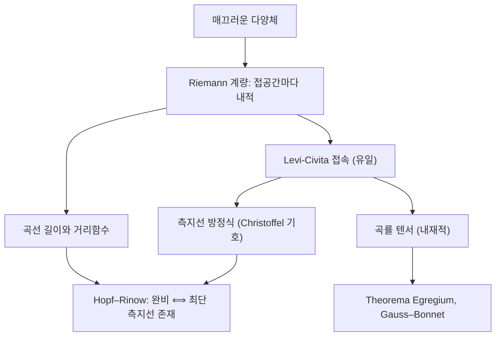

# Riemann 계량과 측지선

# 개요

[다양체](manifolds.md)는 매끄러운 좌표계만 갖춘 뼈대이고, 그 자체로는 길이도 각도 개념도 없다. Riemann 계량은 각 접공간에 [내적](inner-product-spaces.md)을 하나씩, 점에 대해 매끄럽게 변하도록 배치해 이 뼈대에 기하를 입힌다. 계량 하나가 주어지면 곡선의 길이, 두 점 사이의 거리, 부피, 그리고 [곡률](curvature.md)까지 모두 따라 나온다.

측지선(geodesic)은 이 기하에서 "직선"의 역할을 한다. 두 가지 정의가 있고 둘은 일치한다. 가속도가 0인 곡선(등속으로 휘지 않고 나아가는 곡선)이자, 길이 범함수의 임계곡선(국소적으로 최단인 곡선)이다.

핵심 결과 세 가지를 담는다.

- 계량과 양립하면서 비틀림이 없는 접속은 유일하다(Levi-Civita). 따라서 측지선은 계량만으로 결정된다.
- 곡률은 계량만으로 정의되는 내재적 양이다. Gauss의 Theorema Egregium이 그 원형이다.
- 거리공간으로서의 완비성과 측지적 완비성은 같다(Hopf–Rinow). 그 결과 완비 공간에서는 임의의 두 점을 잇는 최단 측지선이 존재한다.

# 직관

곡면 위에 사는 2차원 거주자를 상상하자. 그는 곡면을 바깥에서 볼 수 없고, 자신이 가진 자로 곡선의 길이를 재고 각도를 잴 수 있을 뿐이다. Riemann 기하는 이 거주자가 할 수 있는 측정만으로 재구성되는 기하다. "바깥 공간에 어떻게 놓였는가"(외재적)와 "안에서 잰 길이는 무엇인가"(내재적)를 구분하는 것이 출발점이다.

계량은 각 점에 놓인 자의 눈금이다. 평면 위에 좌표를 그대로 두고 눈금만 바꾸면 다른 기하가 된다. 상반평면에서 위로 갈수록 눈금을 성기게(길이를 짧게) 만들면 쌍곡 기하가 나온다. 같은 좌표 위의 같은 선분도 계량이 다르면 길이가 달라진다.

측지선은 "핸들을 꺾지 않고 달리는 궤적"이다. 속도 벡터가 곡면 안에서 보기에 변하지 않는 곡선이며, 바깥에서 보면 가속도가 곡면에 수직하다. 구 위에서는 대원이 그렇다. 비행기가 서울에서 뉴욕까지 지도상 직선이 아니라 북극 쪽으로 휘어 가는 이유다.

마지막으로 곡률은 측지선의 행동으로 감지된다. 평행하게 출발한 두 측지선이 서로 가까워지면 양의 곡률, 멀어지면 음의 곡률이다. 거주자는 밖을 보지 않고도 삼각형 내각의 합을 재어 자기 세계의 곡률을 알아낼 수 있다.



# 정의

## Riemann 계량

매끄러운 다양체 `M` 위의 **Riemann 계량**이란 각 점 `p`의 접공간 `T_pM` 위에 주어진 대칭 양정부호 쌍선형형식들의 모임으로, 좌표에 대해 매끄럽게 변하는 것을 말한다. 국소 좌표계에서 성분 함수로 쓰면 다음과 같다.

$$
g_p(u, v) = \sum_{i,j} g_{ij}(p)\, u^i v^j, \qquad g_{ij} = g_{ji}, \qquad (g_{ij}) \succ 0 .
$$

성분을 미분 형식 표기로 쓴 것이 익숙한 선소(line element)다.

$$
ds^2 = \sum_{i,j} g_{ij}\, dx^i dx^j .
$$

쌍 `(M, g)`를 **Riemann 다양체**라 한다. 임의의 매끄러운 다양체는(제2가산 가정 아래) 단위 분할을 써서 항상 Riemann 계량을 가진다.

## 길이와 거리

구간 위의 조각별 매끄러운 곡선의 길이와 에너지를 다음으로 정의한다.

$$
L(\gamma) = \int_a^b \sqrt{g_{\gamma(t)}(\dot\gamma(t), \dot\gamma(t))}\, dt, \qquad
E(\gamma) = \frac{1}{2}\int_a^b g_{\gamma(t)}(\dot\gamma(t), \dot\gamma(t))\, dt .
$$

길이는 매개화에 무관하고 에너지는 그렇지 않다. Cauchy–Schwarz 부등식에서 다음이 나오며, 등호는 속력이 일정할 때 성립한다.

$$
L(\gamma)^2 \le 2 (b-a) E(\gamma) .
$$

이 부등식 때문에 "길이의 임계점"을 찾는 문제를 다루기 쉬운 "에너지의 임계점" 문제로 바꿀 수 있다.

연결된 `M`에서 두 점 사이의 거리를 잇는 곡선들의 길이의 하한으로 정의한다.

$$
d(p,q) = \inf \{ L(\gamma) : \gamma(a) = p,\ \gamma(b) = q \} .
$$

이 `d`는 [거리 공간](metric-spaces.md)의 공리를 만족하고, `d`가 정하는 위상은 원래 다양체의 위상과 일치한다. 정의에 [연결성](connectedness.md)이 필요하다. 연결이 아니면 다른 성분의 점 사이 거리가 무한대가 된다.

## 예

- **Euclid 공간.** 성분이 항등행렬인 계량. 측지선은 직선이고 곡률은 0이다.
- **단위 구.** 구면 좌표에서 다음과 같다. 곡률은 어디서나 `1`이다.

$$
ds^2 = d\theta^2 + \sin^2\!\theta \, d\varphi^2 .
$$

- **쌍곡 반평면.** 위쪽 반평면에서 다음 계량을 준다. 곡률은 어디서나 `-1`이며, 측지선은 실축에 수직인 반직선과 실축에 중심을 둔 반원이다.

$$
ds^2 = \frac{dx^2 + dy^2}{y^2} .
$$

- **매장된 곡면.** 3차원 공간의 곡면은 주위 공간의 내적을 접평면에 제한해 계량(제1기본형식)을 얻는다. 회전면, 원환면 등이 이 방식으로 다뤄진다.

## Levi-Civita 접속과 Christoffel 기호

벡터장을 벡터장 방향으로 미분하는 규칙을 접속(connection)이라 한다.

**Riemann 기하의 기본 정리.** 각 Riemann 다양체에는 다음 두 조건을 만족하는 접속이 유일하게 존재한다.

- **계량 호환**: 내적의 미분이 Leibniz 규칙을 따른다. 즉 평행이동이 내적을 보존한다.
- **비틀림 없음**: 두 좌표 방향의 공변미분 차이가 Lie 괄호와 같다.

이것이 **Levi-Civita 접속**이고, 좌표에서의 성분이 **Christoffel 기호**다.

$$
\Gamma^{k}_{ij} = \frac{1}{2} \sum_{l} g^{kl} \left( \partial_i g_{jl} + \partial_j g_{il} - \partial_l g_{ij} \right),
$$

여기서 `g^{kl}`은 계량 행렬의 역행렬 성분이다. Christoffel 기호는 텐서가 아니다. 좌표변환에서 추가 항이 붙으며, 임의의 한 점에서는 좌표를 잘 잡아 모두 0으로 만들 수 있다(normal coordinates). 그래서 곡률은 기호 자체가 아니라 그 미분의 조합으로 정의되어야 한다.

## 측지선

곡선이 **측지선**이라는 것은 속도장의 공변미분이 0이라는 뜻이며, 좌표에서는 다음 2계 연립 비선형 [상미분방정식](ordinary-differential-equations.md)이다.

$$
\ddot{x}^k + \sum_{i,j} \Gamma^{k}_{ij}\, \dot{x}^i \dot{x}^j = 0 .
$$

Christoffel 기호가 매끄러우므로 Picard–Lindelöf 정리에 의해 초기 위치와 초기 속도가 주어지면 해가 국소적으로 유일하게 존재한다. 이로부터 **지수 사상**을 정의한다. 점 `p`와 접벡터 `v`에 대해, `p`에서 속도 `v`로 출발한 측지선을 시간 `1`만큼 따라간 지점을 대응시키는 사상이다. 원점 근방에서 지수 사상은 미분동형이며, 그 상을 normal neighborhood라 한다.

측지선은 자동으로 속력이 일정하다. 계량 호환성에서 속도의 내적의 미분이 0이기 때문이다.

# 성질

## 변분적 특징

**정리.** 곡선이 에너지 범함수의 임계점일 필요충분조건은 측지선인 것이다. 길이 범함수의 임계점은 측지선을 재매개화한 곡선이다.

증명 스케치. 곡선족 변분의 첫 변분 공식을 계산하면 경계항과 함께 측지선 방정식의 좌변이 적분 안에 나타난다. 모든 변분에 대해 임계이려면 그 항이 항등적으로 0이어야 한다. 길이 대신 에너지를 쓰면 제곱근이 사라져 계산이 단순해지고, 위의 Cauchy–Schwarz 부등식이 두 문제의 해를 연결한다.

## 국소 최단성

**정리.** 임의의 점 `p`에는 근방 `U`가 있어, `U` 안의 임의의 두 점은 `U` 안에 놓인 유일한 측지선으로 이어지며 그 측지선이 두 점 사이의 최단 곡선이다.

증명 스케치. Gauss 보조정리에 따르면 지수 사상이 만드는 측지 구면(반지름이 일정한 점들의 집합)은 방사 측지선과 직교한다. 따라서 임의의 경쟁 곡선을 방사 방향 성분과 그에 수직한 성분으로 분해하면 길이는 방사 성분의 길이 이상이고, 등호는 곡선이 방사 측지선일 때만 성립한다.

전역적으로는 최단이 아닐 수 있다. 구 위에서 대원을 따라 반 바퀴를 넘어 계속 가면 여전히 측지선이지만 최단은 아니다. 최단성이 깨지기 시작하는 점이 켤레점(conjugate point) 또는 절단점(cut locus)이며, 구에서는 대척점이 그 자리다.

## 곡률의 내재적 정의

Levi-Civita 접속의 곡률 텐서는 공변미분의 교환 실패로 정의된다.

$$
R(X, Y)Z = \nabla_X \nabla_Y Z - \nabla_Y \nabla_X Z - \nabla_{[X,Y]} Z .
$$

곡률이 0이라는 것은 평행이동이 경로에 무관하다는 뜻이고, 이는 국소적으로 Euclid 공간과 등거리라는 것과 동치다. 2차원 평면 방향에 대한 단면곡률을 뽑아내면 곡면의 경우 그것이 Gauss 곡률이다.

**Theorema Egregium (재해석).** 3차원 공간에 매장된 곡면의 Gauss 곡률은 제1기본형식(즉 유도 계량)만으로 결정된다. Riemann 기하의 언어로는, 곡률 텐서가 계량에서만 만들어지는 양이므로 등거리 사상은 곡률을 보존한다는 진술이다.

따라서 다음이 따라온다.

- 구의 어떤 조각도 평면과 등거리가 아니다. 곡률 `1`과 `0`이 다르기 때문이다. 지도 제작에서 면적·각도·거리를 동시에 보존할 수 없는 근본 이유다.
- 원기둥은 평면과 국소적으로 등거리다. 바깥에서 휘어 보이는 것과 내재적으로 휘는 것은 다르다.
- 곡률은 측지 삼각형의 내각 합으로 감지된다. 양의 곡률에서는 합이 180도보다 크고, 음의 곡률에서는 작다.

## Hopf–Rinow 정리

**정리.** 연결된 Riemann 다양체 `(M, g)`에 대해 다음은 서로 동치다.

- 거리공간 `(M, d)`가 [완비](completeness.md)다.
- 측지적으로 완비다. 즉 모든 측지선이 실수 전체로 연장된다.
- 어떤 한 점에서 지수 사상이 접공간 전체에서 정의된다.
- `M`의 닫힌 유계 부분집합이 모두 [compact](compactness.md)다.

그리고 이 조건이 성립하면 임의의 두 점을 잇는 **최단 측지선이 존재한다**.

증명 스케치. 마지막 주장은 다음 논법이다. 시작점 주위의 작은 측지 구면 위에서 목표점까지의 거리를 최소화하는 점을 잡고, 그 방향의 측지선을 따라가며 "남은 거리가 정확히 줄어드는" 성질이 유지되는 구간이 열린 동시에 닫힘을 보인다. 연결성 논증으로 그 구간이 전체가 되어 측지선이 목표점에 도달한다.

완비성이 없으면 결론이 깨진다. 원점을 제거한 평면에서 서로 반대편에 있는 두 점은 최단 곡선을 갖지 못한다. 하한은 달성되지 않고 거리만 남는다.

따름정리로, 닫힌(compact) 다양체는 항상 완비이며 임의의 두 점 사이에 최단 측지선이 있다.

## 곡면에서의 종합

곡면에서는 곡률 적분이 위상으로 결정된다.

$$
\int_S K \, dA + \int_{\partial S} k_g \, ds = 2\pi \chi(S) .
$$

이 Gauss–Bonnet 정리가 [Euler 지표](euler-characteristic.md)와 계량을 잇고, [곡면의 분류](classification-of-surfaces.md)에 기하적 해석을 준다. 균일화 정리에 따라 닫힌 곡면은 곡률이 `1`, `0`, `-1` 중 하나로 일정한 계량을 가지며, 어느 것인지는 Euler 지표의 부호가 결정한다.

# 활용

## 수치 계산: 구면 측지선

측지선 방정식은 초기값 문제이므로 표준 수치 적분으로 풀린다. 단위 구의 구면 좌표에서 0이 아닌 Christoffel 기호는 둘뿐이며, 방정식은 다음과 같다.

$$
\ddot{\theta} = \sin\theta \cos\theta \, \dot{\varphi}^2, \qquad
\ddot{\varphi} = -2 \cot\theta \, \dot{\theta}\dot{\varphi} .
$$

해가 대원임을 검증하는 방법은 궤적을 3차원으로 매장한 뒤 초기 대원 평면의 법선과의 내적이 0으로 유지되는지 보는 것이다. 아래 구현에서 그 이탈은 배정밀도 오차 수준(약 `1e-13`)에 머문다.

```python
import math

def rhs(state):
    """단위 구의 측지선 방정식. 0 이 아닌 Christoffel 기호는 다음 둘뿐이다.
        Gamma^theta_{phi phi} = -sin(theta) cos(theta)
        Gamma^phi_{theta phi} = Gamma^phi_{phi theta} = cot(theta)
    """
    th, ph, dth, dph = state
    ddth = math.sin(th) * math.cos(th) * dph * dph
    ddph = -2.0 * (math.cos(th) / math.sin(th)) * dth * dph
    return (dth, dph, ddth, ddph)

def step(state, h):                      # 고전적 4차 Runge-Kutta
    def add(s, k, c):
        return tuple(si + c * ki for si, ki in zip(s, k))
    k1 = rhs(state)
    k2 = rhs(add(state, k1, h / 2))
    k3 = rhs(add(state, k2, h / 2))
    k4 = rhs(add(state, k3, h))
    return tuple(s + h / 6 * (a + 2 * b + 2 * c + d)
                 for s, a, b, c, d in zip(state, k1, k2, k3, k4))

def embed(th, ph):                       # 구면 좌표를 3차원으로
    return (math.sin(th) * math.cos(ph), math.sin(th) * math.sin(ph), math.cos(th))

def integrate(th0, ph0, dth0, dph0, T=2.0, n=4000):
    state = (th0, ph0, dth0, dph0)
    h = T / n
    path = [embed(state[0], state[1])]
    for _ in range(n):
        state = step(state, h)
        path.append(embed(state[0], state[1]))
    return path

path = integrate(math.pi / 3, 0.0, 0.35, 0.8)
p0, p1 = path[0], path[1]                # 초기 대원 평면의 법선
n0 = (p0[1]*p1[2] - p0[2]*p1[1], p0[2]*p1[0] - p0[0]*p1[2], p0[0]*p1[1] - p0[1]*p1[0])
s = math.sqrt(sum(c * c for c in n0))
n0 = tuple(c / s for c in n0)
print(max(abs(sum(a * b for a, b in zip(n0, p))) for p in path))   # 약 1.4e-13
print(max(abs(math.sqrt(sum(c * c for c in p)) - 1) for p in path))  # 약 2e-16
```

일반 다양체에서는 Christoffel 기호를 계량의 수치 미분으로 얻거나 자동미분으로 계산한다. 두 점을 잇는 측지선을 구하는 문제(경계값 문제)는 shooting 방법이나 에너지 범함수의 이산화 뒤 [경사하강법](gradient-descent.md) 계열로 푼다.

## 물리

일반 상대성 이론은 시공간을 준-Riemann 다양체로 모형화한다. 계량이 양정부호가 아니라 부호수 `(-,+,+,+)`를 가진다는 점만 다르고, Levi-Civita 접속과 측지선 방정식의 형식은 그대로다. 중력장 속 자유낙하 궤적이 측지선이고, 조석력이 측지선 편차 방정식(곡률 텐서가 등장한다)으로 기술된다. 빛의 휘어짐과 궤도의 세차는 곡률의 직접적 관측이다.

## 통계와 최적화

확률분포족에 Fisher 정보 행렬을 계량으로 주면 통계 모형이 Riemann 다양체가 된다(정보기하). 이 계량에서의 거리는 분포 사이의 구별 가능성을 재며, [KL divergence와 상호정보량](kl-divergence.md)의 2차 근사가 바로 Fisher 계량이다. 이 구조에서 경사하강을 계량에 맞게 수정한 것이 자연경사법(natural gradient)이며, 매개화 방식에 덜 민감하다는 장점이 있다.

## 데이터와 계산 기하

고차원 데이터가 저차원 다양체 근처에 놓인다는 가정 아래, 표본 사이의 국소 거리로 [그래프](graphs.md)를 만들고 그래프 최단경로로 측지 거리를 근사하는 방법이 있다. 이렇게 얻은 거리 행렬을 저차원 좌표로 옮기면 차원 축소가 된다. 여기서 [그래프 Laplacian](graph-laplacian.md)이 Laplace–Beltrami 연산자의 이산 근사로 나타나며, 그래프 스펙트럼과 다양체의 기하가 대응한다.

## 다른 기하 구조와의 관계

- 계량을 상수배로 바꾸면 거리는 비례해서 바뀌지만 측지선은 그대로다. 계량을 점마다 양의 함수로 곱하는 등각변환(conformal change)은 각도를 보존하고 곡률을 바꾼다. 쌍곡 반평면이 Euclid 계량의 등각변환인 것이 그 예다.
- 계량 없이 접속만 주면 측지선은 정의되지만 길이는 정의되지 않는다. 반대로 거리함수만 주어진 [거리 공간](metric-spaces.md)에서도 측지선 개념을 일반화할 수 있고(길이 공간, Alexandrov 공간), 곡률의 부호를 비교 삼각형으로 정의한다. Riemann 다양체는 두 방향이 만나는 지점이다.

# 연관 문서

## 선수지식

- [다양체](manifolds.md)
- [곡률](curvature.md)

## 더 알아보기

- [Gauss–Bonnet 정리](gauss-bonnet.md)
- [Hodge 이론과 조화형식](hodge-theory.md)
- [Selberg 대각합 공식](selberg-trace-formula.md)

#differential_geometry
