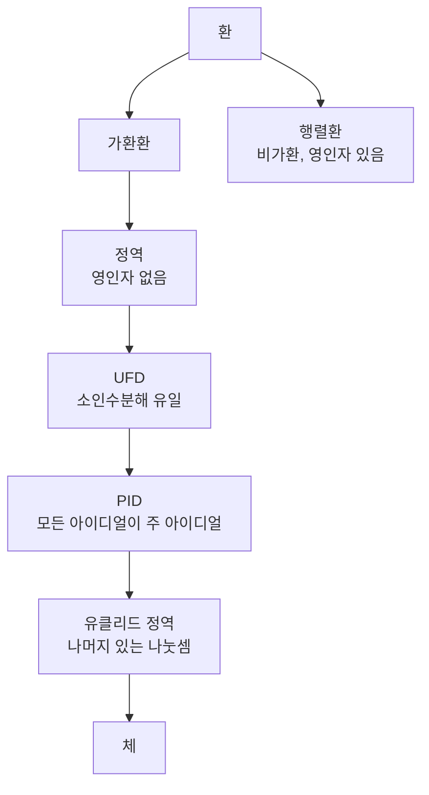

# 환

# 개요

[군](groups.md)은 연산이 하나인 구조다. 정수, 다항식, 행렬, [합동류](modular-arithmetic.md)는 덧셈과 곱셈 두 연산을 갖고 두 연산이 분배법칙으로 묶인다.

환은 이 상황의 공리다. 덧셈에 대해서는 교환군을 요구하고, 곱셈에 대해서는 결합법칙과 단위원만 요구하며 교환성과 역원은 요구하지 않는다. 곱셈 역원을 요구하지 않으므로 정수와 다항식이 환이 되고, 나눗셈이 안 되는 곳에서 나눗셈을 대신하는 방법이 문제가 된다.

# 직관

## 나눗셈의 부재

체는 사칙연산이 전부 되지만 예가 적다. 환은 조건을 낮춰 정수와 다항식을 포함하는 대신 나눗셈을 잃는다. 나눗셈이 없으면 곱이 $0$ 인데 두 인수가 모두 $0$ 이 아닌 영인자가 생기고, 나머지가 남는 나눗셈만 가능해진다.

영인자가 없는 가환환이 정역, 나머지 있는 나눗셈이 되는 정역이 유클리드 정역, 소인수분해가 유일한 정역이 UFD 다. 정수는 셋 다이고 일반적인 환은 하나도 아닐 수 있다.



## 아이디얼에 의한 나눗셈

$6$ 을 법으로 계산하는 것은 $6$ 의 배수 전체를 $0$ 으로 보는 것이다. $0$ 으로 볼 원소들의 집합이 만족해야 하는 조건이 아이디얼이고, 그것으로 나눈 결과가 [몫환](ideals-quotient-rings.md)이다. 군의 정규부분군에 해당하는 것이 환의 아이디얼이다.

원소 대신 아이디얼을 분해하면 정수에서 소수와 소 아이디얼이 일대일 대응하고, 소인수분해가 깨지는 환에서도 아이디얼 수준의 유일 분해가 성립하기도 한다. 대수적 정수론이 여기서 시작한다.

# 정의

## 환

이 문서에서 환은 단위원을 가진 결합환을 뜻한다. 집합 $R$ 과 두 연산 $+$ , $\cdot$ 가 다음을 만족한다.

- $(R,+)$ 는 교환군이다. 항등원은 $0$ , $a$ 의 역원은 $-a$ 다.
- $(R, \cdot)$ 는 결합법칙을 만족하고 단위원 $1$ 을 가진다.
- 분배법칙이 성립한다.

$$
a(b+c)=ab+ac,\qquad(a+b)c=ac+bc
$$

곱셈의 교환법칙과 $0$ 아닌 원소의 곱셈 역원은 요구하지 않는다. 곱셈이 교환적이면 가환환이다. 문헌에 따라 단위원을 요구하지 않는 관례도 있다.

## 부분 구조와 사상

$R$ 의 부분집합이 두 연산에 닫혀 있고 $1$ 을 포함하며 덧셈 역원을 가지면 부분환이다. 환 준동형 $f : R \to S$ 는 $f(a+b)=f(a)+f(b)$ , $f(ab)=f(a)f(b)$ , $f(1)=1$ 을 만족하는 함수다.

## 영인자, 정역, 가역원

| 이름 | 조건 |
|---|---|
| 영인자 | $a \ne 0$ 이고 $ab = 0$ 인 $b \ne 0$ 이 존재 |
| 정역 | 가환환이고 $1 \ne 0$ 이며 영인자가 없음 |
| 가역원 | $ab=ba=1$ 인 $b$ 가 존재 |
| 체 | 가환환이고 $0$ 아닌 모든 원소가 가역 |

가역원 전체는 곱셈에 대해 군을 이루고 $R^\times$ 로 쓴다. $\mathbb{Z}^\times = \lbrace 1, -1\rbrace$ 이고 $(\mathbb{Z}/m\mathbb{Z})^\times$ 는 $m$ 과 서로소인 잉여류들의 군이다.

## 아이디얼

$I \subseteq R$ 이 덧셈 부분군이고 임의의 $r \in R$ , $a \in I$ 에 대해 $ra \in I$ , $ar \in I$ 이면 양쪽 아이디얼이다. $1$ 을 포함하는 아이디얼은 $R$ 전체이므로 아이디얼은 부분환과 다르다. 몫환 $R/I$ 의 구성은 [아이디얼과 몫환](ideals-quotient-rings.md)에서 다룬다.

# 성질

## 공리의 직접적 따름정리

모든 환에서 $0a=a0=0$ 이다. 분배법칙에서

$$
a0=a(0+0)=a0+a0
$$

이고 덧셈군에서 $a0$ 를 소거한다. 곱셈에 역원이 없어도 덧셈군의 소거는 가능하다. 같은 방식으로 $(-a)b=-(ab)$ 와 $(-a)(-b)=ab$ 가 나온다. 음수끼리의 곱이 양수인 것은 분배법칙의 따름정리다.

## 소거의 실패

$\mathbb Z/6\mathbb Z$ 에서 대괄호를 합동류라 하면

$$
[2][3]=[0],\qquad [2][1]=[2][4],\qquad [1]\ne[4]
$$

곱이 $0$ 이어도 한 인수가 $0$ 이 아니고, $0$ 아닌 인수를 양변에서 지울 수도 없다. 소거가 가능한 조건은 곱하는 원소가 가역이거나 환이 정역인 것이다. 정역에서 $ab = ac$ 이고 $a \ne 0$ 이면 $a(b-c) = 0$ 에서 $b = c$ 가 나온다.

```python
def zero_divisors(m):
    return [a for a in range(1, m)
            if any(a * b % m == 0 for b in range(1, m))]

def units(m):
    return [a for a in range(m)
            if any(a * b % m == 1 for b in range(m))]

for m in (5, 6, 7, 8):
    print(m, "영인자", zero_divisors(m), "가역원", units(m))
```

$m$ 이 소수이면 영인자가 없고 $0$ 을 뺀 전부가 가역이므로 $\mathbb{Z}/p\mathbb{Z}$ 는 체다. 유한 정역이 항상 체라는 정리의 특수한 경우이고, 증명에는 유한성에서 $x \mapsto ax$ 가 단사이면 전사라는 사실이 쓰인다.

## 특성

$1$ 을 반복해 더해 $0$ 이 되는 최소의 양의 정수가 환의 특성이고, 그런 수가 없으면 특성이 $0$ 이다. $\mathbb{Z}$ 는 특성 $0$ , $\mathbb{Z}/m\mathbb{Z}$ 는 특성 $m$ 이다. 정역의 특성은 $0$ 이거나 소수다. $n = ab$ 로 쪼개지면 $(a \cdot 1)(b \cdot 1) = 0$ 이 되어 영인자가 생기기 때문이다.

특성이 소수 $p$ 인 가환환에서는

$$
(x+y)^p=x^p+y^p
$$

가 성립한다. 이항계수 $\binom pk$ 가 $0<k<p$ 에서 $p$ 로 나누어지기 때문이다. 이 사상이 Frobenius 준동형이고 [유한체](finite-fields.md)와 [Galois 이론](galois-theory.md)에서 쓰인다.

## 준동형과 아이디얼의 대응

환 준동형의 핵 $\ker f=\lbrace a:f(a)=0\rbrace$ 은 아이디얼이고, 역으로 모든 아이디얼은 몫사상의 핵이다. 군의 정규부분군과 같은 자리이고 제1 동형정리도 같은 형태다.

$$
R/\ker f\thickspace\cong\thickspace\operatorname{im}f
$$

$\mathbb{Z} \to \mathbb{Z}/m\mathbb{Z}$ 의 핵이 $m\mathbb{Z}$ 이고, 다항식환에서 $x$ 에 값을 대입하는 사상의 핵이 $(x - a)$ 다. 뒤의 것에서 $f(a) = 0$ 이면 $f$ 가 $x - a$ 로 나누어진다는 인수정리가 나온다.

# 활용

## 합동방정식의 계산 규칙

$6$ 을 법으로 $2x = 2$ 를 풀 때 양변을 $2$ 로 나누면 해를 잃는다. $2$ 가 가역이 아니기 때문이고, 실제 해는 $x \in \lbrace[1], [4]\rbrace$ 로 둘이다. 나눌 수 있는 조건은 가역성이다.

## 다항식과 수를 같은 언어로

정수와 [다항식환](polynomial-rings.md) $k[x]$ 는 둘 다 유클리드 정역이므로 나머지 있는 나눗셈, 최대공약수, Bézout 항등식, 유일 분해가 같은 증명으로 성립하고 최대공약수 알고리즘도 같다.

## 기하와의 사전

가환환 $R$ 의 소 아이디얼 전체에 위상을 주면 스펙트럼이 되고, 다항식환의 아이디얼과 대수적 집합이 대응한다. 이 대응에서 환의 원소는 함수가 되고 몫환은 부분공간으로의 제한이 된다. 대수기하가 [소 아이디얼](prime-ideals.md)과 [국소화](localization-rings.md)를 기본 도구로 쓴다.

## 비가환의 세계

행렬환, 군환, 미분작용소환은 곱셈이 교환적이지 않다. 왼쪽 아이디얼과 오른쪽 아이디얼이 갈라지고 영인자가 흔하다. [가군](modules.md)이 중심 대상이 되고 군의 표현론이 군환 위의 가군론으로 번역된다.[^1]

[^1]: Thomas W. Judson, *Abstract Algebra: Theory and Applications*, Rings. 환의 공리와 기본 성질. 본문은 단위원을 추가로 요구하는 관례를 따른다. https://math.libretexts.org/Bookshelves/Abstract_and_Geometric_Algebra/Abstract_Algebra%3A_Theory_and_Applications_%28Judson%29/16%3A_Rings/16.03%3A_Rings

# 연관 문서

## 선수지식

- [군](groups.md)
- [정수의 합동과 나머지 연산](modular-arithmetic.md)

## 더 알아보기

- [아이디얼과 몫환](ideals-quotient-rings.md)
- [체](fields.md)
- [다항식환](polynomial-rings.md)
- [가군](modules.md)

#ring_theory #algebra
