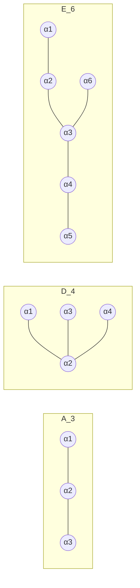

# 근계와 Weyl 군

# 개요

복소 반단순 [Lie 대수](lie-algebras.md)는 Cartan 부분대수 $\mathfrak h$ 의 동시 고유공간으로 분해된다.

$$
\mathfrak g=\mathfrak h\oplus\bigoplus_{\alpha\in\Phi}\mathfrak g_\alpha
$$

여기 나오는 유한집합 $\Phi\subset\mathfrak h^*$ 가 **근계**다. 각 $\dim\mathfrak g_\alpha=1$ 이므로 무한차원 정보가 유클리드 공간 안의 유한개 벡터로 압축된다. 그리고 이 벡터들이 만족하는 조건이 놀랄 만큼 빡빡하다.

핵심은 **정수성**이다. 두 근 $\alpha,\beta$ 에 대해

$$
\langle\beta,\alpha\rangle=\frac{2(\beta,\alpha)}{(\alpha,\alpha)}\in\mathbb Z
$$

가 항상 성립한다. 각도로 읽으면 $\langle\alpha,\beta\rangle\langle\beta,\alpha\rangle=4\cos^2\theta$ 가 $0,1,2,3$ 중 하나여야 한다는 뜻이고, 두 근 사이의 각도가 $90^\circ,60^\circ,45^\circ,30^\circ$ (와 그 보각)로 제한된다. 임의의 각도가 허용되지 않는다는 이 한 줄이 분류 전체를 끌고 간다.

결과는 [내적 공간](inner-product-spaces.md) 안의 유한 벡터 배치를 분류하는 순수 조합 문제가 되고, 답이 네 무한 계열과 다섯 예외다.

$$
A_n,\ B_n,\ C_n,\ D_n,\ G_2,\ F_4,\ E_6,\ E_7,\ E_8
$$

이 목록 하나가 복소 단순 Lie 대수, 단순 대수군, [유한 단순군](finite-simple-groups.md)의 Lie 형 계열, 단순 특이점을 동시에 분류한다. 수학의 여러 분야가 같은 유한 목록으로 수렴하는 대표적인 현상이다.

# 직관

## 반사가 근계를 닫는다

각 근 $\alpha$ 마다 $\mathfrak{sl}\_2$ 부분대수 $\lbrace E_\alpha,F_\alpha,H_\alpha\rbrace$ 가 있다. $\mathfrak g$ 를 이 $\mathfrak{sl}_2$ 의 표현으로 보면 사다리 논법이 적용되고, 무게가 $2$ 씩 오르내리는 정수 사슬이 나온다. 정수성 조건이 여기서 나온다.

사다리의 양 끝을 맞바꾸는 것이 초평면 $\alpha^\perp$ 에 대한 **반사**다.

$$
s_\alpha(\beta)=\beta-\langle\beta,\alpha\rangle\thinspace\alpha
$$

$\mathfrak{sl}\_2$ 표현의 대칭이 그대로 근계의 대칭이 되므로, $s_\alpha$ 는 $\Phi$ 를 $\Phi$ 로 보낸다. 곧 근계는 자기 자신의 반사들에 닫힌 집합이고, 이 반사들이 생성하는 유한군이 **Weyl 군** $W$ 다.

이 닫힘 조건이 얼마나 강한지는 2 차원에서 바로 보인다. 두 벡터를 놓고 반사를 반복하면 각도가 $60^\circ$ 면 근 6 개의 육각형 $A_2$ 가 되고, $45^\circ$ 면 근 8 개의 팔각 배치 $B_2$ 가 되며, $30^\circ$ 면 근 12 개의 $G_2$ 에서 멈추고, 다른 각도에서는 무한히 많은 벡터가 생겨 유한성이 깨진다.

## 단순근이 도표가 된다

$\Phi$ 에서 초평면 하나를 잡아 양쪽으로 나누면 **양근** $\Phi^+$ 가 정해지고, 양근 중 두 양근의 합으로 쓰이지 않는 것들이 **단순근** $\Delta=\lbrace\alpha_1,\dots,\alpha_n\rbrace$ 이다. 단순근은 기저이고, 모든 근이 단순근의 정수계수 조합이며 계수 부호가 일정하다.

단순근 사이의 각도는 항상 둔각이라 Cartan 정수가 음이 아닌 정보로 정리된다. 이것을 그래프로 그린 것이 **Dynkin 도표**다. 꼭짓점이 단순근이고, $\alpha_i$ 와 $\alpha_j$ 를 $\langle\alpha_i,\alpha_j\rangle\langle\alpha_j,\alpha_i\rangle$ 개의 선으로 잇고, 길이가 다르면 긴 쪽으로 화살표를 그린다.



연결된 도표를 분류하는 문제는 "가지가 셋 이상이면 안 되고, 가지의 길이 조합이 몇 가지뿐" 이라는 초등적인 부등식 계산으로 끝난다. 무한차원 대수의 분류가 그래프 몇 개 그리는 일로 내려온다.

## 왜 예외가 다섯인가

가지가 하나 있는 도표($D$ 와 $E$ 형)에서 가지 길이 $(p,q,r)$ 이 만족해야 하는 조건이

$$
\frac1p+\frac1q+\frac1r>1
$$

이다. 정수해는 $(1,q,r)$ 계열($D$ 형), $(2,2,r)$ 계열($D$ 형), 그리고 $(2,3,3),(2,3,4),(2,3,5)$ 셋뿐이다. 마지막 셋이 각각 $E_6,E_7,E_8$ 이다.

같은 부등식이 정다면체의 분류, $\mathrm{SU}(2)$ 의 유한 부분군 분류, 삼각군의 구면·평면·쌍곡 판정에 나온다. $(2,3,5)$ 는 언제나 마지막 자리를 차지하고, $E_8$ 과 정이십면체가 같은 자리에 있는 이유다.

# 정의

## 근계

유클리드 공간 $V$ 의 유한 부분집합 $\Phi$ 가 다음을 만족하면 **근계**다.

- $\Phi$ 가 $V$ 를 생성하고 $0\notin\Phi$ 다.
- $\alpha\in\Phi$ 이면 $\Phi\cap\mathbb R\alpha=\lbrace\pm\alpha\rbrace$ (기약 근계 조건).
- 모든 $\alpha\in\Phi$ 에 대해 $s_\alpha(\Phi)=\Phi$ 다.
- 모든 $\alpha,\beta\in\Phi$ 에 대해 $\langle\beta,\alpha\rangle\in\mathbb Z$ 다.

$\dim V=n$ 을 **랭크**라 한다. 근계가 두 직교하는 근계의 합집합으로 쪼개지지 않으면 **기약**이라 하고, 모든 근계는 기약 근계의 직교합으로 유일하게 분해된다.

## Cartan 행렬과 Weyl 군

단순근 $\Delta=\lbrace\alpha_1,\dots,\alpha_n\rbrace$ 을 고정하면 **Cartan 행렬**이 정해진다.

$$
A_{ij}=\langle\alpha_j,\alpha_i\rangle=\frac{2(\alpha_j,\alpha_i)}{(\alpha_i,\alpha_i)}
$$

대각성분이 $2$ 이고 비대각성분이 $0,-1,-2,-3$ 인 정수행렬이다. 이 행렬이 근계를, 따라서 반단순 Lie 대수를 동형을 빼고 결정한다.

**Weyl 군**은 $W=\langle s_\alpha:\alpha\in\Phi\rangle$ 이고, 사실 단순반사만으로 생성된다.

$$
W=\langle s_1,\dots,s_n\rangle,\qquad (s_is_j)^{m_{ij}}=1
$$

$m_{ii}=1$ 이고 $m_{ij}$ 는 $\alpha_i,\alpha_j$ 사이의 각도로 정해져서 $90^\circ$ 면 2 이고 $120^\circ$ 면 3 이며 $135^\circ$ 면 4 이고 $150^\circ$ 면 6 이다. 이 형태의 표시를 가진 군을 **Coxeter 군**이라 하고, Weyl 군은 결정학적 조건을 만족하는 유한 Coxeter 군이다.

## 근격자와 무게격자

단순근이 생성하는 [격자](lattices.md)를 **근격자** $Q$ 라 하고, 모든 근과의 Cartan 정수가 정수인 벡터들의 격자를 **무게격자** $P$ 라 한다. $Q\subset P$ 이고 몫 $P/Q$ 는 유한군으로, 대응하는 단연결 [Lie 군](lie-groups.md)의 중심과 같다.

$$
P/Q\cong Z(\tilde G)
$$

$A_n$ 에서는 $\mathbb Z/(n+1)$ 이고 $E_8$ 에서는 자명군이다. $E_8$ 의 근격자가 무게격자와 같다는 것은 자기쌍대, 곧 유니모듈러라는 뜻이고, 이것이 $E_8$ 격자가 [구 채우기](sphere-packing.md)와 [theta 급수](theta-functions.md)에서 특별한 이유의 대수적 출처다.

# 성질

## 분류

기약 근계는 다음이 전부다.

| 형 | 랭크 | 근 개수 | Weyl 군 위수 | 대응 Lie 대수 |
|---|---|---|---|---|
| $A_n$ | $n$ | $n(n+1)$ | $(n+1)!$ | $\mathfrak{sl}_{n+1}$ |
| $B_n$ | $n\ge2$ | $2n^2$ | $2^nn!$ | $\mathfrak{so}_{2n+1}$ |
| $C_n$ | $n\ge3$ | $2n^2$ | $2^nn!$ | $\mathfrak{sp}_{2n}$ |
| $D_n$ | $n\ge4$ | $2n(n-1)$ | $2^{n-1}n!$ | $\mathfrak{so}_{2n}$ |
| $G_2$ | 2 | 12 | 12 | $\mathfrak g_2$ |
| $F_4$ | 4 | 48 | 1152 | $\mathfrak f_4$ |
| $E_6$ | 6 | 72 | 51840 | $\mathfrak e_6$ |
| $E_7$ | 7 | 126 | 2903040 | $\mathfrak e_7$ |
| $E_8$ | 8 | 240 | 696729600 | $\mathfrak e_8$ |

$B_n$ 과 $C_n$ 은 근의 길이를 맞바꾼 쌍대이고, 근 개수와 Weyl 군이 같지만 Lie 대수는 다르다. 랭크 조건은 낮은 랭크에서의 우연한 동형 $B_2\cong C_2$ 와 $D_3\cong A_3$ 과 $D_2\cong A_1\times A_1$ 을 피하려는 것이다.

## 반사로 근계를 생성해 보기

단순근에서 출발해 반사를 닫힐 때까지 적용하면 근계 전체가 나온다. $A_2$ 와 $B_2$ 와 $G_2$ 를 정수 좌표로 확인한다.

```python
from fractions import Fraction

def ip(a, b):
    return sum(x * y for x, y in zip(a, b))

def reflect(beta, alpha):
    """s_alpha(beta) = beta - <beta,alpha> alpha"""
    c = Fraction(2 * ip(beta, alpha), ip(alpha, alpha))
    return tuple(b - c * a for b, a in zip(beta, alpha))

def closure(simple):
    R = set(simple)
    while True:
        new = {reflect(b, a) for b in R for a in simple} - R
        if not new:
            return R
        R |= new

def weyl_order(R, simple):
    """W 를 근 위의 순열군으로 실현해 위수를 센다"""
    R = sorted(R)
    idx = {r: i for i, r in enumerate(R)}
    gens = [tuple(idx[reflect(r, a)] for r in R) for a in simple]
    ident = tuple(range(len(R)))
    G, frontier = {ident}, [ident]
    while frontier:
        nxt = []
        for p in frontier:
            for g in gens:
                q = tuple(p[g[i]] for i in range(len(R)))
                if q not in G:
                    G.add(q)
                    nxt.append(q)
        frontier = nxt
    return len(G)

def cartan(simple):
    return [[Fraction(2 * ip(b, a), ip(a, a)) for b in simple] for a in simple]

systems = {
    "A_2": [(1, -1, 0), (0, 1, -1)],      # e_i - e_j 꼴
    "B_2": [(1, -1), (0, 1)],             # 긴근과 짧은근
    "G_2": [(1, -1, 0), (-1, 2, -1)],     # 30도 배치
}
for name, simple in systems.items():
    simple = [tuple(Fraction(x) for x in a) for a in simple]
    R = closure(simple)
    print(name, "근:", len(R), "Weyl 위수:", weyl_order(R, simple),
          "Cartan:", [[int(x) for x in row] for row in cartan(simple)])
# A_2 근: 6  Weyl 위수: 6   Cartan: [[2, -1], [-1, 2]]
# B_2 근: 8  Weyl 위수: 8   Cartan: [[2, -1], [-2, 2]]
# G_2 근: 12 Weyl 위수: 12  Cartan: [[2, -3], [-1, 2]]
```

세 경우 모두 랭크가 2 이고 근이 평면 위에 놓이는데, 근의 개수가 $6,8,12$ 로 갈라진다. 단순근 사이의 각도가 $120^\circ,135^\circ,150^\circ$ 인 차이 하나가 전부다. $G_2$ 의 Cartan 행렬에 $-3$ 이 나타나는 것이 근 길이 비가 $\sqrt3$ 이라는 뜻이고, 이 $-3$ 은 $G_2$ 에서만 나온다.

각 경우 Weyl 군이 정 $n$ 각형의 이면체군이라 위수가 근 개수와 같다. 랭크 2 에서만 생기는 우연이고, $A_3$ 부터는 근 12 개에 Weyl 군 위수 24 로 갈라진다.

## 표현론의 뼈대

근계가 정해지면 표현론이 따라 나온다. 유한차원 기약표현은 **지배적 정수 무게** $\lambda\in P^+$ 로 분류되고, 지표가 Weyl 지표 공식으로 주어진다.

$$
\operatorname{ch}V_\lambda=\frac{\sum_{w\in W}(-1)^{\ell(w)}e^{w(\lambda+\rho)}}{\sum_{w\in W}(-1)^{\ell(w)}e^{w(\rho)}},\qquad \rho=\frac12\sum_{\alpha\in\Phi^+}\alpha
$$

분자와 분모 모두 Weyl 군에 대한 교대합이고, 차원 공식도 여기서 나온다.

$$
\dim V_\lambda=\prod_{\alpha\in\Phi^+}\frac{(\lambda+\rho,\alpha)}{(\rho,\alpha)}
$$

무한차원 대상의 지표가 유한군 $W$ 위의 합으로 계산된다는 것이 요점이다. $\mathfrak{sl}_2$ 의 사다리 논법을 근계 전체로 조직화한 결과다.

## ADE 현상

단순끈 근계, 곧 모든 근의 길이가 같은 $A_n,D_n,E_6,E_7,E_8$ 만 따로 모은 목록이 여러 곳에 나타난다.

- $\mathrm{SU}(2)$ 의 유한 부분군 (McKay 대응).
- $\mathbb C^2$ 의 유한군 몫으로 생기는 Kleinian 특이점과 그 해소의 예외곡선 배치.
- 유한개의 기약표현만 갖는 quiver (Gabriel 정리).
- 유한 대칭군으로 분류되는 등각장론의 모듈러 불변량.

서로 관련이 없어 보이는 분류 문제들이 같은 목록을 내놓는다. 공통 원인은 위의 $1/p+1/q+1/r>1$ 부등식이고, 그 부등식은 결국 구면의 유한 대칭 배치가 몇 개뿐이라는 사실이다.

# 활용

## Lie 형 유한 단순군

Chevalley 는 근계와 Cartan 행렬만으로 복소 Lie 대수의 정수 기저(Chevalley 기저)를 잡고, 그것을 임의의 체 $\mathbb F_q$ 로 환원해 유한군을 만들었다. 이렇게 얻은 $A_n(q),\dots,E_8(q)$ 와 뒤틀린 변종들이 [유한 단순군 분류](finite-simple-groups.md)의 16 개 무한 계열이다. 연속군의 근계 목록이 유한군 목록의 대부분을 낳는다.

## Langlands 쌍대

근계 $\Phi$ 에서 근과 쌍대근을 맞바꾸면 다시 근계가 된다. $B_n$ 과 $C_n$ 이 서로 바뀌고 나머지는 자기쌍대다. 이 조작으로 얻는 군이 [Langlands 강령](langlands-program.md)의 쌍대군 ${}^L\negthinspace G$ 이고, 강령의 진술 자체가 근계 데이터의 대칭에 기대어 서술된다.

## 결정학과 조합론

Weyl 군은 결정학적 반사군이라 격자를 보존하는 대칭에 대응한다. 결정의 점군이 $2,3,4,6$ 회 회전만 허용하는 이유가 Cartan 정수의 정수성과 같은 계산이다. 조합론 쪽에서는 Weyl 군의 Bruhat 순서, Schubert 다항식, 깃발다양체의 셈법이 모두 근계 위에서 전개된다.

[^1]: 표준 참고서는 J. Humphreys, *Introduction to Lie Algebras and Representation Theory* (1972) 3 장과 J. Humphreys, *Reflection Groups and Coxeter Groups* (1990). 분류의 상세한 도표 논증은 N. Bourbaki, *Groupes et algèbres de Lie* 4–6 장. McKay 대응과 ADE 는 P. Slodowy, *Simple Singularities and Simple Algebraic Groups* (1980). 본문의 계산은 직접 한 것이다.

# 연관 문서

## 선수지식

- [Lie 대수](lie-algebras.md)
- [내적 공간](inner-product-spaces.md)

## 더 알아보기

- [Weyl 지표 공식과 최고무게 이론](weyl-character-formula.md)

#algebra #linear_algebra #combinatorics
