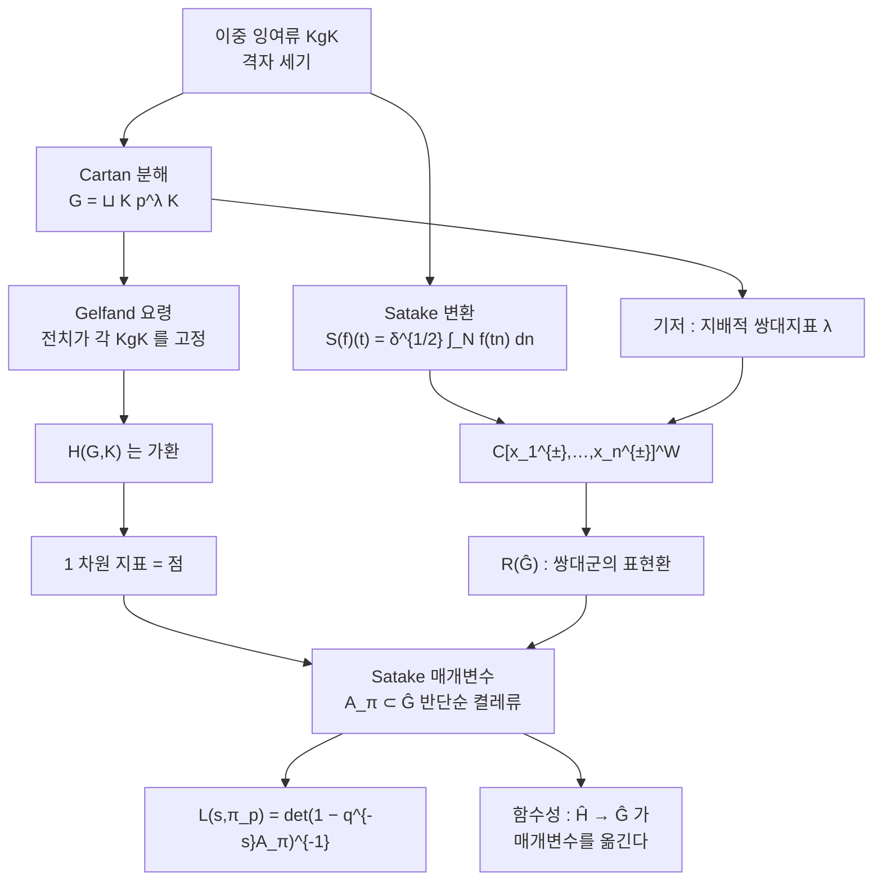

# Satake 동형과 비분기 Hecke 대수

# 개요

[Hecke 작용소](hecke-operators.md)는 이중 잉여류로 정의된다. `T_p` 는 $\mathrm{SL}_2(\mathbb Z)\begin{pmatrix}1&0\\0&p\end{pmatrix}\mathrm{SL}_2(\mathbb Z)$ 를 잘라 만든 것이고, 정의만 보면 왜 그런 것을 만드는지, 왜 서로 가환인지, 왜 고유값이 `L` 함수의 Euler 인자가 되는지가 전혀 보이지 않는다.

[아델](adeles.md) 위로 올리면 이 셋이 한꺼번에 해명된다. 자리 `p` 를 하나 고정하고, $G=\mathrm{GL}_n(\mathbb Q_p)$, $K=\mathrm{GL}_n(\mathbb Z_p)$ 라 하자. 콤팩트 받침을 갖는 양쪽 `K` 불변 함수들이 합성곱으로 이루는 대수

$$
\mathcal H(G,K)=C_c^\infty(K\backslash G/K)
$$

를 **비분기 Hecke 대수** 또는 구형 Hecke 대수라 한다. 고전적 `T_p` 는 이 대수의 원소 하나다. Satake 가 1963 년에 증명한 것은 이 대수의 정체다.

$$
\mathcal H(G,K)\;\xrightarrow{\ \sim\ }\;\mathbb C[x_1^{\pm1},\dots,x_n^{\pm1}]^{S_n}
\;=\;R\bigl(\widehat G\bigr)
$$

오른쪽은 `n` 변수 대칭 Laurent 다항식환이고, 그것은 곧 **쌍대군** $\widehat G=\mathrm{GL}_n(\mathbb C)$ 의 유한차원 표현들이 이루는 표현환이다. 이중 잉여류를 세는 조합론이 복소 Lie 군의 표현론과 같은 환이라는 말이다.

이 동형이 주는 것은 두 가지다.

- **가환성.** 오른쪽이 가환이므로 왼쪽도 가환이다. `T_mT_n=T_nT_m` 이 증명 없이 따라 나온다.
- **Satake 매개변수.** 가환 대수의 1 차원 지표는 점이다. 비분기 표현 $\pi_p$ 가 $\mathcal H(G,K)$ 에 스칼라로 작용하면, 그 스칼라들의 모임은 $(\mathbb C^\times)^n/S_n$, 곧 $\widehat G$ 의 **반단순 켤레류** $A_{\pi_p}$ 하나다. 그래서 `L` 인자를 쌍대군의 표현으로 쓸 수 있다.

$$
L(s,\pi_p)=\det\bigl(1-q^{-s}A_{\pi_p}\bigr)^{-1}
$$

[Godement–Jacquet 적분](godement-jacquet.md)의 비분기 자리 계산이 이 꼴로 떨어지는 것도, [Langlands 강령](langlands-program.md)이 "거의 모든 자리에서 Satake 매개변수가 Frobenius 켤레류와 일치한다" 는 형태로 서술되는 것도 전부 이 동형 때문이다. 강령의 문장을 쓸 수 있게 해 주는 사전이 Satake 동형이다.

# 직관

## 이중 잉여류를 함수로 본다

$\mathcal H(G,K)$ 의 원소는 `f(k_1gk_2)=f(g)` 인 콤팩트 받침 함수다. 받침이 콤팩트하고 양쪽 불변이므로, 이런 함수는 유한개의 이중 잉여류 `KgK` 의 특성함수들의 선형결합이다. 곱은 합성곱이다.

$$
(f_1*f_2)(h)=\int_G f_1(g)\,f_2(g^{-1}h)\,dg,
\qquad \mathrm{vol}(K)=1
$$

$\mathrm{vol}(K)=1$ 로 정규화하면 적분이 유한합이 된다. `f_1` 의 받침이 유한개의 왼쪽 잉여류 `gK` 로 쪼개지기 때문이다. 그래서 합성곱의 구조상수는 **잉여류를 세는 정수**다. 고전적 Hecke 작용소의 "격자를 센다" 는 정의가 여기서 그대로 나온다.

`G/K` 를 격자로 읽으면 그림이 선명해진다. $gK\mapsto L_g=g\mathbb Z_p^n$ 이 `G/K` 와 $\mathbb Q_p^n$ 의 격자 전체의 일대일 대응이고, `KgK` 는 $\mathbb Z_p^n$ 에 대한 `L_g` 의 **초등인자**로 결정된다. 두 함수의 합성곱값은 "중간 격자를 세는 것" 이 된다.

$$
(1_{K\alpha K}*1_{K\beta K})(h)
=\#\bigl\{\,M \;:\; \mathbb Z_p^n\supset M \text{ 가 } \alpha \text{ 형},\;
M\supset L_h \text{ 가 } \beta \text{ 형}\,\bigr\}
$$

## 왜 가환인가 : Gelfand 의 요령

가환성은 한 줄로 증명된다. 전치 $g\mapsto{}^{t}g$ 는 `G` 의 반자기동형이고 `K` 를 보존하므로 $\mathcal H(G,K)$ 위에 반자기동형

$$
f^\iota(g)=f({}^tg)
$$

를 유도한다. 반자기동형이므로 $(f_1*f_2)^\iota=f_2^\iota*f_1^\iota$ 다. 그런데 **Cartan 분해**가

$$
G=\bigsqcup_{\lambda_1\ge\cdots\ge\lambda_n}K\,p^{\lambda}K,
\qquad p^\lambda=\mathrm{diag}(p^{\lambda_1},\dots,p^{\lambda_n})
$$

이고 $p^\lambda$ 는 대각행렬이라 ${}^tp^\lambda=p^\lambda$ 다. 곧 $\iota$ 는 모든 이중 잉여류를 제자리에 두므로 항등사상이다. 항등인 반자기동형이 있으면

$$
f_1*f_2=(f_1*f_2)^\iota=f_2^\iota*f_1^\iota=f_2*f_1
$$

이다. 고전적으로는 `T_mT_n=T_{mn}` (서로소) 같은 식을 격자 계산으로 확인해야 했던 자리가, 대각행렬이 대칭이라는 관찰 하나로 끝난다.

## 왜 대칭 다항식인가

Cartan 분해는 $\mathcal H(G,K)$ 의 기저가 **지배적 쌍대지표** $\lambda\in X_*(T)^+$ 로 매겨진다고 말한다. $\mathrm{GL}_n$ 이면 $\lambda_1\ge\cdots\ge\lambda_n$ 인 정수열이다.

한편 $\widehat G=\mathrm{GL}_n(\mathbb C)$ 의 기약표현도 최고무게 $\lambda_1\ge\cdots\ge\lambda_n$ 로 매겨진다. 표현환 $R(\widehat G)$ 의 기저가 그 지표 $\chi_\lambda$ 들이다.

$$
\{\,KgK\,\}\;\longleftrightarrow\;X_*(T)^+\;\longleftrightarrow\;\{\,\text{기약표현}\,\}
$$

기저끼리의 이 대응은 눈에 띄지만, 그 자체로는 우연일 수도 있다. Satake 의 정리는 **곱셈까지 일치**한다는 것이다. 격자를 세서 얻은 구조상수가 복소 표현의 텐서곱 분해 계수와 같은 환을 만든다.

다만 대응은 기저를 기저로 보내지 않는다. $1_{K p^\lambda K}$ 의 상은 $\chi_\lambda$ 에 더 낮은 항들이 `p^{-1}` 배로 섞인 꼴이다(아래 성질 절). 삼각행렬이라 동형이라는 결론은 변하지 않는다.

## 변환의 모양

동형을 구현하는 사상은 **상수항**이다. Borel 부분군 `B=TN` 에 대해

$$
\mathcal S(f)(t)=\delta_B(t)^{1/2}\int_N f(tn)\,dn
$$

로 두면 $\mathcal S(f)$ 는 $T/T(\mathbb Z_p)\cong X_*(T)$ 위의 함수, 곧 Laurent 다항식이다. 여기서 $\delta_B$ 는 모듈러 지표다.

$\delta_B^{1/2}$ 라는 비틀림이 핵심이다. 이 인자가 없으면 $\mathcal S(f)$ 는 Weyl 군 `W` 불변이 아니다. 반쪽 지표를 곱해야 `N` 방향으로 적분하며 생긴 비대칭이 정확히 상쇄되고, 결과가 `W` 불변이 된다. 표현론적으로는 유도표현 $\mathrm{Ind}_B^G\chi$ 의 정규화와 같은 인자이고, $\mathrm{Ind}_B^G\chi\cong\mathrm{Ind}_B^G(w\chi)$ 라는 사실이 바로 `W` 불변성의 표현론적 내용이다.



# 정의

## 비분기 상황

`F` 를 비아르키메데스 국소체, $\mathcal O$ 를 그 정수환, `q` 를 잉여체의 크기라 하자. `G` 는 `F` 위의 **비분기** 연결 환원군, 곧 `F` 위에서 준분열이고 비분기 확대에서 분열하는 군이다. $K=G(\mathcal O)$ 를 초특수 극대 콤팩트 부분군으로 잡는다. $\mathrm{GL}_n$ 이면 $K=\mathrm{GL}_n(\mathcal O)$ 다.

**비분기 Hecke 대수**는 $\mathrm{vol}(K)=1$ 인 Haar 측도에 대한 합성곱 대수

$$
\mathcal H(G,K)=\bigl\{\,f:G\to\mathbb C \;\bigm|\; f \text{ 는 콤팩트 받침},\; f(k_1gk_2)=f(g)\,\bigr\}
$$

이고 단위원은 `1_K` 다.

**Cartan 분해** $G=\bigsqcup_{\lambda\in X_*(T)^+}K\lambda(\varpi)K$ 에 의해 $\{1_{K\lambda(\varpi)K}\}$ 가 $\mathbb C$ 기저를 이룬다. $\varpi$ 는 소원, `X_*(T)` 는 극대 분열 원환면의 쌍대지표 격자, `X_*(T)^+` 는 고정한 Borel 에 대해 지배적인 것들이다.

## Satake 변환과 정리

`B=TN` 에 대해 모듈러 지표 $\delta_B(t)=\lvert\det(\mathrm{Ad}(t)\mid_{\mathfrak n})\rvert$ 를 쓴다.

$$
\mathcal S:\mathcal H(G,K)\to\mathbb C[X_*(T)],
\qquad
\mathcal S(f)(\lambda)=\delta_B(\lambda(\varpi))^{1/2}\int_N f(\lambda(\varpi)n)\,dn
$$

> **정리 (Satake, 1963).** $\mathcal S$ 는 $\mathbb C$ 대수의 동형
> $$
> \mathcal H(G,K)\;\xrightarrow{\ \sim\ }\;\mathbb C[X_*(T)]^{W}
> $$
> 이다. `W` 는 Weyl 군이다. 특히 $\mathcal H(G,K)$ 는 가환이다.[^1]

쌍대군 $\widehat G$ 는 `G` 의 근계를 뒤집어 만든 복소 환원군이고, $X_*(T)=X^*(\widehat T)$ 다. 그래서 오른쪽은 $\widehat G$ 의 표현환이다.

$$
\mathbb C[X_*(T)]^W=\mathbb C[X^*(\widehat T)]^W=R(\widehat G)\otimes\mathbb C
$$

$G=\mathrm{GL}_n$ 이면 $X_*(T)=\mathbb Z^n$, `W=S_n`, $\widehat G=\mathrm{GL}_n(\mathbb C)$ 이므로

$$
\mathcal H\bigl(\mathrm{GL}_n(F),\mathrm{GL}_n(\mathcal O)\bigr)\;\cong\;
\mathbb C[x_1^{\pm1},\dots,x_n^{\pm1}]^{S_n}
$$

이고 `x_i` 는 $\widehat T$ 의 좌표다.

## Satake 매개변수

기약 매끄러운 표현 $(\pi,V)$ 가 **비분기**(구형)라 함은 $V^K\ne0$ 인 것이다. 이때 $\dim V^K=1$ 이고 $\mathcal H(G,K)$ 가 `V^K` 위에 스칼라로 작용한다. 곧 대수 준동형

$$
\chi_\pi:\mathcal H(G,K)\to\mathbb C
$$

이 정해진다. Satake 동형으로 옮기면 $\chi_\pi$ 는 $\mathbb C[X^*(\widehat T)]^W$ 의 $\mathbb C$ 점, 곧 $\widehat T(\mathbb C)/W$ 의 점이다. $\widehat T/W$ 는 $\widehat G$ 의 반단순 켤레류 전체와 같으므로, 다음을 얻는다.

> 비분기 기약표현 $\pi$ $\;\longleftrightarrow\;$ $\widehat G(\mathbb C)$ 의 반단순 켤레류 $A_\pi$

이 켤레류를 $\pi$ 의 **Satake 매개변수**라 한다. $\mathrm{GL}_n$ 이면 순서를 잊은 `n` 쌍 $(\alpha_1,\dots,\alpha_n)\in(\mathbb C^\times)^n$ 이다.

$\widehat G$ 의 유한차원 표현 `r` 마다 국소 `L` 인자가 정의된다.

$$
L(s,\pi,r)=\det\bigl(1-r(A_\pi)\,q^{-s}\bigr)^{-1}
$$

`r` 이 표준표현이면 표준 `L` 인자 $\prod_i(1-\alpha_iq^{-s})^{-1}$ 다.

# 성질

## GL_2 의 명시적 상

$G=\mathrm{GL}_2(\mathbb Q_p)$, $K=\mathrm{GL}_2(\mathbb Z_p)$ 에서 기저를 $T(p^b,p^{a+b})=1_{K\,\mathrm{diag}(p^b,p^{a+b})K}$ $(a\ge0)$ 로 쓰면

$$
\mathcal S\bigl(T(p^b,p^{a+b})\bigr)
=(x_1x_2)^b\,p^{a/2}\Bigl(h_a(x_1,x_2)-\tfrac1p\,x_1x_2\,h_{a-2}(x_1,x_2)\Bigr)
$$

이다. `h_a` 는 완전 동차 대칭 다항식 $\sum_{k=0}^{a}x_1^kx_2^{a-k}$ 이고 `h_{-1}=h_{-2}=0` 이다. 특별한 경우가

$$
\mathcal S\bigl(T(p)\bigr)=p^{1/2}(x_1+x_2),
\qquad
\mathcal S\bigl(T(p,p)\bigr)=x_1x_2
$$

다. $h_a=\chi_{\mathrm{Sym}^a}$ 이므로 상은 $\chi_{\mathrm{Sym}^a}$ 에 $\chi_{\det\otimes\mathrm{Sym}^{a-2}}$ 가 `-p^{-1}` 배로 섞인 것이다. 계수가 최고항에서 1 인 삼각꼴이라 기저를 기저로 옮긴다.

## 구조상수는 격자 세기다

$\mathcal H$ 의 곱을 정의대로 계산하면 정수 구조상수가 나온다. 가장 유명한 것이

$$
T(p)*T(p)=T(p^2)+(p+1)\,T(p,p)
$$

이고, $m\ge2$ 에서는

$$
T(p)*T(p^m)=T(p^{m+1})+p\,T(p,p)*T(p^{m-1})
$$

이다. `m=1` 에서만 계수가 `p+1` 이고 그 뒤로는 `p` 인 것이 고전적 Hecke 관계식 `T_pT_{p^m}=T_{p^{m+1}}+p^{k-1}T_{p^{m-1}}` 의 무게 정규화와 맞물리는 자리다.

아래 코드는 이 구조상수를 격자를 직접 세어 구하고, 위의 $\mathcal S$ 가 정말 환 준동형인지 검증한다. $\mathbb Z_p^2$ 의 지표 `p^n` 부분격자는 Hermite 꼴 $\begin{pmatrix}p^i&b\\0&p^{n-i}\end{pmatrix}$, $0\le b<p^i$ 로 전부 열거되므로 유한 계산이다.

```python
from fractions import Fraction

def val(p, x):                      # p 진 부치
    if x == 0: return 10**9
    x = Fraction(x); num, den, n = x.numerator, x.denominator, 0
    while num % p == 0: num //= p; n += 1
    while den % p == 0: den //= p; n -= 1
    return n

def lattices(p, n):                 # 지표 p^n 인 부분격자 전부 (Hermite 꼴)
    return [((p**i, b), (0, p**(n-i))) for i in range(n+1) for b in range(p**i)]

def etype(p, A):                    # 2x2 행렬의 초등인자 지수 (d1<=d2)
    vs = [val(p, A[r][s]) for r in range(2) for s in range(2)]
    if min(vs) < 0: return None     # Z_p 위 정수행렬이 아님
    det = A[0][0]*A[1][1] - A[0][1]*A[1][0]
    return (min(vs), val(p, det) - min(vs))

def rel_type(p, M, L):              # M 의 기저로 본 L 의 초등인자
    (a, b), (c, d) = M
    det = Fraction(a*d - b*c)
    Mi = [[Fraction(d)/det, Fraction(-b)/det], [Fraction(-c)/det, Fraction(a)/det]]
    Lm = [[L[0][0], L[0][1]], [L[1][0], L[1][1]]]
    return etype(p, [[sum(Mi[r][k]*Lm[k][s] for k in range(2)) for s in range(2)]
                     for r in range(2)])

def product_in_basis(p, alpha, beta):
    """1_{KαK} * 1_{KβK} 를 이중 잉여류 기저로 전개한다"""
    n, res = sum(alpha) + sum(beta), {}
    for g1 in range(n//2 + 1):
        g2 = n - g1
        Lg = ((p**g1, 0), (0, p**g2))                   # γ 형 대표 격자
        c = sum(1 for M in lattices(p, sum(alpha))
                if etype(p, [[Fraction(v) for v in r] for r in
                             [[M[0][0], M[0][1]], [M[1][0], M[1][1]]]]) == alpha
                and rel_type(p, M, Lg) == beta)
        if c: res[(g1, g2)] = c
    return res

for p in (2, 3, 5):
    print(f"p={p}  T(p)*T(p)     = {product_in_basis(p,(0,1),(0,1))}")
    print(f"      T(p)*T(p^2)   = {product_in_basis(p,(0,1),(0,2))}")
    print(f"      T(p^2)*T(p^2) = {product_in_basis(p,(0,2),(0,2))}")

# p=2  T(p)*T(p)     = {(0, 2): 1, (1, 1): 3}
#      T(p)*T(p^2)   = {(0, 3): 1, (1, 2): 2}
#      T(p^2)*T(p^2) = {(0, 4): 1, (1, 3): 1, (2, 2): 6}
# p=3  T(p)*T(p)     = {(0, 2): 1, (1, 1): 4}
#      T(p)*T(p^2)   = {(0, 3): 1, (1, 2): 3}
#      T(p^2)*T(p^2) = {(0, 4): 1, (1, 3): 2, (2, 2): 12}
# p=5  T(p)*T(p)     = {(0, 2): 1, (1, 1): 6}
#      T(p)*T(p^2)   = {(0, 3): 1, (1, 2): 5}
#      T(p^2)*T(p^2) = {(0, 4): 1, (1, 3): 4, (2, 2): 30}
```

`(1,1)` 의 계수가 `p+1` 이고 `T(p)*T(p^m)` 의 `(1,m)` 계수가 `p` 임이 확인된다. 이제 $\mathcal S$ 를 위 공식으로 정의하고 준동형인지 본다. 반정수 거듭제곱 `p^{a/2}` 가 있으므로 임의의 점에서 수치로 평가한다.

```python
import random

def h(m, x, y):
    return sum(x**k * y**(m-k) for k in range(m+1)) if m >= 0 else 0.0

def S(p, t, x, y):                  # t=(b, a+b) 형 이중 잉여류의 Satake 상
    b, a = t[0], t[1] - t[0]
    return (x*y)**b * p**(a/2) * (h(a, x, y) - (x*y)*h(a-2, x, y)/p)

random.seed(7)
for p in (2, 3, 5):
    x, y = random.uniform(.5, 1.5), random.uniform(.5, 1.5)
    worst = 0.0
    for al in [(0,1), (1,1), (0,2), (1,2), (0,3), (2,2)]:
        for be in [(0,1), (1,1), (0,2), (0,3)]:
            lhs = S(p, al, x, y) * S(p, be, x, y)
            rhs = sum(c * S(p, g, x, y)
                      for g, c in product_in_basis(p, al, be).items())
            worst = max(worst, abs(lhs - rhs) / abs(lhs))
    print(f"p={p}  (x,y)=({x:.4f},{y:.4f})  최대 상대오차 {worst:.2e}")

# p=2  (x,y)=(0.8238,0.6508)  최대 상대오차 4.08e-16
# p=3  (x,y)=(1.1509,0.5724)  최대 상대오차 1.99e-16
# p=5  (x,y)=(1.0359,0.8657)  최대 상대오차 2.13e-16
```

격자 세기로 나온 24 개의 곱 전부에서 $\mathcal S(f_1)\mathcal S(f_2)=\mathcal S(f_1*f_2)$ 가 성립한다. 조합론적 구조상수와 대칭 다항식의 곱이 같은 환이라는 정리의 내용이 $\mathrm{GL}_2$ 의 작은 범위에서 눈에 보인다.

## 구형함수

Satake 변환의 쌍대가 **구형함수**다. 비분기 지표 $\chi$ 에 대해

$$
\omega_\chi(g)=\int_K\chi\delta_B^{1/2}(b(kg))\,dk
$$

가 $\mathcal H(G,K)$ 의 동시 고유함수이고, Macdonald 의 공식이 이것을 Weyl 군 위의 합으로 명시한다.

$$
\omega_\chi(\varpi^\lambda)=\frac{\delta_B^{1/2}(\varpi^\lambda)}{\lvert W\rvert}
\sum_{w\in W}c(w\chi)\,(w\chi)(\varpi^\lambda),
\qquad
c(\chi)=\prod_{\alpha>0}\frac{1-q^{-1}\chi(\alpha^\vee(\varpi))^{-1}}{1-\chi(\alpha^\vee(\varpi))^{-1}}
$$

`c` 인자는 Harish-Chandra 의 `c` 함수의 `p` 진 판이고, Eisenstein 급수의 상수항과 국소 얽힘 작용소의 분모에 같은 것이 나온다. `q^{-1}` 항이 위 $\mathcal S(T(p^a))$ 공식의 `-p^{-1}` 보정과 같은 뿌리다.

## 온도성과 Ramanujan

$\pi$ 가 **온도적**(tempered)이라 함은 행렬 계수가 $L^{2+\epsilon}$ 인 것이고, 비분기 표현에서는 $\lvert\alpha_i\rvert=1$ 과 동치다. 곧 $A_\pi$ 가 $\widehat G$ 의 콤팩트 형 $\widehat K$ 안에 켤레로 들어간다.

$\mathrm{GL}_n$ 의 첨점 자기동형 표현이 모든 자리에서 온도적이라는 것이 **Ramanujan–Petersson 추측**이고, 일반적으로는 미해결이다. 무게 `k` 의 정칙 첨점형식에 대해서는 Deligne 이 Weil 추측으로 증명했다. 이때 Satake 매개변수는 단위원 위에 있고 $\alpha_p\beta_p=1$ 이라 $\alpha_p=e^{i\theta_p}$, $\beta_p=e^{-i\theta_p}$ 로 쓸 수 있다. 이 각 $\theta_p$ 의 분포를 묻는 것이 [Sato–Tate](sato-tate.md) 문제다.

## 국소 L 인자가 Euler 인자다

Satake 매개변수를 알면 `L` 인자를 알고, 그 기하급수 전개가 Hecke 고유값 수열을 준다.

$$
\det(1-A_\pi t)^{-1}=\frac1{(1-\alpha t)(1-\beta t)}=\sum_{m\ge0}h_m(\alpha,\beta)\,t^m
$$

$h_m(\alpha,\beta)$ 가 정규화된 `T_{p^m}` 의 고유값이다. $\Delta$ 의 $\tau$ 로 확인한다.

```python
N = 2000                                  # Δ = q ∏ (1-q^n)^24 의 계수
c = [0]*(N+1); c[0] = 1
for n in range(1, N+1):
    for _ in range(24):
        new = c[:]
        for k in range(n, N+1): new[k] -= c[k-n]
        c = new
tau = [0]*(N+2)
for k in range(N+1): tau[k+1] = c[k]

import cmath
for p in (2, 3, 5, 7, 11):
    ap = tau[p] / p**5.5                  # 정규화 고유값 a_p = τ(p)/p^{(k-1)/2}
    d = cmath.sqrt(complex(ap*ap - 4))
    al, be = (ap + d)/2, (ap - d)/2       # α+β = a_p, αβ = 1
    rows, pk, m = [], p, 1
    while pk <= N:
        hm = sum(al**k * be**(m-k) for k in range(m+1))
        rows.append((m, tau[pk]/p**(5.5*m), hm.real)); pk *= p; m += 1
    ok = all(abs(a-b) < 1e-8 for _, a, b in rows)
    print(f"p={p:3d}  a_p={ap: .6f}  |α|={abs(al):.9f}  m≤{rows[-1][0]}  일치 {ok}")

# p=  2  a_p=-0.530330  |α|=1.000000000  m≤10  일치 True
# p=  3  a_p= 0.598734  |α|=1.000000000  m≤6  일치 True
# p=  5  a_p= 0.691213  |α|=1.000000000  m≤4  일치 True
# p=  7  a_p=-0.376548  |α|=1.000000000  m≤3  일치 True
# p= 11  a_p= 1.000873  |α|=1.000000000  m≤3  일치 True
```

$\lvert\alpha\rvert=1$ 이 Deligne 의 정리, 곧 $\lvert\tau(p)\rvert\le2p^{11/2}$ 다. 그리고 $\tau(p^m)/p^{11m/2}=h_m(\alpha,\beta)$ 가 성립하므로, $\Delta$ 의 `L` 함수의 `p` 인자가 정확히 $\det(1-A_{\pi_p}p^{-s})^{-1}$ 이다. 고전적 Hecke 관계식이 2 차 Euler 인자를 준다는 사실의 표현론적 이유가 Satake 동형이다.

# 활용

## Langlands 강령의 사전

강령의 기본 서술은 "자기동형 표현 $\pi$ 와 Galois 표현 $\rho$ 가 대응한다" 이다. 이 대응을 검증 가능한 형태로 쓰려면 양쪽에서 같은 종류의 자료를 뽑아야 하는데, Galois 쪽이 주는 것은 Frobenius 켤레류다. Satake 동형이 자기동형 쪽에서도 켤레류를 뽑아 준다.

$$
A_{\pi_v}\ \in\ \widehat G(\mathbb C)/\!\sim
\qquad\longleftrightarrow\qquad
\rho(\mathrm{Frob}_v)\ \in\ {}^LG/\!\sim
$$

거의 모든 자리에서 이 둘이 같다는 것이 대응의 정의다. [Galois 표현](galois-representations.md)과 [모듈러 형식](modular-forms.md)의 관계에서 $a_p=\mathrm{tr}\,\rho(\mathrm{Frob}_p)$ 라는 익숙한 식이 `n=2` 의 경우다.

강한 중복도 1 정리(Jacquet–Shalika)는 거의 모든 자리의 Satake 매개변수가 $\pi$ 를 결정한다고 말한다. 곧 이 켤레류들의 모임이 자기동형 표현의 완전한 불변량이다.

## 함수성의 정의

**함수성**은 쌍대군 사이의 준동형 $\varphi:\widehat H\to\widehat G$ 마다 `H` 의 자기동형 표현을 `G` 의 것으로 옮기는 사상이 있어야 한다는 요구다. 비분기 자리에서 그 사상이 무엇인지는 Satake 매개변수가 말해 준다.

$$
A_{\Pi_v}=\varphi\bigl(A_{\pi_v}\bigr)
$$

곧 함수성은 "매개변수를 $\varphi$ 로 밀어 보낸 것이 다시 자기동형 표현에서 나와야 한다" 는 진술이다. 정의가 이렇게 간단히 써지는 것이 Satake 동형 덕이다. 예를 들어 $\mathrm{Sym}^m:\mathrm{GL}_2(\mathbb C)\to\mathrm{GL}_{m+1}(\mathbb C)$ 에 대한 함수성이 $\mathrm{Sym}^m$ 올림이고, $(\alpha,\beta)\mapsto(\alpha^m,\alpha^{m-1}\beta,\dots,\beta^m)$ 이다. [Sato–Tate](sato-tate.md) 의 증명이 요구한 $L(s,\mathrm{Sym}^m\pi)$ 의 해석적 성질이 바로 이 올림의 존재 문제였다.

## 기본 보조정리와 대각합 공식

Arthur–Selberg 대각합 공식에서 두 군의 궤도적분을 맞추려면, $\mathcal H(G,K)$ 의 원소와 내시형 군 `H` 의 $\mathcal H(H,K_H)$ 의 원소를 짝지어야 한다. 그 짝은 쌍대군 준동형 $\widehat H\to\widehat G$ 를 Satake 동형으로 끌어내린 **기본 사상**

$$
b:\mathcal H(G,K)\to\mathcal H(H,K_H)
$$

으로 정의된다. 이 `b` 가 궤도적분 수준에서도 맞는다는 것이 **기본 보조정리**이고, Ngô Bảo Châu 가 Hitchin 올뭉치의 기하로 증명해 2010 년 Fields 메달을 받았다. 진술 자체가 Satake 동형 없이는 쓰이지 않는다.

## 기하학적 Satake

동형의 오른쪽이 표현환이라는 것은 "지표 수준", 곧 Grothendieck 군 수준의 진술이다. 이것을 범주 수준으로 들어 올린 것이 **기하학적 Satake 대응**이다. 아핀 Grassmann 다양체 $\mathrm{Gr}_G=G(F)/G(\mathcal O)$ 위의 $G(\mathcal O)$ 동변 퍼버스 층들의 범주가 텐서 범주로서 $\widehat G$ 의 표현 범주와 동치다.

$$
\mathrm{Perv}_{G(\mathcal O)}(\mathrm{Gr}_G)\;\simeq\;\mathrm{Rep}(\widehat G)
$$

$\mathrm{Gr}_G$ 의 $G(\mathcal O)$ 궤도가 `X_*(T)^+` 로 매겨지고 그 위의 교차 코호몰로지 층이 기약표현에 대응한다. 함수 수준에서 층 수준으로 올라가면 Satake 변환의 `p^{-1}` 보정항이 코호몰로지 차수의 이동으로 설명된다. Lusztig, Ginzburg, Mirković–Vilonen 을 거쳐 정리가 되었고, 쌍대군을 **정의**하는 방법을 준다는 점에서 기하학적 Langlands 강령의 출발점이다.

## 계산

LMFDB 의 자기동형 형식 표가 저장하는 것은 사실상 Satake 매개변수다. 각 자리의 켤레류만 있으면 `L` 함수의 모든 Euler 인자, 모든 대칭 거듭제곱 `L` 함수, 함수성 올림의 매개변수가 전부 유한 계산으로 나오기 때문이다. 유한 자료로 무한한 `L` 함수 족을 다루게 해 주는 압축이다.

[^1]: I. Satake, *Theory of spherical functions on reductive algebraic groups over p-adic fields*, Publ. Math. IHÉS **18** (1963), 5–69. 정리의 현대적 서술과 $\mathrm{GL}_n$ 의 명시적 공식은 D. Bump, *Automorphic Forms and Representations* (1997) 4.6 절, 또는 W. Casselman 의 미출간 노트 *Introduction to the theory of admissible representations of p-adic reductive groups*. Macdonald 공식은 I. G. Macdonald, *Spherical functions on a group of p-adic type* (1971). 기하학적 판은 I. Mirković, K. Vilonen, *Geometric Langlands duality and representations of algebraic groups over commutative rings*, Ann. of Math. **166** (2007). 기본 보조정리는 Ngô Bảo Châu, *Le lemme fondamental pour les algèbres de Lie*, Publ. Math. IHÉS **111** (2010). 본문의 격자 세기와 준동형 검증, Euler 인자 계산은 직접 한 것이다.

# 연관 문서

## 선수지식

- [Hecke 작용소와 새형식](hecke-operators.md)
- [Godement–Jacquet 적분](godement-jacquet.md)

## 더 알아보기

- [Rankin–Selberg 적분](rankin-selberg.md)
- [기하학적 Satake 대응](geometric-satake.md)
- [기본 보조정리와 대각합 공식의 안정화](fundamental-lemma.md)

#number_theory #group_theory #algebra #computation
