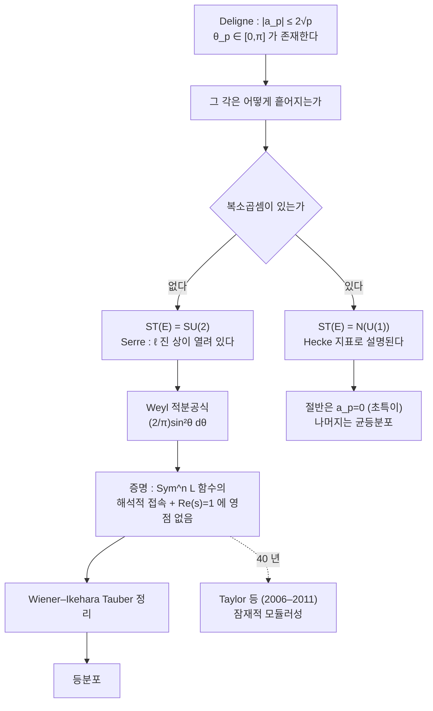

# Sato–Tate 분포

# 개요

[Deligne 의 정리](deligne-weil-conjectures.md)는 Frobenius 고윳값의 절댓값을 정확히 못 박았다. 타원곡선 $E/\mathbb Q$ 와 좋은 환원의 소수 `p` 에서

$$
a_p=p+1-\#E(\mathbb F_p),
\qquad
|a_p|\le2\sqrt p
$$

이고, 두 고윳값은 $\sqrt p\,e^{\pm i\theta_p}$ 꼴이다. 정규화하면

$$
\frac{a_p}{2\sqrt p}=\cos\theta_p\in[-1,1],\qquad\theta_p\in[0,\pi]
$$

다. **각이 구간 안에 있다**는 것이 Deligne 의 정리다. 그러면 다음 질문은 자명하다. `p` 를 키워 갈 때 이 각들은 **어떻게 흩어지는가.**

Sato 는 수치 실험으로, Tate 는 이론적 근거로 1960 년대에 같은 답에 도달했다. `E` 가 복소곱셈을 갖지 않으면

$$
\theta_p\ \sim\ \frac2\pi\sin^2\theta\,d\theta
$$

를 따른다. $\cos\theta$ 로 옮기면 반원 분포 $\frac2\pi\sqrt{1-x^2}\,dx$ 다. 이 측도는 우연히 나온 것이 아니다. 콤팩트군 $\mathrm{SU}(2)$ 의 켤레류 위 Haar 측도이고, 곧 **Frobenius 가 $\mathrm{SU}(2)$ 안에 균등하게 흩어진다**는 말이다.

복소곱셈이 있으면 답이 달라진다. 대칭군이 $\mathrm{SU}(2)$ 가 아니라 그 안의 정규화 토러스로 줄어들기 때문이다. 절반의 소수에서 `a_p=0` 이 되고(그 소수에서 곡선이 초특이다) 나머지 각은 **균등분포**를 따른다. 아래 계산에서 두 경우를 나란히 확인한다.

증명 전략은 Hecke 시절부터 정해져 있었다. 대칭곱 `L` 함수 $L(\mathrm{Sym}^n E,s)$ 가 전부 해석적으로 접속되고 $\mathrm{Re}(s)=1$ 위에서 영점이 없으면 Wiener–Ikehara 형 Tauber 정리로 분포가 나온다. 이 조건을 실제로 확립하는 데 40 년이 걸렸고, 2006–2011 년에 Taylor 와 공저자들이 잠재적 모듈러성(potential automorphy)으로 해냈다.

# 직관

## 왜 하필 sin²인가

$\mathrm{SU}(2)$ 의 원소는 켤레를 무시하면 고윳값 $e^{\pm i\theta}$ 로 결정된다. 곧 켤레류의 공간이 $[0,\pi]$ 다. $\mathrm{SU}(2)$ 의 Haar 측도를 이 공간으로 밀어내면 Weyl 적분공식이

$$
\frac2\pi\sin^2\theta\,d\theta
$$

를 준다. $\sin^2$ 는 Weyl 분모 $|e^{i\theta}-e^{-i\theta}|^2$ 에서 온다. 서로 다른 고윳값이 밀어내는 효과이고, 랜덤 행렬 이론의 반발과 같은 것이다.

그래서 $\theta=0$ 이나 $\theta=\pi$ 근처, 곧 `a_p` 가 Hasse 한계에 거의 닿는 일은 **드물다**. 반대로 $a_p\approx0$ 근처가 가장 흔하다. 밀도가 $\sin^2$ 이므로 중앙에서 최대다.

## 군이 분포를 정한다

이 관점이 Sato–Tate 를 일반화하는 열쇠다. 곡선마다 **Sato–Tate 군** $\mathrm{ST}(E)$ 라는 콤팩트군이 붙고, 정규화된 Frobenius 가 그 군의 켤레류에서 Haar 측도로 등분포한다.

- **복소곱셈이 없으면** $\mathrm{ST}(E)=\mathrm{SU}(2)$. $\ell$ 진 표현의 상이 열려 있다(Serre 의 정리). 측도가 $\frac2\pi\sin^2\theta\,d\theta$ 다.
- **복소곱셈이 있으면** 표현의 상이 훨씬 작다. 허수이차체 `K` 안의 Hecke 지표로 설명되고, $\mathrm{ST}(E)$ 는 정규화 토러스 $N(\mathrm{U}(1))$ 다. $\mathbb Q$ 위에서 보면 절반의 소수(`K` 에서 불활성인 소수)에서 곡선이 초특이라 `a_p=0` 이고, 나머지 절반에서 각이 $[0,\pi]$ 에 **균등**하다.

균등분포가 나오는 이유도 같은 논리다. $\mathrm{U}(1)$ 의 Haar 측도가 각에 대해 균등하기 때문이다. 군이 바뀌면 측도가 바뀐다.



## 왜 대칭곱이 필요한가

측도를 확정하려면 모든 모멘트를 확정해야 한다. $\mathrm{SU}(2)$ 의 기약표현은 대칭곱 $\mathrm{Sym}^n$ 이고 그 지표가

$$
\mathrm{tr}\,\mathrm{Sym}^n(\theta)=\frac{\sin((n+1)\theta)}{\sin\theta}
=U_n(\cos\theta)
$$

곧 제2종 Chebyshev 다항식이다. 이 함수들이 $\frac2\pi\sin^2\theta\,d\theta$ 에 대해 정규직교기저를 이룬다. 그러므로 "모든 $n\ge1$ 에서 $\sum_p U_n(\cos\theta_p)$ 가 주 항 없이 작다" 를 보이면 등분포가 나온다.

그 합을 통제하는 것이 $L(\mathrm{Sym}^nE,s)$ 다. Dirichlet 급수의 표준 논법대로, $\mathrm{Re}(s)=1$ 에서 영점도 극점도 없으면 계수합이 상쇄된다. 곧 **등분포 문제가 무한히 많은 `L` 함수의 해석적 성질로 환원된다.** 소수 정리가 $\zeta(1+it)\ne0$ 으로 환원되는 것과 똑같은 구조이고, 다만 함수가 하나가 아니라 무한히 많다.

# 정의

## 정규화와 Sato–Tate 측도

$E/\mathbb Q$ 가 좋은 환원을 갖는 소수 `p` 에서

$$
a_p=p+1-\#E(\mathbb F_p),
\qquad
\theta_p=\arccos\!\Big(\frac{a_p}{2\sqrt p}\Big)\in[0,\pi]
$$

로 둔다. **Sato–Tate 측도**는

$$
\mu_{ST}=\frac2\pi\sin^2\theta\,d\theta
\qquad\Big(\text{동치로}\quad\frac2\pi\sqrt{1-x^2}\,dx,\ x=\cos\theta\Big)
$$

다. 전체 질량이 `1` 이고 $[0,\pi]$ 에 대칭이다.

## Sato–Tate 추측(정리)

> **정리 (Taylor 등, 2006–2011).** $E/\mathbb Q$ 가 복소곱셈을 갖지 않으면 $\{\theta_p\}$ 는 $\mu_{ST}$ 에 대해 등분포한다. 곧 모든 $0\le\alpha<\beta\le\pi$ 에서
> $$\lim_{X\to\infty}\frac{\#\{p\le X:\theta_p\in[\alpha,\beta]\}}{\#\{p\le X\}}=\int_\alpha^\beta\frac2\pi\sin^2\theta\,d\theta$$

총체적 실체는 전체수체(totally real field) 위의 타원곡선까지 확장되었다.

## 대칭곱 L 함수

$\alpha_p,\beta_p$ 를 `p` 에서의 정규화된 Frobenius 고윳값($\alpha_p\beta_p=1$)이라 할 때

$$
L(\mathrm{Sym}^nE,s)=\prod_{p\ \text{좋음}}\ \prod_{k=0}^{n}
\Big(1-\alpha_p^{\,k}\beta_p^{\,n-k}p^{-s}\Big)^{-1}
$$

이다. `n=1` 이 `E` 의 Hasse–Weil `L` 함수이고, `n=2` 는 수반(adjoint) `L` 함수와 밀접하다.

## Sato–Tate 군

$\mathrm{ST}(E)$ 는 $\ell$ 진 표현의 상의 Zariski 폐포에 대응하는 콤팩트 실형태다. 타원곡선에서는 두 경우뿐이다.

| | $\mathrm{ST}(E)$ | 측도 | `a_p=0` 인 소수의 밀도 |
|---|---|---|---|
| CM 없음 | $\mathrm{SU}(2)$ | $\frac2\pi\sin^2\theta\,d\theta$ | `0` |
| CM 있음 | $N(\mathrm{U}(1))$ | $\frac12\delta_{\pi/2}+\frac1{2\pi}d\theta$ | $\tfrac12$ |

종수 2 이상의 아벨 다양체로 가면 가능한 $\mathrm{ST}$ 군이 훨씬 많다. 종수 2 에서는 `52` 개로 분류되어 있다.

# 성질

## 무엇이 어려웠는가

`n=1` 의 해석적 접속은 모듈러성 정리(Wiles 등)가 준다. `n=2` 도 Gelbart–Jacquet 이 일찍 해결했고 `n=3,4` 까지는 Kim–Shahidi 가 갔다. 문제는 **모든 `n`** 이 필요하다는 것이다.

Taylor 와 공저자들의 돌파구는 접근 자체를 바꾼 것이다. $L(\mathrm{Sym}^nE,s)$ 가 $\mathbb Q$ 위에서 자기동형(automorphic)임을 직접 보이는 대신, 어떤 **전체수체로 올라가면** 자기동형이 된다는 것(잠재적 모듈러성)만 보였다. 그것으로도 해석적 접속과 $\mathrm{Re}(s)=1$ 에서의 비소멸을 얻기에 충분하다. 도구는 모듈러성 올림 정리(`R=T`)와, 대칭곱을 실현하는 Calabi–Yau 다양체 족의 구성이었다.

## 오차항과 남은 문제

정리는 극한만 말하고 수렴 속도는 말하지 않는다. 적절한 `L` 함수의 Riemann 가설을 가정하면 오차가 `O(X^{-1/4})` 규모라고 예상되고, 수치 실험이 이와 맞는다. 무조건적 오차항은 훨씬 약하다.

관련해서 열려 있는 것들.

- **Lang–Trotter 추측.** 고정된 `r` 에 대해 `a_p=r` 인 소수의 개수가 $\asymp\sqrt X/\log X$ 라는 추측. Sato–Tate 는 각 점의 밀도가 `0` 이라는 것까지만 말하므로 이보다 훨씬 거친 정보다.
- **초특이 소수.** CM 이 없는 곡선에서 `a_p=0` 인 소수의 밀도는 `0` 이지만 무한히 많다(Elkies). 개수는 Lang–Trotter 의 특수한 경우다.
- **더 넓은 동기.** 일반 동기에 대한 Sato–Tate 형 추측은 대부분 열려 있다.

## 등분포가 곧 L 함수라는 구조

Sato–Tate 의 증명 구조는 이 저장소의 다른 정리들과 같은 틀이다.

| 등분포 진술 | 필요한 해석적 사실 |
|---|---|
| 소수 정리 | $\zeta(1+it)\ne0$ |
| 산술급수의 소수 분포 | $L(1+it,\chi)\ne0$ |
| [Chebotarev 밀도](chebotarev.md) | Artin `L` 함수의 비소멸 |
| Sato–Tate | 모든 $\mathrm{Sym}^n$ `L` 함수의 비소멸 |

지표(또는 기약표현)마다 `L` 함수를 하나씩 놓고, 그 `L` 함수가 $\mathrm{Re}(s)=1$ 에서 살아 있으면 해당 지표의 평균이 사라진다. 지표들이 완비계를 이루므로 측도가 확정된다. Sato–Tate 가 어려운 이유는 군이 유한군이 아니라 $\mathrm{SU}(2)$ 여서 기약표현이 무한히 많기 때문이다.

# 활용

## 반원 분포를 직접 본다

`p<20000` 의 모든 좋은 소수에서 `a_p` 를 세고 각을 모아 Sato–Tate 측도와 비교한다. 예측값은 측도의 누적분포에서 계산한다.

```python
from math import isqrt, acos, pi, sin

LIM = 20000
sieve = bytearray([1]) * (LIM + 1); sieve[0:2] = b"\0\0"
for i in range(2, isqrt(LIM) + 1):
    if sieve[i]: sieve[i*i::i] = bytearray(len(sieve[i*i::i]))
PRIMES = [i for i in range(2, LIM + 1) if sieve[i]]

def a_p(p, a, b):                              # a_p = p + 1 - #E(F_p)
    n = 1
    for x in range(p):
        c = (x * x % p * x + a * x + b) % p
        n += 1 if c == 0 else (2 if pow(c, (p - 1) // 2, p) == 1 else 0)
    return p + 1 - n

disc = lambda a, b: -16 * (4 * a ** 3 + 27 * b ** 2)

def hist(angles, B):
    h = [0] * B
    for t in angles: h[min(B - 1, int(t / pi * B))] += 1
    return [c / (len(angles) or 1) for c in h]

ST = lambda t: (t - sin(2 * t) / 2) / pi        # (2/π)sin²θ 의 누적분포
UNI = lambda t: t / pi

def report(name, angles, B, cdf, extra=""):
    obs = hist(angles, B)
    print(f"\n  {name}   표본 {len(angles)} 개 {extra}")
    print(f"  {'구간':>16} {'관측':>9} {'예측':>9} {'차':>9}")
    worst = 0.0
    for i in range(B):
        lo, hi = i * pi / B, (i + 1) * pi / B
        pred = cdf(hi) - cdf(lo)
        worst = max(worst, abs(obs[i] - pred))
        print(f"  [{lo:5.3f},{hi:5.3f}] {obs[i]:>9.4f} {pred:>9.4f} {obs[i]-pred:>+9.4f}")
    print(f"  최대 칸 오차 {worst:.4f}")

A, B_ = 1, 1                                   # E : y^2 = x^3 + x + 1  (CM 없음)
print(f"  판별식 = {disc(A, B_)}")
ang, bad = [], 0
for p in PRIMES:
    if p < 5 or disc(A, B_) % p == 0: continue
    t = a_p(p, A, B_)
    if abs(t) > 2 * p ** 0.5 + 1e-9: bad += 1
    ang.append(acos(max(-1.0, min(1.0, t / (2 * p ** 0.5)))))
print(f"  Hasse 한계 위반 : {bad}")
report("Sato–Tate 측도 (2/π)sin²θ dθ 와 비교", ang, 8, ST)

#   판별식 = -496
#   Hasse 한계 위반 : 0
#
#   Sato–Tate 측도 (2/π)sin²θ dθ 와 비교   표본 2259 개
#                 구간        관측        예측         차
#   [0.000,0.393]    0.0124    0.0125   -0.0001
#   [0.393,0.785]    0.0761    0.0784   -0.0022
#   [0.785,1.178]    0.1656    0.1716   -0.0061
#   [1.178,1.571]    0.2417    0.2375   +0.0042
#   [1.571,1.963]    0.2430    0.2375   +0.0055
#   [1.963,2.356]    0.1695    0.1716   -0.0021
#   [2.356,2.749]    0.0779    0.0784   -0.0005
#   [2.749,3.142]    0.0137    0.0125   +0.0013
#   최대 칸 오차 0.0061
```

소수 `2259` 개로 최대 칸 오차가 `0.006` 이다. 양 끝 칸의 비율이 `0.012` 로 가운데 칸 `0.24` 의 스무 분의 일이다. $\sin^2$ 의 모양이 그대로 나온다. Hasse 한계 위반은 물론 하나도 없다.

## 복소곱셈이 있으면 분포가 바뀐다

`y^2=x^3+1` 은 `j=0` 이고 $\mathbb Z[\zeta_3]$ 에 의한 복소곱셈을 갖는다. 같은 계산을 그대로 돌린다.

```python
A2, B2 = 0, 1                                  # E : y^2 = x^3 + 1  (CM 있음)
zero, nz = 0, []
for p in PRIMES:
    if p < 5 or disc(A2, B2) % p == 0: continue
    t = a_p(p, A2, B2)
    if t == 0: zero += 1
    else: nz.append(acos(max(-1.0, min(1.0, t / (2 * p ** 0.5)))))
tot = zero + len(nz)
print(f"  a_p = 0 인 소수 비율 : {zero}/{tot} = {zero/tot:.4f}   (예측 1/2)")
print(f"  그 소수는 전부 p ≡ 2 (mod 3) 인가 : "
      f"{all(p % 3 == 2 for p in PRIMES if p >= 5 and disc(A2,B2) % p and a_p(p,A2,B2) == 0)}")
report("남은 각을 Sato–Tate 와 비교 (맞지 않아야 한다)", nz, 8, ST)
report("남은 각을 균등분포와 비교 (이쪽이 맞아야 한다)", nz, 8, UNI)

#   a_p = 0 인 소수 비율 : 1136/2260 = 0.5027   (예측 1/2)
#   그 소수는 전부 p ≡ 2 (mod 3) 인가 : True
#
#   남은 각을 Sato–Tate 와 비교 (맞지 않아야 한다)   표본 1124 개
#                 구간        관측        예측         차
#   [0.000,0.393]    0.1246    0.0125   +0.1121
#   [0.393,0.785]    0.1281    0.0784   +0.0497
#   [0.785,1.178]    0.1254    0.1716   -0.0462
#   [1.178,1.571]    0.1281    0.2375   -0.1094
#   [1.571,1.963]    0.1201    0.2375   -0.1174
#   [1.963,2.356]    0.1317    0.1716   -0.0399
#   [2.356,2.749]    0.1219    0.0784   +0.0435
#   [2.749,3.142]    0.1201    0.0125   +0.1076
#   최대 칸 오차 0.1174
#
#   남은 각을 균등분포와 비교 (이쪽이 맞아야 한다)   표본 1124 개
#                 구간        관측        예측         차
#   [0.000,0.393]    0.1246    0.1250   -0.0004
#   [0.393,0.785]    0.1281    0.1250   +0.0031
#   [0.785,1.178]    0.1254    0.1250   +0.0004
#   [1.178,1.571]    0.1281    0.1250   +0.0031
#   [1.571,1.963]    0.1201    0.1250   -0.0049
#   [1.963,2.356]    0.1317    0.1250   +0.0067
#   [2.356,2.749]    0.1219    0.1250   -0.0031
#   [2.749,3.142]    0.1201    0.1250   -0.0049
#   최대 칸 오차 0.0067
```

세 가지가 한꺼번에 읽힌다.

- 소수의 정확히 절반에서 `a_p=0` 이다(`0.5027`). 그리고 그 소수가 **전부** $p\equiv2\pmod3$ 다. $\mathbb Q(\zeta_3)$ 에서 불활성인 소수이고, 거기서 곡선이 초특이다.
- 남은 각을 Sato–Tate 와 비교하면 최대 오차가 `0.117` 로 크게 어긋난다. 같은 표본 크기에서 비 CM 곡선이 `0.006` 이었으니 스무 배다. 우연이 아니라 다른 분포다.
- 같은 각을 균등분포와 비교하면 오차가 `0.007` 로 떨어진다. 비 CM 곡선이 Sato–Tate 에 맞는 정도와 같다.

측도가 곡선의 대칭군에 달려 있다는 진술이 표 두 개로 드러난다. $\mathrm{SU}(2)$ 면 $\sin^2$, $\mathrm{U}(1)$ 이면 균등이다.

## 어디에 쓰이는가

- **추측의 발견.** Sato 의 원래 작업이 수치 실험이었다. 이런 표를 만드는 일이 [SEA](sea-algorithm.md)나 [Kedlaya](kedlaya-algorithm.md) 알고리즘의 주요 용도이고, LMFDB 의 곡선 자료가 그 산물이다.
- **CM 판정.** 위 계산이 그대로 실용적 판정법이다. `a_p=0` 인 소수의 비율이 $\tfrac12$ 에 가까우면 복소곱셈을 의심한다.
- **Sato–Tate 군 분류.** 아벨 다양체와 더 일반적인 동기에 대해 어떤 콤팩트군이 나타날 수 있는지를 분류하는 프로그램이 진행 중이다. 종수 2 의 `52` 개 목록이 대표적 성과다.
- **모듈러성 올림.** 증명에 쓰인 `R=T` 형 정리는 Fermat 마지막 정리에서 시작된 줄기이며, 지금은 [Langlands 강령](langlands-program.md)의 표준 도구다. Sato–Tate 는 그 도구가 순수한 분포 문제를 푼 사례다.

[^1]: 원 추측의 문헌은 J. Tate, *Algebraic cycles and poles of zeta functions*, in *Arithmetical Algebraic Geometry* (1965). 증명은 L. Clozel, M. Harris, R. Taylor, *Automorphy for some ℓ-adic lifts of automorphic mod ℓ Galois representations*, Publ. IHÉS **108** (2008) 및 그 후속인 M. Harris, N. Shepherd-Barron, R. Taylor, Ann. of Math. **171** (2010) 과 T. Barnet-Lamb, D. Geraghty, M. Harris, R. Taylor, Publ. RIMS **47** (2011). CM 곡선의 분포와 Serre 의 열린 상 정리는 J.-P. Serre, *Abelian ℓ-adic Representations and Elliptic Curves* (1968). 종수 2 의 Sato–Tate 군 분류는 F. Fité, K. Kedlaya, V. Rotger, A. Sutherland, *Sato–Tate distributions and Galois endomorphism modules in genus 2*, Compos. Math. **148** (2012). 본문의 수치 계산은 직접 한 것이다.

# 연관 문서

## 선수지식

- [Deligne 의 Weil 추측 증명](deligne-weil-conjectures.md)

## 더 알아보기

- [Lang–Trotter 추측과 초특이 소수](lang-trotter.md)

#number_theory #probability #analysis #computation
