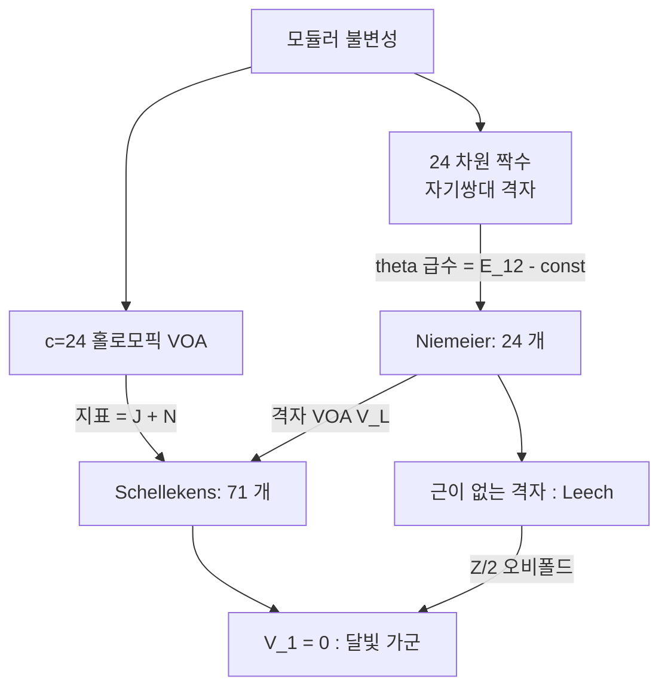

# Schellekens 목록과 홀로모픽 c=24 VOA 분류

# 개요

[Zhu 대수와 모듈러 불변성](zhu-algebra.md)에 따라 $C_2$ 여유한 유리 VOA 의 지표는 모듈러 형식처럼 변환한다. 이 정리가 분류 도구가 된다.

기약가군이 자기 자신뿐인 VOA 가 **홀로모픽**(자기쌍대) VOA 다. 지표가 하나뿐이므로 모듈러 불변성이 지표를 $\mathrm{SL}\_2(\mathbb Z)$ 불변 함수로 만든다. 이 제약이 중심전하를 $c\in24\mathbb Z$ 로 강제하고 $c=24$ 에서는 지표를 완전히 결정한다.

$$
\mathrm{ch}\thinspace V(\tau)=J(\tau)+N=q^{-1}+N+196884\thinspace q+\cdots,\qquad N=\dim V_1
$$

정수 $N$ 하나를 빼면 자유도가 없다. Schellekens 는 1993 년에 무게 $1$ 부분 $V_1$ 의 Lie 대수 구조를 조합적으로 제한해 71 가지 타입만 가능함을 보였다.[^1] 이후 30 년에 걸쳐 각 항목의 존재와 유일성이 증명되었고, $V_1=0$ 인 괴물 달빛 가군의 유일성만 증명되지 않은 채 남아 있다[^2].

24 차원 짝수 자기쌍대 격자가 정확히 24 개라는 [Niemeier 분류](niemeier-lattices.md)가 이 목록과 나란히 놓인다. 격자 쪽 24 개는 VOA 쪽 71 개 안에 격자 VOA 로 들어가고, 두 분류 모두 지표가 대상을 거의 결정한다는 논법을 쓴다.

# 직관

## 중심전하의 제약

홀로모픽 VOA 의 지표는 하나뿐이므로 $\mathrm{SL}\_2(\mathbb Z)$ 작용 아래 자기 자신으로 간다. $T\colon\tau\mapsto\tau+1$ 의 작용은 $q^{-c/24}$ 앞자리에서 $e^{-2\pi ic/24}$ 를 낳는다. 이것이 $1$ 이려면

$$
\frac{c}{24}\in\mathbb Z
$$

여야 한다. $c=8,16,24$ 에서의 답은 다음과 같다.

| $c$ | 홀로모픽 VOA 의 개수 | 대응하는 격자 |
|---|---|---|
| $8$ | 1 | $E_8$ |
| $16$ | 2 | $E_8^2$ 와 $D_{16}^+$ |
| $24$ | 71 (예상, 70 개 확정) | Niemeier 격자 24 개 |

격자 쪽 개수 1, 2, 24 와 VOA 쪽 개수 1, 2, 71 이 $c=24$ 에서 갈라진다. 격자 VOA 가 아닌 홀로모픽 VOA 가 이 차원에서 처음 나타나고, 그 대표가 괴물 달빛 가군이다.

## 지표 $J+N$

$c=24$ 인 홀로모픽 VOA 의 지표는 $q^{-1}$ 에서 시작하는 정칙 모듈러 불변 함수이므로 $j(\tau)+\text{상수}$ 꼴이다. 상수항을 $N$ 이라 두면 $q^1$ 계수가 $196884$ 로 결정된다. 분류에 쓸 수 있는 자유도는 정수 $N=\dim V_1$ 하나다.

$V_1$ 은 벡터공간이 아니라 Lie 대수다. VOA 의 곱이 $[a,b]=a_{(0)}b$ 로 $V_1$ 에 Lie 괄호를 주고, 그 Lie 대수는 아핀 VOA 를 부분대수로 품는다. 문제가 차원이 $N$ 인 Lie 대수 가운데 어떤 것이 가능한지로 바뀌어 유한한 조합 문제가 된다.

## 레벨과 dual Coxeter 수를 묶는 관계식

$V_1=\bigoplus_i\mathfrak g_i$ 를 단순 성분으로 쪼개면 각 성분은 레벨 $k_i$ 의 아핀 VOA $L_{\mathfrak g_i}(k_i)$ 를 만든다. Schellekens 의 핵심 제약은 모든 성분이 같은 비율을 갖는다는 것이다.

$$
\frac{h^\vee_i}{k_i}=\frac{\dim V_1-24}{24}\qquad\text{(모든 } i \text{ 에 대해 같은 값)}
$$

$h^\vee_i$ 는 dual Coxeter 수다. 좌변은 성분마다 다를 수 있고 우변은 $V_1$ 전체로 정해지므로 성분들이 서로 맞물린다. 이 조건이 후보를 크게 줄인다.

단순 성분이 둘 이하인 조합을 모두 훑으면 이 비율 조건을 통과하는 것은 열셋이다.

$$
A_{6,7},\quad C_{4,10},\quad A_{1,2}D_{5,8},\quad A_{2,2}F_{4,6},\quad A_{2,6}D_{4,12},\quad A_{3,1}C_{7,2},\quad A_{3,8}B_{3,10}
$$

$$
A_{3,8}C_{3,8},\quad A_{4,5}A_{4,5},\quad A_{5,1}E_{7,3},\quad A_{8,2}F_{4,2},\quad B_{6,2}B_{6,2},\quad B_{8,1}E_{8,2}
$$

이 관계식은 필요조건이므로 통과한 조합이 모두 실현되지는 않고, 아래의 추가 조건이 후보를 더 잘라낸다. 성분이 세 개 이상인 항목은 이 탐색이 잡지 못한다.

## Niemeier 격자와의 대응

Niemeier 격자 $L$ 에서 격자 VOA $V_L$ 을 만들면 $\dim (V_L)\_1=24+|\lbrace L\text{ 의 근}\rbrace|$ 이고 근계가 $V_1$ 의 Lie 대수가 된다. 근이 없는 유일한 Niemeier 격자가 Leech 격자이고 거기서 나온 $V_\Lambda$ 는 $\dim V_1=24$ 다. $\mathbb Z/2$ 오비폴드를 취해 $V_1$ 을 없애면 달빛 가군 $V^\natural$ 이 된다.

# 정의

## 홀로모픽 VOA

VOA $V$ 가 $C_2$ 여유한 유리 VOA 이고 기약 $V$ 가군이 $V$ 자신뿐이면 홀로모픽(자기쌍대)이다. 이때 모듈러 텐서범주는 자명하고 지표가 하나다. 물리에서는 진공이 하나뿐인 유리 등각장론에 해당한다.

## 무게 1 Lie 대수

$V_1$ 에 $[a,b]=a_{(0)}b$ 로 Lie 괄호를, $\langle a,b\rangle=a_{(1)}b\in V_0=\mathbb C$ 로 불변 쌍선형 형식을 준다. $V$ 가 $c=24$ 홀로모픽이면 $V_1$ 은 **환원적**이고, 단순 성분마다 양의 정수 레벨이 붙어 아핀 VOA 를 이룬다.

$$
\bigotimes_i L_{\mathfrak g_i}(k_i)\thickspace\subseteq\thickspace V
$$

## Schellekens 목록

자료 $(\mathfrak g_i,k_i)\_i$ 가 $V$ 의 **타입**이다. Schellekens 목록은 $c=24$ 홀로모픽 VOA 가 가질 수 있는 타입 71 가지의 표이고, $V_1=0$ 인 경우, $V_1$ 이 아벨 $24$ 차원인 경우(Leech 격자 VOA), 반단순인 경우 69 가지로 나뉜다.

## 분류 정리의 현재 상태

- **존재.** 71 개 타입 각각에 대해 실제 VOA 가 구성되었다. 격자 VOA, 오비폴드, 단순전류 확대, 역오비폴드 등을 조합한다.
- **유일성.** $V_1\ne0$ 인 70 개에 대해 타입이 VOA 를 동형까지 결정한다(Höhn, Möller, Lam, van Ekeren–Möller–Scheithauer 등의 일련의 작업으로 2020 년경 완결).
- **$V_1=0$ 인 경우.** $V_1=0$ 인 홀로모픽 $c=24$ VOA 가 $V^\natural$ 뿐이라는 Frenkel–Lepowsky–Meurman 추측은 증명되지 않았다[^2].

# 성질

## 지표 밖의 제약

지표가 $J+N$ 으로 고정되어도 $N$ 이 같은 서로 다른 VOA 가 있다. 목록에는 같은 $\dim V_1$ 을 갖는 타입이 여럿 있다. 지표는 무게별 차원만 보고 Lie 대수 구조를 보지 못한다. 분류에는 위의 $h^\vee/k$ 관계식과 다음 조건이 더 필요하다.

- 각 아핀 부분 VOA 의 지표를 $V$ 의 지표로 전개할 때 중복도가 음이 아닌 정수여야 한다.
- 부분 VOA 의 정류자(commutant)가 다시 VOA 이므로 그 중심전하가 $0\le c'\le24$ 를 만족해야 한다.
- 레벨 $k_i$ 는 정수이고 $\mathfrak g_i$ 의 종류에 따라 허용 범위가 제한된다.

Schellekens 는 이 조건들을 계산기로 훑어 71 개를 남겼다. 원래 논문의 논법에는 물리적 직관에 기댄 부분이 있었고 수학적으로 다시 세우는 데 시간이 걸렸다.

## 구성적 존재 증명

목록의 각 항목은 다음 도식으로 만든다.

1. 적당한 Niemeier 격자 $L$ 에서 격자 VOA $V_L$ 을 만든다.
2. 유한군 $G\subset\mathrm{Aut}(V_L)$ 를 잡아 오비폴드 $V_L^G$ 를 취하고, 꼬인 가군들을 붙여 확대한다.
3. 나온 VOA 의 $V_1$ 을 계산해 목표 타입과 맞는지 확인한다.

$\mathbb Z/n$ 오비폴드가 홀로모픽을 보존한다는 van Ekeren–Möller–Scheithauer 의 정리가 이 절차의 근거이고, 그 증명이 모듈러 불변성의 정밀한 형태를 쓴다. 71 개를 채우는 데 $n=2,3,4,5,6,7,8$ 오비폴드가 모두 쓰였다.

## 달빛 가군의 위치

$V^\natural$ 은 목록에서 $V_1=0$ 인 유일한 항목이다. $V_1=0$ 이므로 자기동형군이 아핀 대칭에서 오지 않고 유한 단순군이 통째로 나타날 수 있다. $\mathrm{Aut}(V^\natural)=\mathbb M$ 이 괴물군이고 지표가 $J(\tau)$ 라는 사실에서 [괴물 달빛](monstrous-moonshine.md)이 나온다. $V_1$ 을 없애면 대칭이 최대가 되는 구도는 Leech 격자가 근을 갖지 않아 Conway 군을 얻는 것과 같다.

## 더 높은 $c$ 에서

$c=32$ 에서는 짝수 자기쌍대 격자만 해도 십억 개가 넘어 분류가 불가능하다. $c=24$ 가 분류가 가능한 마지막 자리이고, 이 목록이 $E_8$ 과 Leech 격자와 산재 단순군과 같은 예외적 대상의 표가 된다.

# 활용

## 등각장론의 지형도

물리에서 $c=24$ 홀로모픽 이론은 24 차원 보손 끈의 내부 이론이다. 71 개 목록이 그 이론이 가질 수 있는 게이지 대칭의 표이고 각 항목의 $V_1$ 이 게이지군의 Lie 대수다. 초끈 이론의 격자 구성에 나오는 특수한 대칭이 이 목록으로 설명된다.

## 모듈러 텐서범주 쪽의 대응물

홀로모픽 VOA 는 자명한 [모듈러 텐서범주](modular-tensor-categories.md)를 주지만 그 안의 부분 VOA $\bigotimes L_{\mathfrak g_i}(k_i)$ 는 자명하지 않은 범주를 준다. $V$ 의 존재는 그 범주 안에 특정한 라그랑주 대수가 있다는 뜻이고, 범주론 쪽에서 목록의 항목을 검증할 수 있다.

## 새로운 달빛의 원천

$V^\natural$ 밖의 항목들도 자기동형군을 갖고, 그 군의 원소에 대한 꼬인 지표가 모듈러 함수를 준다. Umbral moonshine 을 비롯한 이후의 달빛 현상이 이 표를 훑는 과정에서 발견되었다.

[^1]: A. N. Schellekens, *Meromorphic c=24 conformal field theories*, Comm. Math. Phys. **153** (1993), 159–185. 수학적 재구성과 유일성 완결은 G. Höhn, *On the genus of the moonshine module* (2017), J. van Ekeren, S. Möller, N. Scheithauer, *Construction and classification of holomorphic vertex operator algebras*, J. reine angew. Math. **759** (2020), C. H. Lam 등의 일련의 논문에 걸쳐 있다.
[^2]: I. Frenkel, J. Lepowsky, A. Meurman, *Vertex Operator Algebras and the Monster*, Academic Press (1988). 서문이 $V^\natural$ 의 유일성을 추측으로 제기한다.

# 연관 문서

## 선수지식

- [Zhu 대수와 모듈러 불변성](zhu-algebra.md)
- [Niemeier 격자와 24 차원 분류](niemeier-lattices.md)

## 더 알아보기

아직 연결한 문서가 없다.

#algebra #combinatorics #complex_analysis
