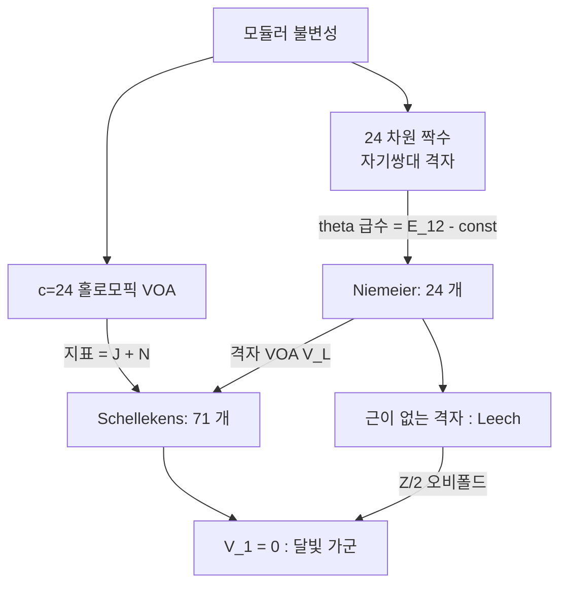

# Schellekens 목록과 홀로모픽 c=24 VOA 분류

# 개요

[Zhu 대수와 모듈러 불변성](zhu-algebra.md)에서 $C_2$-여유한 유리 VOA 의 지표가 모듈러 형식처럼 변환한다는 것을 보았다. 그 정리를 **분류 도구**로 쓰면 어떻게 되는가가 이 문서의 주제다.

가장 단순한 VOA 는 기약가군이 자기 자신뿐인 것, 즉 **홀로모픽**(자기쌍대) VOA 다. 이때 지표가 하나뿐이라 모듈러 불변성이 "지표가 $\mathrm{SL}_2(\mathbb Z)$ 불변인 함수" 라는 강력한 제약이 된다. 그 제약은 중심전하를 $c\in24\mathbb Z$ 로 강제하고, $c=24$ 에서는 지표를 완전히 결정한다.

$$
\mathrm{ch}\,V(\tau)=J(\tau)+N=q^{-1}+N+196884\,q+\cdots,\qquad N=\dim V_1
$$

정수 하나 $N$ 을 빼면 자유도가 없다. 그렇다면 $V$ 자체는 몇 개인가. Schellekens 는 1993 년에 무게 $1$ 부분 $V_1$ 이 지니는 Lie 대수 구조를 조합적으로 제한해 **71 가지**만 가능함을 보였다.[^1] 이후 30 년에 걸쳐 그 목록의 각 항목이 실제로 존재하고 유일함이 증명되었고, $V_1=0$ 인 마지막 한 항목만 유일성이 미해결로 남아 있다. 그것이 괴물 달빛 가군이다.

24 차원 짝수 자기쌍대 격자가 정확히 24 개라는 [Niemeier 분류](niemeier-lattices.md)와 이 목록은 나란히 놓인다. 격자 쪽 24 개는 VOA 쪽 71 개 안에 격자 VOA 로 포함되고, 두 분류 모두 "지표(theta 급수)가 대상을 거의 결정한다" 는 같은 논법으로 진행된다.

# 직관

## 왜 중심전하가 24 의 배수인가

홀로모픽 VOA 의 지표는 하나뿐이므로 $\mathrm{SL}_2(\mathbb Z)$ 작용 아래 자기 자신으로 가야 한다. 그런데 $T\colon\tau\mapsto\tau+1$ 의 작용은 $q^{-c/24}$ 앞자리에서 $e^{-2\pi ic/24}$ 를 낳는다. 이것이 $1$ 이려면

$$
\frac{c}{24}\in\mathbb Z
$$

여야 한다. $c=8,16,24$ 가 차례로 나오고 각각의 답은 이렇다.

| $c$ | 홀로모픽 VOA 의 개수 | 대응하는 격자 |
|---|---|---|
| $8$ | 1 | $E_8$ |
| $16$ | 2 | $E_8^2$, $D_{16}^+$ |
| $24$ | 71 (예상, 70 개 확정) | Niemeier 격자 24 개 |

격자 쪽 개수(1, 2, 24)와 VOA 쪽 개수(1, 2, 71)가 $c=24$ 에서 갈라진다. 격자 VOA 가 아닌 홀로모픽 VOA 가 이 차원에서 처음 나타나기 때문이고, 그 대표가 괴물 달빛 가군이다.

## 지표가 $J+N$ 으로 고정된다

$c=24$ 인 홀로모픽 VOA 의 지표는 $q^{-1}$ 에서 시작하는 정칙 모듈러 불변 함수이므로, $j$ 함수의 이론에 의해 $j(\tau)+\text{상수}$ 꼴이다. 상수항을 $N$ 이라 두면 $q^1$ 계수가 $196884$ 로 **자동으로** 결정된다. 분류에 쓸 수 있는 자유도는 정수 $N=\dim V_1$ 하나뿐이다.

여기서 결정적인 관찰이 나온다. $V_1$ 은 단순히 벡터공간이 아니라 **Lie 대수**다. VOA 의 곱이 $[a,b]=a_{(0)}b$ 로 $V_1$ 에 Lie 괄호를 주고, 그 Lie 대수는 아핀 VOA 를 부분대수로 품는다. 그래서 문제가 "차원이 $N$ 인 Lie 대수 가운데 어떤 것이 가능한가" 로 바뀐다. 무한한 분류 문제가 유한한 조합 문제가 되는 순간이다.

## 레벨과 dual Coxeter 수를 묶는 관계식

$V_1=\bigoplus_i\mathfrak g_i$ 를 단순 성분으로 쪼개면 각 성분은 레벨 $k_i$ 의 아핀 VOA $L_{\mathfrak g_i}(k_i)$ 를 만든다. Schellekens 의 핵심 제약은 모든 성분이 같은 비율을 갖는다는 것이다.

$$
\frac{h^\vee_i}{k_i}=\frac{\dim V_1-24}{24}\qquad\text{(모든 } i \text{ 에 대해 같은 값)}
$$

$h^\vee_i$ 는 dual Coxeter 수다. 좌변은 성분마다 다를 수 있는 양인데 우변은 $V_1$ 전체로 정해지므로, 성분들이 서로 **맞물려야** 한다. 이 한 줄이 후보를 격렬하게 줄인다.

```javascript
// 단순 Lie 대수 [이름, dim, dual Coxeter number]
const simple = [];
for (let n = 1; n <= 8; n++) simple.push([`A${n}`, n * (n + 2), n + 1]);
for (let n = 2; n <= 8; n++) simple.push([`B${n}`, n * (2 * n + 1), 2 * n - 1]);
for (let n = 3; n <= 8; n++) simple.push([`C${n}`, n * (2 * n + 1), n + 1]);
for (let n = 4; n <= 8; n++) simple.push([`D${n}`, n * (2 * n - 1), 2 * n - 2]);
simple.push(['E6', 78, 12], ['E7', 133, 18], ['E8', 248, 30], ['F4', 52, 9], ['G2', 14, 4]);

const pairs = [];
for (const [name, dim, hv] of simple)
  for (let k = 1; k <= 12; k++) pairs.push({ name: `${name},${k}`, dim, m: hv / k });

const found = [];
for (const p of pairs)                                   // 단순 성분 하나
  if (p.dim === 24 * (p.m + 1)) found.push([p.name]);
for (let i = 0; i < pairs.length; i++)                   // 성분 둘
  for (let j = i; j < pairs.length; j++) {
    const [a, b] = [pairs[i], pairs[j]];
    if (a.m === b.m && a.dim + b.dim === 24 * (a.m + 1)) found.push([a.name, b.name]);
  }
console.log(found.map(f => f.join(' ')).join('\n'));
// A6,7        C4,10       A1,2 D5,8    A2,2 F4,6   A2,6 D4,12
// A3,1 C7,2   A3,8 B3,10  A3,8 C3,8    A4,5 A4,5   A5,1 E7,3
// A8,2 F4,2   B6,2 B6,2   B8,1 E8,2
```

성분 두 개까지만 훑었는데도 $A_{6,7}$, $C_{4,10}$, $A_{4,5}^2$, $A_{5,1}E_{7,3}$, $B_{8,1}E_{8,2}$ 처럼 실제 목록에 실린 항목들이 그대로 나온다. 이 관계식은 필요조건일 뿐이라 통과한 조합이 모두 실현되는 것은 아니고, 뒤에 적을 추가 조건들이 남은 후보를 더 잘라낸다. 반대로 성분이 세 개 이상인 항목($A_{1,1}^{24}$ 같은 극단적인 경우까지)은 위 탐색이 놓친다.

## Niemeier 와 나란히 보기



두 분류의 평행이 우연이 아니다. Niemeier 격자 $L$ 에서 격자 VOA $V_L$ 을 만들면 $\dim (V_L)_1=24+|\{L\text{ 의 근}\}|$ 이고, 근계가 그대로 $V_1$ 의 Lie 대수가 된다. 근이 없는 유일한 Niemeier 격자가 Leech 격자이고, 거기서 나온 $V_\Lambda$ 는 $\dim V_1=24$ 다. 여기에 $\mathbb Z/2$ 오비폴드를 취해 $V_1$ 을 아예 없애면 달빛 가군 $V^\natural$ 이 된다.

# 정의

## 홀로모픽 VOA

VOA $V$ 가 홀로모픽(자기쌍대)이라 함은 $V$ 가 $C_2$-여유한 유리 VOA 이고 기약 $V$ 가군이 $V$ 자신뿐인 경우를 말한다. 이때 모듈러 텐서범주는 자명하고 지표가 하나다. 물리에서는 "하나의 진공만 있는 유리 등각장론" 에 해당한다.

## 무게 1 Lie 대수

$V_1$ 에 $[a,b]=a_{(0)}b$ 로 Lie 괄호를, $\langle a,b\rangle=a_{(1)}b\in V_0=\mathbb C$ 로 불변 쌍선형 형식을 준다. $V$ 가 $c=24$ 홀로모픽이면 $V_1$ 은 **환원적**이고, 단순 성분마다 양의 정수 레벨이 붙어 아핀 VOA 를 이룬다.

$$
\bigotimes_i L_{\mathfrak g_i}(k_i)\;\subseteq\;V
$$

## Schellekens 목록

위 자료 $(\mathfrak g_i,k_i)_i$ 를 $V$ 의 **타입**이라 부른다. Schellekens 목록은 $c=24$ 홀로모픽 VOA 가 가질 수 있는 타입 71 가지의 표다. $V_1=0$ 인 경우, $V_1$ 이 아벨 $24$ 차원인 경우(Leech 격자 VOA), 그리고 반단순인 경우 69 가지로 나뉜다.

## 분류 정리의 현재 상태

- **존재.** 71 개 타입 각각에 대해 실제 VOA 가 구성되었다. 격자 VOA, 오비폴드, 단순전류 확대, 역오비폴드 등을 조합한다.
- **유일성.** $V_1\ne0$ 인 70 개에 대해 타입이 VOA 를 동형까지 결정한다(Höhn, Möller, Lam, van Ekeren–Möller–Scheithauer 등의 일련의 작업으로 2020 년경 완결).
- **남은 것.** $V_1=0$ 인 홀로모픽 $c=24$ VOA 가 $V^\natural$ 뿐이라는 것은 Frenkel–Lepowsky–Meurman 추측으로 여전히 미해결이다.

# 성질

## 왜 지표만으로는 부족한가

지표가 $J+N$ 으로 고정된다는 것은 강력하지만 $N$ 이 같은 서로 다른 VOA 가 있을 수 있다. 실제로 목록에는 같은 $\dim V_1$ 을 갖는 서로 다른 타입이 여럿 있다. 지표는 무게별 차원만 보고 Lie 대수 구조는 보지 못하기 때문이다. 분류가 완성되려면 지표 위에 **대수 구조의 제약**을 얹어야 했고, 그것이 위의 $h^\vee/k$ 관계식과 다음 조건들이다.

- 각 아핀 부분 VOA 의 지표를 $V$ 의 지표로 전개할 때 중복도가 음이 아닌 정수여야 한다.
- 부분 VOA 의 정류자(commutant)가 다시 VOA 이므로 그 중심전하가 $0\le c'\le24$ 를 만족해야 한다.
- 레벨 $k_i$ 는 정수이고 $\mathfrak g_i$ 의 종류에 따라 허용 범위가 제한된다.

Schellekens 는 이 조건들을 계산기로 훑어 71 개를 남겼다. 원래 논문의 논법은 물리적 직관에 기댄 부분이 있었고, 수학적으로 빈틈없이 다시 세우는 데 시간이 걸렸다.

## 존재 증명이 구성적이라는 점

목록의 각 항목을 실제로 만드는 방법은 대체로 다음 도식을 따른다.

1. 적당한 Niemeier 격자 $L$ 에서 격자 VOA $V_L$ 을 만든다.
2. 유한군 $G\subset\mathrm{Aut}(V_L)$ 를 잡아 오비폴드 $V_L^G$ 를 취하고, 꼬인 가군들을 붙여 확대한다.
3. 나온 VOA 의 $V_1$ 을 계산해 목표 타입과 맞는지 확인한다.

$\mathbb Z/n$ 오비폴드가 홀로모픽을 보존한다는 사실(van Ekeren–Möller–Scheithauer)이 이 절차의 뼈대이고, 그 증명 자체가 모듈러 불변성의 정밀한 형태를 쓴다. 71 개를 채우는 데 $n=2,3,4,5,6,7,8$ 오비폴드가 모두 동원되었다.

## 달빛 가군의 위치

$V^\natural$ 은 목록에서 $V_1=0$ 인 유일한 항목이다. $V_1=0$ 이므로 자기동형군이 아핀 대칭에서 오지 않고, 그 결과 유한 단순군이 통째로 나타날 여지가 생긴다. 실제로 $\mathrm{Aut}(V^\natural)=\mathbb M$ 이 괴물군이고, 지표가 $J(\tau)$ 라는 사실이 [괴물 달빛](monstrous-moonshine.md)의 출발점이다. **$V_1$ 을 없애는 것이 대칭을 최대로 키우는 길**이라는 구도는 Leech 격자가 근을 갖지 않아 Conway 군을 얻는 것과 정확히 같다.

## 더 높은 $c$ 에서

$c=32$ 에서는 짝수 자기쌍대 격자만 해도 십억 개가 넘어 분류가 사실상 불가능하다. $c=24$ 는 분류가 가능한 마지막 자리이며, 그래서 이 목록이 "유한한 예외적 대상들의 표" 로서 $E_8$, Leech 격자, 산재 단순군과 같은 지위를 얻는다.

# 활용

## 등각장론의 지형도

물리에서 $c=24$ 홀로모픽 이론은 24 차원 보손 끈의 내부 이론에 해당한다. 71 개 목록은 그 이론이 가질 수 있는 게이지 대칭의 완전한 표이고, 각 항목의 $V_1$ 이 게이지군의 Lie 대수다. 초끈 이론의 격자 구성에서 나오던 특수한 대칭들이 왜 그 목록에만 나타나는지가 이 분류로 설명된다.

## 모듈러 텐서범주 쪽 그림자

홀로모픽 VOA 는 자명한 [모듈러 텐서범주](modular-tensor-categories.md)를 주지만, 그 안의 부분 VOA $\bigotimes L_{\mathfrak g_i}(k_i)$ 는 자명하지 않은 범주를 준다. $V$ 가 존재한다는 것은 그 범주 안에 특정한 라그랑주 대수가 있다는 뜻이고, 거꾸로 범주론 쪽에서 목록의 항목을 검증할 수 있다. 분류가 VOA, 격자, 텐서범주 세 언어에서 각각 확인된 셈이다.

## 새로운 달빛의 원천

$V^\natural$ 이외의 항목들도 자기동형군을 가지며, 그 군의 원소에 대한 꼬인 지표가 모듈러 함수를 준다. Umbral moonshine 을 비롯한 이후의 달빛 현상들이 이 표를 훑는 과정에서 발견되었다. 71 개 목록은 그런 현상을 찾을 때 먼저 뒤지는 사전 역할을 한다.

[^1]: A. N. Schellekens, *Meromorphic c=24 conformal field theories*, Comm. Math. Phys. **153** (1993), 159–185. 수학적 재구성과 유일성 완결은 G. Höhn, *On the genus of the moonshine module* (2017), J. van Ekeren, S. Möller, N. Scheithauer, *Construction and classification of holomorphic vertex operator algebras*, J. reine angew. Math. **759** (2020), C. H. Lam 등의 일련의 논문에 걸쳐 있다. 본문의 후보 탐색은 직접 한 것이며 필요조건만 반영한다.

# 연관 문서

## 선수지식

- [Zhu 대수와 모듈러 불변성](zhu-algebra.md)
- [Niemeier 격자와 24 차원 분류](niemeier-lattices.md)

## 더 알아보기

아직 연결한 문서가 없다.

#algebra #combinatorics #complex_analysis
