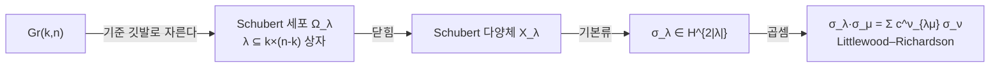

# Schubert 계산과 Grassmann 다양체

# 개요

19 세기 말 Schubert 는 이런 문제를 대량으로 풀었다.

> 3 차원 사영공간에서 일반 위치에 있는 직선 네 개가 주어졌다. 네 직선과 모두 만나는 직선은 몇 개인가?

답은 $2$ 다. Schubert 의 방법은 "보존 원리" 라 불렸는데, 직선들을 특수한 위치로 옮겨도 답이 변하지 않는다고 가정하고 퇴화한 배치에서 세는 것이었다. 답은 거의 다 맞았지만 근거가 엄밀하지 않았고, Hilbert 는 이것을 정당화하는 것을 15 번 문제로 걸었다.

현대적 답은 문제를 **공간의 코호몰로지 계산**으로 바꾸는 것이다. $\mathbb C^n$ 의 $k$ 차원 부분공간들이 이루는 Grassmann 다양체 $\mathrm{Gr}(k,n)$ 을 생각하면, "주어진 직선과 만난다" 같은 조건이 그 안의 부분다양체를 정의하고, 조건 여러 개를 동시에 만족하는 개수가 코호몰로지류의 곱이 된다.

$$
\text{기하 조건의 교차}\ \longleftrightarrow\ \text{코호몰로지류의 곱}
$$

[Borel–Weil–Bott](borel-weil-bott.md) 문서에서 본 Bruhat 분해가 여기서 계산의 기반이 된다. $\mathrm{Gr}(k,n)$ 이 세포로 분해되고 세포가 전부 짝수 차원이므로, 코호몰로지가 세포 하나에 기저 하나씩으로 곧바로 읽힌다. 그 기저가 **Schubert 류**이고, 곱셈 구조가 [Schur 다항식](schur-polynomials.md)의 곱셈 구조와 정확히 같다. 열거기하의 수가 대칭함수의 계수로 계산되는 것이다.

# 직관

## 조건을 부분다양체로 바꾼다

$\mathbb P^3$ 의 직선은 $\mathbb C^4$ 의 2 차원 부분공간이므로 $\mathrm{Gr}(2,4)$ 의 점이다. 이 공간은 4 차원이다.

주어진 직선 $L$ 에 대해 "$L$ 과 만나는 직선들" 의 집합은 $\mathrm{Gr}(2,4)$ 안에서 여차원 $1$ 의 부분다양체다. 조건 하나가 자유도 하나를 줄인다. 조건 네 개를 걸면 $4-4=0$ 차원, 곧 유한 개의 점이 남는다. 그 개수가 답이다.

세는 방법은 각 조건의 코호몰로지류를 곱하는 것이다. 네 조건 모두 같은 류 $\sigma_1$ 을 주므로 계산은

$$
\sigma_1^4\in H^8(\mathrm{Gr}(2,4))
$$

이고, 최고 차수 코호몰로지가 1 차원이므로 결과가 정수 배수로 나온다. 그 정수가 $2$ 다.

## 왜 계산이 조합론이 되는가

$\mathrm{Gr}(k,n)$ 을 기준 깃발 $F_1\subset F_2\subset\cdots\subset F_n$ 에 대해 자른다. 부분공간 $V$ 가 각 $F_i$ 와 얼마나 만나는지를 재면 $V$ 의 "위치" 가 정해지고, 같은 위치의 $V$ 들이 세포 하나를 이룬다. 세포는 $k\times(n-k)$ 상자 안에 들어가는 Young 도형 $\lambda$ 로 색인되고, 여차원이 $|\lambda|$ 다.



세포가 전부 짝수 실차원이라 경계사상이 $0$ 이고, 따라서

$$
H^*(\mathrm{Gr}(k,n),\mathbb Z)=\bigoplus_{\lambda\subseteq k\times(n-k)}\mathbb Z\,\sigma_\lambda
$$

이다. 기저의 개수는 상자 안 Young 도형의 개수, 곧 $\binom{n}{k}$ 다.

곱셈이 Schur 다항식의 곱셈과 같아지는 것은 우연이 아니다. $\sigma_\lambda$ 를 $\lambda$ 의 Schur 다항식으로 보내는 사상이 환 준동형이고, 상자를 벗어나는 항을 $0$ 으로 보내면 정확히 일치한다. 열거기하의 구조상수가 Littlewood–Richardson 계수인 이유가 이것이다.

## Pieri 규칙: 상자 하나를 더한다

일반 곱셈은 복잡하지만 $\sigma_1$ 을 곱하는 것은 쉽다.

$$
\sigma_1\cdot\sigma_\lambda=\sum_{\mu}\sigma_\mu
$$

합은 $\lambda$ 에 상자 **하나**를 더해 얻는 모든 유효한 도형 $\mu$ 에 대한 것이다. 상자를 더한 뒤에도 Young 도형이어야 하고 $k\times(n-k)$ 상자를 벗어나면 버린다.

이 규칙만으로 $\sigma_1^N$ 을 계산할 수 있고, $N=k(n-k)$ 이면 최고 차수에 도달해 답이 하나의 수가 된다. 그 수는 $k\times(n-k)$ 직사각형의 표준 Young 배열 개수다. 상자를 하나씩 채워 가는 경로의 수를 세는 것이기 때문이다.

# 정의

## Grassmann 다양체와 Schubert 세포

$\mathrm{Gr}(k,n)=\{V\le\mathbb C^n:\dim V=k\}$ 는 차원 $k(n-k)$ 의 매끄러운 사영다양체다. 기준 깃발 $F_\bullet$ 을 고정하고 $\lambda=(\lambda_1\ge\cdots\ge\lambda_k)$, $\lambda_1\le n-k$ 에 대해

$$
\Omega_\lambda=\{V:\dim(V\cap F_{n-k+i-\lambda_i})\ge i\ \ (1\le i\le k)\}
$$

를 **Schubert 다양체**라 한다. 열린 부분이 세포 $\cong\mathbb C^{k(n-k)-|\lambda|}$ 이고 여차원이 $|\lambda|$ 다. 기본류를 $\sigma_\lambda\in H^{2|\lambda|}(\mathrm{Gr}(k,n))$ 로 쓴다.

## 곱셈 구조

$$
\sigma_\lambda\cdot\sigma_\mu=\sum_{\nu\subseteq k\times(n-k)}c^{\nu}_{\lambda\mu}\,\sigma_\nu
$$

$c^\nu_{\lambda\mu}$ 는 Littlewood–Richardson 계수이고 $|\nu|=|\lambda|+|\mu|$ 인 항만 살아남는다. 특수한 경우가 두 개 유용하다.

- **Pieri**: $\sigma_p\cdot\sigma_\lambda=\sum\sigma_\mu$, 합은 $\lambda\subseteq\mu$, $|\mu|=|\lambda|+p$ 이고 $\mu/\lambda$ 가 각 열에 많아야 한 상자인(수평 띠) $\mu$ 들.
- **Giambelli**: 임의의 $\sigma_\lambda$ 가 특수류 $\sigma_p$ 들의 행렬식으로 쓰인다. $\sigma_\lambda=\det(\sigma_{\lambda_i+j-i})_{1\le i,j\le k}$.

두 규칙을 합치면 환 $H^*(\mathrm{Gr}(k,n))$ 이 $\sigma_1,\dots,\sigma_{n-k}$ 로 생성됨을 알 수 있다.

## Poincaré 다항식

세포가 여차원 $|\lambda|$ 이므로

$$
\sum_i\dim H^{2i}(\mathrm{Gr}(k,n))\,q^{i}=\sum_{\lambda\subseteq k\times(n-k)}q^{|\lambda|}=\binom{n}{k}_q
$$

우변은 $q$ 이항계수다. $q=1$ 을 넣으면 $\binom{n}{k}$ 로 기저의 개수가 나온다.

## 쌍대성과 적분

여차원이 상보적인 두 류의 곱이 최고류의 배수이고, 그 계수가 교차수다. $\lambda^\vee$ 를 $\lambda$ 의 상자 여집합을 180 도 돌린 도형이라 하면

$$
\int_{\mathrm{Gr}(k,n)}\sigma_\lambda\cdot\sigma_\mu=\delta_{\mu,\lambda^\vee}
$$

즉 Schubert 기저는 교차 쌍에 대해 자기 쌍대 기저를 갖는다. 열거 문제의 답이 항상 비음 정수로 나오는 이유가 이 구조에 있다.

# 성질

## 왜 답이 항상 비음인가

Littlewood–Richardson 계수는 비음 정수다. 조합적으로는 격자 낱말 조건을 만족하는 반표준 배열의 개수이고, 기하적으로는 실제 교차점의 개수다. 두 해석이 같은 수를 준다는 것이 열거기하와 조합론이 만나는 핵심이며, 그래서 "이 계수가 $0$ 인가" 같은 조합 질문이 기하 질문이 된다.

Horn 문제(Hermite 행렬 세 개의 고윳값이 언제 $A+B=C$ 를 만족할 수 있는가)가 $c^\nu_{\lambda\mu}>0$ 인 조건으로 환원되고, Knutson–Tao 의 saturation 정리가 그 조건을 선형 부등식으로 완전히 기술한다. 순수 조합 문제가 선형대수의 스펙트럼 문제와 같다는 것이 이 방향의 성과다.

## 실수체 위에서는 다르다

$\mathbb C$ 위에서 답이 $N$ 이라고 해서 $\mathbb R$ 위에서 실해가 $N$ 개라는 보장은 없다. 그러나 Grassmann 다양체의 Schubert 문제에는 놀라운 결과가 있다. 적절히 배치하면 모든 해가 실수인 경우가 존재하고(Sottile 의 실수성 추측, Mukhin–Tarasov–Varchenko 의 증명), 그 증명이 Gaudin 모형의 스펙트럼 이론을 경유한다. 열거기하의 실수성 문제가 적분가능계로 풀린 예다.

## 양자 코호몰로지로의 변형

$\mathrm{Gr}(k,n)$ 의 코호몰로지환을 유리곡선 세기로 변형한 것이 양자 코호몰로지환이고, 구조상수가 Gromov–Witten 불변량이다. 그 환은 아핀 Weyl 군 수준의 조합으로 기술되며(Bertram 의 양자 Pieri 규칙), 아핀 Lie 대수의 융합 규칙과 일치한다. 고전 열거기하의 계산이 등각장론의 융합 규칙과 같은 표를 만드는 자리다.

# 활용

## 4 직선 문제를 코호몰로지 계산으로 푼다

$\sigma_1$ 을 반복해 곱하는 Pieri 규칙만 구현하면 고전 문제들이 바로 풀린다. 검증으로 세 가지를 함께 확인한다. 기저의 개수가 $\binom{n}{k}$ 인 것, $\sigma_1^{k(n-k)}$ 의 계수가 직사각형의 표준 Young 배열 개수인 것, 그리고 $\mathrm{Gr}(2,4)$ 에서 그 값이 $2$ 인 것이다.

```python
from collections import defaultdict
from math import comb, factorial

def classes(k, m):
    """k x m 상자 안의 Young 도형 = Gr(k, k+m) 의 Schubert 류"""
    out = []
    def gen(pref):
        out.append(tuple(pref))
        last = pref[-1] if pref else m
        if len(pref) < k:
            for p in range(1, last + 1):
                gen(pref + [p])
    gen([])
    return sorted(set(out), key=lambda l: (sum(l), l))

def pieri1(lam, k, m):
    """σ_1 · σ_λ : 상자 하나를 더할 수 있는 모든 자리"""
    res, l = [], list(lam) + [0]
    for i in range(len(l)):
        if i < k and l[i] + 1 <= m and (i == 0 or l[i-1] >= l[i] + 1):
            nxt = l[:]
            nxt[i] += 1
            res.append(tuple(x for x in nxt if x))
    return res

def sigma1_power(N, k, m):
    v = {(): 1}
    for _ in range(N):
        out = defaultdict(int)
        for lam, c in v.items():
            for mu in pieri1(lam, k, m):
                out[mu] += c
        v = dict(out)
    return v

def syt_rectangle(k, m):
    """k x m 직사각형의 표준 Young 배열 개수 (후크 길이 공식)"""
    den = 1
    for i in range(k):
        for j in range(m):
            den *= (k - i - 1) + (m - j - 1) + 1
    return factorial(k * m) // den

for k, m in [(2, 2), (2, 3), (3, 3), (2, 4)]:
    n, N = k + m, k * m
    top = sigma1_power(N, k, m)[tuple([m] * k)]
    print(f"Gr({k},{n}) : 기저 {len(classes(k,m)):2d} 개 (C({n},{k})={comb(n,k):2d}), "
          f"σ_1^{N} = {top:2d}·σ_top,  직사각형 SYT = {syt_rectangle(k,m)}")
    assert len(classes(k, m)) == comb(n, k)
    assert top == syt_rectangle(k, m)

print("\n일반 위치 직선 4 개와 모두 만나는 직선의 개수 =",
      sigma1_power(4, 2, 2)[(2, 2)])

# Gr(2,4) : 기저  6 개 (C(4,2)= 6), σ_1^4 =  2·σ_top,  직사각형 SYT = 2
# Gr(2,5) : 기저 10 개 (C(5,2)=10), σ_1^6 =  5·σ_top,  직사각형 SYT = 5
# Gr(3,6) : 기저 20 개 (C(6,3)=20), σ_1^9 = 42·σ_top,  직사각형 SYT = 42
# Gr(2,6) : 기저 15 개 (C(6,2)=15), σ_1^8 = 14·σ_top,  직사각형 SYT = 14
#
# 일반 위치 직선 4 개와 모두 만나는 직선의 개수 = 2
```

$\mathrm{Gr}(2,4)$ 의 $2$ 가 Schubert 가 손으로 얻은 답이고, 여기서는 상자를 채우는 경우의 수로 나왔다. $\mathrm{Gr}(2,5)$ 의 $5$, $\mathrm{Gr}(2,6)$ 의 $14$ 는 Catalan 수이고, $\mathrm{Gr}(3,6)$ 의 $42$ 도 그렇다. 두 줄짜리 직사각형의 표준 배열이 Catalan 수를 세기 때문이다.

기하적으로 읽으면 이렇다. $\sigma_1^{k(n-k)}$ 은 일반 위치의 여차원 $1$ 조건을 $\dim$ 만큼 걸었을 때의 해의 개수이고, 그것이 조합적으로 상자를 한 칸씩 채우는 순서의 개수와 같다. Hilbert 의 15 번 문제가 요구한 엄밀화가 "이 대응이 왜 성립하는가" 를 교차이론으로 세우는 작업이었다.

## 어디에 쓰이는가

- **열거기하**: 이차곡면에 놓인 직선, 주어진 곡선과 만나는 평면 등 고전 문제들이 전부 이 틀에서 계산된다.
- **표현론과의 사전**: 구조상수가 $\mathrm{GL}_n$ 텐서곱 분해의 Littlewood–Richardson 계수와 같다. 한쪽 계산이 다른 쪽 답을 준다.
- **행렬 스펙트럼**: Horn 문제와 saturation 정리를 통해 Hermite 행렬 합의 고윳값 문제로 이어진다.
- **양자 코호몰로지와 등각장론**: 양자 변형의 구조상수가 $\widehat{\mathfrak{sl}}_n$ 준위 $k$ 의 융합 규칙과 일치한다.

[^1]: W. Fulton, *Young Tableaux*, Cambridge, 1997. 9 장이 Schubert 계산과 Littlewood–Richardson 규칙의 표준 서술이다.
[^2]: A. Knutson, T. Tao, *The honeycomb model of GL_n(C) tensor products I*, JAMS 12 (1999). saturation 정리.

# 연관 문서

## 선수지식

- [Borel–Weil–Bott 정리와 깃발다양체](borel-weil-bott.md)
- [Schur 다항식과 대칭함수](schur-polynomials.md)

## 더 알아보기

아직 연결한 문서가 없다.

#algebra #combinatorics #differential_geometry #computation
