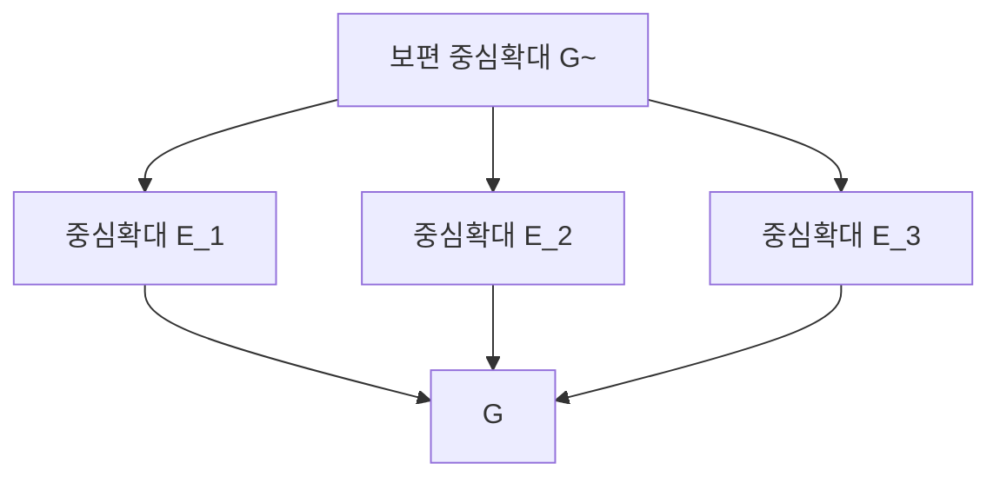

# Schur 곱셈자와 보편 중심확대

# 개요

군 $G$ 를 $\mathbb C^\times$ 의 부분군으로 [중심확대](group-extensions.md)하는 방법은 여러 가지이고, Schur 는 1904 년에 그중 가장 큰 것이 존재함을 보였다.

$G\to\mathrm{PGL}(V)$ 가 **사영표현**이다. 양자역학에서 상태가 위상인자까지만 정해지므로 대칭이 사영표현으로 나타난다. 사영표현을 보통 표현처럼 다루려면 $\mathrm{GL}(V)$ 로 들어올려야 하고, 그 걸림돌을 2-코사이클이 잰다.

$$
\rho(a)\rho(b)=c(a,b)\thinspace\rho(ab),\qquad c(a,b)\in\mathbb C^\times
$$

$c$ 를 스칼라 재조정으로 없앨 수 있으면 보통 표현이고 없앨 수 없으면 진짜 사영표현이다. 없앨 수 있는지를 재는 군이

$$
M(G)=H^2(G,\mathbb C^\times)\cong H_2(G,\mathbb Z)
$$

이고 이것이 **Schur 곱셈자**다. 왼쪽은 사영표현의 걸림돌이고 오른쪽은 군의 호몰로지다.

$G$ 가 완전군, 곧 $G=[G,G]$ 이면 **보편 중심확대** $\tilde G$ 가 존재한다.

$$
1\to M(G)\to\tilde G\to G\to1
$$

$\tilde G$ 는 $G$ 의 모든 중심확대를 덮는다. 어떤 중심확대에도 $\tilde G$ 에서 가는 사상이 유일하게 있다. $G$ 의 사영표현 전체가 $\tilde G$ 의 보통 표현 전체와 같아지므로 사영표현론이 표현론으로 환원된다.

$\mathrm{SO}(3)$ 와 $\mathrm{SU}(2)$ 가 그 예다. 스핀 $1/2$ 은 $\mathrm{SO}(3)$ 의 사영표현이고 이중덮개 $\mathrm{SU}(2)$ 에서 보통 표현이 된다. 전자가 $360^\circ$ 회전에서 부호를 바꾸는 것이 $M(\mathrm{SO}(3))=\mathbb Z/2$ 에 대응한다.

# 직관

## 코사이클과 코바운더리

사영표현 $\bar\rho:G\to\mathrm{PGL}(V)$ 를 들어올리려면 각 $g$ 마다 대표원 $\rho(g)\in\mathrm{GL}(V)$ 를 고른다. 대표원의 곱은 스칼라만큼 어긋난다.

$$
\rho(a)\rho(b)=c(a,b)\rho(ab)
$$

결합법칙을 두 방식으로 전개하면 $c$ 가 만족해야 할 조건이 나온다.

$$
c(a,b)c(ab,d)=c(b,d)c(a,bd)
$$

이것이 2-코사이클 조건이다. 한편 대표원을 $\rho'(g)=\lambda(g)\rho(g)$ 로 다시 고르는 것은 $c$ 를 다음만큼 바꾼다.

$$
c'(a,b)=c(a,b)\frac{\lambda(a)\lambda(b)}{\lambda(ab)}
$$

선택의 자유는 코바운더리만큼이다. 코사이클을 코바운더리로 나눈 것이 $H^2(G,\mathbb C^\times)$ 이고, 그 원소가 0 이면 재조정으로 $c\equiv1$ 을 만들어 보통 표현이 된다.

## 보편 확대의 존재

확대 $1\to A\to E\to G\to1$ 마다 $H^2(G,A)$ 의 원소가 하나 대응하고, 반대로 $H^2(G,A)$ 의 원소마다 확대가 하나 나온다.

$G$ 가 완전군이면 다른 모든 중심확대로 유일하게 사상이 가는 시작 대상 $\tilde G$ 가 있다. 완전성은 유일성에 필요하다. $G$ 에 아벨 몫이 있으면 그 몫을 통해 서로 다른 사상이 여러 개 만들어진다.

사영표현은 언제나 $\tilde G$ 의 보통 표현에서 내려오므로 $\tilde G$ 의 지표표 한 장이 $G$ 의 사영표현 전체를 담는다. ATLAS 의 $2.A_n$ 이나 $6.\mathrm{Suz}$ 같은 표기에서 앞의 수가 $M(G)$ 나 그 부분군의 크기다.

## 호몰로지로서의 곱셈자

$\mathbb C^\times$ 가 나눌 수 있는 군이라 계수 정리의 확장항이 사라지므로 $H^2(G,\mathbb C^\times)$ 과 $H_2(G,\mathbb Z)$ 가 같다. 이로부터 **Hopf 공식**이 나온다. $G=F/R$ 을 자유군의 몫으로 쓰면

$$
M(G)\cong\frac{R\cap[F,F]}{[F,R]}
$$

이다. 표시만 있으면 계산되는 유한 절차이고 컴퓨터 대수 시스템이 이 공식을 쓴다.

# 정의

## 사영표현과 곱셈자

$\bar\rho:G\to\mathrm{PGL}(V)$ 가 **사영표현**이다. $\bar\rho$ 마다 류 $[c]\in H^2(G,\mathbb C^\times)$ 가 정해지고, $[c]=0$ 인 것과 $\bar\rho$ 가 보통 표현으로 들어올려지는 것이 동치다.

$$
M(G)=H^2(G,\mathbb C^\times)
$$

를 $G$ 의 **Schur 곱셈자**라 한다. 유한군에 대해 유한 아벨군이고 지수가 $|G|$ 를 나눈다.

## 보편 중심확대

$1\to A\to E\xrightarrow{\pi}G\to1$ 이 $A\subseteq Z(E)$ 인 **중심확대**라 하자.

> **정리 (Schur).** $G$ 가 완전군이면 $E$ 도 완전이고 위 조건을 만족하는 확대 중 보편적인 것 $\tilde G$ 가 동형을 빼고 유일하게 존재한다. 그 핵이 $M(G)$ 다. 이때 $G$ 의 모든 기약 사영표현이 $\tilde G$ 의 기약 보통 표현에서 정확히 한 번씩 나온다.

$G$ 가 완전하지 않으면 보편 확대가 없다. 곱셈자를 실현하는 **표현군**(Schur 덮개)은 존재하지만 유일하지 않다.

# 성질

## 가장 작은 비자명 예

$G=\mathbb Z/2\times\mathbb Z/2$ 는 아벨군이지만 $M(G)=\mathbb Z/2$ 로 비자명하고, 비자명 사영표현이 Pauli 행렬로 실현된다.

$$
X=\begin{pmatrix}0&1\cr 1&0\end{pmatrix},\qquad Z=\begin{pmatrix}1&0\cr 0&-1\end{pmatrix},\qquad XZ=-ZX
$$

두 행렬은 가환이 아니지만 $\mathrm{PGL}\_2$ 로 내려가면 가환이다. 부호 하나 차이가 걸림돌이다.

이 코사이클은 $\pm1$ 만 취하고 어떤 재조정으로도 $1$ 이 되지 않는다. 들어올린 군의 위수가 $4$ 가 아니라 $8$ 이고, 늘어난 인자 $2$ 가 $M(G)=\mathbb Z/2$ 다.

위수 8 군 $\lbrace\pm I,\pm X,\pm Z,\pm XZ\rbrace$ 는 $X^2=Z^2=I$ , $(XZ)^2=-I$ 이므로 이면체군 $D_4$ 다. 이 확대로 $(\mathbb Z/2)^2$ 이 2 차원 기약 사영표현을 갖는다. 아벨군의 보통 기약표현은 전부 1 차원이므로 사영표현에서만 가능한 현상이다. 양자정보의 Pauli 군이 이것이고 안정자 부호의 대수적 바탕이다.

## 계산 예

| $G$ | $M(G)$ |
|---|---|
| 유한 순환군 | 자명 |
| $(\mathbb Z/n)^k$ | $(\mathbb Z/n)^{k(k-1)/2}$ |
| $n\ge5$ 이고 $n\neq6,7$ 인 $A_n$ | $\mathbb Z/2$ |
| $A_6,A_7$ | $\mathbb Z/6$ |
| 대부분의 $\mathrm{PSL}\_2(q)$ | $\mathbb Z/2$ |
| $M_{11},M_{23},M_{24}$ | 자명 |
| $M_{12},M_{22}$ | 각각 $\mathbb Z/2$ 와 $\mathbb Z/{12}$ |
| 괴물군 $\mathbb M$ | 자명 |

아벨군 $A$ 에 대해 $M(A)\cong\Lambda^2A$ 이고, 순환군은 외적의 2 차 부분이 0 이라 곱셈자가 자명하다. 생성원이 둘 이상이면 곱셈자가 나타나고 $(\mathbb Z/2)^2$ 이 가장 작은 경우다.

교대군의 이중덮개 $2.A_n$ 은 스핀 표현에서 나오고, $n=6,7$ 에서만 삼중덮개가 추가된다. 이 예외는 $A_6\cong\mathrm{PSL}\_2(9)$ 와 $A_7$ 의 우연한 동형과 얽혀 있고, 산재군 $M_{22}$ 의 곱셈자 $\mathbb Z/{12}$ 도 비슷하다.

괴물군의 곱셈자는 자명하다. 중심확대가 없으므로 $V^\natural$ 위의 작용이 사영적이지 않은 진짜 작용이 되고, [괴물 달빛](monstrous-moonshine.md)이 이 사실을 쓴다.

## ATLAS 표기

유한군 ATLAS 는 확대를 점으로 적는다. $2.A_n$ 은 $A_n$ 의 이중 중심확대, $A_n.2=S_n$ 은 위로의 확대, $2.A_n.2$ 는 둘 다이다. [Umbral moonshine](umbral-moonshine.md)에서 근계 $A_2^{12}$ 에 붙는 군 $2.M_{12}$ 의 $2$ 가 $M(M_{12})=\mathbb Z/2$ 를 실현한 것이다.

산재군의 곱셈자 표에는 $6.\mathrm{Suz}$ , $12.M_{22}$ , $3.J_3$ 같은 큰 덮개가 있고, 격자나 부호 위의 작용을 구성할 때 이 형태가 쓰인다. Leech 격자 위의 작용에 $6.\mathrm{Suz}$ 가 나타난다.

# 활용

## 스핀과 대칭의 표현

양자 상태가 [Hilbert 공간](hilbert-spaces.md)의 직선이므로 대칭군은 $\mathrm{PU}(\mathcal H)$ 에 작용하고, 그것을 $\mathrm{U}(\mathcal H)$ 로 들어올릴 때 곱셈자가 걸린다.

- 회전군 $\mathrm{SO}(3)$ 의 곱셈자가 $\mathbb Z/2$ 라 반정수 스핀이 존재한다. 들어올린 군이 $\mathrm{SU}(2)$ 다.
- Galilei 군에서는 질량이 곱셈자의 매개변수로 나타난다. 비상대론적 양자역학에서 질량이 중심전하로 등장하는 이유다.
- 결정의 공간군에서는 곱셈자가 작은 표현의 분류에 들어가고, 고체물리의 밴드 구조 계산에 쓰인다.

## 유한 단순군의 덮개

[유한 단순군 분류](finite-simple-groups.md)를 쓰려면 덮개와 확대까지 포함한 자료가 필요하다. 각 단순군 $S$ 의 $M(S)$ 를 알아야 $S$ 를 부분몫으로 갖는 군들을 조직할 수 있고 분류의 귀납 단계가 돌아간다. ATLAS 가 모든 산재군의 곱셈자와 덮개를 표로 싣는다.

## 대수적 K 이론과의 연결

$\mathrm{SL}\_n(R)$ 의 보편 중심확대는 Steinberg 군 $\mathrm{St}\_n(R)$ 이고, 그 핵이 $K_2(R)$ 다.

$$
1\to K_2(R)\to\mathrm{St}(R)\to E(R)\to1
$$

$K_2$ 는 기본행렬군의 Schur 곱셈자다. Milnor 가 $K_2$ 를 이렇게 정의했고, 체 $F$ 에 대한 $K_2(F)$ 가 Hilbert 기호와 이차형식, [유체론](class-field-theory.md)의 국소 상호법칙과 연결된다.[^1]

[^1]: 고전적 원논문은 I. Schur (1904, 1907) 이고, 현대적 서술은 G. Karpilovsky, *The Schur Multiplier* (1987). ATLAS 의 곱셈자 표는 J. Conway 외, *Atlas of Finite Groups* (1985) 서문. Hopf 공식과 군 호몰로지는 K. Brown, *Cohomology of Groups* (1982) 2 장과 5 장. $K_2$ 와 Steinberg 군은 J. Milnor, *Introduction to Algebraic K-Theory* (1971).

# 연관 문서

## 선수지식

- [군 확대와 Jordan–Hölder 정리](group-extensions.md)

## 더 알아보기

아직 연결한 문서가 없다.

#group_theory #algebra #construction
