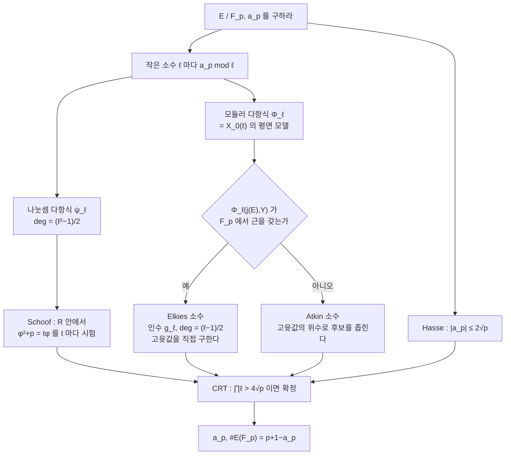

# Schoof–Elkies–Atkin 알고리즘

# 개요

타원곡선 암호는 $\char35{}E(\mathbb F_p)$ 를 알아야 한다. 위수가 작은 소인수로 쪼개지면 Pohlig–Hellman 으로 [이산로그](discrete-logarithm.md)가 무너지므로 곡선을 고른 뒤 위수를 센다. 암호에 쓰는 $p$ 는 $2^{256}$ 규모여서 점을 하나씩 세는 $O(p)$ 도, Shanks 의 $O(p^{1/4})$ 도 쓸 수 없다.

Schoof 가 1985 년에 $\log p$ 의 다항식 시간으로 도는 알고리즘을 주었다[^1].

> $a_p$ 는 크기가 $2\sqrt p$ 이하인 **정수**다. 작은 소수 $\ell$ 마다 $a_p\bmod\ell$ 을 계산하고, $\prod\ell\gt 4\sqrt p$ 가 되면 중국인 나머지 정리로 $a_p$ 가 확정된다.

$a_p\bmod\ell$ 을 어떻게 계산하는가. Frobenius $\varphi(x,y)=(x^p,y^p)$ 는 $E$ 의 자기준동형이고 특성방정식

$$
\varphi^2-a_p\varphi+p=0
$$

를 만족한다. 이 식을 $\ell$ 등분점의 군 $E[\ell]\cong(\mathbb Z/\ell)^2$ 에 제한하면 $\varphi$ 가 $2\times2$ 행렬이 되고 $a_p\bmod\ell$ 이 그 대각합이다.

$E[\ell]$ 은 **나눗셈 다항식** $\psi_\ell(x)$ 로 다룬다. 차수가 $(\ell^2-1)/2$ 이고 근이 $\ell$ 등분점의 $x$ 좌표다. $\mathbb F_p[x]/(\psi_\ell(x))$ 안에서 특성방정식을 $t=0,1,\dots,\ell-1$ 에 대해 시험해 맞는 $t$ 를 찾는다. $\ell$ 이 $O(\log p)$ 까지만 필요하므로 전체가 다항시간이다.

Elkies 와 Atkin 의 개선은 $\psi_\ell$ 의 차수를 $(\ell^2-1)/2$ 에서 $(\ell-1)/2$ 로 줄인다. $\varphi$ 의 특성다항식이 $\bmod\ell$ 에서 근을 가지면(**Elkies 소수**) $E[\ell]$ 안에 $\varphi$ 가 보존하는 1 차원 부분군이 있고 그 부분군만 다루면 된다. 부분군을 찾는 도구가 [모듈러 곡선](modular-curves.md) $X_0(\ell)$ 의 모듈러 다항식이다. $X_0(\ell)$ 이 $\ell$ 등분 구조를 분류하므로 모듈러 곡선이 알고리즘의 부품이 된다.

[Kedlaya 알고리즘](kedlaya-algorithm.md)은 $p$ 에 선형이라 작은 표수를 맡고 SEA(Schoof–Elkies–Atkin)는 $\log p$ 의 다항식이라 큰 $p$ 를 맡는다. 둘 다 정수의 크기를 미리 알고 잉여를 모아 확정하는 논법을 쓰며, Kedlaya 는 $p$ 진 정밀도를 쌓고 SEA 는 여러 $\ell$ 의 잉여를 쌓는다.

# 직관

## 잉여를 모으는 전략

$a_p$ 를 직접 계산하는 것은 점을 세는 일이라 어렵다. $a_p\bmod\ell$ 은 $\ell$ 등분점이라는 작은 유한 대상 위의 계산이다.

$E[\ell]$ 은 원소가 $\ell^2$ 개인 군이고 $\ell$ 은 $100$ 미만이다. $p$ 가 커져도 $E[\ell]$ 의 크기는 변하지 않고, $p$ 의 크기는 $x^p$ 를 반복제곱으로 계산하는 $O(\log p)$ 번의 곱셈에만 들어간다.

잉여를 모으는 일이 끝나는 지점도 미리 안다. Hasse 한계 $|a_p|\le2\sqrt p$ 가 길이 $4\sqrt p$ 인 구간을 주므로 $\prod\ell$ 이 그 길이를 넘으면 잉여류 안에 정수가 하나뿐이다. $\prod_{\ell\le L}\ell\approx e^L$ 이므로 $L\approx\log(4\sqrt p)=O(\log p)$ 면 충분하고, 필요한 가장 큰 $\ell$ 이 $\log p$ 규모로 자란다.

## E[l] 위의 Frobenius 행렬

$\varphi(x,y)=(x^p,y^p)$ 는 $E(\overline{\mathbb F_p})$ 의 군 자기준동형이다. $E[\ell]$ 은 $\varphi$ 로 보존되고($\ell$ 배해서 $O$ 가 되는 성질이 $\varphi$ 에 보존된다) $\mathbb F_\ell$ 위의 2 차원 벡터공간이다. 그러므로 $\varphi|\_{E[\ell]}$ 은 $2\times2$ 행렬이고

$$
\mathrm{tr}\big(\varphi|\_{E[\ell]}\big)\equiv a_p,
\qquad
\det\big(\varphi|\_{E[\ell]}\big)\equiv p
\pmod\ell
$$

다. 행렬식은 검산에 쓴다.

이 행렬은 [Galois 표현](galois-representations.md) $\rho_{E,\ell}:\mathrm{Gal}(\overline{\mathbb Q}/\mathbb Q)\to\mathrm{GL}\_2(\mathbb F_\ell)$ 의 Frobenius 에서의 값이다. 이론의 등식 $\mathrm{tr}\thinspace\rho(\mathrm{Frob}\_p)=a_p$ 를 알고리즘에서는 행렬을 만들어 대각합으로 계산한다.

## 나눗셈 다항식

$\ell$ 등분점이 정의되는 확대체의 차수는 클 수 있다. Schoof 의 방법은 점을 구하지 않는 것이다.

$\ell$ 등분점의 $x$ 좌표는 나눗셈 다항식 $\psi_\ell(x)$ 의 근이다. $E[\ell]$ 위의 항등식을 확인하는 일이 환

$$
R=\mathbb F_p[x,y]\big/\big(\psi_\ell(x),\thinspace y^2-f(x)\big)
$$

안의 계산이 된다. $\psi_\ell$ 이 기약이 아니어도 되므로 이 환은 체가 아니지만 계산에는 지장이 없다. 항등식

$$
(x^{p^2},y^{p^2})+p\cdot(x,y)=t\cdot(x^p,y^p)
$$

를 $R$ 안에서 $t=0,1,\dots,\ell-1$ 에 대해 시험하고, 성립하는 $t$ 가 $a_p\bmod\ell$ 이다. 근을 구하지 않고 몫환에서 형식적으로 계산한다.

비용은 $\deg\psi_\ell=(\ell^2-1)/2$ 가 정한다. $R$ 에서의 곱셈이 그 차수의 다항식 곱셈이다.

## Elkies 소수와 Atkin 소수

$\varphi$ 의 특성다항식 $X^2-a_pX+p$ 를 $\bmod\ell$ 로 보았을 때 두 가지가 갈린다.

- **Elkies 소수.** 판별식 $a_p^2-4p$ 가 $\bmod\ell$ 에서 제곱이다. $\varphi$ 가 $\mathbb F_\ell$ 안에 고윳값을 갖고 $E[\ell]$ 안에 $\varphi$ 가 보존하는 1 차원 부분군 $C$ 가 있다. $C$ 에 대응하는 인수 $g_\ell(x)$ 는 차수가 $(\ell-1)/2$ 로 $\psi_\ell$ 보다 $\ell$ 배 작다.
- **Atkin 소수.** 판별식이 제곱이 아니다. 고유부분군이 없으므로 위의 이득이 없다. $\varphi$ 의 $\mathbb F_{\ell^2}$ 안에서의 고윳값의 위수가 $a_p^2/p\bmod\ell$ 의 값을 몇 가지 후보로 좁힌다.

판정과 $g_\ell$ 의 계산에는 모듈러 다항식 $\Phi_\ell(X,Y)$ 를 쓴다. $\Phi_\ell(j(E),Y)$ 가 $\mathbb F_p$ 에서 근을 가지면 Elkies 소수이고, 그 근이 $\ell$ 차 동종사상으로 연결된 곡선의 $j$ 불변량이다. $\Phi_\ell$ 은 [모듈러 곡선](modular-curves.md) $X_0(\ell)$ 의 평면 모델이고, $X_0(\ell)$ 이 $\ell$ 차 부분군을 가진 타원곡선을 매개변수화한다는 사실이 알고리즘의 근거다.

# 정의

## Frobenius 자기준동형과 그 특성방정식

$E/\mathbb F_p$ 에 대해 $\varphi(x,y)=(x^p,y^p)$ 를 **Frobenius 자기준동형**이라 한다. $\mathrm{End}(E)$ 안에서

$$
\varphi^2-a_p\thinspace\varphi+p=0,\qquad a_p=p+1-\char35{}E(\mathbb F_p)
$$

이고 $|a_p|\le2\sqrt p$ 다(Hasse 정리). $\varphi$ 의 고정점이 정확히 $E(\mathbb F_p)$ 이므로 $\char35{}E(\mathbb F_p)=\deg(\varphi-1)=p+1-a_p$ 가 나온다.

## 나눗셈 다항식

$E:y^2=x^3+Ax+B$ 에 대해 $\psi_n\in\mathbb Z[A,B,x,y]$ 를 다음으로 정의한다.

$$
\psi_1=1,\quad\psi_2=2y,\quad\psi_3=3x^4+6Ax^2+12Bx-A^2,
$$
$$
\psi_4=4y\big(x^6+5Ax^4+20Bx^3-5A^2x^2-4ABx-8B^2-A^3\big)
$$

이고 $n\ge2$ 에서

$$
\psi_{2n+1}=\psi_{n+2}\psi_n^3-\psi_{n-1}\psi_{n+1}^3,
\qquad
\psi_{2n}=\frac{\psi_n}{2y}\big(\psi_{n+2}\psi_{n-1}^2-\psi_{n-2}\psi_{n+1}^2\big)
$$

다. 성질은 이렇다.

- $\ell$ 이 홀수 소수면 $\psi_\ell$ 은 $x$ 만의 다항식이고 차수가 $(\ell^2-1)/2$ 다.
- $P=(x_0,y_0)\ne O$ 에 대해 $\ell P=O\iff\psi_\ell(x_0)=0$ 이다.
- 곱셈사상이 $\psi$ 로 표현된다.
$$
nP=\left(x-\frac{\psi_{n-1}\psi_{n+1}}{\psi_n^2},\ \frac{\psi_{2n}}{2\psi_n^4}\right)
$$

$\ell^2-1$ 개의 비자명 $\ell$ 등분점이 $\pm$ 로 짝지어지므로 $x$ 좌표가 $(\ell^2-1)/2$ 개이고 차수와 맞는다.

## 모듈러 다항식

$\Phi_\ell(X,Y)\in\mathbb Z[X,Y]$ 는 $X_0(\ell)$ 의 평면 모델을 주는 다항식으로, $j(\tau)$ 와 $j(\ell\tau)$ 가 만족하는 대수관계다. $X$ 와 $Y$ 각각에 대해 차수가 $\ell+1$ 이다.

> $\Phi_\ell(j_1,j_2)=0$ 인 것은 $j$ 불변량이 $j_1,j_2$ 인 두 타원곡선 사이에 차수 $\ell$ 의 순환 동종사상이 있다는 것과 동치다.

$\mathbb F_p$ 에서 $\Phi_\ell(j(E),Y)$ 의 근의 개수는 $0,1,2,\ell+1$ 중 하나이고, 그 개수가 $\varphi$ 의 $E[\ell]$ 위 작용의 꼴을 분류한다. 근이 있으면 Elkies 소수다.

## 알고리즘

1. $\prod_{\ell\in S}\ell\gt 4\sqrt p$ 가 되도록 작은 소수 집합 $S$ 를 잡는다. 이때 $p\notin S$ 다.
2. 각 $\ell\in S$ 에서 $t_\ell=a_p\bmod\ell$ 을 구한다.
   - **Schoof.** $R=\mathbb F_p[x,y]/(\psi_\ell,y^2-f)$ 에서 $(x^{p^2},y^{p^2})+p(x,y)=t(x^p,y^p)$ 를 $t$ 마다 시험한다.
   - **Elkies.** $\Phi_\ell(j(E),Y)$ 에 근이 있으면 차수 $(\ell-1)/2$ 의 인수 $g_\ell$ 을 만들고, $\mathbb F_p[x]/(g_\ell)$ 에서 고윳값 $\lambda$ 를 찾아 $t_\ell\equiv\lambda+p/\lambda$ 로 얻는다.
   - **Atkin.** 근이 없으면 $\ell$ 차 확대에서의 위수 정보로 $t_\ell$ 의 후보 집합을 얻고, 마지막에 baby-step giant-step 으로 조합을 고른다.
3. CRT(Chinese remainder theorem)로 $a_p\bmod\prod\ell$ 을 얻고 Hasse 한계로 정수를 확정한다.

Schoof 원본은 $\tilde O(\log^5p)$ 이고 Elkies–Atkin 개선으로 $\tilde O(\log^4p)$ 다.

# 성질

## 대각합과 행렬식

> $\ell\ne p$ 인 소수에 대해 $\varphi$ 는 $E[\ell]\cong(\mathbb Z/\ell)^2$ 위의 $\mathbb F_\ell$ 선형사상이고
> $$\mathrm{tr}\equiv a_p\pmod\ell,\qquad\det\equiv p\pmod\ell$$

$\ell=p$ 를 뺀 것은 $E[p]$ 가 $(\mathbb Z/p)^2$ 가 아니기 때문이다. 보통 곡선이면 $\mathbb Z/p$ 이고 초특이면 자명군이다. 이 퇴화가 [Newton 다각형](newton-polygon.md)의 보통과 초특이 구분에 대응한다.

## 필요한 소수의 개수

Hasse 한계가 길이 $4\sqrt p$ 인 구간을 주므로 $\prod_{\ell\in S}\ell\gt 4\sqrt p$ 면 충분하다. $\prod_{\ell\le L}\ell=e^{(1+o(1))L}$ (Chebyshev 의 $\vartheta$ 함수) 이므로

$$
L\approx\log(4\sqrt p)\approx\tfrac12\log p
$$

이면 된다. $256$ 비트 소수에서 $L$ 이 대략 $100$ 아래다.

## 두 알고리즘의 영역

| | Schoof–Elkies–Atkin | [Kedlaya](kedlaya-algorithm.md) |
|---|---|---|
| 정보를 모으는 축 | 여러 소수 $\ell$ 의 잉여 | 하나의 소수 $p$ 의 정밀도 |
| 쓰는 코호몰로지 | $\ell$ 진 (등분점) | $p$ 진 (Monsky–Washnitzer) |
| 비용 | $\log p$ 의 다항식 | $p$ 에 선형 |
| 잘하는 영역 | 종수 1 과 큰 $p$ | 임의 종수와 작은 $p$ 와 큰 확대 |
| 확정하는 근거 | CRT + Hasse 한계 | $p$ 진 정밀도 + Weil 한계 |

마지막 줄이 같은 논법의 두 판본이다. 답이 정수이고 크기를 알면 충분한 잉여 정보가 답을 확정하고, 잉여를 얻는 곳만 다르다.

종수 2 이상에는 Gaudry–Schost 등의 일반화가 있지만 훨씬 어렵고, 작은 표수에서는 Kedlaya 계열을 쓴다.

# 활용

## Frobenius 행렬의 구성

$\ell$ 등분점을 모두 찾아 기저를 잡고 Frobenius 의 행렬을 만들어 대각합을 잰다.

$\ell=2$ 에서 행렬식이 $1\cdot0-1\cdot1=-1\equiv1$ 이고 $\ell=3$ 에서 $2\cdot1-0=2$ 로, 각각 $5\bmod2=1$ 과 $5\bmod3=2$ 에 맞는다.

$\ell=7$ 에서는 $E[7]$ 이 $n\le4$ 인 $\mathbb F_{5^n}$ 안에 다 들어오지 않아 이 방법이 실패한다. 등분점의 정의체는 커질 수 있고, 나눗셈 다항식의 몫환에서 형식적으로 계산하면 그 체로 올라갈 필요가 없다.

## CRT 의 종료 조건

$\ell=2,3$ 만으로는 $\prod\ell=6\lt 4\sqrt5\approx8.94$ 라 후보가 $-3$ 과 $3$ 둘이다. $\ell=7$ 의 잉여가 더해지면 확정된다.

$p$ 가 $5$ 에서 $2^{61}-1$ 로 $18$ 자리 커지는 동안 필요한 가장 큰 $\ell$ 은 $7$ 에서 $29$ 로만 자란다. $\ell$ 이 $\log p$ 규모로 자라는 것이 Schoof 가 다항시간인 근거다.

## [sea-algorithm]

- **곡선 선택.** NIST(National Institute of Standards and Technology) P-256, secp256k1 같은 표준 곡선의 위수를 이 계열 알고리즘으로 검증했다. 무작위 곡선을 뽑아 위수를 세고 소수이거나 작은 보조인자만 갖는지 확인한다.
- **안전성 조건 확인.** $\char35{}E(\mathbb F_p)=p$ 인 **비정상(anomalous)** 곡선은 이산로그가 선형시간에 풀리고, $\char35{}E$ 가 $p^k-1$ 을 작은 $k$ 에서 나누면 MOV(Menezes–Okamoto–Vanstone) 공격으로 유한체 이산로그로 환원된다. 위수를 알아야 이 조건들을 검사할 수 있다.
- **곡선 개수 세기.** 주어진 위수를 갖는 곡선을 찾거나(복소곱셈법의 역방향), 위수 분포를 실험적으로 조사하는 데 쓰인다.
- **수치 실험.** 대량의 $a_p$ 표가 [Sato–Tate 분포](sato-tate.md)나 BSD(Birch–Swinnerton-Dyer) 추측의 수치 검증에 쓰이고, 큰 $p$ 영역의 표를 SEA 가 만든다.
- **$\ell$ 진 표현의 계산.** $\varphi|\_{E[\ell]}$ 의 행렬이 [Galois 표현](galois-representations.md) $\rho_{E,\ell}$ 의 Frobenius 에서의 상이다. 상이 $\mathrm{GL}\_2(\mathbb F_\ell)$ 전체인지 판정하는 Serre 의 문제를 계산할 때 이 행렬을 쓴다.

[^1]: R. Schoof, *Elliptic curves over finite fields and the computation of square roots mod p*, Math. Comp. **44** (1985), 483–494, 그리고 *Counting points on elliptic curves over finite fields*, J. Théor. Nombres Bordeaux **7** (1995), 219–254. Elkies–Atkin 개선의 표준 서술은 R. Lercier, F. Morain 의 논문들과 I. Blake, G. Seroussi, N. Smart, *Elliptic Curves in Cryptography* (1999) VII장. 나눗셈 다항식과 Hasse 정리는 J. Silverman, *The Arithmetic of Elliptic Curves* (2판, 2009) III, V장. 모듈러 다항식과 $X_0(\ell)$ 의 모듈러 해석은 F. Diamond, J. Shurman, *A First Course in Modular Forms* (2005) 8장.

# 연관 문서

## 선수지식

- [모듈러 곡선](modular-curves.md)

## 더 알아보기

아직 연결한 문서가 없다.

#number_theory #algorithms #cryptography #computation
