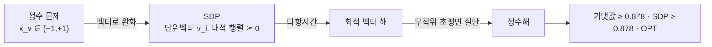

# 반정부호 계획법과 최대 절단

# 개요

[LP 완화와 반올림](lp-rounding.md)에서 근사비의 벽은 적분성 간극이었다. 간극을 줄이려면 반올림을 개선하는 것이 아니라 완화 자체를 좁혀야 한다. 선형 제약만으로 부족하면 어떤 제약을 더할 수 있는가.

반정부호 계획법이 답 하나를 준다. 변수를 스칼라가 아니라 벡터로 두고, 벡터들의 내적 행렬이 양의 준정부호라는 제약을 건다. 이 제약은 선형이 아니지만 볼록이므로 다항시간에 임의 정밀도로 풀린다. 선형 완화보다 정보가 훨씬 많다.

최대 절단 문제가 대표적인 성공 사례다. 각 정점에 `\pm1` 대신 단위벡터를 배정하고, 해를 무작위 초평면으로 자른다. Goemans 와 Williamson 은 이 방법이 `0.878` 근사를 준다는 것을 보였고, 선형 완화로는 `1/2` 를 크게 넘지 못한다. 나아가 유일 게임 추측 아래에서는 이 값이 최적이다[^1].

# 직관

## 부호를 벡터로 푼다

최대 절단은 각 정점에 `x_v \in \{-1,+1\}` 을 주어 다른 부호를 가진 간선의 수를 최대화하는 문제다. 간선 `(u,v)` 가 절단되는지는 `(1-x_ux_v)/2` 로 쓰인다.

여기서 `x_v` 를 `\pm1` 대신 고차원 단위벡터 `v_i` 로 완화한다. 곱 `x_ux_v` 가 내적 `\langle v_u,v_v\rangle` 가 되고, 원래 문제는 모든 벡터가 1 차원인 특수한 경우다. 차원을 풀어 주면 제약이 약해지므로 최적값이 올라가고, 이것이 상한을 준다.

무작위 반올림은 이 벡터들을 무작위 초평면으로 자르는 것이다. 벡터가 이루는 각도가 클수록 반대편에 놓일 확률이 크고, 그 확률이 `\theta/\pi` 다.

## `0.878` 은 어디서 오는가

각도 `\theta` 인 두 벡터가 무작위 초평면에 의해 갈라질 확률은 `\theta/\pi` 다. 반면 SDP 의 목적함수에서 그 간선의 기여는 `(1-\cos\theta)/2` 다. 두 값의 비의 최솟값이 근사비다.

$$
\alpha=\min_{0<\theta\le\pi}\frac{\theta/\pi}{(1-\cos\theta)/2}\approx0.87856
$$

최솟값은 `\theta\approx2.331` 라디안, 약 `134` 도에서 달성된다. 근사비가 기하적 계산 하나에서 정확히 결정된다는 점이 이 결과의 특징이다.

## 왜 양의 준정부호인가

벡터들의 내적을 모은 행렬 `X_{ij}=\langle v_i,v_j\rangle` 는 반드시 양의 준정부호다. 역으로 양의 준정부호 행렬은 항상 `X=V^{\mathsf T}V` 로 분해되므로 벡터 표현을 준다. Cholesky 분해가 그 변환이다.

따라서 "벡터를 찾는 문제" 와 "양의 준정부호 행렬을 찾는 문제" 가 같은 문제다. 후자의 형태에서 제약이 볼록임이 분명해지고, 내점법으로 풀 수 있게 된다.

# 정의

## 반정부호 계획

대칭행렬 변수 `X \in \mathbb S^n` 에 대해 다음 꼴을 반정부호 계획이라 한다.

$$
\max\ \langle C,X\rangle\quad\text{s.t.}\quad \langle A_k,X\rangle=b_k\ (k=1,\dots,m),\qquad X\succeq0
$$

`\langle A,B\rangle=\mathrm{tr}(A^{\mathsf T}B)` 이고 `X\succeq0` 은 양의 준정부호를 뜻한다. `X` 를 대각행렬로 제한하면 선형계획이 되므로 LP 의 일반화다.

양의 준정부호 행렬들의 집합은 볼록 뿔이지만 다면체가 아니다. 그래서 꼭짓점이 유한하지 않고 단체법이 통하지 않는다. 대신 내점법이 임의 정밀도 `\epsilon` 에 대해 `\mathrm{poly}(n,m,\log(1/\epsilon))` 시간에 푼다. 정확한 최적해가 무리수일 수 있으므로 근사해만 얻는다는 점이 LP 와의 실질적 차이다.

## 최대 절단의 완화

원래 문제와 그 벡터 완화를 나란히 쓴다.

$$
\mathrm{OPT}=\max_{x\in\{\pm1\}^n}\sum_{(i,j)\in E}\frac{1-x_ix_j}2,\qquad
\mathrm{SDP}=\max_{\lVert v_i\rVert=1}\sum_{(i,j)\in E}\frac{1-\langle v_i,v_j\rangle}2
$$

행렬 형태로는 `X\succeq0`, `X_{ii}=1` 인 `X` 에 대한 최대화다. 이 제약집합을 타원체라 부른다.

## 알고리즘

1. SDP 를 풀어 최적 `X^*` 를 얻는다.
2. Cholesky 분해로 단위벡터 `v_1,\dots,v_n` 을 얻는다.
3. 표준 Gauss 분포에서 무작위 벡터 `r` 을 뽑는다.
4. `\langle v_i,r\rangle\ge0` 인 정점을 한쪽에, 나머지를 다른 쪽에 둔다.

# 성질

## 근사비 증명

간선 `(i,j)` 가 절단될 확률은 두 벡터 사이 각도 `\theta_{ij}` 에 대해 `\theta_{ij}/\pi` 다. `r` 이 등방적이므로 두 벡터가 이루는 평면으로 사영해도 방향이 균등하고, 그 평면에서 갈라지는 각도가 `\theta_{ij}` 이기 때문이다.

기댓값을 SDP 값과 비교한다.

$$
\mathbb E[\text{절단}]=\sum_{(i,j)\in E}\frac{\theta_{ij}}\pi
\ \ge\ \alpha\sum_{(i,j)\in E}\frac{1-\cos\theta_{ij}}2=\alpha\cdot\mathrm{SDP}\ \ge\ \alpha\cdot\mathrm{OPT}
$$

간선마다 비가 `\alpha` 이상이라는 점별 부등식을 쓰므로 증명이 한 줄이다. 마지막 부등식은 완화가 상한이라는 사실이다.

## 적분성 간극도 `0.878` 이다

이 분석이 헐렁한 것이 아니다. `\mathrm{OPT}/\mathrm{SDP}` 가 `\alpha` 에 임의로 가까운 그래프족이 존재한다. 초구 위에 고르게 퍼진 점들로 만든 그래프가 최악의 각도 `134` 도를 재현한다.

따라서 이 완화를 상한으로 쓰는 어떤 논증도 `0.878` 보다 좋은 근사비를 증명할 수 없다. 알고리즘과 간극이 정확히 맞물린 드문 사례다.

## 최적성

Håstad 는 `16/17\approx0.941` 보다 좋은 근사가 `P=NP` 를 함의함을 보였다. 이것이 무조건적 하한이다.

Khot, Kindler, Mossel, O'Donnell 은 유일 게임 추측 아래에서 `\alpha+\epsilon` 근사가 불가능함을 보였다. 즉 추측이 참이면 Goemans–Williamson 이 최적이다. 기하적 상수 하나가 계산 복잡도의 경계로 나타나는 이 현상은 다른 제약충족 문제들에서도 되풀이된다.

## 왜 선형 완화로는 안 되는가

최대 절단의 자연스러운 선형 완화는 간극이 2 에 가깝다. 무작위로 정점을 나누기만 해도 기댓값이 간선의 절반이므로 `1/2` 근사가 공짜이며, 선형 제약만으로는 이를 의미 있게 개선하기 어렵다.

차이의 근원은 완화가 담는 정보다. 선형 완화는 각 변수의 주변 확률만 다루지만, SDP 는 변수 쌍 사이의 상관까지 담는다. `X_{ij}` 가 `x_ix_j` 의 기댓값 역할을 하고, 양의 준정부호 제약이 그런 상관구조가 실제로 실현 가능하다는 조건이다.

## 다른 성공 사례

| 문제 | SDP 근사비 | 비고 |
|---|---|---|
| 최대 절단 | `0.878` | UG 추측 아래 최적 |
| 최대 2-SAT | `0.940` | 같은 기법 |
| 색칠 (3-채색 가능 그래프) | `\tilde O(n^{0.19})` 색 | 조합적 방법보다 우수 |
| Lovász 세타 함수 | 독립수와 색수 사이 | 완전그래프에서 정확 |
| 희소 최대 절단 | `1-\Theta(1/\sqrt d)` | 차수 `d` 정칙 |

Lovász 세타 함수는 특히 중요하다. `\alpha(G)\le\vartheta(G)\le\chi(\bar G)` 라는 샌드위치를 주며, 두 NP-어려운 양 사이에 다항시간에 계산되는 값이 끼어 있다는 것이 놀라운 사실이다. 완전그래프에서는 이 부등식이 등식이 되어 최대 독립집합이 다항시간에 풀린다.

## 계층으로의 확장

제약을 더 넣어 완화를 조이는 체계적 방법이 있다. Lasserre 와 Sum-of-Squares 계층은 `k` 차 모멘트까지의 상관을 담아 `n^{O(k)}` 시간에 풀리는 완화들의 열을 준다. `k` 가 커지면 정확해지지만 비용이 커진다.

최대 절단에서는 계층을 올려도 `0.878` 을 넘지 못한다는 것이 알려져 있다. 유일 게임 추측과 정합적인 결과이며, 어떤 문제에서 계층이 도움이 되고 어떤 문제에서 그렇지 않은지가 활발한 연구 주제다.

## 비용

SDP 는 LP 보다 훨씬 비싸다. 변수 개수가 `n^2` 규모이고 내점법의 각 반복이 행렬 분해를 요구하므로, 정점 수천 개를 넘으면 표준 해법이 버겁다.

실무에서는 저계수 분해로 변수를 줄이는 Burer–Monteiro 방법이나 일차 방법을 쓴다. 비볼록 문제로 바뀌지만 계수를 충분히 잡으면 국소 최소점이 전역 최소점이 된다는 결과가 알려져 있다.

# 활용

## 근사 알고리즘 설계

이차식으로 쓰이는 조합 최적화 문제에서 변수의 곱을 내적으로 바꾸는 것이 표준 절차다. 최대 절단, 최대 2-SAT, 상관 군집화, 정렬 문제가 같은 틀로 다뤄진다. 무작위 초평면 대신 문제에 맞는 반올림을 설계하는 것이 연구의 초점이다.

## 제어와 신호처리

선형 행렬 부등식으로 쓰이는 제어 문제, 예컨대 Lyapunov 안정성 조건이나 `H_\infty` 제어기 합성이 SDP 다. 다항식 비음성 판정을 제곱합으로 환원하는 것도 SDP 이며, 이것이 제어와 최적화에서 SDP 가 표준 도구가 된 이유다.

## 행렬 완성과 저계수 근사

계수 최소화는 NP-어렵지만 핵노름으로 완화하면 SDP 가 된다. 추천 시스템의 행렬 완성과 위상 복원이 이 형태이며, 일정 조건 아래에서 완화가 원래 해를 정확히 복원한다는 보장이 있다.

## 양자정보

양자 상태와 측정이 양의 준정부호 행렬이므로, 상태 구별과 얽힘 판정 같은 문제들이 자연스럽게 SDP 가 된다. 비국소 게임의 양자 최적값을 계산하는 데도 SDP 계층이 쓰이며, 유일 게임 추측과의 연결도 여기서 나타난다.

[^1]: Goemans, Williamson, *Improved Approximation Algorithms for Maximum Cut and Satisfiability Problems Using Semidefinite Programming*, JACM 42(6), 1995. `0.87856` 의 유도와 간극의 최적성.

# 연관 문서

## 선수지식

- [LP 완화와 반올림](lp-rounding.md)

## 더 알아보기

아직 연결한 문서가 없다.

#optimization #algorithms #complexity
