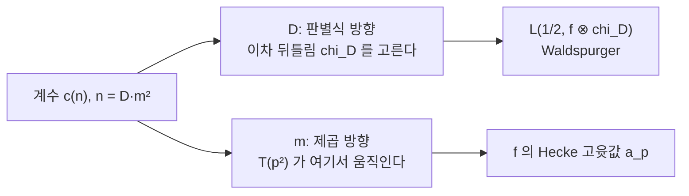

# Shimura 대응과 반정수 무게 형식

# 개요

모듈러 형식의 무게는 보통 정수다. 그런데 가장 기본적인 예인 theta 급수 $\theta(\tau)=\sum_{n\in\mathbb Z}q^{n^2}$ 의 무게는 $1/2$ 이다. 변환식에 제곱근이 붙기 때문이다.

$$
\theta\!\left(\frac{-1}{4\tau}\right)=\sqrt{-2i\tau}\,\theta(\tau)
$$

[Weil 표현](weil-representation.md)이 알려주듯 이 제곱근은 메타플렉틱 2 겹 덮개의 흔적이고, 반정수 무게 형식이란 $\mathrm{Mp}_2$ 위의 형식이다. 그렇다면 자연스러운 물음이 생긴다. **반정수 무게 형식과 정수 무게 형식은 어떻게 대응하는가.**

Shimura 가 1973 년에 답했다. 무게 $k+1/2$ 의 Hecke 고유형식 $g$ 마다 무게 $2k$ 의 고유형식 $f$ 가 대응하고, **Hecke 고윳값이 일치한다**.

$$
T(p^2)\,g=\lambda_p\,g
\quad\Longrightarrow\quad
T(p)\,f=\lambda_p\,f
$$

무게 $2k$ 쪽이 $g$ 의 "제곱근"처럼 행동하는 셈이다. Kohnen 은 여기에 **플러스 공간**이라는 알맞은 부분공간을 찾아 대응을 동형으로 다듬었고, 그 위에서 [Waldspurger 정리](waldspurger-formula.md)가 $g$ 의 Fourier 계수와 $f$ 의 중심 $L$ 값을 잇는다. 세 정리가 합쳐져 **반정수 무게 형식의 계수를 계산하면 정수 무게 형식의 $L$ 값을 안다**는 실용적 결론이 나온다.

# 직관

## 왜 $T(p)$ 가 아니라 $T(p^2)$ 인가

정수 무게에서 $T(p)$ 는 계수 $a_n$ 을 $a_{np}$ 와 $a_{n/p}$ 로 옮긴다. 반정수 무게에서 같은 일을 하려면 문제가 생긴다. 반정수 무게 형식의 계수 $c(n)$ 은 $n$ 의 **판별식 부분**에 민감하기 때문이다.

$n$ 을 $n=D\thinspace m^2$ 으로 쪼개자($D$ 는 제곱인수가 없는 부분). 제곱수를 곱하는 조작은 $D$ 를 바꾸지 않지만 $p$ 를 한 번 곱하는 조작은 $D$ 를 바꾼다. 곧 $n\mapsto np$ 는 서로 다른 판별식 세계를 뒤섞는다. 반면 $n\mapsto np^2$ 는 $D$ 를 고정한 채 $m$ 만 움직인다.



**$D$ 방향은 뒤틀림을 고르고 $m$ 방향은 Hecke 구조를 담는다.** Shimura 대응은 $D$ 를 하나 고정하고 $m$ 방향의 Dirichlet 급수를 들여다보는 것이다. $D$ 를 고정하면

$$
\sum_{m\ge1}\frac{c(|D|m^2)}{m^s}
\ =\ c(|D|)\cdot\frac{L(s-k+1,\chi_D)}{\zeta(2s-2k+2)}\cdot\text{(}f\text{ 의 } L\text{ 함수 인자)}
$$

꼴이 되고, 오른쪽에 나타나는 Euler 인자가 무게 $2k$ 형식의 것이다. 대응이 나오는 자리가 바로 여기다.

## 왜 대응이 존재하는가

Shimura 자신의 증명은 Rankin–Selberg 적분으로 위 Dirichlet 급수의 해석적 성질을 확보하고 Weil 의 역정리를 적용하는 것이었다. 곧 "$L$ 함수가 좋은 성질을 가지면 그것은 모듈러 형식에서 온다"는 원리를 쓴 것이다.

Shintani 와 Niwa 가 곧 다른 증명을 주었다. **theta 올림**이다. 쌍대쌍 $(\mathrm{Mp}_2,\mathrm{PGL}_2)$ 에 대해 Weil 표현을 제한하면 두 군의 표현 사이에 사전이 생기고, 그 사전이 정확히 Shimura 대응이다. 이 관점에서 보면 대응의 존재는 증명해야 할 사실이 아니라 Weil 표현의 구조가 이미 말하고 있는 것이다.

# 정의

## 반정수 무게 형식

$\Gamma_0(4)$ 위에서 $\theta$ 를 자기동형 인자로 삼아 정의한다. $k\ge1$ 에 대해

$$
g\!\left(\frac{a\tau+b}{c\tau+d}\right)
=\left(\frac{\theta(\gamma\tau)}{\theta(\tau)}\right)^{2k+1}g(\tau),
\qquad
\gamma=\begin{pmatrix}a&b\\c&d\end{pmatrix}\in\Gamma_0(4)
$$

를 만족하고 첨점에서 사라지는 정칙함수를 무게 $k+1/2$ 의 첨점형식이라 하고, 그 공간을 $S_{k+1/2}(\Gamma_0(4))$ 라 쓴다. $\theta$ 의 거듭제곱을 자기동형 인자로 쓰는 것이 이 정의의 요점이고, 제곱근 모호성을 $\theta$ 가 흡수한다.

## Hecke 작용소

소수 $p$ 가 홀수일 때 $T(p^2)$ 는 계수에 다음과 같이 작용한다.

$$
\bigl(T(p^2)g\bigr)(n)
=c(p^2n)+\left(\frac{(-1)^kn}{p}\right)p^{k-1}c(n)+p^{2k-1}c(n/p^2)
$$

가운데 항에 Legendre 기호가 나타나는 것이 정수 무게와의 결정적 차이다. $n$ 의 판별식 부분이 작용소 자체에 들어와 있다.

## Shimura 대응

$g\in S_{k+1/2}(\Gamma_0(4N))$ 이 모든 $T(p^2)$ 의 고유형식이고 고윳값이 $\lambda_p$ 라 하자. 그러면 $S_{2k}(\Gamma_0(2N))$ 안에 고유형식 $f$ 가 존재해 모든 $p\nmid 2N$ 에서 $a_p(f)=\lambda_p$ 다. 이 $f$ 를 $\mathrm{Sh}(g)$ 라 쓴다.

## Kohnen 플러스 공간

$N=1$ 에서 대응을 동형으로 만들려면 공간을 줄여야 한다.

$$
S^+_{k+1/2}(\Gamma_0(4))
=\Bigl\{g=\sum c(n)q^n:\ c(n)=0\ \text{ unless }\ (-1)^kn\equiv0,1\ (\mathrm{mod}\ 4)\Bigr\}
$$

계수를 기본판별식이 될 수 있는 $n$ 에만 남기는 조건이다. Kohnen 의 정리는 이 부분공간 위에서 Shimura 대응이 Hecke 작용과 교환하는 **동형**이라고 말한다.

$$
S^+_{k+1/2}(\Gamma_0(4))\ \cong\ S_{2k}(\mathrm{SL}_2(\mathbb Z))
$$

# 성질

## 차원이 맞는다

동형이 주장하는 첫 번째 귀결은 차원 일치다. 오른쪽은 고전적인 공식으로 계산된다.

```javascript
// dim S_w(SL_2(Z)), w 는 짝수
function dimS(w) {
  if (w < 4 || w % 2) return 0
  const d = w % 12 === 2 ? Math.floor(w / 12) : Math.floor(w / 12) + 1
  return d - 1
}

for (let k = 5; k <= 14; k++)
  console.log(`무게 ${k}+1/2  <->  S_${2 * k}(SL_2(Z))  dim = ${dimS(2 * k)}`)
// 무게 5+1/2   dim = 0     무게 10+1/2  dim = 1
// 무게 6+1/2   dim = 1     무게 11+1/2  dim = 1
// 무게 7+1/2   dim = 0     무게 12+1/2  dim = 2
// 무게 8+1/2   dim = 1     무게 13+1/2  dim = 1
// 무게 9+1/2   dim = 1     무게 14+1/2  dim = 2
```

가장 작은 비자명 경우가 $k=6$ 이다. 무게 $13/2$ 의 플러스 공간이 1 차원이고, 그 유일한 형식이 무게 12 의 $\Delta$ 에 대응한다. $k=7$ 에서 차원이 0 으로 돌아가는 것도 양쪽에서 동시에 일어난다. 무게 14 에 첨점형식이 없다는 고전적 사실이 반정수 무게 쪽의 소멸로 그대로 옮겨간다.

## 플러스 조건의 의미

플러스 조건은 겉보기에 임의적이지만 표현론적으로는 자연스럽다. $\mathrm{Mp}_2$ 의 국소 표현이 2 에서 **비분기적으로 행동**하는 조건에 해당하고, theta 올림이 실제로 내놓는 형식들이 정확히 이 조건을 만족한다. 조건을 붙이지 않으면 대응이 다대일이 되어 Hecke 고유공간이 여러 형식을 담는다. 조건을 붙이면 정확히 하나만 남는다.

같은 현상을 Kohnen–Zagier 는 명시적 사영자로 구현했다. $S_{k+1/2}$ 에서 플러스 공간으로 떨어뜨리는 Hecke 형 작용소가 있고, 그것이 위 조건을 강제한다.

## Waldspurger 정리와의 접속

대응이 확립되면 남는 물음은 계수 $c(|D|)$ 가 무엇을 뜻하느냐다. [Waldspurger 정리](waldspurger-formula.md)가 답한다.

$$
|c(|D|)|^2\ \sim\ |D|^{k-1/2}\,\frac{L\!\left(\tfrac12,\ \mathrm{Sh}(g)\otimes\chi_D\right)}{\langle f,f\rangle}
$$

앞의 그림에서 $D$ 방향이 하던 일이 여기 나타난다. $m$ 방향이 Hecke 구조(곧 $f$ 자신)를 주고, $D$ 방향이 $f$ 의 이차 뒤틀림 중심값을 준다. **하나의 반정수 무게 형식이 $f$ 의 뒤틀림 족 전체의 중심값을 계수 안에 담고 있다.**

## Cohen–Eisenstein 급수

첨점형식이 아닌 쪽에서도 같은 구조가 나타난다. Cohen 이 만든 무게 $k+1/2$ 의 Eisenstein 급수는 계수가 Hurwitz 류수 $H(k-1,|D|)$ 이고, Shimura 대응으로 무게 $2k$ 의 Eisenstein 급수에 대응한다. 류수가 반정수 무게 형식의 계수로 나타난다는 사실은 Gauss 의 세 제곱수 정리와 [Siegel–Weil 공식](siegel-weil.md)이 만나는 자리이기도 하다.

# 활용

## 중심값의 대량 계산

$f$ 를 고정하고 $D$ 를 움직이며 $L(1/2,f\otimes\chi_D)$ 를 구하는 일은 $L$ 함수 쪽에서 하면 $D$ 마다 따로 급수를 잘라야 한다. Shimura 대응과 Waldspurger 를 쓰면 대응하는 $g$ 의 $q$ 전개를 **한 번** 계산해 모든 $D$ 의 답을 동시에 얻는다. $g$ 는 theta 급수의 조합으로 만들어져 정수 연산만 필요하다. 이 방식이 BSD 수치 검증과 이차 뒤틀림 족 연구의 표준 도구다.

## 합동수 문제

$n$ 이 직각삼각형의 넓이가 될 수 있는가라는 고전적 물음은 타원곡선 $y^2=x^3-n^2x$ 의 계수 문제이고, 중심값의 비소멸 문제다. Tunnell 은 이를 삼항 이차형식의 표현수 비교로 바꾸었는데, 그 다리가 정확히 Shimura 대응이다. 무게 $3/2$ 의 명시적 theta 급수를 잡아 계수를 세면 판정이 끝난다. BSD 추측을 가정하면 완전한 판정 알고리즘이 된다.

## 계수 자체의 산술

반정수 무게 계수는 그 자체로 흥미로운 대상이다. 크기 추정(Iwaniec, Duke 의 결과)은 이차형식의 표현 문제와 등분포 문제에 직접 쓰이고, 부호 변화와 비소멸 통계는 뒤틀림 족의 계수 분포로 번역된다. 정수 무게에서 Deligne 경계가 최선인 것과 달리 반정수 무게에서는 최적 경계가 여전히 열린 문제이며, 이것이 세 제곱수 문제 같은 고전적 물음의 유효 판정을 막고 있는 장애이기도 하다.

# 연관 문서

## 선수지식

- [Weil 표현과 theta 대응](weil-representation.md)
- [Hecke 작용소와 새형식](hecke-operators.md)

## 더 알아보기

아직 연결한 문서가 없다.

#number_theory #complex_analysis #computation
