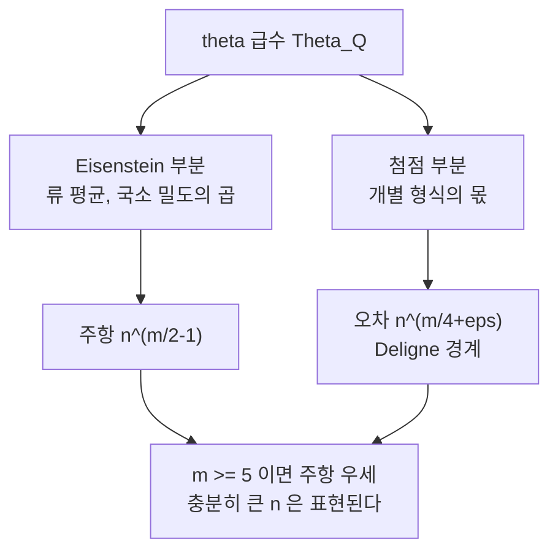

# Siegel–Weil 공식과 이차형식의 표현수

# 개요

정수계수 이차형식 $Q$ 가 정수 $n$ 을 몇 가지 방법으로 표현하는지 묻는 문제는 정수론에서 가장 오래된 물음 가운데 하나다. Lagrange 의 네 제곱수 정리, Gauss 의 세 제곱수 정리가 모두 이 형태다.

$$
r_Q(n)=\char35{}\lbrace x\in\mathbb Z^m:\ Q(x)=n\rbrace
$$

국소적으로는 답이 쉽다. 각 $\mathbb Z_p$ 와 $\mathbb R$ 에서 해가 있는지는 유한한 계산이다. 그러나 국소 해가 전부 있어도 정수해가 없을 수 있다. **정수 위에서는 국소-전역 원리가 깨진다.** 깨지는 정도를 정확히 재는 것이 **Siegel–Weil 공식**이다.

Siegel 의 형태는 이렇다. 같은 **류(genus)** 에 속하는 형식들의 표현수를 자기동형군 크기로 가중 평균하면, 그 평균이 국소 밀도의 곱과 정확히 같다.

$$
\frac{\sum_i r_{Q_i}(n)/|\mathrm{Aut}\thinspace Q_i|}{\sum_i 1/|\mathrm{Aut}\thinspace Q_i|}
=\prod_{v}\delta_v(n)
$$

Weil 은 이것이 표현론적 등식임을 알아냈다. [Weil 표현](weil-representation.md)에서 만든 theta 급수를 직교군 방향으로 적분하면 [Eisenstein 급수](eisenstein-series.md)가 나온다.

$$
\int_{O(V)(F)\backslash O(V)(\mathbb A)}\Theta_\varphi(g,h)\thinspace dh\ =\ E(g,\varphi)
$$

좌변은 류 평균이고 우변은 Fourier 계수가 국소 밀도의 곱으로 명시되는 대상이다. **국소-전역 원리의 양적 판본**이 이 한 줄에 들어 있다. 개별 형식과 류 평균의 차이는 첨점 형식이 담당하고, 그래서 오차항 추정이 자기동형 형식의 계수 크기 문제가 된다.

# 직관

## 왜 하나의 형식이 아니라 류 평균인가

$Q$ 와 $Q'$ 가 **같은 류**라는 것은 모든 $\mathbb Z_p$ 와 $\mathbb R$ 위에서 동치라는 뜻이다. 국소적으로 구별되지 않는다. 그런데 $\mathbb Z$ 위에서는 동치가 아닐 수 있다. 판별식 $-4\cdot 41$ 짜리 형식처럼, 같은 류 안에 $\mathbb Z$ 동치가 아닌 형식이 여럿 들어 있는 일이 흔하다.

그렇다면 국소 데이터만 가지고 만든 $\prod_v\delta_v(n)$ 이 개별 $r_{Q_i}(n)$ 과 같을 수는 없다. 국소 정보로 도달할 수 있는 최선은 **류 전체의 평균**이다. Siegel 공식은 그 최선이 실제로 달성된다고 말한다. 가중치 $1/|\mathrm{Aut}\thinspace Q_i|$ 는 임의로 고른 것이 아니라, 아델 군의 Haar 측도를 각 류 대표에 나눠줄 때 자연스럽게 나오는 무게다. [Eichler 의 질량 공식](jacquet-langlands.md)이 사원수 대수에서 같은 가중치를 쓰는 것과 같은 이유다.

## 주항과 오차항

theta 급수가 모듈러 형식이라는 사실을 쓰면 구조가 선명해진다. 무게 $m/2$ 의 모듈러 형식 공간은 Eisenstein 부분과 첨점 부분의 직합이다.

$$
\Theta_Q=\underbrace{E_Q}_{\text{류에만 의존}}+\underbrace{f_Q}_{\text{개별 형식}}
$$

Eisenstein 부분은 같은 류의 모든 형식에서 똑같고, 그 계수가 바로 국소 밀도의 곱이다. 첨점 부분이 형식마다 다른 몫을 담는다. 계수의 크기를 비교하면

$$
E_Q\ \text{의 계수}\ \asymp n^{m/2-1},
\qquad
f_Q\ \text{의 계수}\ \ll n^{m/4+\varepsilon}
$$

이고 오른쪽은 Deligne 의 Ramanujan 추측 증명이 준다. $m\ge5$ 이면 주항의 지수가 오차항보다 크므로, $n$ 이 충분히 크고 국소 조건을 만족하면 $r_Q(n)>0$ 이 강제된다. **표현 가능성의 국소-전역 원리가 유한 개 예외를 빼고 회복된다**는 Tartakowsky 의 정리가 이렇게 나온다.



변수 개수가 적으면 이 논법이 무너진다. $m=3$ 에서는 두 지수가 $1/2$ 와 $3/4+\varepsilon$ 로 뒤집혀서 오차가 주항을 삼킨다. 세 제곱수 문제가 네 제곱수 문제보다 훨씬 어려운 이유가 정확히 이 지수 비교에 있다.

## Weil 이 본 것

Siegel 의 증명은 해석적이었다. Weil 은 같은 등식을 쌍대쌍의 구조로 다시 읽었다. 쌍대쌍 $(O(V),\mathrm{Sp}(W))$ 에 대해 theta 급수 $\Theta_\varphi$ 는 두 군 모두의 함수다. 여기서 $O(V)$ 방향으로 적분하는 것은 **$O(V)$ 불변 벡터를 뽑는 연산**이고, 그 결과로 $\mathrm{Sp}$ 쪽에 남는 것은 퇴화 주계열에서 만든 Eisenstein 급수다.

곧 공식의 좌변과 우변은 같은 Weil 표현을 두 방향에서 본 것이다. 이렇게 보면 왜 등식이 성립하는지가 계산이 아니라 구조의 문제가 된다. [Rankin–Selberg 적분](rankin-selberg.md)이 Eisenstein 급수를 넣어 $L$ 함수를 뽑았다면, Siegel–Weil 은 반대로 적분에서 Eisenstein 급수가 나온다.

# 정의

## 류와 질량

$L$ 을 이차형식 $Q$ 가 얹힌 격자라 하자. $L$ 의 **류**는 모든 자리에서 국소적으로 동치인 격자들의 $\mathbb Z$ 동치류 모임이고, 유한개다. 류 안의 대표를 $L_1,\dots,L_h$ 라 할 때 **질량**은

$$
\mathrm{Mass}(L)=\sum_{i=1}^h\frac{1}{|\mathrm{Aut}(L_i)|}
$$

이고, Minkowski–Siegel 질량 공식이 이를 국소 밀도의 곱으로 준다. 류 안에 형식이 하나뿐이면, 곧 $h=1$ 이면 평균이 곧 그 형식 자신이라 Siegel 공식이 정확한 표현수 공식이 된다.

## 국소 밀도

각 소수 $p$ 에서

$$
\delta_p(n)=\lim_{k\to\infty}\frac{\char35{}\lbrace x\in(\mathbb Z/p^k)^m:\ Q(x)\equiv n\rbrace}{p^{k(m-1)}}
$$

로 두고, 무한 자리에서는 $Q(x)=n$ 인 실 초곡면 위의 측도로 $\delta_\infty(n)$ 을 정의한다. 이 곱 $\prod_v\delta_v(n)$ 을 **특이급수**라 부른다. 거의 모든 $p$ 에서 $\delta_p=1$ 이라 곱이 수렴한다.

## Siegel 정리

$m\ge4$ 이고 $Q$ 가 양정치이면

$$
\frac{1}{\mathrm{Mass}(L)}\sum_{i=1}^h\frac{r_{Q_i}(n)}{|\mathrm{Aut}(L_i)|}=\prod_v\delta_v(n)
$$

가 모든 $n\ge1$ 에 대해 성립한다.

## Weil 의 형태

$\varphi\in\mathcal S(V(\mathbb A)^k)$ 에 대해

$$
I(g,\varphi)=\int_{[O(V)]}\Theta_\varphi(g,h)\thinspace dh,
\qquad
E(g,\varphi)=\sum_{\gamma\in P(F)\backslash \mathrm{Sp}(F)}\Phi_\varphi(\gamma g)
$$

로 두면 **Weil 조건**(국소적으로 표현 가능성에 관한 조건, 대략 $\dim V$ 가 $\dim W$ 에 비해 충분히 클 것) 아래에서 $I(g,\varphi)=E(g,\varphi)$ 다. 원래 Weil 은 수렴 영역에서만 다뤘고, Kudla–Rallis 가 해석적 접속을 통해 정칙화된 판본으로 확장했다.

# 성질

## 류가 하나인 경우: 정확한 공식

$m=8$ 의 $x_1^2+\cdots+x_8^2$ 은 류에 형식이 하나뿐이다. 따라서 평균이 곧 답이고, 특이급수가 닫힌 공식으로 계산되어 Jacobi 의 여덟 제곱수 정리가 나온다.

```javascript
// theta3^k 의 계수
function thetaPower(k, N) {
  const K = Math.floor(Math.sqrt(N))
  let cur = new Array(N + 1).fill(0)
  for (let n = -K; n <= K; n++) cur[n * n] += 1
  const th = [...cur]
  const conv = (a, b) => {
    const c = new Array(N + 1).fill(0)
    for (let i = 0; i <= N; i++) if (a[i]) for (let j = 0; i + j <= N; j++) c[i + j] += a[i] * b[j]
    return c
  }
  for (let i = 1; i < k; i++) cur = conv(cur, th)
  return cur
}

// Jacobi: r_8(n) = 16 * sum_{d|n} (-1)^(n+d) d^3
const R8 = thetaPower(8, 12)
const jacobi8 = (n) => {
  let s = 0
  for (let d = 1; d <= n; d++) if (n % d === 0) s += (-1) ** (n + d) * d ** 3
  return 16 * s
}
for (let n = 1; n <= 6; n++) console.log(n, R8[n], jacobi8(n))
// 1 16 16      4 1136 1136
// 2 112 112    5 2016 2016
// 3 448 448    6 3136 3136
```

우변은 약수 함수만으로 적힌 순전한 산술 식이다. 이런 닫힌 공식이 존재하는 이유는 무게 4 레벨 4 의 첨점형식 공간이 0 차원이라 theta 급수가 Eisenstein 부분만 갖기 때문이고, 그 Eisenstein 계수가 곧 특이급수다. **공식이 있는 것이 아니라 첨점 형식이 없는 것**이다.

## 류가 여럿인 경우: 첨점 형식이 보인다

24 차원 짝수 유니모듈러 격자는 [Niemeier 격자](niemeier-lattices.md) 24 개로 분류되고 전부 같은 류에 있다. 이들의 theta 급수는 무게 12 의 모듈러 형식이며, 그 공간은 2 차원이다.

$$
\Theta_L=E_{12}+c_L\thinspace\Delta
$$

$E_{12}$ 는 모든 $L$ 에서 같고 $c_L$ 만 격자마다 다르다. Siegel 공식이 말하는 것은 $c_L$ 의 가중 평균이 0 이라는 것이다. Leech 격자는 근벡터가 없어 $\Theta$ 의 2 차 계수가 0 이고, 이 조건이 $c_L$ 을 완전히 결정한다. **류 평균은 국소 정보가 알려주고, 개별 격자의 개성은 첨점 형식의 계수에 담긴다.** Siegel–Weil 공식의 구조가 이보다 선명한 예는 없다.

## 세 변수의 어려움

$m=3$ 에서 주항과 오차의 지수가 뒤집힌다는 점은 앞에서 봤다. 그래서 세 제곱수 정리 $n\ne4^a(8b+7)$ 의 증명은 이 논법으로 되지 않고, $r_3(n)$ 이 허수이차체의 류수 $h(-4n)$ 과 연결된다는 Gauss 의 사실을 거쳐야 한다. 류수의 하한은 Siegel 의 정리가 주지만 그 정리는 **비유효**라 상수를 계산할 수 없다. 세 제곱수 문제의 유효 판정이 오래 열려 있었던 이유다.

여기서 [중심값의 비소멸](waldspurger-formula.md)이 다시 등장한다. $r_3(n)$ 을 중심 $L$ 값과 잇는 것이 Waldspurger 정리이고, 삼항 이차형식의 표현수 문제와 중심 $L$ 값 문제가 같은 문제라는 사실이 여기서 나온다.

## 정칙화와 확장

원래 Weil 조건은 $\dim V$ 가 충분히 커야 한다는 제약이었다. Kudla–Rallis 는 Eisenstein 급수를 $s$ 의 함수로 놓고 유수를 취하는 방식으로 조건을 크게 완화했다. 이 정칙화된 Siegel–Weil 공식이 theta 올림의 비소멸 판정과 [GGP](gan-gross-prasad.md) 계열 주기 문제에서 표준 도구가 되었다. 나아가 Kudla 는 좌변의 theta 적분을 Shimura 다양체 위 사이클의 생성함수로 바꾸는 **산술 Siegel–Weil 공식**을 제안했고, 이는 산술 GGP 와 같은 흐름에 있다.

# 활용

## 표현 가능성의 판정

$m\ge4$ 인 양정치 형식에서 "$Q$ 가 $n$ 을 표현하는가"는 유한 개의 예외를 빼고 국소 조건만으로 결정된다. 실제 알고리즘은 특이급수를 계산해 주항을 얻고, 첨점 부분의 계수 경계를 명시적으로 잡아 두 값을 비교하는 방식으로 작동한다. 유명한 **15 정리**와 **290 정리**(양정치 정수 이차형식이 15 이하 또는 290 이하의 정수를 전부 표현하면 모든 양의 정수를 표현한다)의 증명도 이 구조 위에 서 있다.

## 격자 이론과 부호 이론

질량 공식은 주어진 판별식과 차원에서 격자가 몇 개나 있는지를 미리 알려준다. 질량이 크면 류에 격자가 많다는 뜻이므로, 분류를 시도하기 전에 규모를 가늠할 수 있다. Niemeier 의 24 개 분류나 자기쌍대 부호의 분류가 이 계산을 발판으로 삼았다.

## theta 올림의 비소멸

표현론 쪽 용도가 오늘날 더 중요하다. theta 올림이 0 이 아닌지를 판정할 때, 올림의 Petersson 내적을 Siegel–Weil 로 계산해 $L$ 함수의 특수값과 잇는다(Rallis 내적 공식). 올림이 살아 있는지를 $L$ 값의 비소멸로 바꾸는 이 다리가 [Weil 표현](weil-representation.md)을 자기동형 표현론의 실용적 도구로 만든다.

# 연관 문서

## 선수지식

- [Weil 표현과 theta 대응](weil-representation.md)
- [Eisenstein 급수와 스펙트럼 분해](eisenstein-series.md)

## 더 알아보기

- [질량 공식과 격자의 류](mass-formula.md)

#number_theory #analysis #combinatorics
