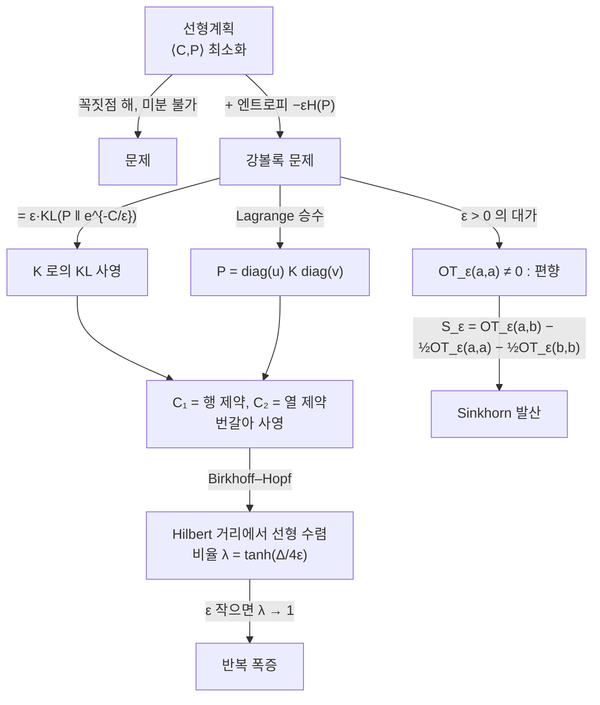

# Sinkhorn 알고리즘과 엔트로피 정규화

# 개요

[최적 수송](optimal-transport.md) 문서에서 이산 Kantorovich 문제가 선형계획이라는 것을 보았다. 정확하지만 두 가지가 불편하다. $n$ 개 점에 대해 $\tilde O(n^3)$ 이 들고, 최적해가 심플렉스의 꼭짓점이라 입력을 조금 흔들면 해가 튄다. 미분가능하지 않다는 뜻이고, 신경망의 손실함수로 쓸 수 없다는 뜻이다.

엔트로피 항을 더하면 둘 다 풀린다. 목적함수가 강볼록해져 해가 유일해지고 매끄러워지며, 최적해가 닫힌 꼴을 갖는다.

$$
P^\star=\mathrm{diag}(u)\,K\,\mathrm{diag}(v),\qquad K=e^{-C/\varepsilon}
$$

남은 일은 $u,v$ 를 주변분포에 맞추는 것뿐이고, 두 조건을 번갈아 강제하는 것이 **Sinkhorn 반복**이다. 행렬-벡터 곱만 쓰므로 GPU 에서 빠르다.

이 문서는 그 반복을 셋으로 나누어 본다. 왜 해가 대각 스케일링 꼴인가는 볼록쌍대가 답하고, 왜 반복이 수렴하는가는 [KL 발산](kl-divergence.md)에 대한 교대 사영이라는 관점과 Hilbert 사영 거리의 축약성이 답한다. 그리고 실제로 쓰려면 두 가지를 더 고쳐야 한다. 작은 $\varepsilon$ 에서의 수치적 언더플로는 로그 영역 구현이, $\varepsilon>0$ 이 남기는 편향은 Sinkhorn 발산이 고친다.

# 직관

## 엔트로피가 문제를 둥글게 만든다

비용 $\langle C,P\rangle$ 는 $P$ 에 대해 선형이다. 선형 목적함수는 볼록집합의 꼭짓점에서 최소가 되므로, 최적 계획은 가능한 한 "결정적" 이다. 질량을 쪼개지 않고 한 점을 한 점으로 보낸다.

엔트로피 $H(P)=-\sum P_{ij}(\log P_{ij}-1)$ 를 빼면 반대 압력이 생긴다. 엔트로피는 질량이 퍼질수록 커지므로, $-\varepsilon H(P)$ 를 최소화하는 것은 계획을 흐릿하게 만드는 힘이다. $\varepsilon$ 이 두 힘의 환율이다.

$$
\varepsilon\to0:\ P^\star\to\text{최적 수송 계획},\qquad
\varepsilon\to\infty:\ P^\star\to a\,b^\top\ (\text{독립 결합})
$$

극한이 둘 다 뜻이 통한다. $\varepsilon$ 이 크면 비용을 무시하고 가장 무질서한 결합인 곱측도로 가고, 작으면 원래 문제로 돌아간다.

## 왜 하필 대각 스케일링인가

주변분포 제약이 행 합과 열 합, 곧 $n+m$ 개의 선형 등식이다. 등식 제약이 $n+m$ 개면 Lagrange 승수도 $n+m$ 개이고, 목적함수가 $P_{ij}$ 에 대해 분리가능하므로 최적해가 승수들로 성분마다 풀린다.

$$
\frac{\partial}{\partial P_{ij}}\Big[\langle C,P\rangle-\varepsilon H(P)-\textstyle\sum_if_i(\cdot)-\sum_jg_j(\cdot)\Big]=0
\ \Longrightarrow\
P_{ij}=e^{f_i/\varepsilon}e^{-C_{ij}/\varepsilon}e^{g_j/\varepsilon}
$$

$u_i=e^{f_i/\varepsilon}$, $v_j=e^{g_j/\varepsilon}$ 로 쓰면 대각 스케일링이다. 미지수가 $nm$ 개에서 $n+m$ 개로 줄었다. 엔트로피 항의 로그가 지수를 낳고, 지수가 곱으로 분리되는 것이 전부다.

## 반복은 KL 사영을 번갈아 하는 것이다

목적함수를 다시 쓰면 정체가 분명해진다. $K=e^{-C/\varepsilon}$ 로 두면

$$
\langle C,P\rangle-\varepsilon H(P)=\varepsilon\,\mathrm{KL}(P\,\|\,K)+\text{상수}
$$

이므로, 엔트로피 정규화 최적 수송은 **$K$ 에 KL 발산으로 가장 가까운 결합을 찾는 문제**다. 제약 집합은 아핀집합 두 개의 교집합이다.

$$
\mathcal C_1=\{P:P\mathbf 1=a\},\qquad \mathcal C_2=\{P:P^\top\mathbf 1=b\}
$$

Sinkhorn 반복의 한 단계는 정확히 $\mathcal C_1$ 로의 KL 사영이고, 다음 단계는 $\mathcal C_2$ 로의 KL 사영이다. 아핀집합으로의 Bregman 교대 사영이 교집합으로 수렴한다는 일반 정리의 특수한 경우이며, 유클리드 거리로 두 부분공간에 번갈아 사영하는 고전적 그림과 같은 구조다.



## 왜 수렴하는가

Sinkhorn 반복은 $u$ 를 양수 벡터의 사영공간(스칼라 배를 동일시한 공간)에서 움직인다. 그 공간의 자연스러운 거리가 **Hilbert 사영 거리**다.

$$
d_H(u,u')=\log\max_{i,j}\frac{u_iu'_j}{u_ju'_i}
$$

Birkhoff–Hopf 정리에 따르면 성분이 모두 양수인 행렬 $K$ 를 곱하는 사상은 이 거리에서 축약이고, 축약비가 $K$ 의 사영 지름으로 명시된다. 유한 차원에서 $K$ 의 성분이 모두 양수라는 것만으로 선형 수렴이 보장된다.

핵심은 그 비율이 $\varepsilon$ 에 어떻게 의존하느냐다. $K=e^{-C/\varepsilon}$ 이면 성분 사이의 비가 $\varepsilon$ 이 작아질수록 극단적이 되고 축약비가 $1$ 에 지수적으로 가까워진다. 정확한 해에 가까워질수록 알고리즘이 느려진다는 뜻이며, 이것이 $\varepsilon$ 을 함부로 줄일 수 없는 이유다.

# 정의

## 엔트로피 정규화 최적 수송

$a\in\Delta_n$, $b\in\Delta_m$ 을 확률벡터, $C\in\mathbb R^{n\times m}_{\ge0}$ 을 비용행렬이라 하고 $\Pi(a,b)=\{P\ge0:P\mathbf1=a,\ P^\top\mathbf1=b\}$ 라 하자.

$$
\mathrm{OT}_\varepsilon(a,b)=\min_{P\in\Pi(a,b)}\ \langle C,P\rangle+\varepsilon\,\mathrm{KL}\big(P\,\|\,a\otimes b\big)
$$

기준측도를 $K=e^{-C/\varepsilon}$ 로 잡느냐 곱측도 $a\otimes b$ 로 잡느냐는 상수 차이이고 최적해 $P^\star$ 는 같다. 아래에서는 편향 논의에 편한 곱측도 규약을 쓴다. 목적함수가 $P$ 에 대해 강볼록하고 $\Pi(a,b)$ 가 콤팩트 볼록집합이므로 최소점이 유일하다.

## 쌍대 문제

제약에 승수 $f\in\mathbb R^n$, $g\in\mathbb R^m$ 을 붙이고 $P$ 에 대해 최소화하면 매끄러운 쌍대 문제가 나온다.

$$
\max_{f,g}\ \langle f,a\rangle+\langle g,b\rangle-\varepsilon\sum_{i,j}a_ib_j\,e^{(f_i+g_j-C_{ij})/\varepsilon}
$$

원 문제와 달리 제약이 전혀 없다. 최적해는

$$
P^\star_{ij}=a_ib_j\,e^{(f_i+g_j-C_{ij})/\varepsilon}
$$

이고, 각 변수에 대한 일계 조건이 곧 주변분포 조건이다. 이 조건을 번갈아 풀면

$$
f_i=-\varepsilon\log\sum_jb_j\,e^{(g_j-C_{ij})/\varepsilon},\qquad
g_j=-\varepsilon\log\sum_ia_i\,e^{(f_i-C_{ij})/\varepsilon}
$$

가 된다. 곧 Sinkhorn 반복은 쌍대 문제의 **블록 좌표 상승법**이다. 곱 형태 $u\leftarrow a/(Kv)$, $v\leftarrow b/(K^\top u)$ 와 같은 알고리즘이며, 위 식은 그것을 로그로 옮긴 것이다.

## 로그 영역 반복

$\varepsilon$ 이 작으면 $K_{ij}=e^{-C_{ij}/\varepsilon}$ 이 부동소수점에서 $0$ 으로 무너지고 $Kv$ 로 나누는 순간 계산이 끝난다. 위의 로그 형태를 그대로 쓰되 $\log\sum\exp$ 를 최댓값을 빼고 계산하면 이 문제가 사라진다.

$$
\mathrm{LSE}(z)=z_{\max}+\log\sum_k e^{z_k-z_{\max}}
$$

지수의 인자가 항상 $0$ 이하가 되어 오버플로가 없고, 한 항은 정확히 $1$ 이라 합이 $0$ 이 되지도 않는다. 대가는 $\exp$ 와 $\log$ 호출이 늘어 행렬 곱의 이점을 일부 잃는 것이다.

## Sinkhorn 발산

$\varepsilon>0$ 이면 $\mathrm{OT}_\varepsilon(a,a)>0$ 이다. 자기 자신과의 거리가 $0$ 이 아니므로 $\mathrm{OT}_\varepsilon$ 은 손실함수로 쓰기에 결함이 있다. 이 상수를 빼내는 것이 **Sinkhorn 발산**이다[^1].

$$
S_\varepsilon(a,b)=\mathrm{OT}_\varepsilon(a,b)-\tfrac12\mathrm{OT}_\varepsilon(a,a)-\tfrac12\mathrm{OT}_\varepsilon(b,b)
$$

$S_\varepsilon(a,a)=0$ 이 정의에서 바로 따라 나오고, $S_\varepsilon(a,b)\ge0$ 이며 $a=b$ 일 때만 $0$ 이다. 두 번의 추가 Sinkhorn 실행이 비용의 전부다.

# 성질

## 수렴

> **Franklin–Lorenz.** $K$ 의 성분이 모두 양수이면 Sinkhorn 반복은 Hilbert 사영 거리에서 선형 수렴한다. 축약비는
> $$
> \lambda=\frac{\sqrt\eta-1}{\sqrt\eta+1},\qquad
> \eta=\max_{i,j,k,l}\frac{K_{ik}K_{jl}}{K_{jk}K_{il}}
> $$
> 이고, $K=e^{-C/\varepsilon}$ 이면 $\eta=e^{\Delta/\varepsilon}$, $\Delta=\max_{i,j,k,l}(C_{jk}+C_{il}-C_{ik}-C_{jl})$ 다.

$\lambda=\tanh\!\big(\Delta/4\varepsilon\big)$ 로 정리된다. $\varepsilon$ 이 크면 $\lambda\approx\Delta/4\varepsilon$ 로 아주 빠르고, $\varepsilon\to0$ 이면 $\lambda\to1-2e^{-\Delta/2\varepsilon}$ 이라 필요한 반복 수가 $e^{\Delta/2\varepsilon}$ 규모로 폭증한다.

정규화 없는 최적 수송을 $\delta$ 오차로 풀겠다면 $\varepsilon\sim\delta/\log n$ 을 잡아야 하고, 이때 전체 복잡도는 $\tilde O(n^2/\delta^3)$ 이다. 선형계획의 $\tilde O(n^3)$ 과 견주면 정밀도를 낮게 잡을수록 유리한 교환이다. 실제 기계학습 응용에서 $\delta$ 를 크게 잡아도 되는 경우가 많아 Sinkhorn 이 널리 쓰인다.

## 편향의 크기

$\mathrm{OT}_\varepsilon$ 과 $\mathrm{OT}_0$ 의 차이는 $\varepsilon$ 에 대해 일차가 아니라 로그 보정이 붙는다. 매끄러운 분포에서

$$
\mathrm{OT}_\varepsilon(a,b)-\mathrm{OT}_0(a,b)=O\big(\varepsilon\log\tfrac1\varepsilon\big)
$$

이 알려져 있다. 반면 $S_\varepsilon$ 은 앞선 항들이 상쇄되어 $\varepsilon$ 의 더 높은 차수로 접근한다. 같은 $\varepsilon$ 에서 훨씬 정확하다는 뜻이고, 같은 정확도를 더 큰 $\varepsilon$ 으로 얻으므로 반복 수까지 줄어든다.

$S_\varepsilon$ 은 두 극한 사이를 보간하기도 한다. $\varepsilon\to0$ 이면 최적 수송 비용으로, $\varepsilon\to\infty$ 이면 커널 $-C$ 로 정의되는 최대평균불일치(MMD)로 수렴한다. 기하를 반영하는 수송 거리와 계산이 값싼 커널 거리 사이의 연속적인 다리다.

## 미분가능성

쌍대 문제의 포락선 정리에서 기울기가 바로 나온다.

$$
\nabla_a\mathrm{OT}_\varepsilon(a,b)=f^\star\quad(\textstyle\sum_if^\star_i a_i=0\ \text{로 정규화})
$$

최적 쌍대 변수가 곧 기울기이므로 반복을 되짚어 미분할 필요가 없다. 반복 전체를 계산 그래프에 넣고 자동미분하는 것도 가능하지만, 수렴한 지점에서는 위 식을 쓰는 편이 메모리와 정확도 양쪽에서 낫다.

## 무엇이 보장되지 않는가

- $\mathrm{OT}_\varepsilon$ 은 삼각부등식을 만족하지 않는다. $S_\varepsilon$ 도 일반적으로는 거리가 아니고, 양정성과 볼록성, 약수렴의 거리화만 보장된다.
- $\varepsilon$ 을 줄이면 정확해지지만 반복이 지수적으로 늘고 조건수가 나빠진다. $\varepsilon$ 을 크게 시작해 줄여 가는 어닐링이 표준 대응이다.
- 주변분포가 정확히 맞는 것은 수렴 후의 이야기다. 유한 반복에서 얻은 $P$ 는 한쪽 주변분포만 정확하다. 근사 계획을 실제로 써야 하면 반올림 단계가 따로 필요하다.

# 활용

## 로그 영역 구현과 편향 제거를 확인한다

1 차원에서는 정렬이 최적해를 주므로 정확한 $W_2^2$ 를 알고 있다. 그 값을 기준으로 세 가지를 본다. $\varepsilon$ 이 줄 때 반복 수가 어떻게 늘어나는지, $\langle C,P\rangle$ 의 편향이 얼마나 남는지, Sinkhorn 발산이 그 편향을 얼마나 줄이는지다.

```python
import math, random

random.seed(3)
n = 8
xs = sorted(random.uniform(0, 1) for _ in range(n))
ys = sorted(random.uniform(0, 1) for _ in range(n))
a = b = [1 / n] * n
C = [[(xs[i] - ys[j]) ** 2 for j in range(n)] for i in range(n)]
exact = sum((xs[i] - ys[i]) ** 2 for i in range(n)) / n      # 1 차원은 정렬이 최적

def lse(vals):                                                # log Σ exp, 안정화판
    m = max(vals)
    return m + math.log(sum(math.exp(v - m) for v in vals)) if m > -math.inf else -math.inf

def sinkhorn_log(C, a, b, eps, tol=1e-9, max_iter=100_000):
    """로그 영역 Sinkhorn. P_ij = a_i b_j exp((f_i+g_j-C_ij)/eps)."""
    n, m = len(a), len(b)
    f, g = [0.0] * n, [0.0] * m
    for it in range(1, max_iter + 1):
        f = [-eps * lse([math.log(b[j]) + (g[j] - C[i][j]) / eps for j in range(m)])
             for i in range(n)]
        g = [-eps * lse([math.log(a[i]) + (f[i] - C[i][j]) / eps for i in range(n)])
             for j in range(m)]
        err = max(abs(sum(a[i] * b[j] * math.exp((f[i] + g[j] - C[i][j]) / eps)
                          for j in range(m)) - a[i]) for i in range(n))
        if err < tol:
            break
    P = [[a[i] * b[j] * math.exp((f[i] + g[j] - C[i][j]) / eps) for j in range(m)]
         for i in range(n)]
    transport = sum(P[i][j] * C[i][j] for i in range(n) for j in range(m))
    kl = sum(P[i][j] * math.log(P[i][j] / (a[i] * b[j])) for i in range(n) for j in range(m)
             if P[i][j] > 0)
    return transport, transport + eps * kl, it                # ⟨C,P⟩, OT_ε, 반복수

print(f"정확한 W₂² = {exact:.8f}")
print(f"{'ε':>8} {'반복':>7} {'⟨C,P⟩':>12} {'편향':>11} {'S_ε':>12} {'편향':>11}")
for eps in (0.5, 0.1, 0.02, 0.005):
    cp, ot_ab, it = sinkhorn_log(C, a, b, eps)
    _, ot_aa, _ = sinkhorn_log([[(xs[i] - xs[j]) ** 2 for j in range(n)] for i in range(n)],
                               a, a, eps)
    _, ot_bb, _ = sinkhorn_log([[(ys[i] - ys[j]) ** 2 for j in range(n)] for i in range(n)],
                               b, b, eps)
    S = ot_ab - 0.5 * ot_aa - 0.5 * ot_bb
    print(f"{eps:>8} {it:>7} {cp:>12.8f} {cp-exact:>+11.2e} {S:>12.8f} {S-exact:>+11.2e}")

# 표준 영역이 왜 깨지는가 : K = exp(-C/ε) 의 최솟값
cmax = max(max(row) for row in C)
print("\n표준 영역 커널의 최솟값")
for eps in (0.1, 0.01, 0.005, 0.002, 0.001):
    try:
        k = math.exp(-cmax / eps)
    except OverflowError:
        k = 0.0
    print(f"  ε={eps:<7} min K = {k:.3e}   {'언더플로 → 0 으로 나눔' if k == 0 else ''}")

# 정확한 W₂² = 0.01664743
#        ε      반복        ⟨C,P⟩          편향          S_ε          편향
#      0.5       8   0.11851554   +1.02e-01   0.00945215   -7.20e-03
#      0.1      31   0.05033355   +3.37e-02   0.01179787   -4.85e-03
#     0.02     145   0.02307929   +6.43e-03   0.01421309   -2.43e-03
#    0.005    6572   0.01801612   +1.37e-03   0.01643426   -2.13e-04
#
# 표준 영역 커널의 최솟값
#   ε=0.1     min K = 6.426e-05
#   ε=0.01    min K = 1.200e-42
#   ε=0.005   min K = 1.441e-84
#   ε=0.002   min K = 2.491e-210
#   ε=0.001   min K = 0.000e+00   언더플로 → 0 으로 나눔
```

세 가지가 한꺼번에 보인다.

첫째, 반복 수가 $8\to31\to145\to6572$ 로 늘어난다. $\varepsilon$ 을 100 배 줄이는 동안 반복이 800 배 넘게 늘었다. Birkhoff–Hopf 축약비가 $1$ 로 가는 모습이다.

둘째, $\langle C,P\rangle$ 의 편향은 항상 양수이고 $\varepsilon$ 에 대략 비례해 줄어든다. 반면 $S_\varepsilon$ 의 편향은 같은 $\varepsilon$ 에서 훨씬 작다. $\varepsilon=0.005$ 에서 $1.37\times10^{-3}$ 대 $2.13\times10^{-4}$ 로 여섯 배 이상 차이다. 편향을 뺀 양이 실제로 더 나은 추정량이라는 것이 수치로 확인된다.

셋째, $\varepsilon=0.001$ 에서 $K$ 가 완전히 $0$ 으로 무너진다. 표준 영역 구현이라면 $Kv=0$ 이 되어 첫 나눗셈에서 실패했을 값이고, 로그 영역이 왜 선택이 아니라 필수인지를 보여 준다.

## 어디에 쓰이는가

- **생성모형의 손실함수.** 표본 집합 두 개 사이의 거리를 미분가능하게 재야 하는 자리에 $S_\varepsilon$ 이 들어간다. 적대적 학습 없이 분포를 맞출 수 있어 학습이 안정적이다.
- **영역 적응과 색 이전.** 서로 다른 분포의 표본을 대응시키는 문제가 그대로 수송 계획이다. 부드러운 계획이 오히려 잡음에 강하다.
- **단세포 유전체학.** 서로 다른 시점에 측정한 세포 집단을 잇는 궤적 추론이 수송 문제로 세워지고, 규모 때문에 Sinkhorn 이 사실상 유일한 선택지가 된다.
- **미분가능한 정렬과 순위.** 치환행렬의 볼록완화가 이중확률행렬이므로, Sinkhorn 을 미분가능한 "부드러운 정렬" 로 쓴다. 순위 기반 손실함수를 신경망에 넣을 때의 표준 수법이다.
- **행렬 균형화.** 비용과 무관하게 양수 행렬을 이중확률행렬로 만드는 고전적 문제 자체가 $\varepsilon=1$, $C=-\log K$ 인 특수한 경우다. Sinkhorn 의 1964년 원논문이 이 문제였다.

[^1]: Marco Cuturi, *Sinkhorn Distances: Lightspeed Computation of Optimal Transport*, NeurIPS 2013 이 정규화와 반복을 최적 수송에 도입했다. 수렴 비율은 J. Franklin, J. Lorenz, *On the scaling of multidimensional matrices*, Linear Algebra Appl. 114–115 (1989), 717–735. Sinkhorn 발산의 양정성과 거리화는 J. Feydy 외, *Interpolating between Optimal Transport and MMD using Sinkhorn Divergences*, AISTATS 2019. 복잡도 $\tilde O(n^2/\delta^3)$ 은 J. Altschuler, J. Weed, P. Rigollet, NeurIPS 2017. 본문의 수치 실험은 직접 한 것이다.

# 연관 문서

## 선수지식

- [최적 수송과 Wasserstein 거리](optimal-transport.md)
- [KL divergence와 상호정보량](kl-divergence.md)

## 더 알아보기

- [불균형 최적 수송](unbalanced-optimal-transport.md)

#optimization #machine_learning #information_theory
