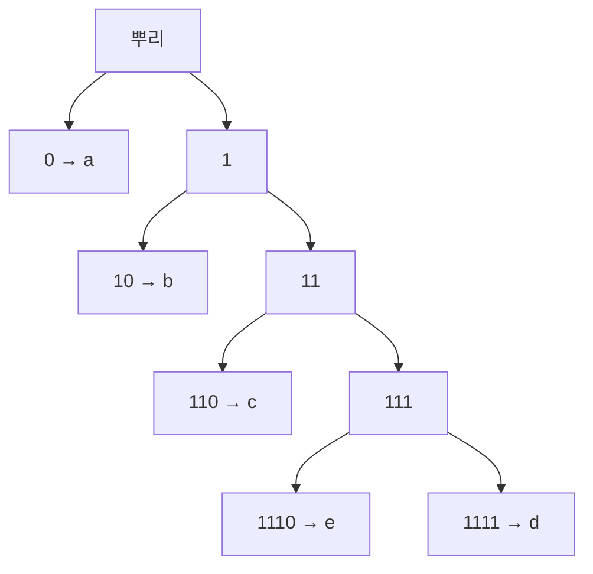

# 무손실 부호화 정리

# 개요

[Shannon entropy](entropy.md) 는 "불확실성의 평균" 이라는 해석만으로도 그럴듯하지만, 그 정의가 임의적이지 않다는 근거는 압축에서 나온다. 무손실 부호화 정리는 어떤 방법으로도 평균 부호 길이를 `H(X)` 아래로 내릴 수 없고, 동시에 `H(X)` 에 원하는 만큼 가까이 갈 수 있다고 말한다.

$$
H(X)\le L^{*}<H(X)+1
$$

즉 entropy 는 비유가 아니라 비트 단위로 측정되는 물리적 한계다. 하한은 "예산" 논증 하나(Kraft 부등식)와 KL divergence 의 비음수성에서 나오고, 상한은 길이를 `⌈−log p⌉` 로 잡는 구체적인 부호가 달성한다. 기호를 묶어서 부호화하면 `+1` 의 손해도 기호당 0 으로 줄어든다.

# 직관

## 자주 쓰는 것에 짧은 이름을

모스 부호에서 `e` 는 점 하나, `q` 는 네 부호다. 영어에서 `e` 가 훨씬 자주 나오기 때문이다. 평균 길이를 줄이려면 확률이 큰 기호에 짧은 부호를 주어야 한다는 원리는 분명하다. 문제는 짧은 부호를 마음대로 늘릴 수 없다는 점이다.

## 짧은 부호는 예산을 많이 쓴다

부호를 이진트리의 잎으로 생각하자. 길이 `ℓ` 인 부호는 깊이 `ℓ` 의 잎 하나를 차지하는데, 그 잎을 쓰는 순간 그 아래로 뻗을 수 있었던 모든 가지가 함께 소모된다. 깊이 1 짜리 잎 하나는 전체의 절반을 먹고, 깊이 2 는 4 분의 1 을 먹는다. 전체 예산을 1 로 두면 다음 제약이 생긴다.

$$
\sum_i2^{-\ell_i}\le1
$$

이것이 Kraft 부등식이고, 압축의 모든 한계가 여기서 나온다. 짧은 부호는 공짜가 아니며, 하나를 짧게 만들면 다른 것이 반드시 길어진다.



부호가 잎에만 놓이면 어떤 부호도 다른 부호의 접두사가 아니므로, 받은 비트열을 왼쪽부터 읽다가 잎에 닿는 순간 기호 하나를 확정할 수 있다. 구분자가 필요 없다.

# 정의

## 부호와 접두 조건

유한 알파벳 `A` 의 각 기호 `a` 에 이진 문자열 `c(a)` 를 대응시키는 것이 부호이고, 길이를 `ℓ(a) = |c(a)|` 라 한다. 평균 부호 길이는 다음과 같다.

$$
L=\sum_{a\in A}p(a)\,\ell(a)
$$

어떤 부호도 다른 부호의 접두사가 아니면 접두부호라 한다. 접두부호는 이진트리의 잎과 같은 것이고, 붙여 쓴 비트열을 왼쪽에서 오른쪽으로 한 번에 복호할 수 있다. 더 약한 조건인 유일복호성(서로 다른 기호열이 서로 다른 비트열이 됨)만 요구해도 얻을 수 있는 길이의 집합은 같다는 것이 McMillan 정리다. 그래서 접두부호만 생각해도 일반성을 잃지 않는다.

## Kraft 부등식

길이 `ℓ_1, …, ℓ_m` 을 갖는 접두부호가 존재할 필요충분조건은 다음이다.

$$
\sum_{i=1}^{m}2^{-\ell_i}\le1
$$

필요조건은 위의 예산 논증이고, 충분조건은 길이를 오름차순으로 정렬해 트리의 왼쪽부터 차례로 잎을 배정하면 항상 자리가 남는다는 구성으로 보인다.

# 성질

## 하한: entropy 아래로 내려갈 수 없다

접두부호의 길이에서 `q(a) = 2^{−ℓ(a)}/S`, `S = ∑2^{−ℓ}` 로 확률분포를 만들면 다음이 성립한다.

$$
L-H(X)=\sum_ap(a)\log_2\frac{p(a)}{q(a)}-\log_2 S=D(p\,\|\,q)-\log_2S\ \ge 0
$$

KL divergence 가 항상 0 이상이고 Kraft 부등식에 의해 `S ≤ 1` 이므로 `−log₂S ≥ 0` 이다. 등호는 `S = 1` 이고 `p = q`, 즉 모든 확률이 2 의 거듭제곱의 역수이고 `ℓ(a) = −log₂p(a)` 일 때만 성립한다. 부호 설계는 결국 분포를 추측하는 일이며, 틀린 분포 `q` 를 믿고 부호를 짜면 정확히 `D(p‖q)` 비트만큼 손해를 본다.

## 상한: Shannon 부호

`ℓ(a) = ⌈−log₂p(a)⌉` 로 두면 Kraft 부등식이 성립하므로 접두부호가 존재하고, 올림의 손해가 기호당 1 비트 미만이므로 다음을 얻는다.

$$
H(X)\le L<H(X)+1
$$

## Huffman 부호의 최적성

가장 확률이 작은 두 기호를 묶어 하나로 만들고 재귀적으로 반복하는 Huffman 알고리즘은 평균 길이가 최소인 접두부호를 만든다. 최적 부호에서는 확률이 가장 작은 두 기호가 최대 깊이의 형제 잎이어야 한다는 교환 논증이 증명의 핵심이다. 최적이라 해도 하한을 깰 수는 없으므로 여전히 `H ≤ L_{Huffman} < H+1` 이다.

## 블록 부호화와 점근 등분할

`n` 개의 기호를 한 덩어리로 보고 부호화하면 덩어리마다 손해가 1 비트 미만이므로 기호당 손해는 `1/n` 이 된다.

$$
H(X)\le\frac{L_n}{n}<H(X)+\frac{1}{n}
$$

같은 결론을 다른 각도에서 보는 것이 점근 등분할 성질이다. 독립 동일분포 표본열의 확률은 거의 확실히 `2^{−nH}` 근처이며, 이런 "전형적인" 열의 개수는 약 `2^{nH}` 개다. 전체 `|A|^n` 개 중 이 작은 집합에만 번호를 붙이면 `nH` 비트로 충분하고, 나머지를 버려도 확률이 0 으로 간다. 압축이 가능한 이유는 실제로 일어나는 열이 가능한 열 전체보다 지수적으로 적기 때문이다.

## 직접 만들어 보기

Huffman 부호를 구현해 Kraft 등식과 하한을 확인하고, 편향된 동전을 묶어 부호화할 때 기호당 길이가 entropy 로 내려가는지 본다.

```python
import heapq, math
from itertools import product

def huffman(p):
    """확률표 p 에서 최적 접두부호를 만든다"""
    h = [(w, i, {s: ""}) for i, (s, w) in enumerate(sorted(p.items()))]
    heapq.heapify(h)
    n = len(h)
    while len(h) > 1:
        w1, _, c1 = heapq.heappop(h)          # 가장 작은 둘을 묶는다
        w2, _, c2 = heapq.heappop(h)
        merged = {s: "0" + c for s, c in c1.items()}
        merged.update({s: "1" + c for s, c in c2.items()})
        heapq.heappush(h, (w1 + w2, n, merged))
        n += 1
    return h[0][2]

H = lambda p: -sum(q * math.log2(q) for q in p.values() if q > 0)
avg = lambda p, c: sum(p[s] * len(c[s]) for s in p)

p = {"a": 0.45, "b": 0.25, "c": 0.15, "d": 0.10, "e": 0.05}
code = huffman(p)
print({s: code[s] for s in sorted(code)})
# {'a': '0', 'b': '10', 'c': '110', 'd': '1111', 'e': '1110'}
print(round(H(p), 4), round(avg(p, code), 4),
      round(sum(2.0 ** -len(c) for c in code.values()), 6))
# 1.9772 2.0 1.0      H ≤ L < H+1, Kraft 는 등호

q = {"0": 0.9, "1": 0.1}
print(round(H(q), 4))                                    # 0.469
for n in (1, 2, 4, 8):
    pn = {"".join(t): math.prod(q[c] for c in t) for t in product("01", repeat=n)}
    print(n, round(avg(pn, huffman(pn)) / n, 4))
# 1 1.0     한 기호씩 부호화하면 압축이 전혀 안 된다
# 2 0.645
# 4 0.4926
# 8 0.4758  H = 0.469 에 접근한다
```

한 기호씩 부호화할 때 길이가 1 비트인 것은 당연하다. 기호가 둘뿐이면 어떤 접두부호도 각각 1 비트를 줘야 한다. 확률의 치우침을 이용하려면 여러 기호를 묶어 "가능하지만 거의 일어나지 않는" 조합에 긴 부호를 밀어 넣을 여지를 만들어야 하고, 그 여지가 `n` 과 함께 커지면서 기호당 길이가 entropy 로 수렴한다.

# 활용

## 실제 압축기

`gzip`, `PNG`, `JPEG` 는 사전 기반 중복 제거나 변환 뒤에 Huffman 부호를 붙인다. 확률이 2 의 거듭제곱에서 멀거나 기호 하나의 확률이 아주 크면 Huffman 의 `+1` 손해가 상대적으로 커지므로, 현대 압축기는 기호당 비트 수를 소수로 쪼갤 수 있는 산술부호나 ANS 를 쓴다. 어느 쪽이든 하한은 그대로 entropy 다.

## 모델링이 곧 압축

부호 길이가 `−log q` 이므로 평균 길이는 교차엔트로피이고, 최적과의 차이는 `D(p‖q)` 다. 따라서 "더 잘 압축하는 것" 과 "더 좋은 확률모형을 갖는 것" 은 같은 말이다. 적응 부호는 지금까지 본 데이터로 `q` 를 갱신하며 부호화하고, 언어모형의 평가지표인 perplexity 는 기호당 부호 길이를 그대로 지수로 올린 값이다.

## 한계와 경계 조건

정리는 확률모형이 주어졌다는 전제 위에 있다. 모형이 틀리면 손해가 KL 만큼 생기고, 기호 사이에 의존성이 있는데 독립으로 보면 그 상관만큼 압축 여지를 버리게 된다. 또한 모든 파일을 줄이는 무손실 압축기는 존재할 수 없다. 길이 `n` 의 비트열은 `2^n` 개인데 더 짧은 문자열은 그보다 적으므로, 어떤 입력은 반드시 길어진다. 압축은 "흔한 것을 짧게, 드문 것을 길게" 하는 재분배이지 총량의 감소가 아니다.

# 연관 문서

## 선수지식

- [Shannon entropy](entropy.md)

## 더 알아보기

- [채널 부호화 정리](channel-coding.md)

#information_theory #theorem
