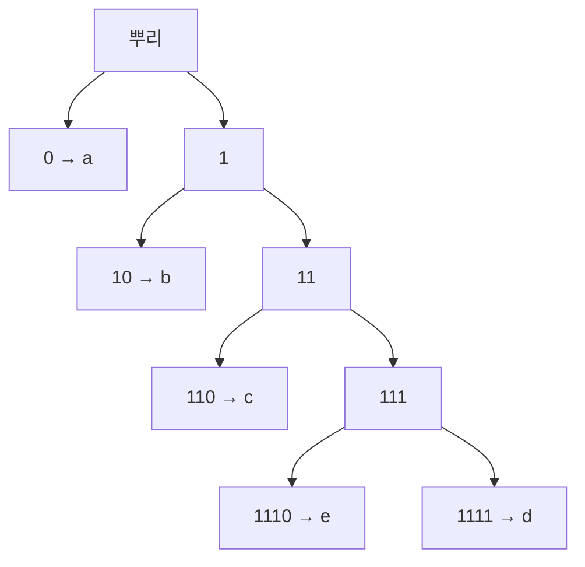

# 무손실 부호화 정리

# 개요

무손실 부호화 정리는 평균 부호 길이를 [Shannon entropy](entropy.md) $H(X)$ 아래로 내릴 수 없고, 동시에 $H(X)$ 에 원하는 만큼 가까이 갈 수 있다고 말한다.

$$
H(X)\le L^{*}<H(X)+1
$$

entropy 는 비트 단위로 측정되는 압축의 한계다. 하한은 Kraft 부등식과 KL divergence 의 비음수성에서 나오고, 상한은 길이를 $\lceil -\log p \rceil$ 로 잡는 부호가 달성한다. 기호를 묶어서 부호화하면 $+1$ 의 손해도 기호당 0 으로 줄어든다.

# 직관

## 빈도와 부호 길이

모스 부호에서 $e$ 는 점 하나, $q$ 는 네 부호다. 평균 길이를 줄이려면 확률이 큰 기호에 짧은 부호를 주어야 하지만, 짧은 부호를 마음대로 늘릴 수는 없다.

## Kraft 예산

부호를 이진트리의 잎으로 보면, 길이 $\ell$ 인 부호는 깊이 $\ell$ 의 잎 하나를 차지하고 그 아래로 뻗을 수 있었던 가지를 함께 소모한다. 깊이 1 짜리 잎 하나는 전체의 절반을, 깊이 2 는 4 분의 1 을 먹는다. 전체 예산을 1 로 두면

$$
\sum_i2^{-\ell_i}\le1
$$

이 성립한다. 이것이 Kraft 부등식이고, 하나를 짧게 만들면 다른 것이 길어진다.



부호가 잎에만 놓이면 어떤 부호도 다른 부호의 접두사가 아니므로, 비트열을 왼쪽부터 읽다가 잎에 닿는 순간 기호 하나가 확정되고 구분자가 필요 없다.

# 정의

## 부호와 접두 조건

유한 알파벳 $A$ 의 각 기호 $a$ 에 이진 문자열 $c(a)$ 를 대응시키는 것이 부호이고 길이를 $\ell(a) = \lvert c(a) \rvert$ 라 한다. 평균 부호 길이는

$$
L=\sum_{a\in A}p(a)\thinspace\ell(a)
$$

다. 어떤 부호도 다른 부호의 접두사가 아니면 **접두부호**라 한다. 접두부호는 이진트리의 잎에 대응하고, 붙여 쓴 비트열을 왼쪽에서 오른쪽으로 한 번에 복호한다. 유일복호성만 요구해도 얻을 수 있는 길이의 집합이 같다는 것이 McMillan 정리이므로, 접두부호만 생각해도 일반성을 잃지 않는다.

## Kraft 부등식

길이 $\ell_1, \dots, \ell_m$ 을 갖는 접두부호가 존재할 필요충분조건은

$$
\sum_{i=1}^{m}2^{-\ell_i}\le1
$$

이다. 필요조건은 예산 논증이고, 충분조건은 길이를 오름차순으로 정렬해 트리의 왼쪽부터 차례로 잎을 배정하는 구성으로 보인다.

# 성질

## Entropy 하한

접두부호의 길이에서 $q(a) = 2^{-\ell(a)}/S$ , $S = \sum 2^{-\ell}$ 로 확률분포를 만들면

$$
L-H(X)=\sum_ap(a)\log_2\frac{p(a)}{q(a)}-\log_2 S=D(p\thinspace\Vert\thinspace q)-\log_2S\ \ge 0
$$

이다. KL divergence 가 0 이상이고 Kraft 부등식에서 $S \le 1$ 이므로 $-\log_2 S \ge 0$ 이다. 등호는 $S = 1$ 이고 $p = q$ , 곧 모든 확률이 2 의 거듭제곱의 역수이고 $\ell(a) = -\log_2 p(a)$ 일 때만 성립한다. 틀린 분포 $q$ 로 부호를 짜면 $D(p\Vert q)$ 비트만큼 손해를 본다.

## Shannon 부호

$\ell(a) = \lceil -\log_2 p(a) \rceil$ 로 두면 Kraft 부등식이 성립하므로 접두부호가 존재하고, 올림의 손해가 기호당 1 비트 미만이므로

$$
H(X)\le L<H(X)+1
$$

이다.

## Huffman 부호의 최적성

가장 확률이 작은 두 기호를 묶어 하나로 만들고 재귀적으로 반복하는 Huffman 알고리즘은 평균 길이가 최소인 접두부호를 만든다. 증명의 핵심은 최적 부호에서 확률이 가장 작은 두 기호가 최대 깊이의 형제 잎이라는 교환 논증이다. 최적 부호도 하한을 깨지 못하므로 $H \le L_{\mathrm{Huffman}} < H+1$ 이다.

## 블록 부호화와 점근 등분할

$n$ 개의 기호를 한 덩어리로 부호화하면 덩어리마다 손해가 1 비트 미만이므로 기호당 손해는 $1/n$ 이다.

$$
H(X)\le\frac{L_n}{n}<H(X)+\frac{1}{n}
$$

점근 등분할 성질은 같은 결론을 다른 각도에서 준다. 독립 동일분포 표본열의 확률은 거의 확실히 $2^{-nH}$ 근처이고 그런 전형적인 열의 개수는 약 $2^{nH}$ 개다. 전체 $\lvert A \rvert^n$ 개 중 이 집합에만 번호를 붙이면 $nH$ 비트로 충분하고 나머지를 버려도 확률이 0 으로 간다. 압축이 가능한 원인은 실제로 일어나는 열이 가능한 열 전체보다 지수적으로 적다는 데 있다.

## Huffman 알고리즘

```python
import heapq, math

def huffman(p):
    """확률표 p 에서 최적 접두부호를 만든다"""
    h = [(w, i, {s: ""}) for i, (s, w) in enumerate(sorted(p.items()))]
    heapq.heapify(h)
    n = len(h)
    while len(h) > 1:
        w1, _, c1 = heapq.heappop(h)          # 가장 작은 둘을 묶는다
        w2, _, c2 = heapq.heappop(h)
        merged = {s: "0" + c for s, c in c1.items()}
        merged.update({s: "1" + c for s, c in c2.items()})
        heapq.heappush(h, (w1 + w2, n, merged))
        n += 1
    return h[0][2]
```

$p=(0.45,0.25,0.15,0.10,0.05)$ 에서 얻는 부호는 길이 $(1,2,3,4,4)$ 로 $L=2.0$ , $H=1.9772$ 이고 Kraft 부등식이 등호다.

편향된 동전 $p(0)=0.9$ 에서는 $H=0.469$ 이지만 한 기호씩 부호화하면 어떤 접두부호도 1 비트를 줘야 한다. $n$ 개를 묶으면 기호당 길이가 $0.645\ (n=2)$ , $0.4926\ (n=4)$ , $0.4758\ (n=8)$ 로 entropy 에 접근한다. 여러 기호를 묶어야 드문 조합에 긴 부호를 밀어 넣을 여지가 생긴다.

# 활용

- **실제 압축기.** `gzip`, `PNG`, `JPEG` 는 사전 기반 중복 제거나 변환 뒤에 Huffman 부호를 붙인다. 확률이 2 의 거듭제곱에서 멀면 Huffman 의 $+1$ 손해가 커지므로, 현대 압축기는 기호당 비트 수를 소수로 쪼개는 산술부호나 ANS 를 쓴다.
- **확률모형과 압축.** 부호 길이가 $-\log q$ 이므로 평균 길이는 교차엔트로피이고 최적과의 차이는 $D(p \Vert q)$ 다. 적응 부호는 지금까지 본 데이터로 $q$ 를 갱신하며 부호화하고, 언어모형의 perplexity 는 기호당 부호 길이를 지수로 올린 값이다.
- **한계.** 모형이 틀리면 손해가 KL 만큼 생기고, 기호 사이 의존성을 무시하면 그 상관만큼 압축 여지를 버린다. 길이 $n$ 의 비트열은 $2^n$ 개인데 더 짧은 문자열은 그보다 적으므로, 모든 파일을 줄이는 무손실 압축기는 존재하지 않는다.

# 연관 문서

## 선수지식

- [Shannon entropy](entropy.md)

## 더 알아보기

- [채널 부호화 정리](channel-coding.md)

#information_theory #theorem
