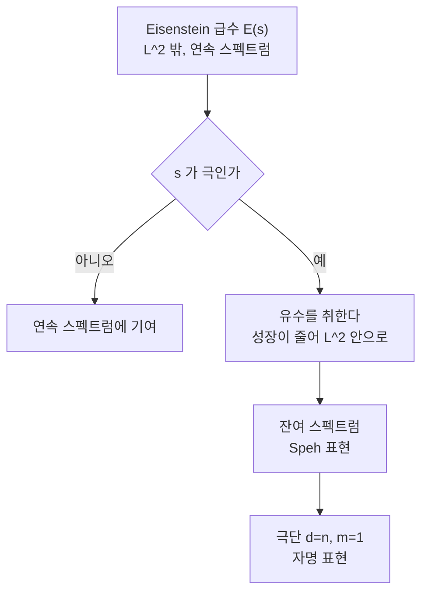

# Speh 표현과 잔여 스펙트럼

# 개요

자기동형 형식의 공간 $L^2\bigl(\mathrm{GL}_n(F)\backslash\mathrm{GL}_n(\mathbb A)^1\bigr)$ 는 세 조각으로 나뉜다.

$$
L^2=\underbrace{L^2_{\mathrm{cusp}}}_{\text{첨점}}\ \oplus\ \underbrace{L^2_{\mathrm{res}}}_{\text{잔여}}\ \oplus\ \underbrace{L^2_{\mathrm{cont}}}_{\text{연속}}
$$

앞의 둘을 합쳐 **이산 스펙트럼**이라 한다. 첨점 부분은 정의가 명확하지만 그 안에 무엇이 있는지는 여전히 열린 문제다. 반면 **잔여 부분은 완전히 분류되어 있다**. Mœglin 과 Waldspurger 가 1989 년에 끝냈고, 답이 놀랍도록 단순하다.

$$
L^2_{\mathrm{disc}}\bigl(\mathrm{GL}_n\bigr)=\bigoplus_{n=dm}\ \bigoplus_{\sigma\ \text{첨점}(\mathrm{GL}_m)}\mathrm{Speh}(\sigma,d)
$$

각 항이 정확히 한 번씩 나온다. $d=1$ 이 첨점 표현 자신이고, $d>1$ 인 것들이 잔여 스펙트럼을 가득 채우는 **Speh 표현**이다.

[Arthur 매개변수](arthur-parameters.md) 쪽에서 보면 이 분류는 $\psi=\sigma\boxtimes[d]$ 라는 한 줄이다. 둘째 $\mathrm{SL}_2(\mathbb C)$ 의 $d$ 차원 표현이 그대로 Speh 표현의 $d$ 다. 그 문서가 "둘째 $\mathrm{SL}_2$ 가 비템퍼드성을 담는다"고 말할 때, 담긴 내용물을 구체적으로 꺼내 보는 것이 이 문서다. $\mathrm{GL}_n$ 은 Arthur 의 분류가 완전히 증명된 유일한 경우이고, 고전군 쪽 그림의 원본 노릇을 한다.

# 직관

## 유수를 취하면 $L^2$ 에 들어온다

[Eisenstein 급수](eisenstein-series.md)는 연속 스펙트럼을 만드는 장치다. $E(z,s)$ 자체는 첨점에서 $y^s$ 처럼 자라 제곱적분가능하지 않다. 그런데 $s$ 를 복소평면에서 움직이다 **극**을 만나면 사정이 달라진다. 극에서 유수를 취한 함수는 성장이 한 등급 줄어 $L^2$ 안으로 들어온다.

$\mathrm{GL}_2$ 가 그 전부를 보여준다. $E(z,s)$ 는 $s=1$ 에 단순극을 갖고 유수는 상수함수 $3/\pi$ 다. 상수함수는 제곱적분가능하고, 그것이 생성하는 표현이 **자명 표현**이다. 자명 표현이 첨점이 아니라 잔여 스펙트럼에 산다는 사실이 여기서 나온다.



일반 $n$ 에서도 절차는 같다. 포물형 부분군 $P$ 와 그 Levi 위의 첨점 표현에서 Eisenstein 급수를 만들고, 다변수 $s$ 의 극을 따라 차례로 유수를 취한다. Langlands 가 이 절차를 세웠고, Mœglin–Waldspurger 가 $\mathrm{GL}_n$ 에서 **어느 극이 살아남는지**를 끝까지 계산했다.

## 왜 하필 등차수열인가

살아남는 극은 지수가 특별한 모양일 때만 생긴다. Levi 가 $\mathrm{GL}_m^{\,d}$ 이고 각 성분에 같은 첨점 표현 $\sigma$ 를 올린 뒤, 지수를 간격 1 의 등차수열

$$
\Bigl(\tfrac{d-1}2,\ \tfrac{d-3}2,\ \dots,\ -\tfrac{d-1}2\Bigr)
$$

로 잡은 자리에서만 유수가 0 이 아니다. 다른 조합은 전부 사라진다.

이 등차수열 조건은 국소 표현론에서 이미 익숙한 것이다. Bernstein–Zelevinsky 의 **분절(segment)** $[\rho,\rho\nu,\dots,\rho\nu^{d-1}]$ 이 바로 이 모양이고, 분절 하나가 본질적 제곱적분가능 표현 하나를 준다. 전역 잔여 스펙트럼은 그 국소 현상이 아델 위에서 그대로 재현된 것이다. **국소에서 표현을 뭉치는 규칙과 전역에서 극이 생기는 규칙이 같다**는 사실이 이 이론의 중심이다.

## 비템퍼드성의 크기

$\sigma$ 의 Satake 매개변수가 $\{\alpha_1,\dots,\alpha_m\}$ 이면 $\mathrm{Speh}(\sigma,d)$ 의 것은

$$
\bigl\{\alpha_i\,q^{j}\ :\ 1\le i\le m,\ j=\tfrac{d-1}2,\tfrac{d-3}2,\dots,-\tfrac{d-1}2\bigr\}
$$

이다. $\sigma$ 가 Ramanujan 경계 $|\alpha_i|=1$ 을 지키더라도 Speh 표현은 $q^{\pm(d-1)/2}$ 만큼 벌어진다. **벌어진 폭이 정확히 $d$ 에 의해 결정된다.** Ramanujan 추측이 첨점 표현에 한정된 주장인 이유가 여기 있다. 잔여 표현은 애초에 경계를 지킬 생각이 없고, 얼마나 어기는지가 분류에 의해 미리 정해져 있다.

# 정의

## 세 조각

$L^2_{\mathrm{cusp}}$ 는 모든 진 포물형 부분군의 멱단근기 위 적분이 0 인 함수들이 이루는 닫힌 부분공간이다. $L^2_{\mathrm{cont}}$ 는 Eisenstein 급수의 직접적분으로 얻어지는 부분이고, 나머지 $L^2_{\mathrm{res}}$ 가 **잔여 스펙트럼**이다. 이름 그대로 Eisenstein 급수의 유수(residue)들이 생성한다.

## Speh 표현

$\sigma$ 를 $\mathrm{GL}_m(\mathbb A)$ 의 유니터리 첨점 자기동형 표현, $\nu=|\det|$ 라 한다. $n=dm$ 에 대해 정규화 포물형 유도

$$
\sigma\nu^{\frac{d-1}2}\ \times\ \sigma\nu^{\frac{d-3}2}\ \times\ \cdots\ \times\ \sigma\nu^{-\frac{d-1}2}
$$

를 만들면 이 표현은 기약이 아니다. 유일한 Langlands 몫을 $\mathrm{Speh}(\sigma,d)$ 라 쓴다. 이것이 유니터리라는 것이 자명하지 않은 사실이고, Speh 가 $\mathrm{GL}_{2n}(\mathbb R)$ 에서 처음 발견해 이름이 붙었다.

$d=1$ 이면 $\mathrm{Speh}(\sigma,1)=\sigma$ 다. $m=1,\ d=n$ 이고 $\sigma$ 가 자명 지표면 $\mathrm{Speh}(\mathbf 1,n)$ 이 $\mathrm{GL}_n$ 의 자명 표현이다.

## Mœglin–Waldspurger 정리

$$
L^2_{\mathrm{disc}}\bigl(\mathrm{GL}_n(F)\backslash\mathrm{GL}_n(\mathbb A)^1\bigr)
=\bigoplus_{\substack{n=dm}}\ \bigoplus_{\sigma}\ \mathrm{Speh}(\sigma,d)
$$

합은 $n$ 의 약수 분해 $n=dm$ 과 $\mathrm{GL}_m$ 의 유니터리 첨점 표현 $\sigma$ 위를 달리고, **각 항의 중복도는 1** 이다. 특히 잔여 스펙트럼은 $d>1$ 인 항들의 합이다.

# 성질

## 중복도 1 과 강중복도 1

$\mathrm{GL}_n$ 의 이산 스펙트럼은 중복도가 언제나 1 이다. 이는 성분군이 자명하다는 사실의 반영으로, Arthur 의 중복도 공식이 $\mathrm{GL}_n$ 에서 자명해지는 것과 같은 이야기다. 고전군에서는 성분군이 살아 있어 중복도가 1 을 넘을 수 있다.

## 매개변수 세기

$n$ 이 주어졌을 때 잔여 스펙트럼에 기여하는 모양이 몇 가지인지는 약수를 세는 문제로 환원된다.

```python
def discrete_spectrum_shapes(n):
    """GL_n 이산 스펙트럼의 (d, m) 모양과 Ramanujan 경계 위반 폭"""
    out = []
    for d in range(1, n + 1):
        if n % d:
            continue
        m = n // d
        # Satake 매개변수가 q^{(d-1)/2} 까지 벌어진다
        out.append((d, m, (d - 1) / 2))
    return out

for n in (1, 2, 4, 6, 12):
    rows = discrete_spectrum_shapes(n)
    print(f"n={n:2d}: " + ", ".join(
        f"[GL_{m} 첨점]x[{d}]" + ("(첨점)" if d == 1 else f"(잔여, q^{e})")
        for d, m, e in rows))
```

```
n= 1: [GL_1 첨점]x[1](첨점)
n= 2: [GL_2 첨점]x[1](첨점), [GL_1 첨점]x[2](잔여, q^0.5)
n= 4: [GL_4 첨점]x[1](첨점), [GL_2 첨점]x[2](잔여, q^0.5), [GL_1 첨점]x[4](잔여, q^1.5)
n= 6: [GL_6 첨점]x[1](첨점), [GL_3 첨점]x[2](잔여, q^0.5), [GL_2 첨점]x[3](잔여, q^1.0), [GL_1 첨점]x[6](잔여, q^2.5)
n=12: [GL_12 첨점]x[1](첨점), [GL_6 첨점]x[2](잔여, q^0.5), [GL_4 첨점]x[3](잔여, q^1.0), [GL_3 첨점]x[4](잔여, q^1.5), [GL_2 첨점]x[6](잔여, q^2.5), [GL_1 첨점]x[12](잔여, q^5.5)
```

$n$ 이 소수면 잔여 스펙트럼이 자명 표현 계열 하나뿐이다. $n=12$ 처럼 약수가 많으면 잔여 쪽이 층층이 쌓이고, 가장 깊은 층이 자명 표현이다. **약수 격자의 모양이 곧 스펙트럼의 층 구조다.**

## $L$ 함수로 판정하기

$\pi$ 가 $\mathrm{GL}_n$ 의 이산 스펙트럼에 있을 때 첨점인지 잔여인지는 Rankin–Selberg $L$ 함수로 읽힌다. $L(s,\pi\times\tilde\pi)$ 는 $s=1$ 에 언제나 극을 갖지만, 그 차수가 $\pi$ 가 몇 겹의 Speh 인지를 드러낸다. 잔여 표현은 $\sigma\nu^j$ 들의 중복 때문에 $L$ 함수가 더 많은 극을 갖는다. 첨점성 판정이 해석적 성질의 문제로 바뀌는 지점이다.

## 유니터리 쌍대의 벽돌

Tadić 가 $\mathrm{GL}_n$ 의 유니터리 쌍대를 분류했는데, 그 답은 "Speh 표현과 그 보조적 계열 변형을 유도로 조립한 것이 전부"다. Speh 표현은 잔여 스펙트럼을 채우는 데 그치지 않고 **유니터리 표현론 전체의 기본 벽돌**이다. 국소와 전역에서 같은 대상이 같은 역할을 하는 드문 예다.

# 활용

## CAP 표현과 Saito–Kurokawa

$\mathrm{GL}_n$ 에서는 비템퍼드 표현이 전부 잔여 스펙트럼으로 밀려난다. 첨점이면 곧 템퍼드일 것이라는 Ramanujan 추측이 여기서는 분류와 모순되지 않는다.

고전군에서는 이 깔끔함이 깨진다. $\mathrm{GSp}_4$ 에는 **첨점이면서** Arthur 매개변수의 둘째 $\mathrm{SL}_2$ 가 자명하지 않은 표현이 있다. 포물형 부분군에서 올라온 Eisenstein 급수와 거의 모든 자리에서 Satake 매개변수가 같다는 뜻에서 **CAP 표현**(cuspidal associated to parabolic)이라 부른다. 대표가 **Saito–Kurokawa 올림**으로, 무게 $2k-2$ 의 타원 첨점형식에서 만든 무게 $k$ 의 Siegel 모듈러 형식이다.

$$
\psi_{\mathrm{SK}}=\bigl(\sigma\boxtimes[1]\bigr)\ \boxplus\ \bigl(\mathbf 1\boxtimes[2]\bigr)
$$

둘째 항의 $[2]$ 가 비템퍼드성을 넣는다. 그 결과 Saito–Kurokawa 올림의 Hecke 고윳값은 Ramanujan 경계를 명백히 위반하고, Siegel 형식에 대한 Ramanujan 추측의 반례가 된다. 이 반례들이 **정확히 어디에 있는지**를 Arthur 매개변수가 지정해 주기 때문에, 추측은 "CAP 이 아닌 첨점 표현은 템퍼드"로 수정되어 살아남는다.

## 부호를 맞추는 규칙

고전군의 이산 스펙트럼을 세는 작업은 "$\mathrm{GL}_N$ 의 자기쌍대 첨점 표현 $\sigma_i$ 와 정수 $d_i$ 의 짝을 부호 조건에 맞게 조립하기"가 된다. 조립의 부품이 $\sigma_i\boxtimes[d_i]$ 이고 곧 Speh 표현의 국소 매개변수다. $\mathrm{GL}_N$ 쪽 분류가 완전하기 때문에 고전군 쪽 분류가 **유한한 조합 문제**로 환원된다. Arthur 의 책 전체가 이 환원을 정당화하는 작업이라 해도 지나치지 않다.

## 주기와 올림

Speh 표현은 주기 적분 쪽에서도 특별하게 행동한다. $\mathrm{Speh}(\sigma,2)$ 의 $\mathrm{Sp}_{2m}$ 주기가 $\sigma$ 의 외곱 $L$ 함수의 극과 이어지는 식이다. [Gan–Gross–Prasad 추측](gan-gross-prasad.md)의 비템퍼드 판본이 이런 주기들을 다루고, Ikeda 올림이나 Miyawaki 올림처럼 한 군에서 다른 군으로 형식을 옮기는 구성이 매개변수 수준에서는 $\boxtimes[d]$ 를 붙였다 떼는 조작으로 보인다.

[^1]: 분류의 원논문은 C. Mœglin, J.-L. Waldspurger, *Le spectre résiduel de* $\mathrm{GL}(n)$ (Ann. Sci. ÉNS **22**, 1989), 605–674. Eisenstein 급수와 유수 절차의 전모는 같은 저자의 *Spectral Decomposition and Eisenstein Series* (1995). Speh 표현의 실수 자리 원본은 B. Speh, *Unitary representations of* $\mathrm{GL}(n,\mathbb R)$ *with nontrivial (g,K)-cohomology*, Invent. Math. **71** (1983). 유니터리 쌍대 분류는 M. Tadić, *Classification of unitary representations in irreducible representations of general linear group*, Ann. Sci. ÉNS **19** (1986). CAP 표현과 Saito–Kurokawa 는 I. Piatetski-Shapiro, *On the Saito-Kurokawa lifting*, Invent. Math. **71** (1983). 고전군 쪽은 J. Arthur, *The Endoscopic Classification of Representations* (2013). 본문의 매개변수 열거는 직접 한 것이다.

# 연관 문서

## 선수지식

- [Arthur 매개변수와 비템퍼드 표현](arthur-parameters.md)

## 더 알아보기

아직 연결한 문서가 없다.

#number_theory #group_theory #theorem
