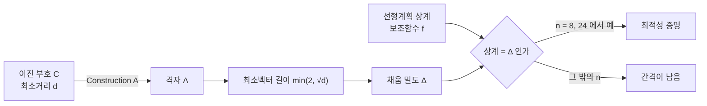

# 구 채우기와 E8, Leech 격자

# 개요

같은 크기의 공을 공간에 겹치지 않게 최대한 빽빽이 쌓으면 밀도가 얼마인가. 3 차원에서 과일 가게의 쌓기가 최적이라는 Kepler 의 추측은 1611 년에 제기되어 1998 년에야 Hales 의 컴퓨터 보조 증명으로 닫혔다. 400 년이 걸린 셈이다.

그런데 8 차원과 24 차원에서는 답이 훨씬 깔끔하다. [격자](lattices.md) `E_8` 과 Leech 격자가 각각 최적이며, 2016 년에 Viazovska 가 증명했다. 3 차원 증명이 수천 줄의 사례 분석인 데 비해, 8 차원 증명은 특정 성질을 가진 함수 하나를 명시적으로 구성하는 20 여 쪽짜리 논문이다. 차원이 높을수록 어려워질 것 같은데 정반대였다.

이유는 이 두 차원에 극도로 대칭적인 격자가 있기 때문이다. 그리고 그 격자들은 [오류정정부호](error-correcting-codes.md)에서 곧바로 만들어진다. 확장 Hamming 부호가 `E_8` 을, Golay 부호가 Leech 격자를 낳는다. Hamming 거리로 떨어진 부호어와 Euclid 거리로 떨어진 격자점이 같은 최적화 문제의 두 얼굴이라는 사실이 이 분야의 골격이다.

# 직관

## 부호에서 격자를 만든다

이진 부호 `C\subseteq\mathbb F_2^n` 이 주어지면 다음 집합이 격자가 된다.

$$
\Lambda_A(C)=\{x\in\mathbb Z^n:\ x\bmod2\in C\}
$$

이것이 Construction A 다. 격자점 사이의 거리가 두 가지 방식으로 생긴다. 같은 부호어에 대응하는 점들은 좌표 하나를 2 만큼 옮겨 얻어지므로 거리가 `2` 이고, 서로 다른 부호어 사이는 Hamming 거리 `d` 만큼의 좌표가 1 씩 달라 거리가 `\sqrt d` 다.

두 값을 맞추면(`d=4`) 격자가 균형을 이룬다. 부호의 최소거리가 클수록 격자의 최소거리도 커지므로, 좋은 부호가 곧 좋은 격자다.

## 왜 8 과 24 인가

밀도의 상계를 주는 선형계획법이 있다. 어떤 조건을 만족하는 보조함수 `f` 를 찾으면 그 함수로부터 상계가 나오는 방식이다.

대부분의 차원에서는 이 상계와 알려진 최선의 채움 사이에 지수적 간격이 남는다. 그런데 8 과 24 에서는 수치 실험 결과 상계가 `E_8` 과 Leech 의 밀도에 소수점 아래 여러 자리까지 일치했다. 곧 최적 함수가 존재한다면 상계가 정확히 달성된다는 뜻이었고, 그 함수를 실제로 구성하는 것이 남은 문제였다.



## Viazovska 의 해법

필요한 함수는 조건이 까다롭다. Fourier 변환이 자기 자신과 부호까지 얽혀 있고, 격자의 벡터 길이에서 정확히 0 이 되어야 한다.

Viazovska 는 그런 함수를 모듈러 형식으로 구성했다. 준모듈러 형식의 적분 변환이 요구되는 0 점 조건을 자동으로 만족한다는 발견이 핵심이며, 수치 실험이 시사한 값을 정확히 재현한다. 정수론의 도구가 기하 최적화 문제를 닫은 사례이고, 몇 주 뒤 공동 연구로 24 차원까지 같은 방식이 확장되었다.

# 정의

## 채움 밀도

격자 `L\subset\mathbb R^n` 의 최소거리가 `\lambda_1` 이면 반지름 `\lambda_1/2` 인 공들을 격자점마다 놓아도 겹치지 않는다. 밀도는

$$
\Delta(L)=\frac{V_n(\lambda_1/2)^n}{\det L},\qquad V_n=\frac{\pi^{n/2}}{\Gamma(n/2+1)}
$$

격자가 아닌 일반 채움도 있지만, 8 과 24 차원의 정리는 모든 채움(격자든 아니든)에 대한 최적성을 말한다.

## 접촉수

한 공에 동시에 닿을 수 있는 같은 크기 공의 최대 개수다. 격자에서는 최소벡터의 개수와 같다. `n=1,2,3,4,8,24` 에서만 정확한 값이 알려져 있고 각각 `2,6,12,24,240,196560` 이다.

## Hermite 상수

$$
\gamma_n=\max_L\frac{\lambda_1(L)^2}{(\det L)^{2/n}}
$$

격자 채움의 최적 밀도와 같은 정보를 담는다. `n\le8` 과 `n=24` 에서만 값이 알려져 있으며, `\gamma_8=2`(`E_8`), `\gamma_{24}=4`(Leech)다.

## `E_8` 격자

$$
E_8=\Big\{x\in\mathbb Z^8\cup(\mathbb Z+\tfrac12)^8:\ \sum_i x_i\in2\mathbb Z\Big\}
$$

`\det E_8=1` 이고 `\lambda_1=\sqrt2` 다. 모든 벡터의 노름 제곱이 짝수인 짝격자이고, 자기 쌍대이며(`E_8^*=E_8`), 이 두 성질을 동시에 갖는 가장 낮은 차원의 격자다. 짝 자기쌍대 격자는 차원이 8 의 배수일 때만 존재한다.

## Leech 격자

24 차원의 짝 자기쌍대 격자 중 노름 제곱이 2 인 벡터가 없는 유일한 것이다. `\lambda_1=2`, `\det=1`, 접촉수 `196560` 이다.

확장 이진 Golay 부호 `[24,12,8]` 에서 Construction B 로 만들어지며, 자기동형군이 Conway 군 `\mathrm{Co}_0` 로 위수가 약 `8\times10^{18}` 이다. 산재 단순군 26 개 중 12 개가 이 군과 관련되어 있어, 유한 단순군 분류에서도 중심적인 대상이다.

# 성질

## 최적성 정리

$$
\Delta_8=\frac{\pi^4}{384}\approx0.2537,\qquad
\Delta_{24}=\frac{\pi^{12}}{12!}\approx0.001930
$$

각각 `E_8` 과 Leech 격자가 달성하며, 이보다 밀도가 높은 채움은 격자가 아니어도 존재하지 않는다. 2016 년의 두 논문이 이를 증명했다.

2019 년에는 더 강한 결과가 나왔다. 두 격자가 밀도뿐 아니라 광범위한 상호작용 퍼텐셜에 대해 에너지를 최소화한다는 보편 최적성이다. 곧 이 배치가 "어떤 의미에서든 최선" 이다.

## 밀도와 접촉수 계산

```python
from itertools import product
from math import pi, factorial, gamma

# E8 = {x in Z^8 or (Z+1/2)^8 : sum(x) 가 짝수}.  노름^2 = 2 인 벡터를 센다.
def e8_min_vectors():
    v = 0
    for x in product([-1, 0, 1], repeat=8):                    # 정수 좌표
        if sum(x) % 2 == 0 and sum(a*a for a in x) == 2: v += 1
    v += sum(1 for s in product([-1, 1], repeat=8)             # 반정수 좌표 x = s/2
             if sum(s) % 4 == 0)                               # 좌표합이 짝수인 조건
    return v
print("E8 의 최소벡터(노름^2=2) 개수 =", e8_min_vectors())

# 확장 Hamming [8,4,4] 부호에서 Construction A 로 E8 을 만든다.
G = [0b11111111, 0b10101010, 0b11001100, 0b11110000]
code = set()
for c in product([0, 1], repeat=4):
    w = 0
    for bit, g in zip(c, G):
        if bit: w ^= g
    code.add(w)
A = [0] * 9
for w in code: A[bin(w).count("1")] += 1
print("무게 분포 A_i =", A, " 부호 크기 =", len(code))
print("Construction A 의 접촉수 = 2·8 + 16·A_4 =", 2*8 + 16*A[4])

# 밀도 Δ = V_n · (λ1/2)^n / det L
V = lambda n: pi ** (n/2) / gamma(n/2 + 1)
print(f"E8    : det=1, λ1=√2 → Δ = {V(8) * (2**0.5/2)**8:.6f}  (π^4/384 = {pi**4/384:.6f})")
print(f"Leech : det=1, λ1=2  → Δ = {V(24) * 1**24:.8f}  (π^12/12! = {pi**12/factorial(12):.8f})")

# E8 의 최소벡터(노름^2=2) 개수 = 240
# 무게 분포 A_i = [1, 0, 0, 0, 14, 0, 0, 0, 1]  부호 크기 = 16
# Construction A 의 접촉수 = 2·8 + 16·A_4 = 240
# E8    : det=1, λ1=√2 → Δ = 0.253670  (π^4/384 = 0.253670)
# Leech : det=1, λ1=2  → Δ = 0.00192957  (π^12/12! = 0.00192957)
```

두 방식이 같은 240 을 준다. 직접 정의에서는 `\pm1` 이 두 개인 정수 벡터 `\binom82\cdot4=112` 개와 반정수 벡터 128 개가 나오고, Construction A 에서는 한 좌표만 `\pm2` 인 것 16 개와 무게 4 인 부호어 14 개마다 부호 배정 `2^4` 가지로 224 개가 나온다. 격자를 어느 쪽에서 보든 같은 대상이라는 확인이다.

무게 분포 `[1,0,0,0,14,0,0,0,1]` 이 확장 Hamming 부호의 자기쌍대성을 보여 준다. 이 대칭이 `E_8` 의 자기쌍대성으로 그대로 옮겨 간다.

## 대부분의 차원은 모른다

`n=1,2,3,8,24` 외의 차원에서는 최적 밀도를 모른다. 상계와 하계 사이의 간격이 차원에 대해 지수적으로 벌어진다.

현재 알려진 하계는 대략 `\Delta\ge2^{-n}` 수준이고 상계는 `2^{-0.599n}` 이다. 놀라운 점은 하계를 주는 구성이 대부분 무작위라는 것이다. 명시적으로 좋은 격자를 만드는 것이 무작위로 뽑는 것보다 어렵다는 상황이 부호 이론과 똑같이 재현된다.

## 왜 이 두 차원만 특별한가

선형계획 상계가 타이트해지려면 격자의 최소벡터 구조가 매우 특별해야 한다. `E_8` 과 Leech 는 모듈러 형식과의 대응이 완벽하게 작동하는 유일한 경우로 보인다.

12 차원의 `K_{12}`, 16 차원의 `\Lambda_{16}` 같은 좋은 격자들이 있지만 상계와 간격이 남는다. 4 차원의 `D_4` 는 격자 중에서는 최적이나 일반 채움에 대한 최적성은 미해결이다.

# 활용

## 통신의 변조 설계

Gauss 잡음 채널에서 신호를 격자점으로 보내면 복호가 CVP 가 된다. 채널 부호화 정리가 말하는 용량에 접근하려면 고차원에서 밀도가 높은 격자가 필요하고, 격자 부호가 그 역할을 한다.

실무의 변조 방식도 저차원 격자다. QAM 이 `\mathbb Z^2`, 일부 방식이 `D_4` 나 `E_8` 을 쓴다. 같은 전력에서 오류율을 낮추는 이득이 격자의 밀도와 직결된다.

## 양자화와 압축

연속 신호를 유한 비트로 표현할 때 격자의 Voronoi 영역이 양자화 오차를 결정한다. 밀도가 높은 격자가 평균 제곱 오차를 줄이며, 이 문제에서 최적인 격자는 채움에서 최적인 격자와 반드시 같지는 않다(쌍대 쪽이 관련된다).

## 유한군과 모듈러 형식

Leech 격자의 자기동형군에서 Conway 군이 나오고, 그 몫과 부분군으로 여러 산재 단순군이 만들어진다. 괴물군과 모듈러 함수 `j` 의 계수를 잇는 몬스트러스 문샤인도 Leech 격자에서 만든 꼭짓점 작용소 대수를 거친다.

격자의 세타 급수 `\sum_{x\in L}q^{\|x\|^2/2}` 가 모듈러 형식이 되는 것이 이 모든 연결의 통로다. 짝 자기쌍대 격자에서 세타 급수가 무게 `n/2` 인 모듈러 형식이 되고, 그 공간이 저차원에서 매우 작기 때문에 격자의 구조가 강하게 제한된다. 8 차원에서 그 공간이 1 차원이라 `E_8` 이 유일하다는 결론이 즉시 나온다.

## 격자 암호와의 대비

[격자 암호](lattices.md)에서 쓰는 격자는 정반대 성격이다. 채움 문제에서는 최소벡터가 길고 구조가 대칭적인 격자를 찾지만, 암호에서는 무작위 격자에서 짧은 벡터를 찾기 어렵다는 성질에 의존한다.

`E_8` 이나 Leech 처럼 구조가 알려진 격자는 암호에 쓸 수 없다. 좋은 기저가 공개되어 있는 것과 마찬가지이기 때문이다. 같은 대상의 두 성질이 각각 다른 분야의 기반이 된다.

# 연관 문서

## 선수지식

- [격자와 최단벡터 문제](lattices.md)
- [오류정정부호](error-correcting-codes.md)

## 더 알아보기

- [Niemeier 격자와 24 차원 분류](niemeier-lattices.md)

#combinatorics #number_theory #information_theory
