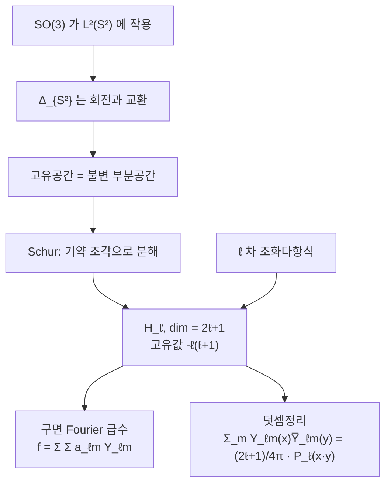

# 구면조화함수와 SO(3) 의 표현

# 개요

구면 위의 함수를 전개하는 기저는 회전군이 정한다. $L^2(S^2)$ 에 $\mathrm{SO}(3)$ 가 작용하고, 이 [Hilbert 공간](hilbert-spaces.md)이 [기약표현](group-representations.md)들의 직교합으로 쪼개진다.

$$
L^2(S^2)=\widehat{\bigoplus_{\ell\ge0}}\ \mathcal H_\ell,\qquad \dim\mathcal H_\ell=2\ell+1
$$

$\mathcal H_\ell$ 의 원소가 차수 $\ell$ 의 **구면조화함수**다. 각 $\mathcal H_\ell$ 은 $\mathrm{SO}(3)$ 의 기약표현이고 $\ell$ 마다 하나씩 나오므로, 이 분해가 곧 회전군의 표현론이다.

구면 Laplace 작용소는 회전과 교환하므로 그 고유공간이 표현의 불변 부분공간이 되고, Schur 보조정리가 기약 조각으로의 분해를 강제한다. 원에서 $\mathrm{SO}(2)$ 의 기약표현이 1 차원 문자 $e^{in\theta}$ 인 것과 같은 논리이고, 군이 비아벨이 되면서 조각의 차원이 $2\ell+1$ 로 커진다.

# 직관

## 조화다항식의 제한

$\mathbb R^3$ 의 $\ell$ 차 동차다항식 가운데 $\Delta p=0$ 인 것을 조화다항식이라 한다. 이것을 단위구면에 제한한 함수가 구면조화함수다.

차원 세기가 곧바로 $2\ell+1$ 을 준다. $\ell$ 차 동차다항식의 공간은 $\binom{\ell+2}2$ 차원이고, $\Delta$ 가 이를 $\ell-2$ 차 동차다항식의 공간으로 보낸다. 이 사상이 전사이므로

$$
\dim\mathcal H_\ell=\binom{\ell+2}2-\binom\ell2=(2\ell+1)
$$

이다.

동차다항식 전체를 구면에 제한하면 겹침이 생긴다. $x^2+y^2+z^2$ 이 구면에서 1 이므로 $r^2\cdot q$ 꼴은 $q$ 와 같은 함수가 되기 때문이다. 조화 조건이 정확히 이 잉여를 제거한다. $P_\ell=\mathcal H_\ell\oplus r^2P_{\ell-2}$ 라는 분해가 그 진술이다.

## 기약성

회전은 $\Delta$ 와 교환하고 차수를 보존하므로 $\mathrm{SO}(3)$ 가 $\mathcal H_\ell$ 에 작용하고, 이 표현은 기약이다.

기약성에서 분해가 유일해진다. $\Delta_{S^2}$ 의 $-\ell(\ell+1)$ 고유공간이 $\mathcal H_\ell$ 이고 고유값이 서로 달라 고유공간이 직교한다. Schur 보조정리에 의해 회전불변 작용소는 각 $\mathcal H_\ell$ 위에서 스칼라로 작용하므로, 구면 위의 합성곱과 필터링이 $\ell$ 마다 수 하나로 서술된다.

## 원과의 대응

| | 원 $S^1$ | 구면 $S^2$ |
|---|---|---|
| 대칭군 | 아벨군 $\mathrm{SO}(2)$ | 비아벨군 $\mathrm{SO}(3)$ |
| 기약표현 | 1 차원인 $e^{in\theta}$ | $2\ell+1$ 차원인 $\mathcal H_\ell$ |
| Laplace 고유값 | $-n^2$ | $-\ell(\ell+1)$ |
| 전개 | Fourier 급수 | 구면조화 전개 |

아벨군에서는 기약표현이 모두 1 차원이라 주파수마다 함수가 하나씩이다. 비아벨군에서는 같은 고유값을 공유하는 함수가 여럿 묶이고 그 묶음이 표현의 단위다.

# 정의

## 구면조화함수

$\mathcal H_\ell$ 의 정규직교기저를 구면좌표로 쓰면

$$
Y_{\ell m}(\theta,\varphi)=\sqrt{\frac{2\ell+1}{4\pi}\frac{(\ell-m)!}{(\ell+m)!}}\thickspace P_\ell^m(\cos\theta)\thinspace e^{im\varphi},
\qquad -\ell\le m\le\ell
$$

이다. $P_\ell^m$ 은 버금 Legendre 함수다. 지수 $m$ 은 $z$ 축 둘레 회전에 대한 $\mathrm{SO}(2)$ 의 문자를 고른 것이고, $2\ell+1$ 개의 $m$ 값이 $\mathcal H_\ell$ 의 차원을 채운다.

## 고유값 방정식

$$
\Delta_{S^2}Y_{\ell m}=-\ell(\ell+1)Y_{\ell m}
$$

$\mathbb R^3$ 에서 $\Delta=\partial_r^2+\frac2r\partial_r+\frac1{r^2}\Delta_{S^2}$ 이므로, $p=r^\ell Y$ 에 $\Delta p=0$ 을 대입하면 $\Delta_{S^2}Y=-\ell(\ell+1)Y$ 가 나온다. 조화다항식이라는 대수적 조건과 Laplace 고유함수라는 해석적 조건이 같은 것이다.

## 덧셈정리

$$
\sum_{m=-\ell}^\ell Y_{\ell m}(\hat x)\overline{Y_{\ell m}(\hat y)}=\frac{2\ell+1}{4\pi}P_\ell(\hat x\cdot\hat y)
$$

좌변은 $\mathcal H_\ell$ 로의 사영을 주는 핵이고 우변은 두 방향의 내적에만 의존한다. 사영이 회전불변 작용소이므로 그 핵은 불변량 $\hat x\cdot\hat y$ 의 함수이고, 그 함수가 $\ell$ 번째 Legendre 다항식이다.

# 성질

## 완비성과 근사

$\lbrace Y_{\ell m}\rbrace$ 이 $L^2(S^2)$ 의 정규직교기저다. 다항식이 구면 위에서 조밀하다는 Stone–Weierstrass 논증과 위의 분해를 합치면 나온다. 따라서

$$
f=\sum_{\ell\ge0}\sum_{m=-\ell}^\ell a_{\ell m}Y_{\ell m},\qquad
a_{\ell m}=\int_{S^2}f\thinspace\overline{Y_{\ell m}}\thinspace d\sigma
$$

이고 $\Vert f\Vert^2=\sum|a_{\ell m}|^2$ 다. $f$ 가 매끄러우면 계수가 빠르게 감소하므로 낮은 $\ell$ 만 남겨도 좋은 근사가 된다.

## 회전불변 작용소와 Funk–Hecke

회전과 교환하는 유계 작용소는 각 $\mathcal H_\ell$ 에서 스칼라 $\lambda_\ell$ 배다. 특히 핵이 $k(\hat x\cdot\hat y)$ 꼴인 적분작용소에서

$$
\int_{S^2}k(\hat x\cdot\hat y)Y_{\ell m}(\hat y)\thinspace d\sigma(\hat y)=\lambda_\ell\thinspace Y_{\ell m}(\hat x),
\qquad
\lambda_\ell=2\pi\int_{-1}^1k(t)P_\ell(t)\thinspace dt
$$

가 성립한다. Funk–Hecke 정리다. 구면 위의 합성곱이 $\ell$ 마다 하나의 곱셈으로 대각화된다는 뜻이며, 원에서 합성곱이 Fourier 계수의 곱이 되는 것의 구면판이다.

## $\mathrm{SU}(2)$ 와 반정수

$\mathrm{SU}(2)\to\mathrm{SO}(3)$ 는 핵이 $\lbrace\pm I\rbrace$ 인 이중덮개다. $\mathrm{SU}(2)$ 의 기약표현은 각 차원마다 하나씩, 곧 최고무게 $j\in\frac12\mathbb Z$ 마다 $2j+1$ 차원짜리가 있다.

이 가운데 $-I$ 가 자명하게 작용하는 것, 곧 $j$ 가 정수인 것만 $\mathrm{SO}(3)$ 의 표현으로 내려온다. 그것이 $\mathcal H_\ell$ 들이다. $j$ 가 반정수인 표현은 $\mathrm{SO}(3)$ 의 표현이 아니라 사영표현이고, 물리에서 스핀 $\frac12$ 입자가 여기에 해당한다. 구면조화함수에 반정수 차수가 없는 것과 전자가 스피너인 것은 모두 $\pi_1(\mathrm{SO}(3))=\mathbb Z/2$ 에서 나온다.

## 고차원

$S^{n-1}$ 에서도 같은 구조가 성립한다. $\mathbb R^n$ 의 $\ell$ 차 조화다항식이 $\mathrm{SO}(n)$ 의 기약표현을 이루고 차원은

$$
\binom{n+\ell-1}{\ell}-\binom{n+\ell-3}{\ell-2}
$$

이다. Legendre 다항식 자리에는 Gegenbauer 다항식이 들어간다. $n=3$ 에서 위의 공식이 $2\ell+1$ 로 줄어든다.

# 활용

## 쓰이는 자리

- **양자역학.** 수소 원자의 파동함수가 지름 부분과 각 부분으로 분리되고, 각 부분이 정확히 $Y_{\ell m}$ 이다. 궤도 각운동량의 양자수 $\ell,m$ 이 표현의 표지이며, $2\ell+1$ 겹 축퇴가 기약표현의 차원이다.
- **전자기학과 중력.** 다중극 전개가 구면조화 전개다. 지구 중력장과 자기장을 $\ell$ 별 계수로 기술하는 것이 표준이며, 위성 관측이 이 계수들을 측정한다.
- **우주론.** 우주 마이크로파 배경의 온도 요동을 $\ell$ 별 검정력 $C_\ell$ 로 요약한다. 회전불변성에서 $m$ 에 대한 정보가 통계적으로 무의미해지고 $\ell$ 마다 수 하나만 남는다.
- **컴퓨터 그래픽스.** 환경 조명을 낮은 차수 계수 몇 개로 압축하는 구면조화 조명이 실시간 렌더링의 표준 기법이다. 매끄러운 조명에서 계수가 빠르게 감소한다는 성질을 쓴다.
- **기하 딥러닝.** 구면 위의 데이터를 다루는 신경망에서 회전등변 층을 만들 때, $\ell$ 별 기약 성분과 Clebsch–Gordan 계수를 직접 쓴다. 분자 구조 예측 모형이 대표적인 사례다.

# 연관 문서

## 선수지식

- [군의 표현과 지표](group-representations.md)
- [Hilbert 공간](hilbert-spaces.md)

## 더 알아보기

아직 연결한 문서가 없다.

#group_theory #analysis #functional_analysis
