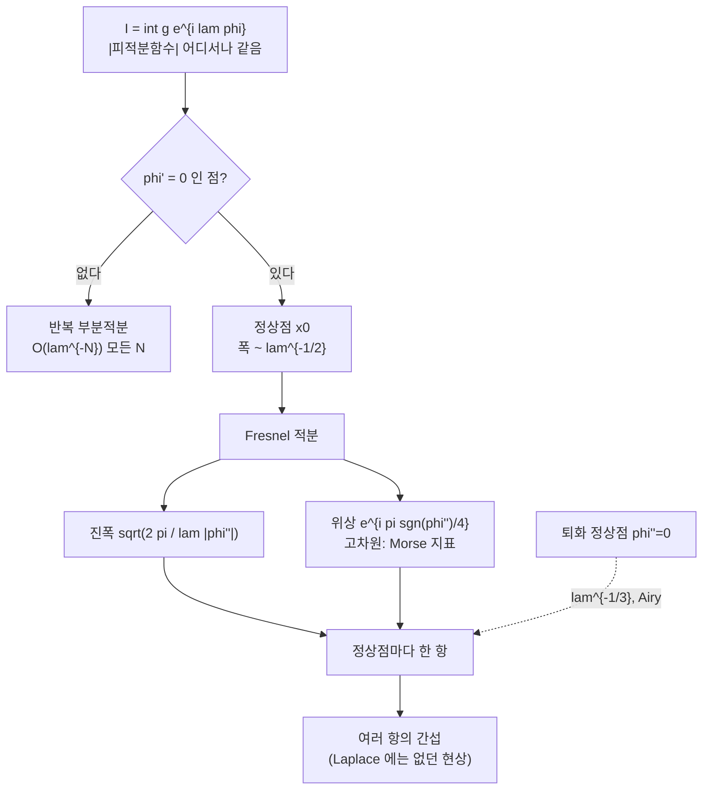

# 정상위상법과 안장점 근사

# 개요

[Laplace 방법](laplace-method.md)은 지수가 실수인 적분 $\int g\,e^{\lambda\varphi}$ 를 다루었다. 그때 크기를 정한 것은 **감쇠**였다. 최대점을 벗어나면 피적분함수의 절댓값이 지수적으로 작아지므로, 적분은 최대점 하나만 본다.

지수가 순허수이면 사정이 완전히 달라진다.

$$
I(\lambda)=\int g(x)\,e^{i\lambda\varphi(x)}\,dx,\qquad \varphi\ \text{실함수}
$$

여기서는 피적분함수의 절댓값이 어디서나 $|g|$ 로 같다. 어느 점도 다른 점보다 크지 않으므로 감쇠가 크기를 정할 수 없다. 그런데도 $I(\lambda)$ 는 $\lambda\to\infty$ 에서 작아진다. 이유는 다른 데 있다. **이웃한 점들의 위상이 서로 달라 상쇄되기 때문**이다.

그러면 상쇄되지 않는 곳이 어디인가. 위상이 국소적으로 멈추는 곳, 곧 $\varphi'(x_0)=0$ 인 **정상점**이다. 그 주위에서만 위상이 느리게 변해 기여가 살아남는다. 이것이 정상위상법이고, Laplace 방법과 형태는 같되 세 가지가 새로 생긴다.

- 정상점이 없으면 적분은 **모든 다항식 차수보다 빨리** 작아진다. Laplace 에서는 이런 일이 없다.
- 각 정상점의 기여에 **위상 인자** $e^{i\pi\operatorname{sgn}\varphi''(x_0)/4}$ 가 붙는다. Gauss 적분의 제곱근을 복소평면에서 어느 가지로 택하느냐가 남기는 흔적이고, 고차원에서 이것이 Hessian 의 부호수, 곧 Morse 지표가 된다.
- 정상점이 여럿이면 전부 **같은 크기로** 기여해 서로 **간섭**한다. Laplace 에서는 최대점 하나가 나머지를 지수적으로 눌렀지만, 여기서는 모든 정상점이 대등하게 남아 위상차에 따라 보강되고 상쇄된다.

세 번째가 물리적으로 가장 중요하다. 파동이 간섭하는 이유, WKB 근사에서 여러 고전 궤도가 더해지는 이유, 그리고 [Witten 점근 추측](witten-asymptotics.md)에서 여러 평탄 접속이 모두 답에 나타나는 이유가 전부 이 하나다.

# 직관

## 상쇄가 크기를 정한다

정상점이 없는 경우부터 보자. $\varphi'\ne0$ 이면 $e^{i\lambda\varphi}$ 를 미분의 형태로 쓸 수 있다.

$$
e^{i\lambda\varphi}=\frac1{i\lambda\varphi'}\frac{d}{dx}e^{i\lambda\varphi}
$$

부분적분하면 $1/\lambda$ 이 하나 떨어진다. $g$ 와 $\varphi$ 가 매끄럽고 $g$ 가 구간 끝에서 사라지면 경계항이 없으므로, **이 과정을 무한히 반복할 수 있다.** 그래서

$$
I(\lambda)=O(\lambda^{-N})\qquad\text{모든 }N
$$

이 된다. 크기를 눌러 준 것은 감쇠가 아니라 반복되는 상쇄다. 이것이 Riemann–Lebesgue 보조정리의 정량적 판본이고, $g$ 가 해석적이면 상쇄가 더 세서 지수적으로 작아진다.

정상점에서는 이 논법이 깨진다. $\varphi'(x_0)=0$ 이라 $1/\varphi'$ 이 폭발하기 때문이다. **부분적분이 실패하는 자리가 답이 나오는 자리다.**

## 왜 폭이 $\lambda^{-1/2}$ 인가

정상점 주위에서 $\varphi(x)\approx\varphi(x_0)+\tfrac12\varphi''(x_0)(x-x_0)^2$ 이다. 위상이 $1$ 라디안 넘게 변하기 전까지가 상쇄 없이 더해지는 구간이므로

$$
\lambda|\varphi''|(x-x_0)^2\lesssim1
\quad\Longrightarrow\quad
|x-x_0|\lesssim\frac1{\sqrt{\lambda|\varphi''|}}
$$

폭이 $\lambda^{-1/2}$ 이고 그 안에서 피적분함수의 크기가 $|g(x_0)|$ 이므로 기여가 $\lambda^{-1/2}$ 이다. Laplace 방법과 **완전히 같은 계산**이다. 다른 점은 그 계산을 정당화하는 이유뿐이다. 저쪽은 바깥이 지수적으로 작아서, 이쪽은 바깥이 상쇄되어서.

## 위상 인자는 어디서 오는가

남는 적분은 Fresnel 적분이다.

$$
\int_{-\infty}^{\infty}e^{i\lambda\varphi''(x-x_0)^2/2}dx
=\sqrt{\frac{2\pi}{\lambda|\varphi''|}}\;e^{i\pi\operatorname{sgn}(\varphi'')/4}
$$

Laplace 쪽에서는 $\sqrt{2\pi/(\lambda|\varphi''|)}$ 로 끝났는데 여기서는 $e^{\pm i\pi/4}$ 가 더 붙는다. 이것은 $\int e^{-ax^2}dx=\sqrt{\pi/a}$ 를 $a=-i\lambda\varphi''/2$ 라는 순허수까지 해석적으로 연장할 때, 제곱근이 어느 가지로 가느냐에서 나온다. $a$ 가 양의 실수에서 출발해 허축으로 회전하면 $\sqrt{1/a}$ 의 편각이 $\mp\pi/4$ 만큼 돈다.

부호가 중요한 이유는 정상점이 여럿일 때다. 한 점에서 $\varphi''>0$ 이고 다른 점에서 $\varphi''<0$ 이면 두 기여의 위상이 $\pi/2$ 만큼 어긋난다. 전체 답의 진동 패턴이 그 차이로 정해진다.

# 정의

## 1 차원

> **정리 (정상위상법).** $g\in C_c^\infty(\mathbb R)$ 이고 $\varphi$ 가 $\operatorname{supp}g$ 위에서 매끄럽다고 하자.
>
> 1. $\varphi'\ne0$ 이면 모든 $N$ 에 대해 $I(\lambda)=O(\lambda^{-N})$ 이다.
> 2. $\varphi$ 가 유일한 정상점 $x_0$ 를 갖고 $\varphi''(x_0)\ne0$ 이면
> $$
> I(\lambda)=g(x_0)\,e^{i\lambda\varphi(x_0)}\sqrt{\frac{2\pi}{\lambda|\varphi''(x_0)|}}\;e^{i\pi\operatorname{sgn}\varphi''(x_0)/4}\Big(1+O(\lambda^{-1})\Big)
> $$
>
> 정상점이 여럿이면 각각의 기여를 더한다.

$\varphi''(x_0)\ne0$ 이라는 조건이 **비퇴화**다. Morse 이론의 비퇴화 임계점과 같은 말이고, 이 조건이 있어야 2 차 항만으로 근사가 끝난다.

## 고차원

$x\in\mathbb R^n$ 이고 $\varphi$ 의 임계점 $x_0$ 에서 Hessian $H=D^2\varphi(x_0)$ 가 가역이면

$$
\int_{\mathbb R^n}g\,e^{i\lambda\varphi}dx
=g(x_0)e^{i\lambda\varphi(x_0)}\Big(\frac{2\pi}{\lambda}\Big)^{n/2}\frac{e^{i\pi\,\sigma(H)/4}}{\sqrt{|\det H|}}\Big(1+O(\lambda^{-1})\Big)
$$

$\sigma(H)$ 는 $H$ 의 부호수(양의 고윳값 개수 빼기 음의 고윳값 개수)다. 1 차원의 $\operatorname{sgn}\varphi''$ 가 그대로 올라온 것이고, 음의 고윳값 개수가 Morse 지표이므로 **위상이 임계점의 Morse 지표를 읽는다.** 진폭에 나타나는 $|\det H|^{-1/2}$ 는 임계점이 얼마나 "평평한지" 를 재는 양이고, 무한차원으로 가면 이 행렬식이 정규화되어 비틀림 같은 위상적 불변량이 된다.

## 퇴화하면 달라진다

$\varphi''(x_0)=0$ 이면 폭이 $\lambda^{-1/2}$ 가 아니다. $\varphi-\varphi(x_0)\sim c(x-x_0)^k$ 이면 폭이 $\lambda^{-1/k}$ 이고 기여가 $\lambda^{-1/k}$ 이다. 가장 흔한 경우인 $k=3$ 에서 나오는 것이 [Airy 함수](airy-functions.md)다.

$$
\mathrm{Ai}(t)=\frac1{2\pi}\int_{-\infty}^{\infty}e^{i(s^3/3+ts)}ds
$$

$t$ 가 음수이면 정상점이 둘이라 진동하고, 양수이면 실수 정상점이 없어 지수적으로 작아진다. 두 영역의 경계 $t=0$ 에서 두 정상점이 충돌해 퇴화한다. 무지개의 밝은 띠, 파동의 화선(caustic), WKB 근사가 전향점에서 깨지는 현상이 전부 이 하나의 그림이다.

# 성질

## Laplace 방법과의 대조

| | Laplace $\int g e^{\lambda\varphi}$ | 정상위상 $\int g e^{i\lambda\varphi}$ |
|---|---|---|
| 크기를 정하는 것 | 감쇠 | 상쇄 |
| 지배하는 점 | 최대점 | 모든 정상점 |
| 임계점 없을 때 | 경계항이 지배 | $O(\lambda^{-N})$ 모든 $N$ |
| 여러 임계점 | 최대인 것 하나만 살아남음 | 전부 남아 간섭 |
| 추가 위상 | 없음 | $e^{i\pi\sigma/4}$ (Morse 지표) |
| 점근급수의 성격 | 발산, Borel 합 가능 | 발산, 복소 안장점 기여 |

최대급강하법은 이 둘 사이에 있다. 복소 안장점을 지나는 경로를 잡으면 진동이 사라져 Laplace 형태가 되지만, 어느 안장점을 지나는 경로로 변형할 수 있는지가 매개변수에 따라 바뀐다. 그 전환이 [Stokes 현상](stokes-phenomenon.md)이다. 정상위상법에서 정상점이 충돌하는 자리와 Stokes 선이 나타나는 자리는 같은 현상을 실축과 복소평면에서 각각 본 것이다.

## 간섭이 답의 형태를 정한다

정상점이 $x_1,x_2$ 두 개이고 $\varphi''(x_1)>0>\varphi''(x_2)$ 라 하자. 기여를 더하면

$$
I(\lambda)\approx\sqrt{\frac{2\pi}{\lambda}}\Big[\frac{g(x_1)}{\sqrt{|\varphi''(x_1)|}}e^{i\lambda\varphi(x_1)+i\pi/4}
+\frac{g(x_2)}{\sqrt{|\varphi''(x_2)|}}e^{i\lambda\varphi(x_2)-i\pi/4}\Big]
$$

두 항의 위상차가 $\lambda(\varphi(x_1)-\varphi(x_2))+\pi/2$ 이므로, $\lambda$ 가 커짐에 따라 $|I(\lambda)|$ 가 $\lambda^{-1/2}$ 로 줄면서 **주기적으로 진동**한다. 어떤 $\lambda$ 에서는 거의 0 이 된다.

이 구조가 그대로 반복되는 곳이 양자 불변량의 점근이다. Chern–Simons 경로적분에서 임계점은 평탄 접속이고, 임계값 $\varphi(x_\alpha)$ 는 Chern–Simons 불변량, $|\det H|^{-1/2}$ 는 Reidemeister 비틀림, $\sigma(H)$ 는 스펙트럼 흐름이다. 위 식의 각 기호가 무한차원에서 무엇이 되는지를 모두 안다면 Witten 점근 추측의 진술을 그대로 얻는다. 양자 불변량이 어떤 $k$ 에서 0 이 되어 아무 정보도 주지 않는 현상도 여기 두 항의 상쇄와 같은 것이다.

# 활용

## 어디에 쓰는가

- **파동의 전파.** 분산관계 $\omega(k)$ 를 가진 파동의 해는 $\int A(k)e^{i(kx-\omega(k)t)}dk$ 이고, 정상점 조건 $x/t=\omega'(k)$ 가 **군속도**의 정의다. 관측자가 보는 파수는 자기 속도에 맞는 군속도를 가진 성분이라는 진술이 정상위상법 한 줄이다.
- **반고전 극한.** $\hslash\to0$ 에서 Feynman 경로적분의 정상점이 고전 궤도이고, Morse 지표가 Maslov 지표가 되어 WKB 근사의 위상을 준다. 전향점에서 Airy 함수가 나오는 것이 퇴화 정상점의 표준형이다.
- **양자 불변량의 점근.** 위 표의 각 항목을 무한차원으로 옮긴 것이 Witten 점근 추측이다. 유한차원에서 이 문서가 정당화한 계산이 그쪽에서는 아직 정의조차 되지 않았고, 그래서 그 추측은 다른 방법으로 증명되어야 한다.

# 연관 문서

## 선수지식

- [Laplace 방법과 안장점](laplace-method.md)

## 더 알아보기

- [Witten 점근 추측과 Ohtsuki 급수](witten-asymptotics.md)
- [Airy 함수와 회전점](airy-functions.md)

#analysis #complex_analysis #computation
