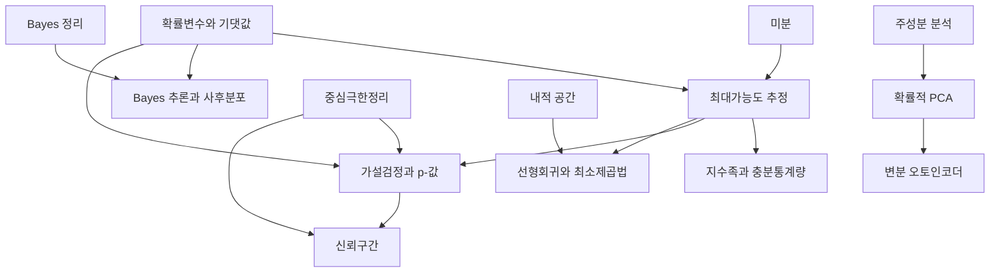

# 통계 개관

# 개요

통계는 관측된 표본에서 그 표본을 만든 분포에 관한 진술을 끌어낸다. 확률론이 분포에서 표본으로 가는 방향을 다룬다면 통계는 그 반대 방향이다. 물음은 세 가지다. 모수를 어떤 값으로 추정하는가, 그 추정이 얼마나 확실한가, 그리고 데이터가 어떤 가설을 기각할 만큼 강한가.

통계학의 갈래는 세 줄기다. 가능도를 최대로 하는 점추정과 사전분포를 얹는 Bayes 추론, 표본분포를 써서 불확실성을 재는 검정과 구간, 그리고 설명변수와 잠재변수로 데이터를 설명하는 모형이다. 확률적 기반은 [확률론 개관](probability-overview.md)에, 우도비의 측도론적 정의는 [측도변환과 우도비](change-of-measure.md)에 있다.

시작은 [최대가능도 추정](maximum-likelihood.md)이다. 거기서 [지수족과 충분통계량](exponential-families.md)으로 가면 추정량이 닫힌 꼴로 나오는 구조가 보이고, [가설검정과 p-값](hypothesis-testing.md)에서 [신뢰구간](confidence-intervals.md)으로 이어지며, [Bayes 추론](bayesian-inference.md)이 사전분포를 얹는 다른 길을 연다.

# 지도

# 갈래

## 추정

- [최대가능도 추정](maximum-likelihood.md): 가능도함수, 점근 정규성, Fisher 정보량과 Cramér–Rao 하한
- [지수족과 충분통계량](exponential-families.md): 자연모수와 로그분배함수, 충분통계량, 켤레 사전분포
- [Bayes 추론과 사후분포](bayesian-inference.md): 사전분포와 사후분포, 사후예측분포, 최대사후추정

## 검정과 구간

- [가설검정과 p-값](hypothesis-testing.md): 귀무가설과 검정통계량, 제1종·제2종 오류, Neyman–Pearson 보조정리
- [신뢰구간](confidence-intervals.md): 피벗량과 구간 구성, 피복확률, 검정과의 쌍대성

## 모형

- [선형회귀와 최소제곱법](linear-regression.md): 정규방정식과 사영, Gauss–Markov 정리, 정칙화
- [확률적 PCA](probabilistic-pca.md)(principal component analysis): 저차원 잠재변수를 둔 Gauss 모형, 주성분과의 관계

# 연관 문서

## 선수지식

- [집합](sets.md)

## 더 알아보기

- [최대가능도 추정](maximum-likelihood.md)
- [Bayes 추론과 사후분포](bayesian-inference.md)
- [확률적 PCA](probabilistic-pca.md)

#statistics #probability #machine_learning #overview
