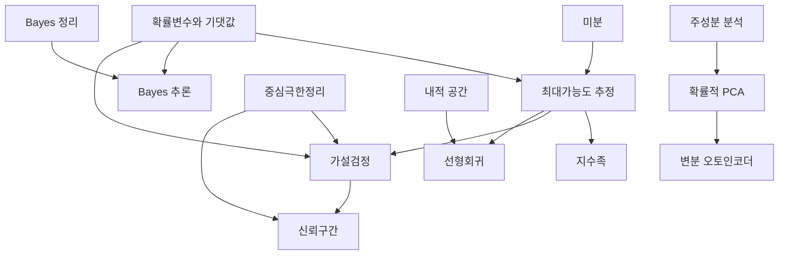

# 통계 개관

# 개요

통계는 관측된 표본에서 그 표본을 만든 분포에 관한 진술을 끌어낸다. 확률론이 분포에서 표본으로 가는 방향을 다룬다면 통계는 그 반대 방향이다. 물음은 세 가지다. 모수를 어떤 값으로 추정하는가, 그 추정이 얼마나 확실한가, 그리고 데이터가 어떤 가설을 기각할 만큼 강한가.

통계학의 갈래는 세 줄기다. 가능도를 최대로 하는 점추정과 사전분포를 얹는 Bayes 추론, 표본분포를 써서 불확실성을 재는 검정과 구간, 그리고 설명변수와 잠재변수로 데이터를 설명하는 모형이다. 확률적 기반은 [확률론 개관](probability-overview.md)에, 우도비의 측도론적 정의는 [측도변환](change-of-measure.md)에 있다.

시작은 [최대가능도 추정](maximum-likelihood.md)이다. 거기서 [지수족](exponential-families.md)으로 가면 추정량이 닫힌 꼴로 나오는 구조가 보이고, [가설검정](hypothesis-testing.md)에서 [신뢰구간](confidence-intervals.md)으로 이어지며, [Bayes 추론](bayesian-inference.md)이 사전분포를 얹는 다른 길을 연다.

# 지도

```mermaid
graph TD
  DV["미분"] --> ML["최대가능도 추정"]
  RV["확률변수와 기댓값"] --> ML
  ML --> EF["지수족"]
  BY["Bayes 정리"] --> BI["Bayes 추론"]
  RV --> BI
  ML --> HT["가설검정"]
  RV --> HT
  CLT["중심극한정리"] --> HT
  HT --> CI["신뢰구간"]
  CLT --> CI
  IP["내적 공간"] --> LR["선형회귀"]
  ML --> LR
  PCA["주성분 분석"] --> PPCA["확률적 PCA"]
  PPCA --> VAE["변분 오토인코더"]
```

# 갈래

## 추정

- [최대가능도 추정](maximum-likelihood.md): 가능도함수, 점근 정규성, Fisher 정보량과 Cramér–Rao 하한
- [기댓값 최대화 알고리즘](em-algorithm.md): 은닉변수 모형의 최대가능도 추정, 증거 하한과 두 단계, 가능도의 단조 증가
- [Fisher 정보](fisher-information.md): 점수함수의 공분산, 정보 등식, Cramér–Rao 하한, Fisher–Rao 계량
- [지수족](exponential-families.md): 자연모수와 로그분배함수, 충분통계량, 켤레 사전분포
- [Bayes 추론](bayesian-inference.md): 사전분포와 사후분포, 사후예측분포, 최대사후추정

## 검정과 구간

- [가설검정](hypothesis-testing.md): 귀무가설과 검정통계량, 제1종·제2종 오류, Neyman–Pearson 보조정리
- [신뢰구간](confidence-intervals.md): 피벗량과 구간 구성, 피복확률, 검정과의 쌍대성
- [순차확률비 검정](sequential-probability-ratio-test.md): 누적 우도비와 두 문턱, Wald 의 오류율 경계, 기대 표본 수
- [군축차 설계](group-sequential-design.md): 중간분석 시점마다의 경계, 알파 소비 함수와 1 종 오류율의 통제

## 모형

- [선형회귀](linear-regression.md): 정규방정식과 사영, Gauss–Markov 정리, 정칙화
- [일반화선형모형](generalized-linear-models.md): 반응분포를 지수족으로 둔 회귀, 정준연결함수와 반복 가중최소제곱
- [확률적 PCA](probabilistic-pca.md)(principal component analysis): 저차원 잠재변수를 둔 Gauss 모형, 주성분과의 관계
- [Kalman 필터](kalman-filter.md): 선형 Gauss 상태공간 모형의 순차 추정, Kalman 이득과 정보 형식
- [은닉 Markov 모형](hidden-markov-model.md): 유한 상태 뒤에 숨은 열의 추정, 전향 후향 재귀와 Viterbi 복호
- [편향-분산 분해](bias-variance-decomposition.md): 평균제곱오차를 편향의 제곱과 분산으로 가르는 항등식, 축소 추정과 모형 선택의 근거
- [정칙화](regularization.md): 잔차제곱합에 계수의 크기를 재는 벌점을 더하는 추정, 능형회귀와 라소의 축소와 희소성
- [교차검증](cross-validation.md): 자료를 나누어 적합에 쓰지 않은 조각으로 오차를 재는 절차, 선형 적합에서의 닫힌 꼴

# 연관 문서

## 선수지식

- [집합](sets.md)

## 더 알아보기

- [최대가능도 추정](maximum-likelihood.md)
- [Bayes 추론](bayesian-inference.md)
- [확률적 PCA](probabilistic-pca.md)

#statistics #probability #machine_learning #overview
