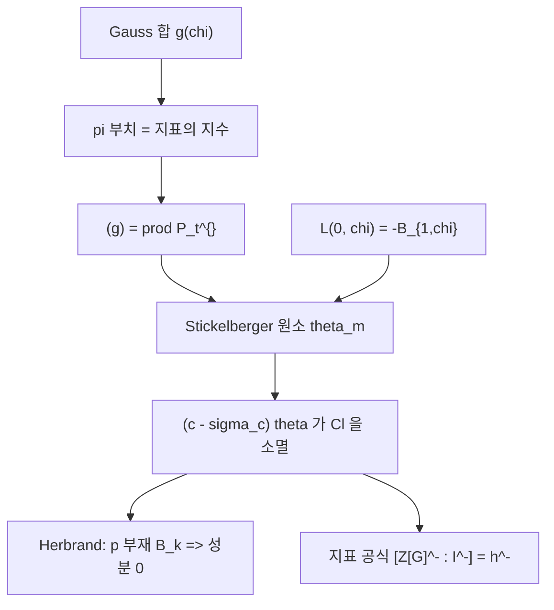

# Stickelberger 원소와 Gauss 합

# 개요

[Gauss 합](gauss-sums.md)의 절댓값은 `\sqrt p` 로 완전히 정해져 있다. 그런데 크기를 안다고 해서 그 수가 순환체 안의 **어디에** 놓여 있는지를 아는 것은 아니다. `g(\chi)` 가 생성하는 아이디얼의 소인수분해를 물으면 대답은 지표 `\chi` 에 따라 달라지고, 그 대답이 Stickelberger 의 정리다.

핵심은 다음 한 줄이다. `\pi=1-\zeta_p` 로 두고 `\omega` 를 Teichmüller 지표라 하면

$$
\mathrm{ord}_\pi\,g(\omega^{-k})=k,\qquad 0\le k\le p-2
$$

이다. 곧 Gauss 합의 부치가 지표의 "지수" 를 그대로 읽어 준다. Galois 켤레를 모두 모으면 이 데이터가 군환 `\mathbb Q[G]` 안의 한 원소로 묶인다.

$$
\theta_m=\sum_{a\in(\mathbb Z/m)^{\times}}\Big\{\frac{a}{m}\Big\}\,\sigma_a^{-1}
$$

이것이 **Stickelberger 원소**다. 계수는 유리수지만 `(c-\sigma_c)\theta_m` 꼴은 정수계수가 되고, 그렇게 얻은 정수계수 원소들이 `\mathbb Q(\mu_m)` 의 **이데알류군을 소멸시킨다**. 이것이 Stickelberger 의 정리다.

왜 중요한가. `\theta_m` 의 지표 성분이 `L(0,\chi)` 와 같기 때문이다. 그러므로 이 정리는

> `L` 함수의 값을 계수로 삼은 군환 원소가 이데알류군을 죽인다

는 진술이고, "해석적 양이 산술적 군을 제어한다" 는 도식의 가장 오래되고 가장 명시적인 사례다. [Iwasawa 주추측](iwasawa-main-conjecture.md)에서 Herbrand 방향이 쉬운 이유가 바로 이 정리이며, 반대 방향이 어려운 이유는 소멸자가 크기를 말해 주지 않기 때문이다.

# 직관

## 크기는 알지만 위치는 모른다

`g(\chi)=\sum_{a}\chi(a)\zeta_p^{a}` 는 `\mathbb Q(\mu_{p-1},\mu_p)` 의 원소이고 `|g(\chi)|=\sqrt p` 다. 이 절댓값은 무한 자리의 정보일 뿐이다. 유한 자리에서는 `g(\chi)\overline{g(\chi)}=\pm p` 이므로 `(g(\chi))` 가 `p` 위의 소 아이디얼들만으로 이루어진다는 것까지는 알 수 있지만, **각 소 아이디얼이 몇 번 나오는지**는 절댓값이 말해 주지 않는다.

`p` 는 `\mathbb Q(\mu_p)` 에서 완전히 분기하므로 `(p)=(\pi)^{p-1}` 이고, 물음은 "`g(\chi)` 가 `\pi` 로 몇 번 나뉘는가" 가 된다. 답이 `\chi=\omega^{-k}` 의 `k` 라는 것이 놀라운 점이다. 해석적으로 정의된 합이 지표의 이산적 지수를 부치로 드러낸다.

## 왜 지수가 그대로 나오는가

`\mathbb Z_p[\mu_p]` 에서 `\zeta_p=1+\pi` 이므로

$$
g(\omega^{-k})=\sum_{a=1}^{p-1}\omega^{-k}(a)(1+\pi)^{a}
=\sum_{j\ge0}\binom{\cdot}{j}\pi^{j}\sum_{a}\omega^{-k}(a)a^{\,j}\big/j!\ \text{꼴}
$$

로 전개된다. 안쪽 합 `\sum_a\omega^{-k}(a)a^{j}` 는 `j\equiv k` 일 때만 `p` 를 법으로 살아남는다. `\omega` 가 `\bmod p` 에서 항등이라 직교성이 그대로 작동하기 때문이다. 따라서 가장 낮은 살아남는 항이 `j=k` 이고, 부치가 정확히 `k` 가 된다. 같은 계산을 조금 더 밀면 **Stickelberger 합동**

$$
\frac{g(\omega^{-k})}{\pi^{k}}\equiv\frac{-1}{k!}\pmod{\pi}
$$

이 나온다. 부치뿐 아니라 최고차 계수까지 계승으로 주어진다.

## 켤레를 모으면 군환 원소가 된다

`\sigma_t\in\mathrm{Gal}` 이 `\omega` 를 `\omega^{t}` 로 보내므로 `\sigma_t` 를 적용하면 지수 `k` 가 `\langle kt\rangle`(`[0,p-2]` 안의 대표원)로 바뀐다. 따라서

$$
\big(g(\omega^{-k})\big)=\prod_t \mathfrak P_t^{\,\langle kt\rangle}
$$

꼴이 되고, 지수의 목록 `\{\langle kt\rangle/(p-1)\}` 이 정확히 `\theta` 의 계수 `\{a/m\}` 다. **분수부 함수가 등장하는 이유는 `p` 진 전개의 자릿수를 재고 있기 때문이다.**

## 소멸자의 정체

`\mathfrak P^{\,\theta}` 가 주 아이디얼이라는 것이 위 등식의 내용이다. `\theta` 자체는 정수계수가 아니지만, 정수계수로 만드는 원소를 곱하면 "`\mathfrak P` 의 류를 그만큼 거듭제곱하면 단위류" 라는 말이 된다. 소 아이디얼의 류가 류군을 생성하므로 소멸 정리가 나온다.

```python
# (c - sigma_c) theta 가 정수계수이고, (1 + sigma_{-1}) theta = 노름원소임을 확인한다
from math import gcd
from fractions import Fraction

def theta(m):                                   # {a/m} 를 sigma_a^{-1} 의 계수로
    G = [a for a in range(1, m) if gcd(a, m) == 1]
    return {a: Fraction(a, m) for a in G}, G

def act(c, th, G, m):                           # sigma_c 를 왼쪽에서 곱한다
    return {a: th[(a * c) % m] for a in G}

for m in [5, 7, 8, 9, 11, 12, 13, 15, 16, 23]:
    th, G = theta(m)
    for c in G:
        if c == 1: continue
        sc = act(c, th, G, m)
        assert all((c * th[a] - sc[a]).denominator == 1 for a in G)
    minus = act(m - 1, th, G, m)
    assert all(th[a] + minus[a] == 1 for a in G)
```

두 번째 확인이 이 이론의 방향을 정한다. `\{a/m\}+\{-a/m\}=1` 이므로 `(1+\sigma_{-1})\theta_m=\sum_a\sigma_a` 이고, 이는 **`\theta` 의 짝수 부분이 노름원소밖에 없다**는 뜻이다. 노름원소는 류군의 짝수 성분에 대해 아무 정보도 주지 않는다. 그래서 Stickelberger 는 홀수 성분만 다루며, 이 비대칭이 Herbrand–Ribet 과 Vandiver 추측까지 그대로 이어진다.



# 정의

## Stickelberger 원소와 아이디얼

`K=\mathbb Q(\mu_m)`, `G=\mathrm{Gal}(K/\mathbb Q)\cong(\mathbb Z/m)^{\times}`, `\sigma_a(\zeta_m)=\zeta_m^{a}` 라 하자.

$$
\theta_m=\sum_{a\in(\mathbb Z/m)^{\times}}\Big\{\frac{a}{m}\Big\}\sigma_a^{-1}\in\mathbb Q[G],
\qquad
I_m=\mathbb Z[G]\cap\theta_m\mathbb Z[G]
$$

`I_m` 을 **Stickelberger 아이디얼**이라 한다. `\gcd(c,m)=1` 인 `c` 에 대해 `(c-\sigma_c)\theta_m\in\mathbb Z[G]` 이고, 실제로 이런 원소들이 `I_m` 을 생성한다.

## Gauss 합의 소인수분해

**정리(Stickelberger).** `\mathfrak P` 를 `\mathbb Q(\mu_{p-1},\mu_p)` 의 `p` 위 소 아이디얼이라 하자. `\chi` 가 `\mathbb F_p^{\times}` 의 위수 `d\mid p-1` 인 지표일 때

$$
\big(g(\chi)\big)=\mathfrak P^{\,(p-1)\theta}
$$

꼴로 쓸 수 있고, 지수에 나타나는 유리수들이 위의 `\{a/m\}` 이다. 소수체가 아닌 `\mathbb F_q`, `q=p^{f}` 로 가면 지수가 `k` 의 `p` 진 자릿수의 합 `s_p(k)` 로 대체된다.

## Stickelberger 의 정리

**정리.** `I_m` 은 `\mathbb Q(\mu_m)` 의 이데알류군 `\mathrm{Cl}(K)` 를 소멸시킨다. 곧 `\alpha\in I_m` 과 아이디얼류 `[\mathfrak a]` 에 대해 `[\mathfrak a]^{\alpha}=1` 이다.

**증명의 뼈대.** 류군은 `m` 과 서로소인 1 차 소 아이디얼 `\mathfrak p` 의 류로 생성된다. `\mathfrak p` 의 잉여체 위에서 Gauss 합을 만들면 위 분해에 의해 `\mathfrak p^{(c-\sigma_c)\theta}` 가 `g` 의 적당한 거듭제곱이 생성하는 주 아이디얼이 된다. 따라서 그 류가 자명하다. `\square`

## `L` 값과의 관계

`\chi` 를 도체 `f\mid m` 인 원시 지표라 하면

$$
\chi(\theta_m)=\sum_a\Big\{\frac{a}{m}\Big\}\chi^{-1}(a)
=-L(0,\chi^{-1})\times(\text{국소 인자}),
\qquad
L(0,\chi)=-B_{1,\chi}=-\frac1f\sum_{a=1}^{f}\chi(a)\,a
$$

이다. `\chi` 가 짝이면 `L(0,\chi)=0` 이고 위에서 본 `\theta` 의 짝수 부분 소멸과 일치한다. 그러므로 `\theta_m` 은 **`L` 함수의 `s=0` 값들을 성분으로 갖는 군환 원소**다.

# 성질

## Herbrand 방향

`p` 가 홀소수, `k` 가 짝수, `2\le k\le p-3` 이라 하자. `\theta` 의 `\omega^{1-k}` 성분은 `L(0,\omega^{-k})` 와 같고, Kummer 합동으로

$$
L_p(0,\omega^{-k})\ \equiv\ -\frac{B_k}{k}\pmod p
$$

이다. 따라서 `p\nmid B_k` 이면 그 성분이 `\mathbb Z_p` 의 단원이 되고, Stickelberger 의 소멸 정리가 `A^{(\omega^{1-k})}=0` 을 준다. 이것이 **Herbrand 정리**이며, 소멸자 하나에서 곧바로 나오는 쉬운 방향이다.

반대 방향, 곧 `p\mid B_k` 일 때 그 성분이 실제로 0 이 아님을 보이는 것이 Ribet 의 정리다. 군이 크다는 것을 보이려면 소멸자로는 안 되고 원소를 만들어야 한다. 소멸자 이론의 구조적 한계가 여기서 드러난다.

## 지표 공식과 상대류수

Iwasawa 와 Sinnott 은 Stickelberger 아이디얼의 지표를 계산했다.

$$
\big[\,\mathbb Z[G]^{-}:I_m^{-}\,\big]=h^{-}_m
$$

`h^{-}` 은 상대류수 `h/h^{+}` 다. 이 공식이 [Iwasawa 주추측](iwasawa-main-conjecture.md)에서 "총량을 고정" 하는 역할을 하는 두 지표 공식 중 하나다. 나머지 하나가 순환체 단수의 지표 `[E:C]=h^{+}` 이고, 둘은 정확히 홀수 쪽과 짝수 쪽을 나눠 맡는다.

| 쪽 | 대상 | 지표 공식 | `L` 값 |
|---|---|---|---|
| 홀수 (`-`) | Stickelberger 아이디얼 | `[\mathbb Z[G]^{-}:I^{-}]=h^{-}` | `L(0,\chi)`, `\chi` 홀 |
| 짝수 (`+`) | 순환체 단수 | `[E:C]=h^{+}` | `L'(0,\chi)`, `\chi` 짝 |

`\theta` 가 홀수 쪽만 보는 이유와 단수가 짝수 쪽만 보는 이유가 같은 뿌리(복소켤레의 작용)에서 나온다.

## 소멸자와 크기의 간극

Stickelberger 는 `I_m` 이 류군을 죽인다고만 말한다. 이로부터 `\#\mathrm{Cl}` 의 상계는 나오지 않는다. 소멸자가 크다고 군이 작지는 않기 때문이다. 지표 공식이 크기를 주지만 이번에는 `\Lambda` 가군으로서의 구조를 주지 않는다.

세 층위를 정리하면 이렇다.

1. **Stickelberger** — 소멸자. 성분별로 "0 인가" 를 판정.
2. **지표 공식** — 총량. 전체 크기를 고정.
3. **주추측** — 구조. `\Lambda` 가군의 특성 아이디얼까지 결정.

[Euler 계](euler-systems.md)가 필요한 지점이 1 에서 3 으로 올라가는 대목이다. Stickelberger 원소 하나로는 한 개의 방정식밖에 못 얻지만, Euler 계는 층마다 새 방정식을 공급한다.

## 일반화

- **Brumer–Stark 추측.** 임의의 아벨 확대 `L/K` 에 대해 `\theta` 의 유사물이 류군을 소멸시키고, 나아가 그 소멸을 실현하는 원소가 명시적 조건을 만족한다는 예측. 총실체 위에서는 Dasgupta–Kakde 가 증명했다.
- **Gross–Koblitz 공식.** Stickelberger 합동의 `\pi` 진 정밀판으로, Gauss 합을 Morita 의 `p` 진 감마함수 값의 곱으로 정확히 표현한다. 합동이 등식으로 승격된다.
- **Rubin–Stark 원소.** 고차 소실 차수에서의 유사물. 존재하면 Euler 계가 되지만 아직 추측이다.

# 활용

## 허수이차체의 유수 공식

`m=p\equiv3\pmod4` 이고 `\chi` 를 이차 지표로 두면 `\theta_p` 의 `\chi` 성분이

$$
h\big(\mathbb Q(\sqrt{-p})\big)=\frac{1}{2-\left(\frac2p\right)}\sum_{0<a<p/2}\left(\frac{a}{p}\right)\cdot(-1)\ \text{꼴}
$$

의 고전적 유수 공식으로 환원된다. 곧 "이차잉여가 앞쪽 절반에 몇 개 더 있는가" 가 류수를 준다는 Dirichlet 의 결과다. Stickelberger 원소는 이 공식을 모든 지표로 한꺼번에 확장한 것으로 읽을 수 있다.

## 정칙소수 판정

Kummer 의 기준 "`p\nmid B_2B_4\cdots B_{p-3}` 이면 `p\nmid h`" 의 홀수 쪽 절반이 Herbrand 방향에서 바로 나온다. 짝수 쪽은 Vandiver 추측이 필요해 아직 일반적으로 증명되지 않았고, 대신 대규모 수치 검증이 이루어져 있다.

## Jacobi 합과 곡선의 점 개수

Gauss 합의 분해는 Jacobi 합 `J(\chi,\psi)=g(\chi)g(\psi)/g(\chi\psi)` 의 분해를 준다. Jacobi 합은 [유한체](finite-fields.md) 위의 Fermat 곡선 `x^{n}+y^{n}=1` 의 점 개수를 세는 Weil 수이고, 그 절댓값이 `\sqrt q` 라는 사실이 Weil 추측의 가장 이른 사례다. Stickelberger 의 분해는 그 Weil 수가 어느 소 아이디얼에서 몇 번 나뉘는지까지 알려 주어, 곡선의 Newton 다각형과 Hodge 수를 조합적으로 계산하게 해 준다.

## 소멸자로 류군을 계산하기

실제 계산에서 `I_m` 은 류군의 후보를 빠르게 줄이는 데 쓰인다. 성분별로 `L(0,\chi)` 의 `p` 부치를 계산하면 그 성분이 `0` 이어야 할 곳이 즉시 드러나고, 남은 성분만 하강이나 Minkowski 경계로 다루면 된다. 순환체의 류수표가 이 방식으로 작성된다.

[^1]: 표준 서술은 L. Washington, *Introduction to Cyclotomic Fields* (2판, Springer 1997) 6, 15 장과 K. Ireland, M. Rosen, *A Classical Introduction to Modern Number Theory* (2판) 14 장. 원논문은 L. Stickelberger, *Über eine Verallgemeinerung der Kreistheilung*, Math. Ann. **37** (1890). Gross–Koblitz 는 Ann. of Math. **109** (1979), Brumer–Stark 의 해결은 S. Dasgupta, M. Kakde, Ann. of Math. **200** (2024). 본문의 군환 계산은 직접 확인한 것이다.

# 연관 문서

## 선수지식

- [Gauss 합과 국소 근 수](gauss-sums.md)
- [Bernoulli 수와 von Staudt–Clausen 정리](bernoulli-numbers.md)

## 더 알아보기

- [Iwasawa 주추측과 순환체 단수](iwasawa-main-conjecture.md)

#number_theory #theorem #algebra
