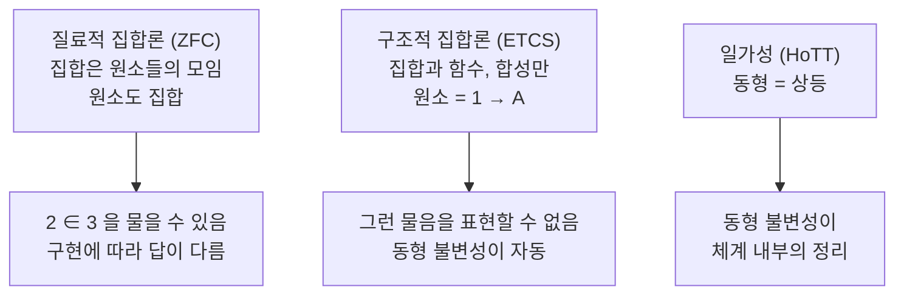

# 구조적 집합론과 동형 불변성

# 개요

[ZFC 공리계](zfc-axioms.md)에서 모든 것은 집합이고, 집합은 원소로 이루어지며, 원소도 집합이다. 그래서 $2 \in 3$ 같은 물음을 던질 수 있고, 자연수를 어떻게 구현했느냐에 따라 답이 달라진다. [수학적 구조주의](mathematical-structuralism.md)는 이런 물음이 수학의 내용이 아니라고 말한다.

그렇다면 그런 물음을 아예 표현할 수 없는 기초를 세울 수 있을까. 구조적 집합론이 그 시도다. 집합의 원소가 무엇인지 묻지 않고, 집합과 함수와 합성만으로 모든 것을 서술한다. Lawvere 의 ETCS 가 대표적이며, [범주](category.md)의 언어로 집합론을 다시 쓴 것이다.

같은 목표를 타입 이론에서 추구한 것이 일가성 공리다. 여기서는 동형인 두 구조가 실제로 같아져서, 구조 성질이 동형사상으로 보존된다는 관찰이 메타 수준의 정리가 아니라 체계 내부의 원리가 된다.

# 직관

## 원소를 묻지 않으면 무엇이 남는가

ZFC 에서 집합 $A$ 를 안다는 것은 $x \in A$ 인 $x$ 들을 안다는 것이다. 구조적 관점에서는 다르게 묻는다. $A$ 로 들어오는 함수와 $A$ 에서 나가는 함수가 무엇인지만 안다.

원소도 이 언어로 표현된다. 한 점 집합 $1$ 에서 $A$ 로 가는 함수 $1 \to A$ 가 $A$ 의 원소다. 그러면 "$A$ 의 원소가 $B$ 의 원소인가" 라는 물음은 아예 제기되지 않는다. 원소는 어떤 집합에 속한 화살표이지 그 자체로 떠다니는 대상이 아니기 때문이다.

## 무엇을 잃고 무엇을 얻는가

잃는 것은 표현력의 일부다. ZFC 의 누적 위계는 서수를 따라 집합을 쌓아 올리는 그림을 주고, 큰 기수의 위계를 자연스럽게 다룬다. 구조적 집합론은 이런 논의에 덜 편하다.

얻는 것은 일상적 수학과의 거리다. 실제로 수학자가 쓰는 문장은 거의 전부 구조적이다. 두 군이 동형이면 같은 정리를 만족한다고 자유롭게 말하고, 그 근거를 따지지 않는다. 구조적 기초에서는 이 자유가 공짜로 따라온다.

## 동형인데 다르다는 어색함

ZFC 에서 두 동형인 군은 다른 집합이다. 그래서 "동형을 무시하면 유일" 이라는 단서가 늘 붙는다. 이 단서는 형식 체계 바깥의 관행이며, 형식 증명을 기계에 맡기면 곧바로 걸림돌이 된다. 사람은 동형을 따라 성질을 옮기는 일을 자동으로 하지만 기계는 그렇지 않기 때문이다.

일가성 공리는 이 간극을 없앤다. 동형이면 상등이라고 못 박으면, 한쪽에서 증명한 것이 다른 쪽으로 자동으로 옮겨 간다.

# 정의

## 질료적 집합론과 구조적 집합론

질료적 집합론은 원시 관계로 $\in$ 을 가지고 모든 대상이 집합인 체계다. ZFC 가 표준이다.

구조적 집합론은 원시 개념으로 집합, 함수, 합성을 가지고 원소를 파생 개념으로 다루는 체계다. 서로 다른 집합의 원소 사이에 상등을 물을 수 없다는 것이 결정적 차이다.

## ETCS

Lawvere 의 기본 집합론은 집합과 함수의 범주가 다음을 만족한다고 요구한다.

1. 유한 극한과 쌍대극한을 가진다.
2. 데카르트 닫혀 있다. 즉 함수 집합 $B^A$ 가 존재한다.
3. 부분대상 분류자 $\Omega = \{\top,\bot\}$ 를 가진다.
4. 자연수 대상이 있다.
5. 한 점 집합 $1$ 이 생성자다. 즉 $f,g:A\to B$ 가 모든 원소에서 같으면 $f=g$ 다.
6. 모든 전사가 분할된다. 선택공리에 해당한다.

앞의 네 조건은 이 범주가 토포스임을 말하고, 뒤의 둘이 집합의 범주다운 성질을 더한다. $1$ 이 생성자라는 조건이 특히 중요한데, 이것이 "함수는 원소에서의 값으로 결정된다" 는 익숙한 성질이다.

## 일가성 공리

호모토피 타입 이론에서 타입 $A$ 와 $B$ 에 대해 자연스러운 사상

$$
\mathrm{idtoeqv}:(A=B)\ \longrightarrow\ (A\simeq B)
$$

가 있다. 일가성 공리는 이 사상 자체가 동치라고 말한다. 상등의 증명과 동치의 증명이 같은 것이 되므로, 동형인 구조는 모든 면에서 교환 가능해진다.

# 성질

## ETCS 와 ZFC 의 힘

ETCS 는 ZFC 보다 약하다. 정확히는 유계 분리와 선택을 가진 Zermelo 집합론 $\mathrm{BZC}$ 와 같은 세기다. 치환 공리꼴에 해당하는 것이 빠져 있기 때문이다.

치환에 대응하는 원리를 추가하면 ZFC 와 쌍방향으로 해석 가능해진다. 한쪽에서 증명되는 것이 다른 쪽에서도 증명된다는 뜻이며, 두 기초 사이의 선택이 수학의 내용을 바꾸지 않음을 보장한다.

| | ZFC | ETCS |
|---|---|---|
| 원시 개념 | 집합, $\in$ | 집합, 함수, 합성 |
| 원소 | 집합 | $1 \to A$ |
| $2 \in 3$ | 표현 가능, 구현 의존 | 표현 불가 |
| 세기 | | $\mathrm{BZC}$ 와 동등, 치환 추가 시 ZFC 와 동등 |
| 편한 영역 | 큰 기수, 누적 위계 | 일상적 수학, 범주론 |

## 동형 불변성은 정리가 된다

구조적 체계에서는 다음이 메타정리로 성립한다. 체계의 언어로 표현 가능한 모든 성질은 동형사상으로 보존된다.

이유가 단순하다. 구현에 의존하는 성질은 애초에 언어로 쓸 수 없기 때문이다. $2 \in 3$ 처럼 동형사상이 보존하지 않는 문장을 만들 문법이 없다.

ZFC 에서는 이런 메타정리가 성립하지 않는다. 보존되지 않는 문장을 쓸 수 있고, 그래서 어떤 문장이 구조적인지를 매번 사람이 판단해야 한다.

## 일가성이 주는 것

일가성 아래에서는 동형 불변성이 메타정리가 아니라 내부의 정리가 된다. $A = B$ 를 얻었으므로 $P(A)$ 에서 $P(B)$ 로 옮기는 것이 상등의 대입 규칙 한 번이다.

부작용도 있다. 일가성은 명제 외연성을 함의하고, 배중률과 결합하면 모든 타입이 집합 수준으로 무너지지 않도록 조심해야 한다. 그래서 호모토피 타입 이론은 구성적 기반 위에 서고, 타입을 호모토피 수준으로 층화한다. 명제, 집합, 군체가 각각 다른 층이다.

일가성의 계산적 의미를 주는 것이 입방체 타입 이론이다. 공리로 덧붙이면 계산 규칙이 막히는 문제를 해결해, 일가성을 증명 보조 도구에서 실제로 실행할 수 있게 만든다.

## 구현 독립성이 왜 실무 문제인가

형식 증명에서 같은 대상의 여러 구현을 오가는 일이 끊임없이 생긴다. 자연수를 이진 표현으로 바꾸어 계산을 빠르게 하고, 행렬을 리스트의 리스트로도 함수로도 쓴다. 동형인 두 구현 사이에 성질을 옮기는 작업을 손으로 하면 증명이 배로 늘어난다.

일가성이나 그에 준하는 원리는 이 이전을 자동화한다. 실제로 증명 보조 도구의 이전 기법이 이 문제를 겨냥한 것이며, 수학 철학의 물음이 공학적 이득으로 직결된 드문 사례다.

## 어느 쪽이 옳은가

세 체계는 경쟁하는 진리 주장이 아니라 다른 목적의 도구다. 집합론의 독립성 현상과 큰 기수를 연구하려면 ZFC 의 누적 위계가 필요하고, 일상적 수학을 형식화하려면 구조적 기초가 편하며, 동형 이전을 자동화하려면 일가성이 필요하다.

세 체계가 서로 해석 가능하므로 수학의 내용은 선택에 좌우되지 않는다. 이것이 [수학적 구조주의](mathematical-structuralism.md)의 실천적 교훈과 일치한다. 구현은 도구이고 구조가 내용이다.

# 활용

## 기초 선택을 읽는 눈

어떤 형식 체계를 볼 때 "이 체계가 말할 수 없는 것은 무엇인가" 를 먼저 묻는 습관이 여기서 나온다. 말할 수 없는 것이 많을수록 약한 체계가 아니라, 무의미한 물음을 걸러 내는 체계일 수 있다.

## 증명 보조 도구의 설계

Lean 의 수학 라이브러리는 ZFC 가 아니라 의존 타입 이론 위에 서 있고, 구조를 타입 클래스로 다룬다. Agda 와 Coq 의 일부 라이브러리는 입방체 타입 이론으로 일가성을 직접 지원한다. 어떤 기초를 고르느냐가 라이브러리의 구조와 증명의 길이를 직접 결정한다.

## 범주론적 기초

ETCS 는 집합의 범주 하나를 공리화한 것이지만, 더 나아가 범주 자체를 기초로 삼으려는 시도들이 있다. 기본 범주론 이론이나 $\infty$ 범주 기반의 접근이 그 방향이다. 수학의 기초가 반드시 집합일 필요는 없다는 것이 공통된 출발점이다.

# 연관 문서

## 선수지식

- [수학적 구조주의](mathematical-structuralism.md)
- [ZFC 공리계](zfc-axioms.md)
- [범주](category.md)

## 더 알아보기

아직 연결한 문서가 없다.

#foundations #set_theory #philosophy_of_math #category_theory
