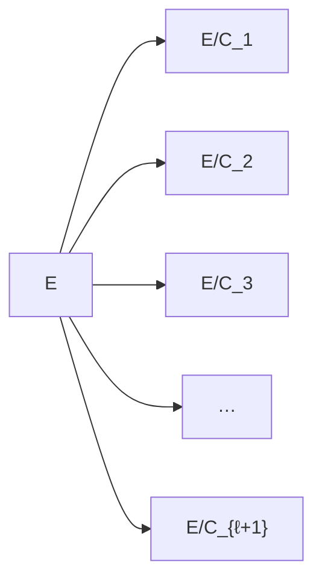

# 초특이 동종사상 그래프와 SIDH

# 개요

[Lang–Trotter 추측](lang-trotter.md)에서 초특이 소수를 세었다. 고정된 곡선 $E/\mathbb Q$ 를 여러 $p$ 로 환원하며 언제 초특이가 되는지를 물었던 것이다. 이 문서는 시점을 뒤집는다. $p$ 를 고정하고, 표수 $p$ 의 초특이 곡선 **전체**를 한 자리에 모아 그 사이의 관계를 본다.

그러면 뜻밖의 대상이 나온다. $\overline{\mathbb F_p}$ 위의 초특이 $j$ 불변량은 모두 $\mathbb F_{p^2}$ 에 있고 개수가

$$
\#\{\text{초특이 }j\}=\Big\lfloor\frac p{12}\Big\rfloor+\varepsilon_p,\qquad
\varepsilon_p=\begin{cases}0&p\equiv1\\1&p\equiv5,7\\2&p\equiv11\end{cases}\pmod{12}
$$

로 유한하다. 이 유한집합을 정점으로 두고 $\ell$ 차 동종사상을 간선으로 두면 $(\ell+1)$ 정규 그래프가 되며, 그것이 **Ramanujan 그래프**다. 스펙트럼 간극이 이론적 최댓값에 도달해 [random walk](random-walks.md)가 가장 빠르게 섞인다.

빠르게 섞이는 그래프에서 두 정점 사이의 경로를 찾는 일은 어렵다. 이 어려움을 가정으로 삼아 CGL 해시함수와 SIDH 키교환이 설계되었고, 후자는 NIST 후양자 표준화의 최종 후보(SIKE)까지 올라갔다. 그리고 2022년에 깨졌다. 그 경위가 이 문서의 마지막 주제다.

# 직관

## 초특이란 무엇이 없다는 뜻인가

표수 $p$ 의 타원곡선 $E$ 에서 $p$ 비틀림을 보면 두 가지만 가능하다.

$$
E[p](\overline{\mathbb F_p})\cong\mathbb Z/p\ \ (\text{보통})\qquad\text{또는}\qquad E[p]=0\ \ (\text{초특이})
$$

표수 $0$ 에서 $E[p]\cong(\mathbb Z/p)^2$ 이던 것이 표수 $p$ 에서 절반 또는 전부 무너진다. 초특이 곡선은 $p$ 비틀림 점이 하나도 없는 쪽이고, 동치인 조건이 $a_p=0$ 이고 곧 $\#E(\mathbb F_p)=p+1$ 이다.

이 결손이 자기준동형환에 나타난다. 보통 곡선의 $\mathrm{End}(E)$ 는 허수이차체의 차수(order)로 가환이지만, 초특이 곡선은

$$
\mathrm{End}(E)\ =\ p\ \text{에서 분지하는 사원수대수의 극대차수}
$$

가 되어 **비가환**이다. 가환성이 깨진 것이 이 문서의 모든 현상의 근원이다. 뒤에서 볼 그래프의 확장성도, SIDH 가 군 작용이 아니라 그래프 걷기로 설계된 것도 여기서 나온다.

## 왜 개수가 $p/12$ 인가

Eichler 의 질량 공식이 답을 준다. 초특이 곡선 전체에 자기동형군의 크기로 가중치를 주어 세면

$$
\sum_{E\ \text{초특이}}\frac1{\#\mathrm{Aut}(E)}=\frac{p-1}{24}
$$

가 된다. 대부분의 곡선은 $\#\mathrm{Aut}=2$ ($\pm1$ 뿐) 이므로 정점 수가 대략 $(p-1)/12$ 이고, $j=0$ (자기동형 6개) 과 $j=1728$ (4개) 이 있을 때만 보정항 $\varepsilon_p$ 가 붙는다. 위 공식의 $12$ 와 $\varepsilon_p$ 가 이렇게 설명된다.

## 그래프를 만든다

정점을 $\mathbb F_{p^2}$ 의 초특이 $j$ 불변량으로, 간선을 $\ell$ 차 동종사상($\ell\ne p$ 인 작은 소수)으로 둔다. 차수 $\ell$ 의 동종사상은 크기 $\ell$ 의 부분군 하나에 대응하고, $E[\ell]\cong(\mathbb Z/\ell)^2$ 의 크기 $\ell$ 부분군은 $\mathbb P^1(\mathbb F_\ell)$ 만큼, 곧 $\ell+1$ 개 있다.



그래서 그래프는 $(\ell+1)$ 정규다. 쌍대 동종사상이 있으므로 간선은 방향이 없고, 두 정점이 이웃인 조건은 모듈러 다항식 $\Phi_\ell(j_1,j_2)=0$ 으로 순수 대수적으로 판정된다. 초특이성은 동종사상으로 보존되므로 이 그래프는 초특이 정점들 안에서 닫혀 있다.

## 왜 Ramanujan 인가

$k$ 정규 그래프의 인접행렬 고윳값은 $k=\lambda_1\ge\lambda_2\ge\dots$ 이고, Alon–Boppana 가 $\lambda_2\ge2\sqrt{k-1}-o(1)$ 이라는 하한을 준다. 이 하한을 (자명한 것을 제외한 모든 고윳값에서) 달성하는 그래프가 Ramanujan 그래프다.

초특이 $\ell$ 동종사상 그래프의 인접행렬은 사원수대수의 Brandt 행렬이고, 그 고윳값은 무게 $2$ 새형식의 Hecke 고윳값 $a_\ell$ 이다. Jacquet–Langlands 대응이 둘을 잇고, Deligne 이 증명한 Ramanujan 추정

$$
|a_\ell|\le2\sqrt\ell
$$

이 정확히 Ramanujan 조건을 준다. 이름이 겹치는 것이 우연이 아니라 같은 정리다[^1]. 결과로 이 그래프 위의 random walk 는 $O(\log p)$ 걸음이면 거의 균등분포에 도달한다.

## 걷기는 쉽고 되짚기는 어렵다

빠른 혼합에는 암호적 함의가 있다. 출발 정점에서 무작위로 $O(\log p)$ 걸음 걸으면 도착점은 사실상 균등하게 흩어진다. 그런데 도착점만 보고 어떤 경로로 왔는지 복원하는 문제, 곧 **동종사상 경로 문제**는 알려진 최선이 $\tilde O(\sqrt p)$ (고전) 또는 $\tilde O(p^{1/3})$ (양자, 주장) 이다. 지수적 격차가 있고, Shor 알고리즘이 깨는 숨은 부분군 구조가 없어 보인다. 비가환 자기준동형환 덕분이다.

$p$ 를 $2^{256}$ 정도로 잡으면 정점이 $2^{250}$ 개쯤 되는 그래프에서 길이 $256$ 짜리 경로를 숨기는 셈이다. 이것이 CGL 해시함수와 SIDH 의 설계 원리다.

# 정의

## 동종사상과 그래프

$\phi\colon E_1\to E_2$ 가 차수 $\ell$ 의 분리 가능한 동종사상이면 $\ker\phi\subset E_1[\ell]$ 이 크기 $\ell$ 의 순환 부분군이고, 역으로 그런 부분군마다 동종사상이 동형을 빼고 유일하다(Vélu 공식이 명시적으로 준다).

$$
G_\ell(p)\colon\quad
V=\{j\in\mathbb F_{p^2}:\ j\ \text{초특이}\},\qquad
j_1\sim j_2\iff\Phi_\ell(j_1,j_2)=0
$$

중복도를 세면 $(\ell+1)$ 정규다. $j=0,1728$ 근처에서는 여분의 자기동형 때문에 서로 다른 이웃의 개수가 $\ell+1$ 보다 적을 수 있다.

## Deuring 대응

$$
\{\text{초특이 }E/\overline{\mathbb F_p}\}\ \longleftrightarrow\ \{B_{p,\infty}\ \text{의 극대차수}\}/\text{공액}
$$

$B_{p,\infty}$ 는 $p$ 와 $\infty$ 에서만 분지하는 유일한 유리 사원수대수다. 이 대응 아래에서 동종사상은 좌아이디얼이 되고, 그래프는 아이디얼 류의 그래프가 된다. 곡선 쪽의 문제를 격자 쪽으로 옮기는 통로이며, 공격과 방어 양쪽에서 핵심 도구다.

## SIDH 키교환

서로 다른 두 소수 $\ell_A=2,\ \ell_B=3$ 을 쓰고 $p=2^{e_A}3^{e_B}-1$ 로 잡는다. 공개 정보는 시작 곡선 $E_0$ 와 기저 $\langle P_A,Q_A\rangle=E_0[2^{e_A}]$ 와 $\langle P_B,Q_B\rangle=E_0[3^{e_B}]$ 다.

1. Alice 가 비밀 $\ker\phi_A=\langle P_A+[a]Q_A\rangle$ 를 잡아 $\phi_A\colon E_0\to E_A$ 를 계산한다.
2. Alice 가 $E_A$ 와 함께 **보조점** $\phi_A(P_B),\phi_A(Q_B)$ 를 공개한다. Bob 도 대칭으로 한다.
3. 각자 상대의 자료에 자기 비밀 부분군을 밀어 넣어 $E_{AB}\cong E_{BA}$ 를 얻고, 그 $j$ 불변량을 공유 비밀로 쓴다.

2 단계의 보조점이 없으면 두 걸음을 합성할 수 없다. 그런데 바로 이 보조점이 치명적이었다.

# 성질

## 정점 수와 연결성

$\ell$ 동종사상 그래프는 모든 $\ell\ne p$ 에 대해 연결이다. 사원수대수 쪽의 강한 근사 정리에서 나오며, 임의의 두 초특이 곡선이 $\ell$ 멱 차수 동종사상으로 이어진다는 뜻이다.

## 스펙트럼 간극과 혼합 시간

Ramanujan 성질에서 $\lambda_2\le2\sqrt\ell$ 이므로 혼합 시간이

$$
t_{\mathrm{mix}}=O\Big(\frac{\log\#V}{\log\big((\ell+1)/2\sqrt\ell\big)}\Big)=O(\log p)
$$

이다. 이 상계는 곧 "임의의 두 정점 사이에 길이 $O(\log p)$ 의 경로가 있다" 는 지름 상계도 준다. 존재는 보장되지만 찾는 것은 별개의 문제라는 구도가 여기서 성립한다.

## 경로 문제의 난이도

| 문제 | 최선 알려진 비용 |
|---|---|
| 일반 동종사상 경로 (고전) | $\tilde O(\sqrt p)$ (만남 중간 / Pollard) |
| 일반 동종사상 경로 (양자) | $\tilde O(p^{1/3})$ 주장, claw 찾기 |
| 자기준동형환 계산 | 경로 문제와 다항시간 동치 (Wesolowski 2022) |
| SIDH 키 복원 | **다항시간** (Castryck–Decru 2022) |

마지막 줄만 무너졌다는 점이 중요하다. 일반 경로 문제는 여전히 어렵고, 무너진 것은 보조점이라는 추가 정보를 주는 SIDH 특유의 구조다.

## Castryck–Decru 공격

핵심 도구는 Kani 의 정리다. 적절한 조건에서 두 타원곡선 사이의 동종사상 자료가 **아벨 곡면** 사이의 $(\ell,\ell)$ 동종사상으로 실현되고, 역으로 그런 곡면 동종사상이 존재하는지는 계산할 수 있다.

공격은 Alice 의 비밀을 한 조각씩 추측하며, 각 추측에 대해 대응하는 곡면 동종사상이 "분해되는지" 를 검사한다. 추측이 맞을 때만 분해가 일어나므로 판정기가 된다. 보조점 $\phi_A(P_B),\phi_A(Q_B)$ 가 정확히 이 검사를 가능하게 하는 정보다. $E_0$ 가 알려진 자기준동형을 가지면 시작 곡선 정보까지 합쳐져 복원이 곧장 끝난다. SIKE 의 실제 매개변수는 개인용 컴퓨터에서 몇 시간 만에 깨졌고[^2], NIST 표준화에서 탈락했다.

교훈은 "초특이 동종사상 문제가 쉽다" 가 아니라 **비밀 동종사상의 토션 상(image)을 공개하면 안 된다** 는 것이다.

## 살아남은 설계

- **CGL 해시.** 메시지 비트로 그래프를 걷고 도착 $j$ 를 출력한다. 보조점을 공개하지 않으므로 공격이 닿지 않는다. 충돌 저항성이 경로 문제와 자기준동형환 계산에 직결된다.
- **CSIDH.** $\mathbb F_p$ 유리 초특이 곡선만 쓰면 유수군의 가환 군 작용이 복원된다. 구조가 가환이라 준지수 양자 공격(Kuperberg)에 노출되지만, 매개변수를 키워 대응한다. 토션 상을 공개하지 않는다.
- **SQIsign.** Deuring 대응을 정면으로 활용해 서명을 만든다. 서명 길이가 매우 짧아 후양자 서명 후보로 남아 있다.

# 활용

## 정점을 직접 센다

초특이 $j$ 불변량은 Legendre 형 $y^2=x(x-1)(x-\lambda)$ 의 Hasse 다항식

$$
H_p(\lambda)=\sum_{i=0}^{m}\binom mi^2\lambda^i,\qquad m=\frac{p-1}2
$$

의 근으로 나온다. 근 $\lambda$ 를 $j=256\,(\lambda^2-\lambda+1)^3/\lambda^2(\lambda-1)^2$ 로 옮겨 중복을 제거하면 정점 집합이다.

```python
from math import comb

def fp2(p):
    """F_{p^2} = F_p[√n] 의 사칙연산."""
    n = next(a for a in range(2, p) if pow(a, (p-1)//2, p) == p-1)
    mul = lambda x, y: ((x[0]*y[0] + n*x[1]*y[1]) % p, (x[0]*y[1] + x[1]*y[0]) % p)
    add = lambda x, y: ((x[0]+y[0]) % p, (x[1]+y[1]) % p)
    sub = lambda x, y: ((x[0]-y[0]) % p, (x[1]-y[1]) % p)
    def inv(x):
        d = pow((x[0]*x[0] - n*x[1]*x[1]) % p, p-2, p)
        return (x[0]*d % p, -x[1]*d % p)
    return mul, add, sub, inv

def supersingular_js(p):
    mul, add, sub, inv = fp2(p)
    H = [comb((p-1)//2, i)**2 % p for i in range((p-1)//2 + 1)]
    js = set()
    for a in range(p):
        for b in range(p):
            lam = (a, b)
            if lam in ((0, 0), (1, 0)):
                continue
            v, pw = (0, 0), (1, 0)
            for c in H:                                   # H_p(lam) 을 Horner 없이 평가
                v = add(v, (c*pw[0] % p, c*pw[1] % p))
                pw = mul(pw, lam)
            if v != (0, 0):
                continue
            t = add(sub(mul(lam, lam), lam), (1, 0))       # lam^2 - lam + 1
            num = mul(mul(t, t), t)
            num = (256*num[0] % p, 256*num[1] % p)
            den = mul(mul(lam, lam), mul(sub(lam, (1, 0)), sub(lam, (1, 0))))
            js.add(mul(num, inv(den)))
    return js

for p in [11, 13, 17, 19, 23, 31, 37, 41, 71, 97, 101]:
    pred = p//12 + {1: 0, 5: 1, 7: 1, 11: 2}[p % 12]
    n = len(supersingular_js(p))
    print(f"p={p:4d}  초특이 j 개수={n:3d}   floor(p/12)+eps={pred:3d}   {n == pred}")
```

```
p=  11  초특이 j 개수=  2   floor(p/12)+eps=  2   True
p=  13  초특이 j 개수=  1   floor(p/12)+eps=  1   True
p=  17  초특이 j 개수=  2   floor(p/12)+eps=  2   True
p=  19  초특이 j 개수=  2   floor(p/12)+eps=  2   True
p=  23  초특이 j 개수=  3   floor(p/12)+eps=  3   True
p=  31  초특이 j 개수=  3   floor(p/12)+eps=  3   True
p=  37  초특이 j 개수=  3   floor(p/12)+eps=  3   True
p=  41  초특이 j 개수=  4   floor(p/12)+eps=  4   True
p=  71  초특이 j 개수=  7   floor(p/12)+eps=  7   True
p=  97  초특이 j 개수=  8   floor(p/12)+eps=  8   True
p= 101  초특이 j 개수=  9   floor(p/12)+eps=  9   True
```

## 간선을 놓는다

$\ell=2$ 의 모듈러 다항식은 명시적으로 쓸 수 있다.

$$
\Phi_2(X,Y)=X^3+Y^3-X^2Y^2+1488(X^2Y+XY^2)-162000(X^2+Y^2)+40773375XY+8748000000(X+Y)-157464000000000
$$

위에서 얻은 정점 집합에 이 식으로 간선을 놓으면 그래프가 완성된다. 실제로 $p\le101$ 의 모든 경우에 그래프가 **연결**이고, 중복도를 세면 $3$ 정규다. 서로 다른 이웃만 세면 $j=0,1728$ 주변에서 $1$ 이나 $2$ 가 나오는데, 이는 그 정점의 여분 자기동형이 서로 다른 부분군을 같은 곡선으로 보내기 때문이다.

## 후양자 암호에서의 위치

격자 기반(Kyber, Dilithium)이 표준으로 선정된 지금, 동종사상 기반은 "다양성 확보" 역할을 맡는다. 격자와 전혀 다른 수학에 기반하므로 격자 가정이 무너져도 살아남을 여지가 있고, 무엇보다 키와 서명이 매우 짧다. SIKE 의 공개키는 330 바이트로 Kyber 의 1/4 이었다. SQIsign 의 서명은 177 바이트로 Dilithium 의 1/10 수준이다.

SIDH 의 붕괴가 남긴 것은 이 분야가 아직 젊고, 무엇을 공개하는지가 안전성을 좌우한다는 인식이다. 그래프 자체의 어려움과 그 그래프를 쓰는 프로토콜의 어려움은 같지 않다.

## 계산 수론 도구로서

암호를 떠나서도 이 그래프는 쓸모가 있다. 초특이 곡선과 사원수 극대차수의 대응은 Brandt 행렬을 통해 무게 $2$ 새형식의 Hecke 고윳값을 곧바로 계산하게 해 주며, 이것이 [모듈러 기호](modular-symbols.md)와 나란한 또 하나의 계산 경로다. 준위가 소수일 때는 사원수 쪽이 더 빠르다.

[^1]: A. Pizer, *Ramanujan graphs and Hecke operators*, Bull. AMS **23** (1990). 이 그래프가 Ramanujan 임을 Eichler–Selberg 대각합 공식과 Deligne 의 추정으로 보인다.

[^2]: W. Castryck, T. Decru, *An efficient key recovery attack on SIDH*, EUROCRYPT 2023. 독립적인 공격으로 Maino–Martindale 와 Robert 의 것이 있고, Robert 의 방법은 시작 곡선의 자기준동형환을 몰라도 통한다. Deuring 대응 쪽 정리는 B. Wesolowski, *The supersingular isogeny path and endomorphism ring problems are equivalent*, FOCS 2021. 본문의 정점 수와 그래프 계산은 직접 한 것이다.

# 연관 문서

## 선수지식

- [Lang–Trotter 추측과 초특이 소수](lang-trotter.md)
- [Random walk와 전기 네트워크](random-walks.md)

## 더 알아보기

- [Deuring 대응과 사원수 알고리즘](deuring-correspondence.md)

#number_theory #cryptography #graph_theory #computation
