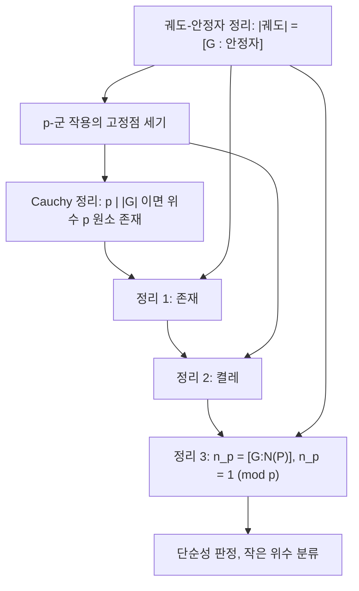

# Sylow 정리

# 개요

Lagrange 정리는 부분군의 위수가 군의 위수를 나눈다고 말하지만 역은 성립하지 않는다. 위수 12인 교대군 $A_4$ 에는 위수 6인 부분군이 없다. Sylow 정리는 이 역이 소수의 거듭제곱에 대해서는 언제나 성립함을 보이고, 나아가 그런 부분군들이 서로 켤레이며 그 개수가 강한 산술 조건을 만족함을 말한다.

세 정리는 모두 [군 작용](group-actions.md)의 궤도-안정자 정리와 고정점 세기로 증명된다. 결과는 유한군론의 기본 도구가 되어, 주어진 위수의 군이 단순할 수 없음을 보이거나 작은 위수의 군을 완전히 분류하는 데 쓰인다.

# 직관

## 소수 거듭제곱만 특별하다

위수 $|G|=p^am$ 에서 $p$ 가 $m$ 을 나누지 않는다고 하자. 이때 $p^a$ 은 "$p$ 쪽에서 가능한 최대치" 다. Sylow 정리의 핵심 주장은 이 최대치가 실제로 부분군으로 실현된다는 것이다.

왜 소수만 되는가. 증명은 $p$ 군이 집합에 작용할 때 고정점의 개수가 집합 크기와 법 $p$ 로 합동이라는 사실에 전적으로 의존한다. 궤도의 크기가 $p$ 의 거듭제곱이므로, 크기 $1$ 이 아닌 궤도는 모두 $p$ 의 배수여서 세기에서 지워지기 때문이다. 합성수 위수에는 이런 깔끔한 상쇄가 없다.

## 켤레와 정규성

Sylow 부분군들은 서로 켤레다. 따라서 Sylow $p$ 부분군이 단 하나뿐이라는 것과 그것이 정규부분군이라는 것은 같은 말이다. 단순군 판정이 Sylow 정리로 돌아가는 이유가 여기에 있다. $n_p=1$ 을 강제할 수 있으면 비자명한 정규부분군이 생겨 단순성이 깨진다.

## 세기가 주는 압박

세 번째 정리가 주는 두 조건 $n_p \mid m$ 과 $n_p \equiv 1 \pmod p$ 는 함께 매우 강하다. 위수 15에서는 두 조건이 $n_3 = n_5 = 1$ 을 강제하여 군이 하나뿐임이 바로 나온다. 후보가 여럿 남아도, 서로 다른 Sylow 부분군이 단위원 말고는 겹치지 않는다는 사실을 더해 원소를 세면 모순이 나오는 경우가 많다.

# 정의

## p-군과 Sylow 부분군

소수 $p$ 에 대해, 위수가 $p$ 의 거듭제곱인 유한군을 $p$ 군이라 한다.

$|G| = p^a m$ 이고 $p$ 가 $m$ 을 나누지 않는다고 하자. 위수가 정확히 $p^a$ 인 부분군 $P \le G$ 를 Sylow $p$ -부분군이라 한다. 그 전체 집합을

$$
\operatorname{Syl}_p(G), \qquad n_p = |\operatorname{Syl}_p(G)|
$$

로 쓴다.

## 정규화부분군

부분군 $H \le G$ 의 정규화부분군은

$$
N_G(H) = \{ g \in G : gHg^{-1} = H \}
$$

이고, $H$ 를 정규부분군으로 포함하는 가장 큰 부분군이다. 켤레 작용의 안정자가 바로 이것이다.

## 세 정리

**정리 1 (존재).** $|G| = p^a m$ , $p \nmid m$ 이면 위수 $p^a$ 인 부분군이 존재한다. 더 나아가 $0 \le i \le a$ 인 모든 $i$ 에 대해 위수 $p^i$ 인 부분군이 존재한다.

**정리 2 (켤레).** 임의의 두 Sylow $p$ -부분군 $P$ , $Q$ 에 대해 $gPg^{-1} = Q$ 인 $g \in G$ 가 존재한다. 또한 모든 $p$ -부분군은 어떤 Sylow $p$ -부분군에 포함된다.

**정리 3 (개수).** Sylow $p$ 부분군의 개수는

$$
n_p = [G : N_G(P)], \qquad n_p \mid m, \qquad n_p \equiv 1 \pmod{p}
$$

를 만족한다.[^1]

# 성질

## 증명의 뼈대

세 정리는 모두 같은 재료로 증명된다.



기본 보조정리를 먼저 적는다. $P$ 가 $p$ 군이고 유한집합 $X$ 에 작용하면

$$
|X| \equiv |X^{P}| \pmod{p}
$$

이다. 여기서 $X^P$ 는 고정점 집합이다. 궤도 분해에서 크기 $1$ 이 아닌 궤도의 크기는 $p$ 의 배수이기 때문이다.

## 정리 1의 증명 스케치

귀납법과 류방정식을 쓰는 표준 증명을 적는다. 먼저 아벨군에 대한 Cauchy 정리를 얻는다. $|G|$ 가 $p$ 로 나누어떨어지면 위수 $p$ 인 원소가 존재한다. 일반 $G$ 에 대해서는 류방정식

$$
|G| = |Z(G)| + \sum_{i} [G : C_G(x_i)]
$$

를 쓴다. 어떤 중심화부분군 $C_G(x_i)$ 의 지수가 $p$ 로 나누어떨어지지 않으면 그 부분군이 $p^a$ 를 모두 포함하므로 귀납가정을 적용한다. 모든 지수가 $p$ 의 배수이면 $p$ 가 $|Z(G)|$ 를 나누므로 중심에서 위수 $p$ 인 원소 $z$ 를 얻고, $G/\langle z \rangle$ 에 귀납가정을 적용한 뒤 표준 사영의 역상을 취한다. 위수 $p^i$ 부분군의 존재도 같은 귀납으로 따라온다.

Wielandt의 짧은 증명도 있다. 크기 $p^a$ 인 부분집합 전체에 $G$ 가 왼쪽 곱으로 작용하는데, 이항계수

$$
\binom{p^a m}{p^a}
$$

가 $p$ 로 나누어떨어지지 않으므로 크기가 $p$ 의 배수가 아닌 궤도가 존재하고, 그 궤도의 안정자가 위수 $p^a$ 를 가진다.

## 정리 2와 3의 증명 스케치

$P$ 를 Sylow $p$ -부분군, $X = \lbrace gP\rbrace$ 를 좌잉여류 집합이라 하고, 임의의 $p$ -부분군 $Q$ 가 $X$ 에 왼쪽 곱으로 작용한다고 하자. $|X| = m$ 은 $p$ 의 배수가 아니므로 위 보조정리에 의해 고정점 $gP$ 가 존재한다. 고정점 조건 $QgP = gP$ 는 $g^{-1}Qg \subseteq P$ 를 뜻하므로 $Q$ 는 $P$ 의 켤레에 포함된다. $Q$ 가 Sylow이면 크기가 같아 켤레가 된다. 이것이 정리 2다.

정리 3은 $G$ 가 $\mathrm{Syl}_p(G)$ 에 켤레로 작용한다고 보면 된다. 정리 2에 의해 작용은 추이적이므로 궤도-안정자 정리에서

$$
n_p = [G : N_G(P)]
$$

이고, $P \le N_G(P)$ 이므로 $n_p$ 는 $m$ 을 나눈다. 이제 작용을 $P$ 로 제한한다. $Q \in \mathrm{Syl}_p(G)$ 가 $P$ 의 작용에 고정되면 $P \le N_G(Q)$ 이고, $N_G(Q)$ 안에서 $P$ 와 $Q$ 는 모두 Sylow이며 $Q$ 는 정규이므로 $P = Q$ 다. 즉 고정점은 $P$ 하나뿐이고 보조정리에서

$$
n_p \equiv 1 \pmod{p}
$$

를 얻는다. ∎

## 바로 따라오는 따름정리

- $n_p=1$ 인 것과 그 Sylow $p$ 부분군이 정규인 것은 동치다.
- 서로 다른 두 Sylow $p$ 부분군의 위수가 $p$ 이면 교집합이 자명하다. 따라서 위수 $p$ 인 원소가 정확히 $n_p(p-1)$ 개다. 원소 세기 논증의 기본 도구다.
- 유한 아벨군에서는 모든 Sylow 부분군이 정규이고, 군은 그들의 직접곱이다. 이것이 유한생성 아벨군 분류의 $p$ 부분 분해다.
- 위수 $p^a$ 인 군은 항상 비자명한 중심을 가진다. 류방정식에서 곧바로 나오며, 따라서 위수 $p^2$ 인 군은 아벨군이다.

## 단순성 판정 예

**위수 15.** $n_3$ 은 $5$ 를 나누고 $3$ 으로 나눈 나머지가 $1$ 이므로 $n_3 = 1$ . $n_5$ 는 $3$ 을 나누고 $5$ 로 나눈 나머지가 $1$ 이므로 $n_5 = 1$ . 두 Sylow 부분군이 모두 정규이고 교집합이 자명하므로 $G \cong \mathbb{Z}/3 \times \mathbb{Z}/5 \cong \mathbb{Z}/15$ 다. 위수 15인 군은 순환군 하나뿐이다.

**위수 30.** $n_3 \in \lbrace 1, 10\rbrace$ , $n_5 \in \lbrace 1, 6\rbrace$ 이다. 만약 둘 다 $1$ 이 아니면 위수 3인 원소가 $10 \cdot 2 = 20$ 개, 위수 5인 원소가 $6 \cdot 4 = 24$ 개여서 원소가 $44$ 개 이상 필요하므로 모순이다. 따라서 어느 한쪽이 정규이고, 그 곱 $P_3 P_5$ 는 위수 15인 부분군이 되어 지수가 2, 즉 정규다. 결국 위수 30인 군은 단순하지 않다.

**위수 12.** $n_3 \in \lbrace 1, 4\rbrace$ 다. $n_3 = 4$ 이면 위수 3인 원소가 $8$ 개이고 남은 원소는 $4$ 개뿐이어서 Sylow 2-부분군이 유일해진다. 어느 경우든 정규부분군이 생기므로 단순하지 않다. $A_4$ 가 바로 $n_3 = 4$ 인 경우다.

**일반 진술.** $p<q$ 이고 $q\not\equiv1\pmod p$ 이면 위수 $pq$ 인 군은 순환군이다. 같은 방식의 산술 논증이 소수 위수가 아닌 단순군의 최소 위수가 60임을 보이는 첫 단계가 된다.

# 활용

## 위수별 Sylow 수 계산

두 조건만으로 후보를 좁히는 계산은 짧은 코드로 자동화된다.

```python
from sympy import factorint, divisors

def sylow_counts(n):
    """위수 n 인 군에서 각 소수 p 에 대해 가능한 n_p 후보"""
    out = {}
    for p, e in factorint(n).items():
        m = n // p**e                       # p 와 서로소인 부분
        out[p] = [d for d in divisors(m) if d % p == 1]
    return out

def forced_normal(n):
    """어떤 p 에 대해 n_p = 1 만 가능하면 그 p 를 모은다"""
    return [p for p, cands in sylow_counts(n).items() if cands == [1]]

for n in [15, 20, 30, 100, 255]:
    print(n, sylow_counts(n), "-> 정규 Sylow:", forced_normal(n))
```

실행 결과는 다음과 같다.

```text
15 {3: [1], 5: [1]} -> 정규 Sylow: [3, 5]
20 {2: [1, 5], 5: [1]} -> 정규 Sylow: [5]
30 {2: [1, 3, 5, 15], 3: [1, 10], 5: [1, 6]} -> 정규 Sylow: []
100 {2: [1, 5, 25], 5: [1]} -> 정규 Sylow: [5]
255 {3: [1, 85], 5: [1, 51], 17: [1]} -> 정규 Sylow: [17]
```

위수 30이 빈 목록을 주는 데서 보듯 산술 조건만으로는 부족할 때가 있고, 그때 앞 절처럼 원소 세기를 덧붙인다. 반대로 위수 255처럼 한 줄로 정규부분군이 나오는 경우도 흔하다.

## 유한군의 구조 분석

Sylow 정리는 유한군을 소수별 조각으로 나누어 보는 첫 단계다.

- 모든 Sylow 부분군이 정규인 군을 nilpotent 군이라 하고, 이는 Sylow 부분군들의 직접곱과 동형이다.
- 유한 단순군 분류의 초반 논증은 대부분 Sylow 세기와 융합(fusion) 분석으로 이루어진다.
- 군의 위수에서 $p$ 부분만 남기는 조작은 [정수의 합동과 나머지 연산](modular-arithmetic.md)과 [소수와 유일분해](primes.md)의 산술이 군론으로 직접 번역되는 지점이다.

## 다른 분야와의 연결

- 표현론에서 $p$ 부분군으로의 제한은 modular representation theory의 핵심 도구이며, [군의 표현과 지표](group-representations.md)에서 지표를 Sylow 부분군 위에서 검사하는 기법으로 나타난다.
- [Galois 이론](galois-theory.md)에서 Galois 군의 Sylow 부분군은 고정체의 탑에 대응한다. 대수적으로 닫힌 체로 가는 확대의 차수를 제한하는 논증(예: 대수학의 기본정리의 대수적 증명)이 Sylow 정리를 그대로 쓴다.
- 계산군론 소프트웨어는 Sylow 부분군 계산을 기본 연산으로 제공하며, 치환군의 구조 분석에서 되풀이해 호출된다.[^2]

[^1]: Wikipedia, Sylow theorems, https://en.wikipedia.org/wiki/Sylow_theorems
[^2]: GAP Group, GAP – Groups, Algorithms, Programming, https://www.gap-system.org/

# 연관 문서

## 선수지식

- [군 작용](group-actions.md)

## 더 알아보기

- [유한 단순군 분류](finite-simple-groups.md)

#group_theory #theorem
