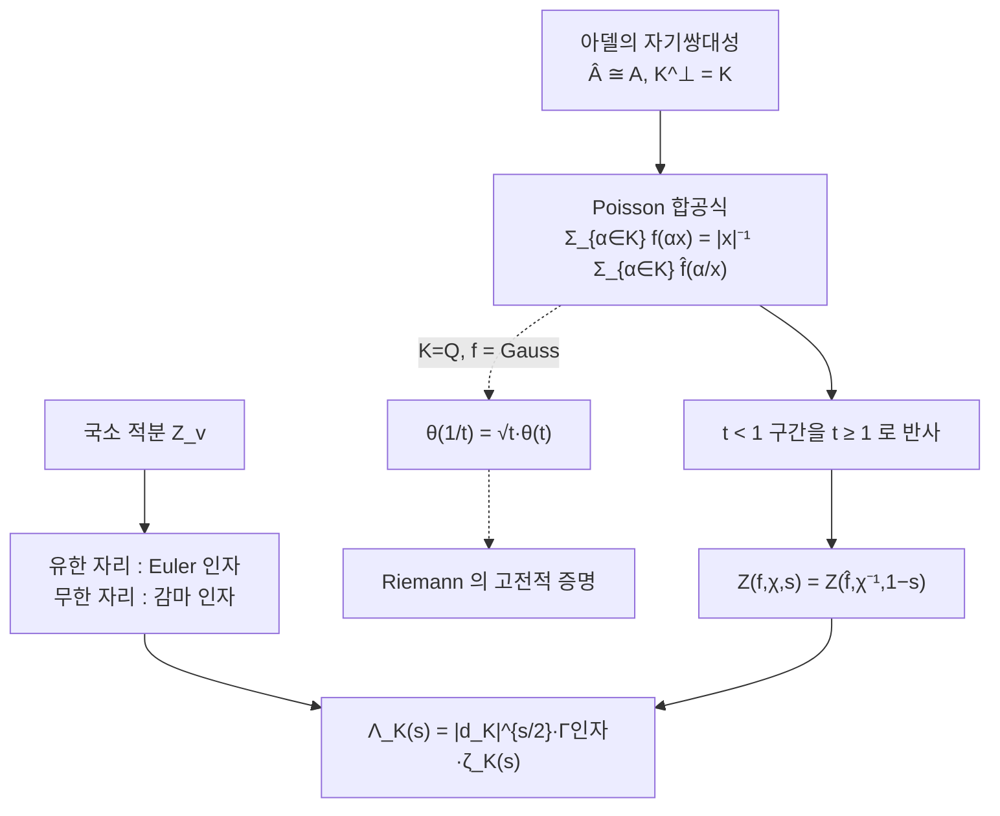

# 논문: Fourier Analysis in Number Fields and Hecke's Zeta-Functions

# 개요

Riemann 은 $\zeta(s)$ 의 함수방정식을 theta 함수 $\theta(t)=\sum_ne^{-\pi n^2t}$ 의 변환식 $\theta(1/t)=\sqrt t\thinspace\theta(t)$ 에서 끌어냈다. Hecke 는 같은 방법을 [수체](algebraic-number-fields.md) $K$ 위로 옮겨 $\zeta_K(s)$ 와 Hecke $L$ 함수까지 처리했지만, 그 계산은 수체마다 격자와 단원군을 손으로 다루는 작업이었고 감마 인자의 모양과 판별식 $\sqrt{|d_K|}$ 의 출처는 계산이 끝난 뒤에야 드러났다.

Tate 의 학위논문[^1]은 계산을 [아델](adeles.md) 위로 옮긴다. theta 변환식이 Poisson 합공식의 특수한 경우가 되고 $\zeta_K(s)$ 가 이델군 위의 적분 하나가 된다.

$$
Z(f,\chi,s)=\int_{\mathbb A_K^\times}f(x)\thinspace\chi(x)\thinspace|x|\_{\mathbb A}^{s}\thickspace d^\times x
$$

이 적분이 자리마다 쪼개지면서 Euler 인자와 감마 인자가 **같은 종류의 국소 적분**으로 통일되고, 함수방정식은 아델군의 자기쌍대성에서 자동으로 나온다. 판별식은 자기쌍대 측도를 정규화할 때 생기는 부피 인자다.

수론의 해석적 정리를 국소콤팩트군 위의 조화해석으로 번역하는 방식이 여기서 시작했고, [Langlands 강령](langlands-program.md)의 $\mathrm{GL}\_1$ 사례가 바로 이 논문이다.

# 직관

## 감마 인자와 Euler 인자

고전적 서술에서 $\zeta(s)$ 의 Euler 곱은 소수에서 오고 완비화에 붙는 $\pi^{-s/2}\Gamma(s/2)$ 는 해석에서 온다. 아델로 올라가면 둘이 같은 식의 값이다.

각 자리 $v$ 에서 국소 zeta 적분을 같은 모양으로 정의한다.

$$
Z_v(f_v,s)=\int_{K_v^\times}f_v(x)\thinspace|x|\_v^{s}\thickspace d^\times x
$$

자리마다 그 자리에서 가장 자연스러운 시험함수를 넣으면 된다. 유한 자리에서는 정수환의 정의함수 $\mathbf 1_{\mathbb Z_p}$ 이고 무한 자리에서는 Gauss 함수 $e^{-\pi x^2}$ 다. 둘 다 그 자리의 덧셈 Fourier 변환에 대해 자기쌍대인 함수라는 점에서 같은 선택이다.

$$
Z_p(\mathbf 1_{\mathbb Z_p},s)=\sum_{n\ge0}p^{-ns}=\frac1{1-p^{-s}},\qquad
Z_\infty(e^{-\pi x^2},s)=2\int_0^\infty e^{-\pi x^2}x^{s}\frac{dx}{x}=\pi^{-s/2}\Gamma(s/2)
$$

왼쪽은 Euler 인자, 오른쪽은 감마 인자다. $\zeta(s)$ 는 자리를 하나 빼먹은 곱이고 $\Lambda(s)=\pi^{-s/2}\Gamma(s/2)\zeta(s)$ 가 모든 자리에 걸친 곱이므로, 완비 zeta 함수 쪽이 대칭적이다.

## Mellin 변환의 정체

Mellin 변환 $\int_0^\infty f(t)t^s\thinspace dt/t$ 에서 $dt/t$ 는 곱군 $\mathbb R_{\gt 0}$ 의 Haar 측도이고 $t\mapsto t^s$ 는 그 군의 준지표다. Mellin 변환은 $\mathbb R_{\gt 0}$ 위의 Fourier 변환이다.

Tate 의 zeta 적분은 이 관찰을 이델류군으로 일반화한 것이다. $\mathbb R_{\gt 0}$ 자리에 $K^\times\backslash\mathbb A_K^\times$ 를 놓고, $t^s$ 자리에 Hecke 지표 $\chi\cdot|\cdot|^s$ 를 놓는다. Dirichlet 지표로 잘게 쪼개던 작업과 Mellin 변환이 하나의 조화해석으로 합쳐진다.

## 함수방정식이 나오는 자리

적분을 $|x|\_{\mathbb A}=t$ 로 잘라 본다. $t\ge1$ 쪽은 $f$ 의 급감 때문에 모든 $s$ 에서 수렴해 정함수를 준다. 문제는 $t\lt 1$ 쪽인데, 여기에 Poisson 합공식을 쓰면 $t$ 를 $1/t$ 로 뒤집어 $t\ge1$ 쪽 적분으로 되돌릴 수 있다. 되돌린 결과에서 $f$ 가 $\hat f$ 로, $s$ 가 $1-s$ 로 바뀐다. 그것이 함수방정식의 전부다.

$K=\mathbb Q$ 이고 $f$ 가 Gauss 함수이면 Poisson 합공식이 theta 변환식이 되고, Riemann 의 증명이 이 그림의 한 점이다.

# 정의

## 가법 지표와 자기쌍대 측도

$\mathbb A_K$ 는 국소콤팩트 가법군이므로 Pontryagin 쌍대를 갖는다. 자명하지 않은 연속 지표 $\psi\colon\mathbb A_K/K\to\mathbb C^\times$ 를 하나 고정하면 사상

$$
y\longmapsto\big(x\mapsto\psi(xy)\big)
$$

가 $\mathbb A_K$ 와 그 쌍대군 사이의 동형이 된다. 아델 환은 자기쌍대다. 게다가 $K$ 의 소멸자가 정확히 $K$ 자신이다. 이것이 $K$ 가 이산이고 몫이 콤팩트하다는 사실의 쌍대판이다.

Haar 측도는 Fourier 반전이 $\hat{\hat f}(x)=f(-x)$ 로 딱 떨어지도록 잡는다. 이 **자기쌍대 측도**에서 $\mathrm{vol}(\mathbb A_K/K)=1$ 이고, 국소 성분으로 내려가면 유한 자리마다 $\mathrm{vol}(\mathcal O_v)=N\mathfrak d_v^{-1/2}$ 가 되어 다른 아이디얼 $\mathfrak d$ 의 노름, 곧 판별식의 제곱근이 등장한다.

## Schwartz–Bruhat 공간

적분에 넣을 시험함수의 공간은 국소적으로 조립한다.

$$
\mathcal S(\mathbb A_K)=\Big\lbrace\textstyle\sum_i\bigotimes_vf_{i,v}\thickspace:\thickspace f_v\in\mathcal S(K_v),\ \text{거의 모든 } v \text{ 에서 } f_v=\mathbf 1_{\mathcal O_v}\Big\rbrace
$$

무한 자리에서 $\mathcal S(K_v)$ 는 보통의 급감 매끄러운 함수, 유한 자리에서는 국소상수이고 콤팩트 받침인 함수다. 유한 자리의 "매끄러움" 은 국소상수성이다. 이 공간은 Fourier 변환에 대해 닫혀 있고, $\widehat{\mathbf 1_{\mathcal O_v}}=\mathbf 1_{\mathcal O_v}$ 가 거의 모든 자리에서 성립해 무한 곱이 유한 곱으로 줄어든다.

## Hecke 지표와 zeta 적분

**Hecke 지표**는 이델류군의 연속 준지표 $\chi\colon K^\times\backslash\mathbb A_K^\times\to\mathbb C^\times$ 다. $K^\times$ 에서 자명하다는 조건이 고전적 서술의 "무한 자리에서의 조건 + 법 $\mathfrak m$ 에서의 합동 조건" 을 한꺼번에 담는다.

$f\in\mathcal S(\mathbb A_K)$ 와 Hecke 지표 $\chi$ 에 대해 **대역 zeta 적분**을 정의한다.

$$
Z(f,\chi,s)=\int_{\mathbb A_K^\times}f(x)\thinspace\chi(x)\thinspace|x|\_{\mathbb A}^{s}\thickspace d^\times x,\qquad
d^\times x=\prod_v\frac{dx_v}{|x_v|\_v}\ (\text{정규화})
$$

$\chi$ 가 유니터리이면 $\mathrm{Re}(s)\gt 1$ 에서 절대수렴한다. $f=\bigotimes f_v$ 이면 적분이 자리마다 쪼개진다.

$$
Z(f,\chi,s)=\prod_vZ_v(f_v,\chi_v,s),\qquad Z_v(f_v,\chi_v,s)=\int_{K_v^\times}f_v(x)\chi_v(x)|x|\_v^{s}\thinspace d^\times x
$$

# 성질

## 국소 계산

유한 자리 $v\mid p$ 에서 $\mathrm{vol}(\mathcal O_v^\times)=1$ 로 정규화하고 $f_v=\mathbf 1_{\mathcal O_v}$ 를 넣으면, $\mathcal O_v\setminus\lbrace 0\rbrace$ 이 $\varpi^n\mathcal O_v^\times$ 들로 분할되므로

$$
Z_v(\mathbf 1_{\mathcal O_v},\chi_v,s)=\sum_{n\ge0}\chi_v(\varpi)^nN\mathfrak p^{-ns}=\frac1{1-\chi_v(\varpi)N\mathfrak p^{-s}}
$$

가 된다. $\chi_v$ 가 분기하면($\mathcal O_v^\times$ 에서 자명하지 않으면) 같은 합에서 지표의 직교성 때문에 $n\ge1$ 항이 모두 상쇄되어 값이 $1$ 이다. 이 상쇄가 Euler 곱에서 분기한 소수의 인자를 뺀다.

무한 자리는 실수와 복소수를 나눠 계산한다.

| 자리 | 시험함수 $f_v$ | $Z_v(f_v,s)$ |
|---|---|---|
| $v$ 유한, $\chi_v$ 비분기 | $\mathbf 1_{\mathcal O_v}$ | $(1-\chi_v(\varpi)N\mathfrak p^{-s})^{-1}$ |
| $v$ 유한, $\chi_v$ 분기 | $\mathbf 1_{\mathcal O_v}$ | $1$ |
| $v$ 실수 | $e^{-\pi x^2}$ | $\pi^{-s/2}\Gamma(s/2)$ |
| $v$ 복소수 | $e^{-2\pi\vert z\vert^2}$ | $2(2\pi)^{-s}\Gamma(s)$ |

**국소 함수방정식**은 각 자리에서 따로 성립한다. $f_v$ 를 바꿔 가며 두 적분의 비를 보면 $f_v$ 에 의존하지 않는 인자가 남는다.

$$
\frac{Z_v(\hat f_v,\chi_v^{-1},1-s)}{Z_v(f_v,\chi_v,s)}=\gamma_v(\chi_v,s)
$$

$\gamma_v$ 는 국소 $L$ 인자의 비와 근 수 $\varepsilon_v(\chi_v,s)$ 로 쪼개진다. 대역 함수방정식의 $\varepsilon$ 인자는 이 국소 근 수들의 곱이며, 유한 개를 빼면 모두 $1$ 이다.

## Tate 의 정리

> $f\in\mathcal S(\mathbb A_K)$ 와 Hecke 지표 $\chi$ 에 대해 $Z(f,\chi,s)$ 는 $s$ 평면 전체로 유리형 접속되고
> $$
> Z(f,\chi,s)=Z(\hat f,\chi^{-1},1-s)
> $$
> 를 만족한다. $\chi$ 가 자명할 때만 극이 있고, $s=0$ 과 $s=1$ 에서 단순극이며 유수는 각각 $-\kappa f(0)$ 와 $\kappa\hat f(0)$ 다. 여기서 $\kappa=\mathrm{vol}(\mathbb A_K^1/K^\times)$ 다.

증명의 요지는 세 단계다.

1. 이델군을 $|x|\_{\mathbb A}$ 로 층층이 자른다. $\mathbb A_K^\times\cong\mathbb A_K^1\times\mathbb R_{\gt 0}$ 이므로 적분이 $\int_0^\infty\big(\int_{\mathbb A^1}\cdots\big)t^s\thinspace dt/t$ 가 된다.
2. $t\ge1$ 부분은 $f$ 의 급감으로 모든 $s$ 에서 수렴하는 정함수다.
3. $t\lt 1$ 부분에 **Riemann–Roch 항등식**을 쓴다. $\mathrm{vol}(\mathbb A_K/K)=1$ 인 Poisson 합공식을 $x$ 배 만큼 늘린 것이다.
   $$
   \sum_{\alpha\in K}f(\alpha x)=\frac1{|x|\_{\mathbb A}}\sum_{\alpha\in K}\hat f\negthinspace\left(\frac\alpha x\right)
   $$
   양변을 $t\lt 1$ 구간에서 적분하면 $x\mapsto x^{-1}$ 치환으로 $t\ge1$ 구간의 $\hat f$ 적분이 나온다. 이 과정에서 $\alpha=0$ 항이 따로 남아 $f(0)/s$ 와 $\hat f(0)/(1-s)$ 꼴의 극 두 개를 만든다.

적분이 이미 자리별 곱으로 쪼개져 있으므로, 하나의 함수방정식에서 모든 $L$ 함수의 함수방정식이 동시에 나온다.

## 판별식이 나오는 자리

$\mathrm{vol}(\mathbb A_K/K)=1$ 이라는 정규화를 국소 측도의 곱으로 풀어 쓰면, 유한 자리에서 $\mathrm{vol}(\mathcal O_v)=1$ 이 아니라 $N\mathfrak d_v^{-1/2}$ 여야 한다. 다른 아이디얼 $\mathfrak d$ 의 노름이 판별식 $|d_K|$ 이므로 전체에서 $|d_K|^{-1/2}$ 가 빠져나오고, $|x|^s$ 를 곱한 뒤에는 $|d_K|^{s/2}$ 로 나타난다. 완비 zeta 함수

$$
\Lambda_K(s)=|d_K|^{s/2}\Big(\pi^{-s/2}\Gamma(s/2)\Big)^{r_1}\Big(2(2\pi)^{-s}\Gamma(s)\Big)^{r_2}\zeta_K(s),\qquad \Lambda_K(s)=\Lambda_K(1-s)
$$

의 세 인자가 모두 같은 출처에서 나온다. 고전적 증명에서 따로 맞춰 넣어야 했던 것들이다.

## 유수와 유수 공식

$\chi$ 가 자명할 때 $s=1$ 의 유수가 $\kappa=\mathrm{vol}(\mathbb A_K^1/K^\times)$ 라는 것이 위 정리의 내용이다. 이 부피를 [아델](adeles.md) 문서의 콤팩트성에서 실제로 계산하면 이델류군의 구조가 그대로 나온다. 유수는 유수 $h$ 와 조절자 $R$ 과 단원근 개수 $w$ 와 판별식으로 표현된다.

$$
\mathop{\mathrm{Res}}\_{s=1}\zeta_K(s)=\frac{2^{r_1}(2\pi)^{r_2}hR}{w\sqrt{|d_K|}}
$$

Dirichlet 의 유수 공식이 "노름 1 이델류군의 부피" 한 줄로 정리된다. 유수는 이델류군의 성분 개수, 조절자는 단원 격자의 공변량, $w$ 와 $\sqrt{|d_K|}$ 는 측도 정규화에서 온다.

# 활용

## 고전적 방법과의 대조

고전적 증명과 비교하면 이득이 분명하다.

| 항목 | 고전적 방법 | Tate 의 방법 |
|---|---|---|
| 함수방정식의 출처 | theta 변환식(수체마다 격자 계산) | 아델의 자기쌍대성 + Poisson |
| 감마 인자 | 밖에서 맞춰 넣음 | 무한 자리 국소 적분 |
| 판별식 $\vert d_K\vert^{s/2}$ | 격자의 공변량 계산 | 자기쌍대 측도의 부피 |
| $\varepsilon$ 인자 | Gauss 합으로 개별 계산 | 국소 근 수의 곱 |
| Hecke 지표 | 법과 무한 성분의 조건 | 이델류군의 지표 하나 |
| 적용 범위 | 수체마다 다시 계산 | 함수체까지 같은 증명 |

$\mathbb F_q(T)$ 같은 함수체에서도 아델과 이델이 그대로 정의되고 Riemann–Roch 항등식이 곡선의 [Riemann–Roch 정리](riemann-roch.md)가 되므로, 한 증명이 수체와 함수체를 함께 다룬다. 이 대응이 항등식 이름의 유래다.

## 이후의 발전

Godement 와 Jacquet 이 이 논문을 $\mathrm{GL}\_n$ 으로 올렸다. 시험함수를 행렬 공간 $M_n(\mathbb A)$ 위에서 잡고 자기동형 표현 $\pi$ 의 행렬 계수를 곱해 적분하면

$$
Z(f,\pi,s)=\int_{\mathrm{GL}\_n(\mathbb A)}f(g)\thinspace\langle\pi(g)v,\tilde v\rangle\thinspace|\det g|^{s+\frac{n-1}2}\thinspace dg
$$

가 되고, 같은 논법이 $L(s,\pi)$ 의 해석적 접속과 함수방정식을 준다. $n=1$ 이 Tate 의 논문이다. [Langlands 강령](langlands-program.md)이 $L$ 함수를 급수가 아니라 군 위의 적분으로 정의하는 전략을 쓰는 것이 이 계보에서 나왔다. 자기동형 쪽에는 Poisson 합공식이 있으므로, Galois 쪽에서 보이지 않던 해석적 성질이 그쪽에서 나온다.

[^1]: John Tate, *Fourier Analysis in Number Fields and Hecke's Zeta-Functions*, 1950년 Princeton 학위논문. Cassels–Fröhlich, *Algebraic Number Theory* (1967) 15장에 수록. 국소 계산은 2절, Riemann–Roch 항등식과 대역 정리는 4.2절이다.

# 연관 문서

## 선수지식

- [아델](adeles.md)
- [Riemann zeta 함수](riemann-zeta.md)

## 더 알아보기

- [Gauss 합과 국소 근 수](gauss-sums.md)
- [Godement–Jacquet 적분](godement-jacquet.md)

#number_theory #analysis #paper
