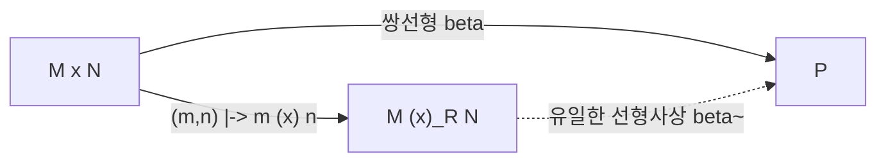

# 텐서곱

# 개요

텐서곱은 두 [가군](modules.md) `M`, `N` 에서 새 가군 `M ⊗_R N` 을 만드는 구성으로, "쌍선형 사상을 선형 사상으로 바꿔 주는 가장 경제적인 장치" 로 정의된다. 두 변수에 각각 선형인 사상은 다루기 번거롭지만, 텐서곱을 거치면 한 변수 [선형사상](linear-maps.md)으로 환원되어 선형대수의 모든 도구를 다시 쓸 수 있다.

정의는 보편성질로 하고, 존재는 자유가군을 관계로 나누어 얻는다. 유한차원 벡터 공간에서는 기저의 곱으로 계산되고 차원이 곱해지며, 행렬 수준에서는 Kronecker product가 된다. 일반 환 위에서는 사정이 더 흥미로워서, 텐서곱은 우완전이지만 좌완전은 아니다. 이 실패가 torsion을 감지하고 Tor functor를 낳는다.

# 직관

## 쌍선형성을 선형화한다

행렬식, 내적, 다항식의 곱, 확률에서의 독립 결합은 모두 두 변수에 각각 선형인 사상이다. 이런 사상 `β : M × N -> P` 는 곱집합 `M × N` 위에서 정의되지만, `M × N` 은 가군으로서 직합 `M ⊕ N` 이고 `β` 는 그 위의 선형사상이 아니다. 예컨대 `β(2m, 2n) = 4 β(m, n)` 이므로 스칼라가 두 번 곱해진다.

텐서곱은 이 어긋남을 정면으로 해결한다. `M ⊗ N` 은 "쌍선형 사상이 선형 사상으로 보이는 새 좌표계" 이며, 모든 쌍선형 사상이 이 좌표계를 딱 한 번 거쳐 간다.

## 원소 수준의 그림

`M ⊗ N` 의 원소는 단순텐서 `m ⊗ n` 들의 유한 합이다. 계산 규칙은 쌍선형성이 강제하는 것뿐이다.

$$
(m + m') \otimes n = m \otimes n + m' \otimes n, \qquad r(m \otimes n) = (rm) \otimes n = m \otimes (rn)
$$

주의할 점 두 가지가 있다. 첫째, 일반 원소는 단순텐서가 아니다. 둘째, 표현이 유일하지 않다. `2 ⊗ 3` 과 `6 ⊗ 1` 은 `Z ⊗_Z Z` 에서 같은 원소다.

## 스칼라가 소멸시키는 예

가장 인상적인 계산은 다음이다.

$$
\mathbb{Z}/2\mathbb{Z} \otimes_{\mathbb{Z}} \mathbb{Z}/3\mathbb{Z} = 0
$$

`Z/2Z` 에서는 `3x = x` 이므로 임의의 단순텐서에 대해 `x ⊗ y = 3x ⊗ y = x ⊗ 3y` 인데, `Z/3Z` 에서는 `3y = 0` 이므로 이 값이 `0` 이다. 두 가군 모두 `0` 이 아닌데 텐서곱은 사라진다. 벡터 공간에서는 결코 일어나지 않는 현상이고, 스칼라환의 산술이 텐서곱에 직접 반영된다는 신호다.

# 정의

## 보편성질

`R` 을 가환환, `M`, `N`, `P` 를 `R`-가군이라 하자. 사상 `β : M × N -> P` 가 각 변수에서 선형이면 쌍선형이라 한다.

**정의.** `R`-가군 `M ⊗_R N` 과 쌍선형 사상 `⊗ : M × N -> M ⊗_R N` 의 쌍이 텐서곱이라는 것은, 임의의 쌍선형 `β : M × N -> P` 에 대해

$$
\beta = \tilde{\beta} \circ \otimes
$$

를 만족하는 `R`-선형사상 `β̃ : M ⊗_R N -> P` 가 유일하게 존재한다는 뜻이다.



보편성질로 정의된 대상이 늘 그렇듯 텐서곱은 유일하다. 두 텐서곱이 있으면 서로를 통해 유일한 사상이 오가고 그 합성이 항등사상이 되므로 표준 동형이 하나 정해진다. 이 논법은 [adjunction](adjunctions.md)의 unit이 갖는 보편성질과 같은 형태다.

## 존재 구성

집합 `M × N` 이 자유롭게 생성하는 자유 `R`-가군 `F` 를 잡는다. 즉 기호 `e_{(m,n)}` 들이 기저다. 부분가군 `K` 를 다음 원소들이 생성하도록 둔다.

$$
e_{(m+m',\,n)} - e_{(m,n)} - e_{(m',n)}, \qquad e_{(m,\,n+n')} - e_{(m,n)} - e_{(m,n')}
$$

$$
e_{(rm,\,n)} - r\,e_{(m,n)}, \qquad e_{(m,\,rn)} - r\,e_{(m,n)}
$$

그리고

$$
M \otimes_R N := F / K, \qquad m \otimes n := e_{(m,n)} + K
$$

로 정의한다. 구성상 `⊗` 는 쌍선형이고, `F` 의 보편성질(기저 위의 값이 사상을 결정한다)에 `K` 가 핵에 들어간다는 조건을 더하면 보편성질이 그대로 나온다.

## 기저에 의한 계산

`V`, `W` 가 체 `k` 위 벡터 공간이고 기저가 각각 `{v_1, ..., v_m}`, `{w_1, ..., w_n}` 이면, 원소들

$$
\{ v_i \otimes w_j : 1 \le i \le m,\ 1 \le j \le n \}
$$

가 `V ⊗_k W` 의 기저다. 따라서 차원 공식

$$
\dim (V \otimes_k W) = (\dim V)(\dim W)
$$

가 성립한다. 직합의 차원이 더해지는 것과 대비된다. 자유가군에 대해서도 같은 진술이 성립하여 `R^m ⊗_R R^n ≅ R^{mn}` 이다.

## 사상의 텐서곱

`f : M -> M'`, `g : N -> N'` 이 선형이면 `f ⊗ g : M ⊗ N -> M' ⊗ N'` 이 `(f ⊗ g)(m ⊗ n) = f(m) ⊗ g(n)` 으로 잘 정의된다. 이로써 `- ⊗ N` 은 가군 범주 위의 functor가 된다.

## 기본 동형

다음은 모두 표준 동형이며 보편성질로 곧바로 확인된다.

$$
M \otimes_R N \cong N \otimes_R M, \qquad (M \otimes_R N) \otimes_R P \cong M \otimes_R (N \otimes_R P)
$$

$$
R \otimes_R M \cong M, \qquad \Big(\bigoplus_{i} M_i\Big) \otimes_R N \cong \bigoplus_{i} (M_i \otimes_R N)
$$

마지막 줄, 즉 직합과의 교환은 텐서곱이 left adjoint라는 사실의 그림자다.

# 성질

## 텐서-Hom adjunction

가장 중요한 성질은 다음 자연동형이다.

$$
\operatorname{Hom}_R(M \otimes_R N, P) \;\cong\; \operatorname{Hom}_R\big(M, \operatorname{Hom}_R(N, P)\big)
$$

좌변의 사상은 `M × N` 위의 쌍선형 사상과 같고, 우변은 "`m` 을 넣으면 `N -> P` 사상이 나오는" 사상이다. 둘 다 결국 같은 데이터를 가리킨다. 범주론의 언어로는

$$
- \otimes_R N \;\dashv\; \operatorname{Hom}_R(N, -)
$$

이며, 자세한 틀은 [Adjunction](adjunctions.md)에 있다. 집합에서의 curry와 uncurry가 그대로 대수 버전으로 옮겨온 것이다.

## 우완전성

**정리.** `N` 을 고정하면 `- ⊗_R N` 은 우완전이다. 즉 정확열

$$
A \to B \to C \to 0
$$

에 텐서곱을 적용한

$$
A \otimes N \to B \otimes N \to C \otimes N \to 0
$$

도 정확하다.

*증명 스케치.* 위 adjunction에 의해 `- ⊗ N` 은 left adjoint이고, left adjoint는 여극한을 보존한다. 전사와 몫은 여극한으로 표현되므로 오른쪽 끝의 정확성이 따라온다. 직접 증명도 짧다. `C ⊗ N` 이 `B ⊗ N` 의 몫으로서 갖는 보편성질을 확인하면 된다. ∎

## 좌완전성의 실패

단사성은 보존되지 않는다. 표준 반례는 곱하기 `2` 로 주어지는 단사 `Z -> Z` 에 `Z/2Z` 를 텐서한 것이다.

$$
\mathbb{Z} \xrightarrow{\ \times 2\ } \mathbb{Z} \quad \Longrightarrow \quad \mathbb{Z}/2\mathbb{Z} \xrightarrow{\ 0\ } \mathbb{Z}/2\mathbb{Z}
$$

왼쪽은 단사지만 오른쪽은 영사상이다. 이 실패의 정도를 재는 것이 Tor functor이고, 예컨대 `Tor_1^Z(Z/2Z, Z/2Z) = Z/2Z` 다. `- ⊗ N` 이 항상 단사성을 보존하는 가군 `N` 을 평탄(flat) 가군이라 한다. 자유가군은 평탄하고, PID 위에서는 torsion-free와 평탄이 같다.

## 스칼라 확장

환 준동형 `f : R -> S` 가 있으면 `S` 는 `R`-가군이므로

$$
M \;\longmapsto\; S \otimes_R M
$$

가 `R`-가군을 `S`-가군으로 보낸다. 이를 스칼라 확장이라 하고, 스칼라를 잊는 제한 functor의 left adjoint다.

$$
\operatorname{Hom}_S(S \otimes_R M, N) \cong \operatorname{Hom}_R(M, N)
$$

구체적인 예가 실수 벡터 공간의 복소화 `C ⊗_R V` 다. 실수 `n` 차원 공간은 복소 `n` 차원 공간이 되고, 실행렬은 같은 성분의 복소행렬이 된다. 실수 위에서는 [고윳값](eigenvalues.md)이 없던 회전행렬이 복소화 후 대각화되는 일이 여기서 일어난다. 국소화 `S^{-1}R ⊗_R M` 도 같은 형태이며 [국소화](localization-rings.md)에서 다룬다.

## 체 위에서 무너지는 미묘함

체 위 벡터 공간은 모두 자유이므로 텐서곱은 완전 functor이고, 차원 공식 하나로 모든 것이 끝난다. 위에서 본 소멸이나 Tor는 전부 `R` 이 체가 아니어서 생기는 현상이다. 즉 텐서곱의 난이도는 계수환의 난이도와 정확히 같다.

# 활용

## Kronecker product

기저를 고정하면 텐서곱은 행렬 연산이 된다. `A` 가 `m × n`, `B` 가 `p × q` 일 때 `A ⊗ B` 는 `mp × nq` 블록 행렬

$$
A \otimes B = \begin{pmatrix} a_{11}B & \cdots & a_{1n}B \\ \vdots & & \vdots \\ a_{m1}B & \cdots & a_{mn}B \end{pmatrix}
$$

이며, 선형사상의 텐서곱을 표현한다.[^1] 유용한 항등식이 몇 개 있다.

$$
(A \otimes B)(C \otimes D) = (AC) \otimes (BD), \qquad \operatorname{tr}(A \otimes B) = \operatorname{tr}(A)\operatorname{tr}(B)
$$

$$
\det(A \otimes B) = (\det A)^{q} (\det B)^{n} \quad (A \text{ 는 } n \times n,\ B \text{ 는 } q \times q)
$$

정사각행렬의 고윳값은 곱으로 나타난다. `A` 의 고윳값이 `λ_i`, `B` 의 고윳값이 `μ_j` 이면 `A ⊗ B` 의 고윳값은 `λ_i μ_j` 전부다.

```python
import numpy as np

A = np.array([[1, 2],
              [0, 3]])
B = np.array([[0, 1],
              [1, 0]])

K = np.kron(A, B)                     # 4x4, 선형사상 A (x) B 의 행렬
print(K.shape)                        # (4, 4)

# 항등식 (A (x) B)(C (x) D) = AC (x) BD 확인
C = np.array([[2, 0], [1, 1]])
D = np.array([[1, 1], [0, 1]])
assert np.allclose(np.kron(A, B) @ np.kron(C, D), np.kron(A @ C, B @ D))

# 고윳값은 곱으로 나타난다
ev = np.sort(np.linalg.eigvals(K).real)
prod = np.sort(np.outer(np.linalg.eigvals(A), np.linalg.eigvals(B)).real.ravel())
assert np.allclose(ev, prod)

# 단순텐서가 아닌 원소: 랭크가 1이 아니면 v (x) w 꼴이 아니다
x = np.array([1, 0, 0, 1])            # (1,1) 성분과 (2,2) 성분만 있는 텐서
print(np.linalg.matrix_rank(x.reshape(2, 2)))   # 2 이므로 단순텐서가 아니다
```

마지막 세 줄이 실용적이다. `V ⊗ W` 의 원소를 행렬로 펼쳤을 때 랭크가 `1` 인 것이 정확히 단순텐서이고, 양자정보에서 얽힘 여부를 판정하는 기준도 이것이다.

## 다중선형대수

텐서곱을 반복하면 `T^k(V) = V ⊗ ... ⊗ V` 를 얻고, 대칭·반대칭 몫을 취하면 대칭곱과 외적대수가 나온다. 외적대수 `Λ^n V` 가 1차원이라는 사실이 [행렬식](determinants.md)의 존재와 유일성을 설명한다. 미분기하에서 계량과 미분형식이 모두 접공간의 텐서이며, [Riemann 계량](riemannian-metrics.md)은 대칭 2차 텐서장이다.

## 표현론

두 표현의 텐서곱은 다시 표현이고, 지표는 곱으로 계산된다.

$$
\chi_{V \otimes W}(g) = \chi_V(g)\, \chi_W(g)
$$

이 성질이 [군의 표현과 지표](group-representations.md)에서 기약표현의 곱을 분해하는 계산의 출발점이며, 물리의 각운동량 합성 규칙이 같은 계산이다.

## 대수와 기하

- 두 `R`-대수 `A`, `B` 의 텐서곱 `A ⊗_R B` 는 다시 대수이고, 기하적으로는 두 스킴의 올곱에 해당한다. [체의 확대](field-extensions.md)에서 `K ⊗_k L` 을 계산하면 두 확대가 얼마나 독립적인지가 드러난다.
- 다항식환끼리의 관계 `k[x] ⊗_k k[y] ≅ k[x, y]` 는 [다항식환](polynomial-rings.md)의 변수 추가가 텐서곱임을 말한다.
- 기계학습과 수치계산에서 고차원 배열의 분해(CP 분해, Tucker 분해)는 텐서곱 공간의 낮은 랭크 근사이며, 행렬에서의 [특이값 분해](singular-value-decomposition.md)를 다중선형으로 밀어 올린 것이다.[^2]

[^1]: Wikipedia, Kronecker product, https://en.wikipedia.org/wiki/Kronecker_product
[^2]: Wikipedia, Tensor rank decomposition, https://en.wikipedia.org/wiki/Tensor_rank_decomposition

# 연관 문서

## 선수지식

- [가군](modules.md)
- [선형사상](linear-maps.md)

## 더 알아보기

아직 연결한 문서가 없다.
