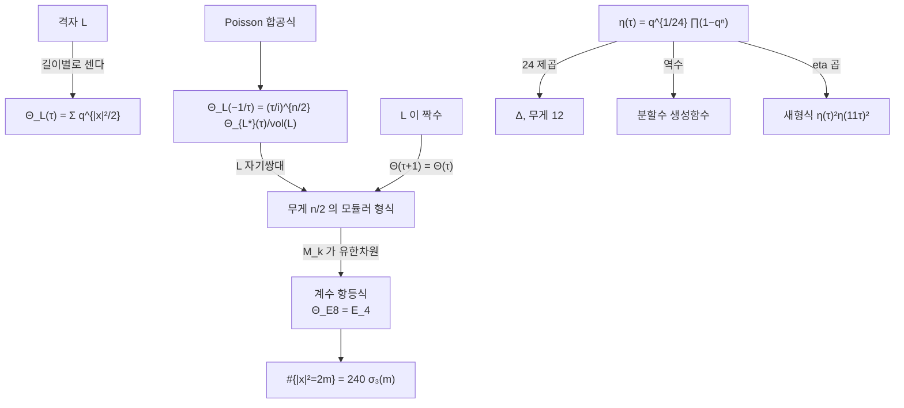

# theta 급수와 Dedekind eta

# 개요

[격자](lattices.md) $L\subset\mathbb R^n$ 의 벡터를 길이별로 세어 생성함수로 묶은 것이 **theta 급수**다.

$$
\Theta_L(\tau)=\sum_{x\in L}q^{|x|^2/2},\qquad q=e^{2\pi i\tau}
$$

이 급수가 격자에 대한 조건이 맞으면 [모듈러 형식](modular-forms.md)이 된다. Poisson 합공식이 $\tau\mapsto-1/\tau$ 변환을 주고, 격자가 짝수이면 $\tau\mapsto\tau+1$ 변환이 공짜로 따라온다.

모듈러 형식의 공간은 유한차원이므로 여기서 곧바로 이득이 나온다. 차원이 $1$ 인 공간에 두 대상이 들어가면 그 둘은 상수배 차이뿐이고, 첫 계수를 맞추면 **모든** 계수가 같아진다. $E_8$ 격자에서 이 논법이 한 줄로 끝난다.

$$
\Theta_{E_8}=E_4\ \Longrightarrow\ \#\{x\in E_8:|x|^2=2m\}=240\,\sigma_3(m)
$$

8 차원 격자의 벡터를 세는 조합 문제가 약수의 세제곱합이라는 정수론적 답을 갖는다.

반대편에 **Dedekind eta 함수**가 있다. 무한곱으로 정의되고 무게가 $1/2$ 인 반정수 무게의 형식이며, 24 제곱이 판별식 첨점형식 $\Delta$ 다. 격자를 세는 theta 와 분할을 세는 eta 가 같은 변환군 아래에서 만난다.

# 직관

## Poisson 합공식이 변환식을 만든다

$\mathbb R^n$ 의 Gauss 함수 $f_t(x)=e^{-\pi t|x|^2}$ 는 Fourier 변환에 대해 거의 자기 자신이다.

$$
\widehat{f_t}(y)=t^{-n/2}e^{-\pi|y|^2/t}=t^{-n/2}f_{1/t}(y)
$$

격자 위의 Poisson 합공식 $\sum_{x\in L}f(x)=\frac1{\mathrm{vol}(L)}\sum_{y\in L^*}\hat f(y)$ 에 넣으면 $t$ 와 $1/t$ 가 바뀐다.

$$
\Theta_L(-1/\tau)=\frac{(\tau/i)^{n/2}}{\mathrm{vol}(L)}\,\Theta_{L^*}(\tau)
$$

$L$ 이 자기쌍대($L^*=L$, 곧 유니모듈러)이면 오른쪽이 다시 $\Theta_L$ 이라 이 식이 무게 $n/2$ 의 모듈러 변환이 된다. 그리고 $L$ 이 짝수 격자이면 모든 $|x|^2$ 가 짝수라 $q$ 의 지수가 정수이고, $\Theta_L(\tau+1)=\Theta_L(\tau)$ 다. 두 변환이 $\mathrm{SL}_2(\mathbb Z)$ 를 생성하므로 $\Theta_L$ 이 모듈러 형식이다.

[Tate 논문](tate-thesis.md)에서 $\zeta$ 의 함수방정식을 준 것도 같은 Poisson 합공식이었다. 자기쌍대성이 대칭을 낳는 구조가 격자에서 반복된다.

## 유한차원성이 격자를 센다

$\Theta_L$ 이 무게 $n/2$ 의 모듈러 형식이라는 것만으로 많은 것이 결정된다. $n=8$ 이면 무게 4 이고 $M_4(\mathrm{SL}_2(\mathbb Z))$ 는 $E_4$ 가 생성하는 1 차원 공간이다. 상수항이 둘 다 $1$ 이므로

$$
\Theta_{E_8}=E_4=1+240\sum_{m\ge1}\sigma_3(m)q^m
$$

이고 계수를 비교하면 벡터 개수가 나온다. 격자의 기하를 전혀 들여다보지 않고, 공간의 차원이 1 이라는 사실만으로 얻은 결과다.

$n=16$ 에서 더 놀라운 일이 생긴다. 짝수 유니모듈러 격자가 $E_8\oplus E_8$ 와 $D_{16}^+$ 두 개 있는데, $M_8$ 도 1 차원이라 두 theta 급수가 **같다**. 길이 분포가 완전히 같은 서로 다른 격자다. Milnor 가 이것으로 "북소리로 북의 모양을 들을 수 없다" 는 현상의 16 차원 예를 만들었다.

## eta 의 $1/24$ 은 어디서 오는가

Dedekind eta 는 무한곱이다.

$$
\eta(\tau)=q^{1/24}\prod_{n\ge1}(1-q^n)
$$

앞의 $q^{1/24}$ 가 없으면 변환식이 성립하지 않는다. 이유는 $\Delta=\eta^{24}$ 에서 보인다. $\Delta$ 는 무게 12 의 첨점형식이고 $q$ 로 시작하므로, 24 제곱근인 $\eta$ 는 무게 $1/2$ 이고 $q^{1/24}$ 로 시작해야 한다. 지수 $1/24$ 는 $\Delta$ 의 $q^1$ 을 24 등분한 것이다.

무게가 정수가 아니므로 $\eta$ 는 엄밀히는 모듈러 형식이 아니다. 변환할 때 24 차 단위근이 곱해지며, 그 부호 규칙을 **곱셈자 시스템**이라 한다. 반정수 무게 이론 전체가 이 곱셈자를 다루는 기술이다.



# 정의

## 격자의 theta 급수

$L\subset\mathbb R^n$ 이 완전계수 격자일 때

$$
\Theta_L(\tau)=\sum_{x\in L}e^{\pi i\tau|x|^2}=\sum_{m\ge0}N_L(m)\,q^{m/2},\qquad
N_L(m)=\#\{x\in L:|x|^2=m\}
$$

로 둔다. $L$ 이 **짝수**라는 것은 모든 $|x|^2$ 가 짝수라는 뜻이고, **유니모듈러**라는 것은 $L^*=L$, 곧 Gram 행렬의 행렬식이 $1$ 이라는 뜻이다.

$E_8$ 은 다음으로 정의되는 8 차원 짝수 유니모듈러 격자다.

$$
E_8=\Big\{x\in\mathbb Z^8:\textstyle\sum x_i\in2\mathbb Z\Big\}\ \cup\
\Big\{x\in(\mathbb Z+\tfrac12)^8:\textstyle\sum x_i\in2\mathbb Z\Big\}
$$

## Jacobi theta 와 삼중곱

고전적 theta 함수는 변수 두 개짜리다.

$$
\vartheta(z,\tau)=\sum_{n\in\mathbb Z}q^{n^2/2}w^n,\qquad w=e^{2\pi iz}
$$

**Jacobi 삼중곱 항등식**이 이 합을 곱으로 바꾼다.

$$
\sum_{n\in\mathbb Z}q^{n^2/2}w^n=\prod_{n\ge1}(1-q^n)(1+q^{n-1/2}w)(1+q^{n-1/2}w^{-1})
$$

$\mathbb Z$ 격자의 theta 급수가 $\vartheta(0,\tau)$ 이며, 위 항등식이 합과 곱 두 서술을 잇는다.

## Dedekind eta 와 변환식

$$
\eta(\tau)=q^{1/24}\prod_{n\ge1}(1-q^n),\qquad
\eta(\tau+1)=e^{\pi i/12}\eta(\tau),\qquad
\eta(-1/\tau)=\sqrt{-i\tau}\ \eta(\tau)
$$

두 번째 식이 $\eta$ 를 계산 가능하게 만든다. $\tau$ 의 허수부가 작으면 $q$ 가 $1$ 에 가까워 곱이 느리게 수렴하는데, $-1/\tau$ 로 옮기면 급수가 빠르게 수렴한다.

# 성질

## 짝수 유니모듈러 격자의 분류

> 짝수 유니모듈러 격자는 $n\equiv0\pmod8$ 일 때만 존재한다[^1]. 각 차원에서의 개수는 $n=8$ 에서 1 개($E_8$), $n=16$ 에서 2 개, $n=24$ 에서 24 개(Niemeier 격자)다.

$8\mid n$ 이라는 조건이 theta 급수에서 바로 나온다. $\Theta_L$ 이 무게 $n/2$ 이려면 변환식의 인자 $(\tau/i)^{n/2}$ 가 모듈러 형식의 규약과 맞아야 하고, $\mathrm{SL}_2(\mathbb Z)$ 의 관계식이 $n$ 을 8 의 배수로 강제한다.

차원 $n=24$ 에서 $M_{12}$ 가 2 차원($E_4^3$ 와 $\Delta$ 가 기저)이라 theta 급수가 상수항 $1$ 과 $\Delta$ 의 계수 하나로 결정된다. 그 자유도가 최소벡터 개수 $N_L(2)$ 이며, $N_L(2)=0$ 인 유일한 격자가 **Leech 격자**다. 최소벡터가 없다는 것이 24 차원 [구 채우기](sphere-packing.md)의 최적성으로 이어진다.

## 계수 항등식

$\Theta_{E_8}=E_4$ 에서 $N_{E_8}(2m)=240\sigma_3(m)$ 이 나온다. 같은 논법의 다른 예들이 있다.

| 격자 | 무게 | 공간 | theta 급수 |
|---|---|---|---|
| $E_8$ | 4 | $M_4$, 1 차원 | $E_4$ |
| $E_8\oplus E_8$, $D_{16}^+$ | 8 | $M_8$, 1 차원 | $E_4^2$ (두 격자가 같은 급수) |
| Niemeier 격자 | 12 | $M_{12}$, 2 차원 | $E_4^3-\frac{N_L(2)-1104}{720}\Delta$ 꼴 |
| Leech | 12 | $M_{12}$ | $E_4^3-\frac{720}{691}\Delta$ |

두 번째 줄이 격자가 theta 급수로 결정되지 않는다는 것을 보여 준다. 길이 분포는 격자의 완전한 불변량이 아니다.

## eta 곱과 첨점형식

$\eta$ 를 여러 개 곱해 만든 형식을 **eta 곱**이라 한다. 무게와 레벨이 지수로 계산되며, 낮은 레벨의 첨점형식이 종종 이 꼴로 명시된다.

$$
\Delta(\tau)=\eta(\tau)^{24},\qquad
\eta(\tau)^2\eta(11\tau)^2\in S_2(\Gamma_0(11)),\qquad
\eta(\tau)\eta(23\tau)\in S_1(\Gamma_0(23),\chi)
$$

두 번째가 [Hecke 작용소](hecke-operators.md) 문서에서 다룬 레벨 11 새형식이고, $X_0(11)$ 의 정칙 미분형식이다. 무한곱 하나가 타원곡선의 점 개수를 전부 담고 있다는 뜻이다.

## 분할수와 오각수

$\eta$ 의 역수가 [분할수](partitions.md)의 생성함수다.

$$
\prod_{n\ge1}\frac1{1-q^n}=\sum_{n\ge0}p(n)q^n
$$

반대로 곱 자체는 Jacobi 삼중곱의 특수한 경우로 아주 성긴 급수가 된다. Euler 의 **오각수 정리**다.

$$
\prod_{n\ge1}(1-q^n)=\sum_{k\in\mathbb Z}(-1)^kq^{k(3k-1)/2}
=1-q-q^2+q^5+q^7-q^{12}-q^{15}+\cdots
$$

무한 개의 항을 곱했는데 살아남는 계수가 $0,\pm1$ 뿐이다. 이 성김이 $p(n)$ 을 계산하는 빠른 점화식을 주고, $\eta$ 가 첨점형식의 재료가 되는 이유이기도 하다.

# 활용

## 두 항등식을 직접 센다

$E_8$ 의 벡터를 정의대로 전수조사해 세고 $240\sigma_3(m)$ 과 맞춰 본다. 반정수 좌표는 2 배해 정수로 다루면 편하다. 이어서 오각수 정리를 다항식 곱으로 확인한다.

```python
from itertools import product

# E8 = {x ∈ Z^8 : Σx_i 짝수} ∪ {x ∈ (Z+1/2)^8 : Σx_i 짝수},  좌표를 2배해 정수로 다룬다
def theta_E8(maxnorm=8):
    cnt = [0] * (maxnorm + 1)
    for v in product(range(-2, 3), repeat=8):              # 정수 벡터
        if sum(v) % 2: continue
        n = sum(c * c for c in v)
        if n <= maxnorm: cnt[n] += 1
    for h in product((-3, -1, 1, 3), repeat=8):            # 반정수 벡터 (2배한 좌표)
        if sum(h) % 4: continue                            # Σx_i = Σh_i/2 가 짝수
        n4 = sum(c * c for c in h)
        if n4 % 4 == 0 and n4 // 4 <= maxnorm: cnt[n4 // 4] += 1
    return cnt

def sigma3(n):
    return sum(d ** 3 for d in range(1, n + 1) if n % d == 0)

cnt = theta_E8(6)
print(f"{'norm²':>6} {'E8 벡터 수':>12} {'240·σ₃(m)':>12}")
ok = cnt[0] == 1
for n in range(0, 7, 2):
    m = n // 2
    pred = 1 if m == 0 else 240 * sigma3(m)
    ok &= cnt[n] == pred
    print(f"{n:>6} {cnt[n]:>12} {pred:>12}")
print("홀수 norm² 벡터가 없다 :", all(cnt[n] == 0 for n in range(1, 7, 2)))
print("Θ_E8 = E_4 의 계수와 일치 :", ok)

# Euler 의 오각수 정리 : ∏(1-q^n) = Σ_k (-1)^k q^{k(3k-1)/2}
N = 60
prod_ = [0] * N; prod_[0] = 1
for n in range(1, N):
    new = prod_[:]
    for i in range(N - n):
        new[i + n] -= prod_[i]
    prod_ = new
pent = [0] * N
for k in range(-15, 16):
    e = (3 * k * k - k) // 2
    if e < N: pent[e] += (-1) ** k
print("오각수 정리 ∏(1-qⁿ) = Σ(-1)^k q^{k(3k-1)/2} :", prod_ == pent)
print("  계수 0..20 :", prod_[:21])

#  norm²      E8 벡터 수    240·σ₃(m)
#      0            1            1
#      2          240          240
#      4         2160         2160
#      6         6720         6720
# 홀수 norm² 벡터가 없다 : True
# Θ_E8 = E_4 의 계수와 일치 : True
# 오각수 정리 ∏(1-qⁿ) = Σ(-1)^k q^{k(3k-1)/2} : True
#   계수 0..20 : [1, -1, -1, 0, 0, 1, 0, 1, 0, 0, 0, 0, -1, 0, 0, -1, 0, 0, 0, 0, 0]
```

$2160=240\cdot9=240\cdot(1^3+2^3)$ 이고 $6720=240\cdot28=240\cdot(1^3+3^3)$ 이다. 8 차원 공간에서 길이가 정확히 $\sqrt6$ 인 격자점이 몇 개인지를 묻는 기하 문제의 답이 $3$ 의 약수의 세제곱합으로 나온다. 두 문제 사이에 직접적인 관계는 전혀 보이지 않는데, $M_4$ 가 1 차원이라는 사실 하나가 둘을 잇는다.

오각수 정리의 계수 배열에서 $0$ 이 아닌 자리가 $0,1,2,5,7,12,15,\dots$ 다. 일반 오각수 $k(3k-1)/2$ 의 목록이고, 그 사이는 전부 $0$ 이다.

## 어디에 쓰이는가

- **구 채우기.** $E_8$ 과 Leech 격자의 최적성 증명에서 theta 급수가 핵심 재료다. Viazovska 의 마법함수 구성이 준모듈러 형식으로 이루어진다.
- **부호 이론.** 이진 부호의 무게 열거다항식과 격자의 theta 급수가 Construction A 로 대응하고, MacWilliams 항등식이 theta 변환식에 대응한다.
- **끈 이론과 등각장론.** 분배함수가 $\eta$ 와 theta 의 비로 쓰이며, 모듈러 불변성이 물리적 무모순성 조건이 된다. 24 와 $1/24$ 이 도처에 나타나는 이유다.
- **표현론.** Leech 격자에서 만든 정점작용소대수의 자기동형군이 Monster 군이고, 그 지표의 생성함수가 $j$ 함수라는 괴물 달빛 현상이 여기서 출발한다.

[^1]: 짝수 유니모듈러 격자의 분류, Niemeier 목록, 각 격자의 theta 급수는 J. Conway, N. Sloane, *Sphere Packings, Lattices and Groups* (3판, 1999) 의 4장, 7장, 16장. Jacobi 삼중곱과 오각수 정리는 G. Andrews, *The Theory of Partitions* (1976) 2장. $\eta$ 의 변환식은 T. Apostol, *Modular Functions and Dirichlet Series in Number Theory* (2판, 1990) 3장. 본문의 계산은 직접 한 것이다.

# 연관 문서

## 선수지식

- [모듈러 형식](modular-forms.md)
- [격자와 최단벡터 문제](lattices.md)
- [Poisson 합 공식](poisson-summation.md)

## 더 알아보기

- [괴물 달빛 추측](monstrous-moonshine.md)
- [Mock 모듈러 형식과 Zwegers 이론](mock-modular-forms.md)
- [Niemeier 격자와 24 차원 분류](niemeier-lattices.md)
- [Weil 표현과 theta 대응](weil-representation.md)

#number_theory #combinatorics #complex_analysis
