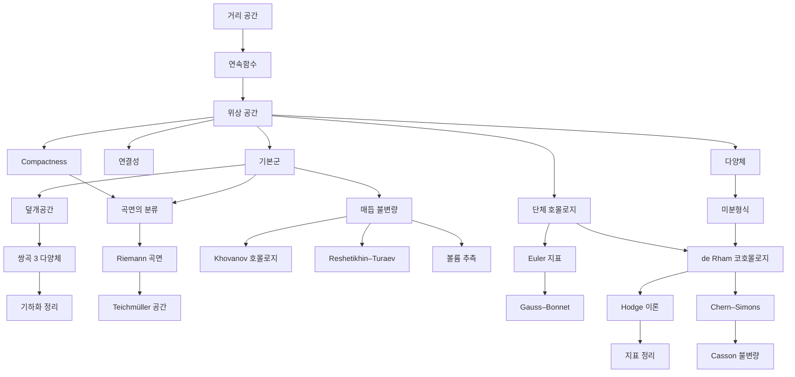

# 위상수학 개관

# 개요

위상수학은 늘리고 구부려도 변하지 않는 성질을 다룬다. 물음은 "두 공간이 같은가" 이고, 답은 대개 불변량으로 온다. 연결성분의 수, 기본군, 호몰로지, Euler 지표, 매듭 다항식이 그것이다. 위상수학의 갈래는 다섯 줄기다. 열린집합의 언어인 점집합 위상, 불변량을 만드는 대수적 위상, 미적분이 되는 공간인 다양체, 3 차원과 매듭, 그리고 물리에서 온 양자 위상이다. 정수론과 만나는 산술 위상, 곧 에탈 코호몰로지와 기하학적 Langlands 는 [정수론 개관](number-theory-overview.md)에 있다.

시작은 [거리 공간](metric-spaces.md)에서 [위상 공간](topology.md)으로 가는 추상화다. 거기서 [콤팩트성](compactness.md)과 [연결성](connectedness.md)이 점집합 위상의 두 축이고, [기본군](fundamental-group.md)과 [단체 호몰로지](homology.md)가 대수적 위상의 두 입구이며, [다양체](manifolds.md)가 기하로 가는 문이다.

# 지도

# 갈래

## 점집합 위상

- [거리 공간](metric-spaces.md) → [위상 공간](topology.md): 거리를 버리고 열린집합만 남기기
- [콤팩트성](compactness.md), [연결성](connectedness.md): 두 기본 불변량

## 대수적 위상

- [기본군](fundamental-group.md) → [덮개공간](covering-spaces.md): 고리와 그 들어 올림
- [단체 호몰로지](homology.md) → [Euler 지표](euler-characteristic.md) → [평면 그래프](planar-graphs.md), [곡면의 분류](classification-of-surfaces.md)
- [de Rham 코호몰로지](de-rham-cohomology.md) → [Hodge 이론](hodge-theory.md) → [Kähler 다양체](kahler-manifolds.md), [지표 정리](index-theorem.md)
- [Reidemeister 비틀림](reidemeister-torsion.md) → [s-코보디즘 정리](s-cobordism.md): 단순 호모토피와 고차원 분류

## 다양체와 기하

- [다양체](manifolds.md) → [미분형식과 Stokes 정리](differential-forms.md)
- [Gauss–Bonnet 정리](gauss-bonnet.md) → [Poincaré–Hopf 정리](poincare-hopf.md): 곡률과 위상의 첫 만남
- [Riemann 곡면과 균일화 정리](riemann-surfaces.md) → [Teichmüller 공간](teichmuller-space.md)
- [Fredholm 작용소와 지표](fredholm-operators.md): 지표 정리의 해석 쪽

## 3 차원과 매듭

- [매듭 불변량과 Jones 다항식](knot-invariants.md) → [땋임군](braid-groups.md), [Khovanov 호몰로지](khovanov-homology.md)
- [쌍곡 3 다양체와 Mostow 강직성](hyperbolic-3-manifolds.md) → [기하화 정리](geometrization.md)
- [Lobachevsky 함수](lobachevsky-function.md) → [볼륨 추측](volume-conjecture.md): 양자 불변량이 쌍곡 부피를 본다
- [Casson 불변량](casson-invariant.md) → [순간자 Floer 호몰로지](instanton-floer-homology.md)

## 양자 위상

- [Chern–Simons 이론](chern-simons.md) → [Wess–Zumino–Witten 모형](wess-zumino-witten.md), [Witten 점근 추측](witten-asymptotics.md)
- [모듈러 텐서범주와 3 차원 TQFT](modular-tensor-categories.md)(topological quantum field theory) → [Reshetikhin–Turaev 불변량](reshetikhin-turaev.md), [애니온과 위상적 양자계산](anyons.md)

# 연관 문서

## 선수지식

- [집합](sets.md)

## 더 알아보기

- [거리 공간](metric-spaces.md)
- [위상 공간](topology.md)

#topology #algebraic_topology #overview
