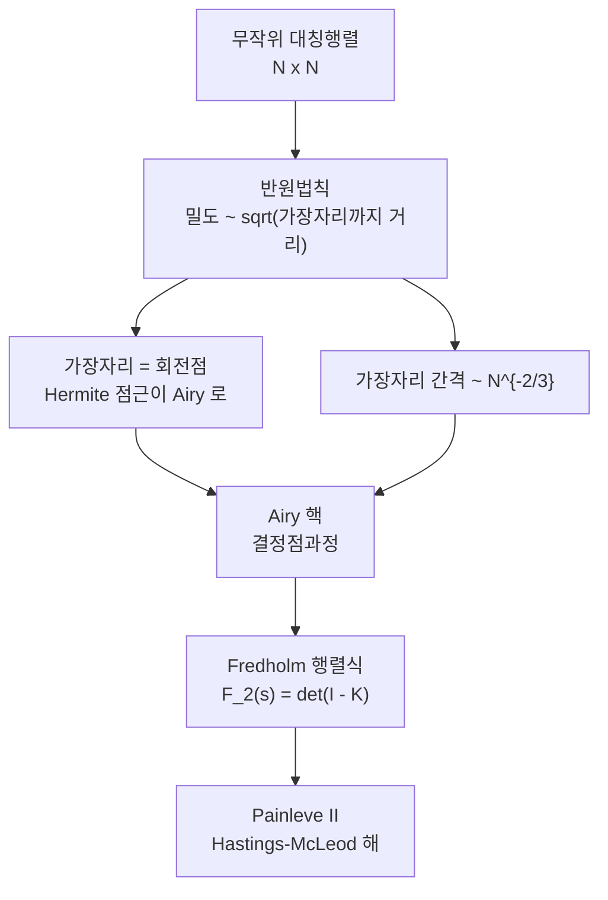

# Tracy–Widom 분포와 Airy 핵

# 개요

[중심극한정리](central-limit-theorem.md)는 독립인 양들을 더하면 세부 사정과 무관하게 정규분포가 나온다고 말한다. 더하는 대신 최댓값을 취하고 그 대상이 서로 밀어내는 무작위 행렬의 [고윳값](eigenvalues.md)이면 다른 극한이 나오며, 그것이 **Tracy–Widom 분포**다.

$N \times N$ 무작위 대칭행렬의 고윳값은 반원 모양으로 퍼지고, 최대 고윳값은 반원의 오른쪽 끝 $2\sqrt N$ 근처에 놓인다. 그 요동의 크기는 $N^{-1/6}$ 이라는 어중간한 지수를 가지며, 적절히 규격화하면

$$
N^{2/3}\left(\frac{\lambda_{\max}}{\sqrt N} - 2\right) \thickspace\longrightarrow\thickspace \mathrm{TW}\_\beta
$$

로 수렴한다. 극한분포는 [Airy 함수](airy-functions.md)로 만든 적분핵의 Fredholm 행렬식으로도, Painlevé II 방정식의 특정 해로도 쓰인다. 스펙트럼의 가장자리는 고윳값이 있는 영역과 없는 영역이 만나는 회전점이므로 Airy 함수가 나타난다.

# 직관

## 지수 $2/3$

반원법칙에 따르면 고윳값 밀도는 가장자리 $2\sqrt N$ 근처에서 제곱근으로 사라진다. 가장자리에서 거리 $\delta$ 안에 들어 있는 고윳값의 개수는 밀도를 적분해

$$
\char35{}\lbrace\lambda : \lambda \gt 2\sqrt N - \delta\rbrace \thickspace\sim\thickspace N\cdot\delta^{3/2}
$$

규모다. 이 개수가 1 이 되는 $\delta \sim N^{-2/3}$ 이 가장자리 고윳값들의 간격이고, 요동의 규모가 간격과 같으므로 $\lambda_{\max}$ 의 요동도 $N^{-2/3}$ 이다. 제곱근 밀도 하나에서 지수 $2/3$ 이 결정된다.

## 정규분포와의 차이

고윳값들은 독립이 아니다. 결합밀도의 인자 $\prod_{i\lt j}\lvert\lambda_i - \lambda_j\rvert^{\beta}$ 가 고윳값을 서로 밀어낸다. 최대 고윳값이 위로 올라가려면 아래 고윳값들을 전부 밀어야 하고 아래로 내려가려면 스펙트럼 전체가 수축해야 하므로, 양쪽 꼬리가 정규분포보다 가볍고 좌우가 비대칭이다. 왼쪽이 $e^{-\lvert s\rvert^3/12}$ , 오른쪽이 $e^{-\frac43 s^{3/2}}$ 로 지수가 다르다.

## 가장자리와 회전점

고윳값 밀도가 있는 곳과 없는 곳의 경계는 [WKB 근사](wkb-approximation.md)의 언어로 파동이 진동하는 영역과 지수적으로 감쇠하는 영역의 경계, 곧 회전점이다. Hermite 다항식의 점근을 가장자리에서 확대하면 Airy 함수가 나오고 고윳값 상관을 기술하는 핵이 Airy 핵으로 수렴한다. 회전점 근방의 보편성이 확률론의 보편성이 된다.

# 정의

## 세 가지 앙상블

행렬 성분을 어떻게 뽑는가에 따라 세 표준 앙상블이 있고, 고윳값 반발의 세기 $\beta$ 로 구분한다.

| 이름 | 성분 | $\beta$ | 극한분포 |
|---|---|---|---|
| GOE | 실 대칭, 성분 독립 정규 | 1 | $F_1$ |
| GUE | Hermite, 성분 독립 복소 정규 | 2 | $F_2$ |
| GSE | 사원수 자기쌍대 | 4 | $F_4$ |

성분이 정규분포가 아니어도 평균 0 과 유한한 네 번째 적률만 있으면 같은 극한이 나온다. 정규분포가 독립합의 보편 극한인 것과 같은 지위다.

## Airy 핵과 Fredholm 행렬식

GUE 의 고윳값은 **결정점과정**을 이룬다. $k$ 개의 고윳값이 특정 위치들에 있을 상관함수가 하나의 핵 $K$ 의 $k\times k$ 행렬식으로 쓰인다는 뜻이다. 가장자리를 $N^{2/3}$ 배로 확대하면 그 핵이

$$
K_{\mathrm{Ai}}(x,y) = \frac{\mathrm{Ai}(x)\mathrm{Ai}'(y) - \mathrm{Ai}'(x)\mathrm{Ai}(y)}{x-y}
= \int_0^\infty \mathrm{Ai}(x+t)\mathrm{Ai}(y+t)\thinspace dt
$$

로 수렴한다. 첫 표현의 분자는 [Airy 함수](airy-functions.md)의 Wronskian 형태이고, $x \to y$ 극한에서 $\mathrm{Ai}'(x)^2 - x\mathrm{Ai}(x)^2$ 이 되어 특이하지 않다. 두 번째 표현은 이 핵이 양의 준정부호임을 바로 보여 준다.

최대 고윳값이 $s$ 이하일 확률은 구간 $(s,\infty)$ 에 점이 하나도 없을 확률이므로

$$
F_2(s) = \det\left(I - K_{\mathrm{Ai}}\right)\_{L^2(s,\infty)}
$$

다. Fredholm 행렬식은 핵의 자취들로 만든 급수 $\exp\bigl(-\sum_{k\ge1}\tfrac1k\mathrm{tr}K^k\bigr)$ 로 정의된다.

## Painlevé II 표현

Tracy 와 Widom 의 정리는 이 행렬식을 상미분방정식으로 바꾼다. Painlevé II 방정식

$$
q''(x) = x\thinspace q(x) + 2q(x)^3
$$

의 해 가운데 $x \to +\infty$ 에서 $q(x) \sim \mathrm{Ai}(x)$ 인 것을 **Hastings–McLeod 해**라 하며, 이것이 유일하게 존재한다. 그러면

$$
F_2(s) = \exp\left(-\int_s^{\infty}(x-s)\thinspace q(x)^2\thinspace dx\right)
$$

이고, $F_1$ 과 $F_4$ 도 같은 $q$ 로

$$
F_1(s)^2 = F_2(s)\thinspace e^{-\int_s^\infty q},
\qquad
F_4(s/\sqrt2)^2 = F_2(s)\left(\cosh\int_s^\infty q\right)^2
$$

처럼 쓰인다. 무한차원 행렬식이 2계 상미분방정식 하나로 줄어들고, 수치표가 이 표현으로 계산된다. Painlevé II 에서 비선형항 $2q^3$ 를 빼면 Airy 방정식이므로 $q$ 는 Airy 함수의 비선형 변형이다.

# 성질

## 값과 꼬리

| $\beta$ | 평균 | 분산 | 왜도 |
|---|---|---|---|
| 1 (GOE) | $-1.2065$ | $1.6078$ | $0.293$ |
| 2 (GUE) | $-1.7711$ | $0.8132$ | $0.224$ |
| 4 (GSE) | $-2.3069$ | $0.5177$ | $0.166$ |

평균이 음수인 것은 반발 때문에 $\lambda_{\max}$ 가 반원의 끝보다 평균적으로 안쪽에 있다는 뜻이다. $\beta$ 가 커지면 반발이 세져 분포가 더 왼쪽으로 가고 더 좁아진다.

꼬리는 양쪽이 다르다.

$$
1 - F_2(s) \sim \frac{e^{-\frac43 s^{3/2}}}{16\pi s^{3/2}}\ (s\to+\infty),
\qquad
F_2(s) \sim \exp\left(-\frac{\lvert s\rvert^{3}}{12}\right)\ (s\to-\infty)
$$

오른쪽 꼬리의 $e^{-\frac43 s^{3/2}}$ 는 $\mathrm{Ai}(s)^2$ 의 감쇠이며, 고윳값 하나가 혼자 멀리 나가는 사건이다. 왼쪽 꼬리는 지수가 3 으로, 스펙트럼 전체가 함께 움직이는 큰 편차 사건이라 더 비싸다.

## 보편성

같은 극한이 무작위 행렬 바깥에서도 나타난다. **최장증가부분수열**이 대표적이다. $n$ 개 원소의 무작위 순열에서 가장 긴 증가부분수열의 길이 $\ell_n$ 은 $2\sqrt n$ 근처에 있고, Baik–Deift–Johansson 의 정리가

$$
\frac{\ell_n - 2\sqrt n}{n^{1/6}} \thickspace\longrightarrow\thickspace \mathrm{TW}\_2
$$

를 준다. 순열에는 행렬도 고윳값도 없지만 같은 분포가 나온다. 무작위 성장 모형(모서리 성장, ASEP, 방향성 중합체)에서도 요동이 $t^{1/3}$ 규모이고 극한이 Tracy–Widom 이며, 이 부류를 **KPZ 보편성류**라 한다.

# 활용

## Fredholm 행렬식의 수치 계산

[Fredholm 행렬식](fredholm-determinant.md) 문서의 Nyström 구적을 Airy 핵에 적용하면 분포를 정의에서 직접 계산한다. 무한구간 $(s,\infty)$ 은 $x = s + L\tan(\pi u/4)$ 로 옮기고, 필요한 것은 $\mathrm{Ai}$ 와 $\mathrm{Ai}'$ 뿐이라 작은 $\lvert x\rvert$ 에서는 전평면 수렴 급수를 큰 $x$ 에서는 점근급수를 쓴다.

핵이 해석적이므로 Nyström 근사가 지수적으로 수렴하고, 무한차원 행렬식이 마디 스무 개의 행렬식 하나로 열두 자리 정확도에 도달한다. 같은 구적으로 평균과 분산을 적분하면 위 표의 $-1.7710868074$ 와 $0.8131947928$ 을 열 자리까지 재현한다. 쓰인 재료는 $\mathrm{Ai}$ 의 급수와 Gauss 구적과 LU 분해뿐이다.

## 쓰이는 자리

주성분분석에서 "이 고윳값이 잡음인가 신호인가" 를 판정할 때가 대표적이다. 자료가 순수한 잡음이라면 표본공분산행렬의 최대 고윳값은 Tracy–Widom 을 따르므로, 관측값이 그 분포의 상위 백분위를 넘는지로 유의성을 판단한다. 정규분포 대신 이 분포를 써야 하는 것은 고윳값 사이의 반발 때문이며, 정규근사를 쓰면 신호를 과대검출한다.

무선통신의 스펙트럼 감지, 금융 상관행렬에서 의미 있는 요인 수 결정, 성장 모형과 교통 흐름의 요동 분석에도 같은 판정 도구가 쓰인다. 전혀 다른 기원을 가진 문제들이 같은 분포표 하나를 공유한다는 것이 이 주제의 요점이다.[^1]

[^1]: Craig A. Tracy, Harold Widom, *Level-spacing distributions and the Airy kernel*, Communications in Mathematical Physics 159 (1994), 151–174. Airy 핵의 Fredholm 행렬식과 Painlevé II 표현의 원논문.

# 연관 문서

## 선수지식

- [Wigner 반원법칙](wigner-semicircle.md)
- [Painlevé 방정식과 등모노드로미 변형](painleve-equations.md)
- [결정점과정](determinantal-point-process.md)

## 더 알아보기

아직 연결한 문서가 없다.

#probability #analysis #linear_algebra
