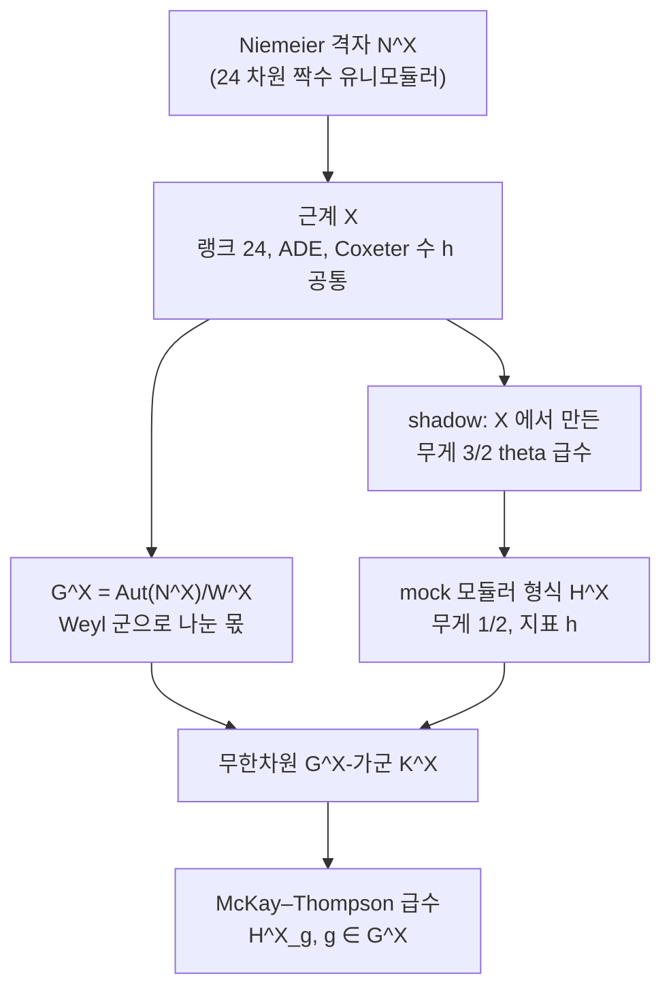

# Umbral moonshine 과 Mathieu 달빛

# 개요

[괴물 달빛](monstrous-moonshine.md)은 한 번의 기적처럼 보였다. 가장 큰 산재군 하나와 모듈러 함수 하나가 짝을 이루고, Borcherds 의 증명이 그 짝을 설명하면서 이야기가 닫혔다. 그런데 2010 년에 Eguchi, Ooguri, Tachikawa 가 전혀 다른 자리에서 같은 종류의 숫자놀이를 발견했다.

출발점은 K3 곡면의 **타원 종수**다. 위상적 불변량 하나를 두 변수 $q,y$ 의 급수로 확장한 것이고, $N=4$ 초등각대수의 지표들로 분해하면 계수가 줄줄이 나온다. 그 계수들이 이랬다.

$$
-2,\quad 90,\quad 462,\quad 1540,\quad 4554,\quad 11592,\ \dots
$$

전부 짝수라 반으로 나누면 $1,45,231,770,2277,5796$ 이다. 이것이 [Mathieu 군](mathieu-groups.md) $M_{24}$ 의 기약표현 차원 목록에 그대로 들어 있다. McKay 가 $196884=196883+1$ 을 본 것과 같은 종류의 일치이고, 이번에는 우연이라 하기에 항이 너무 여러 개 맞았다.

괴물 달빛과 결정적으로 다른 점이 둘이다.

- 모듈러 쪽 대상이 모듈러 형식이 **아니다**. 계수를 담는 함수 $H(\tau)$ 는 Ramanujan 이 마지막 편지에 남긴 mock theta 함수와 같은 종류, 곧 **mock 모듈러 형식**이다. 변환법칙이 딱 맞지 않고 비정칙 보정항을 더해야 맞는다.
- 사례가 하나가 아니다. Cheng, Duncan, Harvey 가 2012 년에 이 현상이 **23 개**의 짝을 이루는 집합의 한 원소임을 보였다. 색인 집합은 Leech 격자를 제외한 23 개의 **Niemeier 격자**, 곧 24 차원 짝수 유니모듈러 격자다.

이 23 겹 짝짓기가 **umbral moonshine** 이다. 이름은 그림자를 뜻하는 라틴어 $umbra$ 에서 왔다. mock 모듈러 형식에는 **shadow** 라 불리는 진짜 모듈러 형식이 딸려 있고, 각 사례에서 그 shadow 가 해당 Niemeier 격자의 근계로 만들어진 theta 급수이기 때문이다. 달빛 이야기에 그림자가 붙었다는 말장난이 그대로 정의가 되었다.

# 직관

## mock 모듈러 형식과 shadow

정칙함수이면서 모듈러 변환을 만족하라는 요구는 매우 빡빡해서, 주어진 무게와 지표에서 해가 유한차원 공간뿐이다. Ramanujan 의 mock theta 함수들은 "거의" 그 조건을 만족하는데 정확히는 아닌 함수들이었고, 80 년 동안 그 "거의" 가 무슨 뜻인지 정식화되지 않았다.

Zwegers 가 2002 년에 답을 냈다. mock 모듈러 형식 $H$ 에는 **shadow** 라 부르는 정칙 모듈러 형식 $g$ 가 있고, $H$ 에 $g$ 로 만든 비정칙 적분을 더하면 변환법칙이 정확히 맞는다.

$$
\widehat H(\tau)=H(\tau)+\underbrace{\text{(}g\text{ 의 비정칙 Eichler 적분)}}_{\text{정칙성을 깨고 모듈러성을 복구}}
$$

$\widehat H$ 는 모듈러이지만 정칙이 아니고, $H$ 는 정칙이지만 모듈러가 아니다. 둘 중 하나를 포기해야 하는 상황이고, 어느 쪽을 포기했는지를 재는 양이 shadow 다. $g=0$ 이면 보통 모듈러 형식으로 돌아온다.

달빛 쪽에서 이 구조가 필연인 이유는 물리 쪽 언어로 설명된다. $N=4$ 초등각대수의 지표 가운데 **짧은**(BPS) 것은 그 자체로 모듈러 성질이 나쁘고, 긴 지표들과 섞여야 전체가 모듈러가 된다. 타원 종수 전체는 좋은 Jacobi 형식인데 그것을 짧은 조각과 긴 조각으로 갈라놓으면 각 조각의 모듈러성이 깨진다. 갈라놓은 자리에서 정확히 mock 이 나온다. 괴물 달빛에서는 이런 분해가 없었으므로 순수한 모듈러 함수로 끝났다.

## 색인 구조

괴물 달빛의 구조는 "군 하나 + 그 군의 원소마다 함수 하나" 였다. umbral moonshine 은 한 겹이 더 있다.

Niemeier 격자 하나를 고르면 나머지가 전부 따라 나온다. 근계 $X$ 가 격자의 근으로 정해지고, 격자의 자기동형군을 Weyl 군으로 나눈 몫이 달빛 군 $G^X$ 이며, 근계에서 만든 theta 급수가 shadow 이고, 그 shadow 를 갖는 mock 모듈러 형식이 $H^X$ 다. $X=A_1^{24}$ 인 경우가 $G^X=M_{24}$ 이고 Mathieu 달빛이다.

Weyl 군을 나눠 버리는 것이 핵심이다. 근계의 대칭 중 "자명한" 부분인 반사들을 걷어내면 근계 성분들을 뒤섞는 순열 대칭만 남고, $A_1^{24}$ 에서 그것이 24 개 성분의 순열 중 격자가 허용하는 것들, 곧 Golay 부호의 자기동형군 $M_{24}$ 다. [Mathieu 군 문서](mathieu-groups.md)에서 $M_{24}$ 가 Golay 부호에서 나온 것과 같은 군이 여기서 격자의 몫으로 다시 나타난다.

## 23 이라는 수의 출처

24 차원 짝수 유니모듈러 양의정부호 격자는 정확히 24 개다(Niemeier, 1973). 그중 근이 하나도 없는 것이 Leech 격자이고, 나머지 23 개는 각각 랭크 24 짜리 ADE 근계를 갖는다. 근계가 격자를 결정하므로 23 개의 근계 목록이 곧 23 개의 격자 목록이다.

이 근계들에는 눈에 띄는 제약이 있다. 기약 성분들의 **Coxeter 수가 전부 같다**. 이 제약과 "랭크 합이 24" 만으로 가능한 조합을 세면 답이 정확히 23 개가 된다. 무게가 나가는 정리 없이 초등적인 열거로 확인할 수 있고, 아래 성질 절에서 직접 센다.

# 정의

## K3 타원 종수

콤팩트 초켈러 곡면 $X$ 의 **타원 종수**는 두 변수 함수다.

$$
Z_X(\tau,z)=\mathrm{tr}_{\mathcal H_{RR}}\left((-1)^Fy^{J_0}q^{L_0-c/24}\bar q^{\bar L_0-c/24}\right),\qquad q=e^{2\pi i\tau},\ y=e^{2\pi iz}
$$

우변은 물리적 표현이지만 결과는 순수하게 위상적이고, $X$ 의 변형에 불변이다. K3 곡면에 대해 이것은 무게 $0$ 과 지표 $1$ 의 약한 Jacobi 형식이고 그런 형식의 공간이 1 차원이라 정규화 하나로 결정된다.

$$
Z_{K3}(\tau,z)=8\left[\left(\frac{\theta_2(\tau,z)}{\theta_2(\tau,0)}\right)^2+\left(\frac{\theta_3(\tau,z)}{\theta_3(\tau,0)}\right)^2+\left(\frac{\theta_4(\tau,z)}{\theta_4(\tau,0)}\right)^2\right]
$$

$z=0$ 을 넣으면 $Z_{K3}(\tau,0)=24=\chi(K3)$ 로 Euler 지표가 나온다.

## EOT 분해와 $H(\tau)$

$Z_{K3}$ 를 $c=6$ 인 $N=4$ 초등각대수의 지표로 분해한다. 짧은 지표 하나와 긴 지표들의 무한합으로 갈라진다.

$$
Z_{K3}(\tau,z)=24\thinspace\mathrm{ch}_{\frac14,0}(\tau,z)+\sum_{n\ge0}A_n\thinspace\mathrm{ch}_{n+\frac14,\frac12}(\tau,z)
$$

계수를 모은 생성함수를 놓는다.

$$
H(\tau)=2q^{-1/8}\left(-1+\sum_{n\ge1}A_nq^n\right)=2q^{-1/8}\left(-1+45q+231q^2+770q^3+2277q^4+5796q^5+\cdots\right)
$$

> **Mathieu 달빛 관찰 (EOT 2010).** $H$ 의 계수가 $M_{24}$ 의 기약표현 차원의 음이 아닌 정수 조합이고, 더 나아가 각 $g\in M_{24}$ 마다 적절한 mock 모듈러 형식 $H_g$ 가 있어 $H_e=H$ 이고 계수가 $g$ 에서의 지표값이 된다.

$H$ 는 무게 $1/2$ 와 지표 2 의 mock 모듈러 형식이고 shadow 는 $24\thinspace\theta(\tau)$ 꼴의 무게 $3/2$ 단항 theta 급수다.

## Umbral moonshine 의 일반형

$N^X$ 를 근계 $X$ 를 갖는 Niemeier 격자, $W^X$ 를 그 Weyl 군이라 하고

$$
G^X=\mathrm{Aut}(N^X)/W^X
$$

를 **umbral 군**이라 한다. $m=h(X)$ 를 $X$ 의 공통 Coxeter 수라 할 때, 각 $g\in G^X$ 에 대응하는 무게 $1/2$ 와 지표 $m$ 의 벡터값 mock 모듈러 형식 $H^X_g=(H^X_{g,r})_{r\bmod 2m}$ 이 정해지고 그 shadow 는 $X$ 의 근계 theta 급수에 $g$ 의 작용을 얹은 것이다.

> **Umbral moonshine 추측 (CDH 2012).** 각 $X$ 마다 무한차원 등급 $G^X$ 가군 $K^X$ 가 있어, 그 등급 지표의 생성함수가 정확히 $H^X_g$ 다.

$X=A_1^{24}$ 이면 $m=2$ 이고 $G^X=M_{24}$ 이며 앞의 Mathieu 달빛이 된다.

# 성질

## 23 개를 직접 세기

Niemeier 근계가 만족하는 두 조건, 곧 **랭크 합이 24** 이고 **모든 기약 성분의 Coxeter 수가 같다**는 것만으로 후보를 전부 열거한다. $A_n$ 의 Coxeter 수는 $n+1$ 이고, $D_n$ 은 $2n-2$ 이며, $E_6,E_7,E_8$ 은 각각 $12,18,30$ 이다.

열거가 끝이라는 것은 $h$ 가 커지면 성분 랭크가 24 를 넘어 버리기 때문이다. 다섯 줄짜리 재귀가 Niemeier 의 분류 목록을 그대로 재현하고, 이 23 줄이 umbral moonshine 의 색인표가 된다. $A_1^{24}$ 가 맨 위, $D_{24}$ 가 맨 아래이고 그 사이가 전부 개별 달빛 사례다.

주의할 점은 이 열거가 **필요조건의 열거**라는 것이다. 두 조건을 만족하는 조합이 23 개라는 것과 각 조합이 실제로 Niemeier 격자를 하나씩 준다는 것은 다른 문제이고, 후자는 격자를 실제로 구성해야 한다. 목록의 크기는 초등적인 조합 제약에서 나온다.

## 사례 몇 개

| 근계 $X$ | $h(X)$ | umbral 군 $G^X$ |
|---|---|---|
| $A_1^{24}$ | 2 | $M_{24}$ |
| $A_2^{12}$ | 3 | $2.M_{12}$ |
| $A_3^{8}$ | 4 | $2.\mathrm{AGL}_3(2)$ |
| $D_4^{6}$ | 6 | $\mathrm{GL}_2(3)$ |
| $A_{24}$ | 25 | $\mathbb Z/2$ |
| $D_{24}$ | 46 | 자명군 |

근계가 잘게 쪼개져 있을수록 성분을 뒤섞을 여지가 많아 군이 크다. $A_1^{24}$ 에서 성분이 24 개로 최대이고 군도 $M_{24}$ 로 가장 크다. 반대쪽 끝 $D_{24}$ 는 성분이 하나뿐이라 뒤섞을 것이 없고 군이 자명하다. $M_{24}$ 사례가 가장 풍부하므로 먼저 발견됐다.

$A_2^{12}$ 의 $2.M_{12}$ 처럼 중심확대가 나타나는 것도 구조적이다. 근계 성분의 자기동형 중 Dynkin 도표의 대칭($A_n$ 의 뒤집기)이 남아서 순열군 위에 확대를 만든다.

## 증명 상황

| 진술 | 상태 |
|---|---|
| $M_{24}$ 가군의 존재 | Gannon (2016) 증명 |
| 23 개 전부의 가군 존재 | Duncan–Griffin–Ono (2015) 증명 |
| 자연스러운 구성 | 주어지지 않음[^1] |

존재 증명의 전략은 괴물 달빛의 $V^\natural$ 같은 대상을 만드는 것이 아니다. 각 $g$ 에 대한 mock 모듈러 형식을 명시적으로 구성한 뒤, 가정된 가군의 등급 지표 중복도가 지표표의 직교관계로 결정되므로 그것이 전부 음이 아닌 정수임을 보이면 된다. 그 정수성과 양성은 Rademacher 합과 mock 모듈러 형식의 점근 해석으로 처리한다.[^1]

가군의 존재는 증명되었지만 그 가군의 구성은 주어지지 않았다[^1]. 괴물 달빛에서 $V^\natural$ 이 먼저 주어졌던 것과 다른 점이다.

## K3 시그마 모형과의 간극

가장 자연스러운 후보는 K3 곡면 위의 시그마 모형이었다. 타원 종수에서 나온 현상이니 그 물리 모형의 상태공간이 $M_{24}$ 표현이면 이야기가 끝난다. 그런데 Gaberdiel, Hohenegger, Volpato 가 K3 시그마 모형의 대칭군을 분류했고, 답이 부정적이었다. 가능한 대칭군은 Leech 격자 자기동형군 $\mathrm{Co}\_0$ 의 특정 부분군들이고, 그중 $M_{24}$ 전체를 실현하는 것은 없다.

모듈라이 공간의 점마다 대칭군이 다르고 각각은 $M_{24}$ 의 진부분군이며, 전체를 합쳐야 $M_{24}$ 가 생성된다. 어떤 한 점에서도 전체 대칭이 보이지 않는데 불변량에는 전체 대칭이 남는다. 이 긴장이 umbral moonshine 의 핵심 수수께끼이고, 답이 모듈라이 공간 전체를 보는 어떤 대상에 있으리라는 것이 현재의 짐작이다.

# 활용

## Mock 모듈러 형식의 지위 변화

Ramanujan 의 mock theta 함수는 오랫동안 고립된 호기심이었다. Zwegers 의 정식화가 이론을 만들었고, umbral moonshine 은 그 이론이 필요한 자리를 대규모로 공급했다. 실제로 23 개 사례에 나타나는 $H^X$ 중 여럿이 Ramanujan 의 목록에 있던 함수들이고, 100 년 전의 계산이 어느 Niemeier 격자에 붙는지가 이제 설명된다.

이 방향으로 mock 모듈러 형식은 분할수의 점근, 계급수 관계, [세타 급수](theta-functions.md)의 비정칙 확장으로 퍼졌고, Hurwitz 계급수 생성함수가 무게 $3/2$ mock 모듈러 형식이라는 고전적 사실이 같은 틀 안에 들어왔다.

## 끈이론의 BPS 상태 세기

타원 종수는 BPS 상태의 지표 세기이고, 블랙홀 엔트로피의 미시적 계산이 같은 형태의 급수로 나온다. $N=4$ 초대칭 끈 이론의 dyon 세기 함수가 Siegel 모듈러 형식이고, 그것을 분해할 때 나오는 조각이 mock 모듈러 형식이라는 것을 Dabholkar, Murthy, Zagier 가 보였다. 벽 넘기 현상(모듈라이를 바꾸면 상태 수가 점프하는 것)이 mock 성질, 곧 shadow 의 존재와 대응한다. 세기 함수가 왜 순수한 모듈러 형식이 아닌지가 물리적 이유를 갖는다.

## 산재군을 보는 새로운 창

괴물 달빛이 끝났을 때 남은 질문은 "다른 산재군에도 비슷한 것이 있는가" 였다. umbral moonshine 은 $M_{24}$ 와 $M_{12}$ 를 포함한 여러 군에 대해 그렇다고 답했고, 이후 Conway 군 $\mathrm{Co}_0$ 에 대한 달빛, Thompson 군 달빛, $O'Nan$ 군 달빛이 이어졌다. 마지막 것은 특히 흥미로운데, $O'Nan$ 달빛의 계수가 [타원곡선](elliptic-curves.md)의 계급수와 Selmer 군 정보를 담고 있어 산재군이 산술적 대상과 연결된다.

[유한 단순군 분류](finite-simple-groups.md)가 26 개의 산재군을 예외로 남긴 뒤, 그 예외들이 왜 존재하는지는 여전히 설명되지 않았다. 달빛 현상들은 그 설명이 군론 바깥, 모듈러 형식과 등각장론 쪽에 있으리라는 가장 강한 증거다.

[^1]: 원 관찰은 T. Eguchi, H. Ooguri, Y. Tachikawa, *Notes on the K3 surface and the Mathieu group M_24*, Exper. Math. 20 (2011). 일반화는 M. Cheng, J. Duncan, J. Harvey, *Umbral moonshine*, Commun. Number Theory Phys. 8 (2014). 존재 증명은 J. Duncan, M. Griffin, K. Ono, *Proof of the umbral moonshine conjecture*, Res. Math. Sci. 2 (2015) 와 $M_{24}$ 경우의 T. Gannon, *Much ado about Mathieu*, Adv. Math. 301 (2016). mock 모듈러 형식의 기초는 S. Zwegers 의 2002 년 학위논문과 D. Zagier 의 Bourbaki 강연 986 (2009). K3 시그마 모형 대칭의 분류는 M. Gaberdiel, S. Hohenegger, R. Volpato, *Mathieu twining characters for K3*, JHEP (2010). 본문의 근계 열거는 직접 계산한 것이다.

# 연관 문서

## 선수지식

- [괴물 달빛 추측](monstrous-moonshine.md)
- [Mathieu 군과 Golay 부호](mathieu-groups.md)
- [Mock 모듈러 형식과 Zwegers 이론](mock-modular-forms.md)
- [Niemeier 격자와 24 차원 분류](niemeier-lattices.md)

## 더 알아보기

아직 연결한 문서가 없다.

#number_theory #group_theory #complex_analysis
