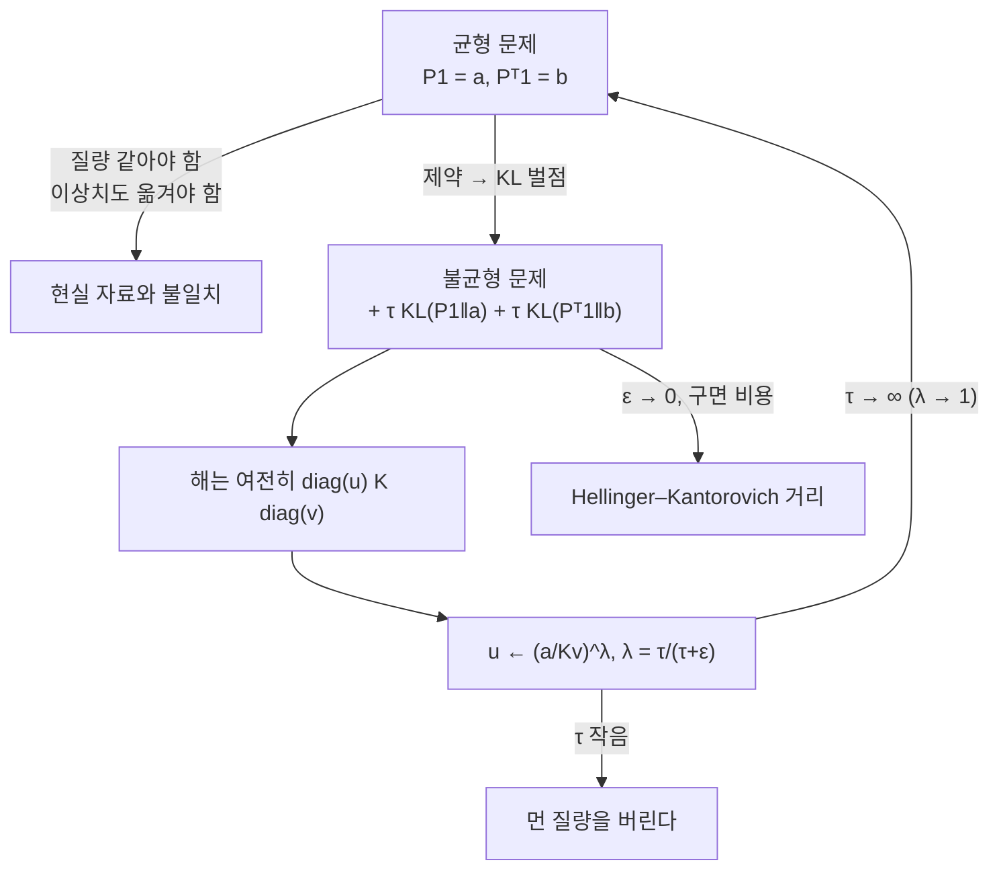

# 불균형 최적 수송

# 개요

최적 수송 문제는 결합의 집합 $\Pi(a,b)$ 위에서 정의된다. 이 집합이 비어 있지 않으려면 두 분포의 총질량이 같아야 하고, 나아가 **모든** 질량이 반드시 어딘가로 가야 한다. 실제 자료에서는 두 조건 모두 무리한 요구다. 표본 크기가 다르고, 이상치가 섞여 있고, 세포가 분열하거나 죽는다.

한 점만 멀리 떨어져 있어도 균형 문제는 그 질량을 끝까지 옮긴다. 비용이 거리의 제곱이면 이상치 하나가 전체 비용을 지배한다.

**불균형 최적 수송**은 주변분포 제약을 등식에서 벌점으로 바꾼다[^1].

$$
\min_{P\ge0}\ \langle C,P\rangle+\varepsilon\,\mathrm{KL}(P\,\|\,a\otimes b)
+\tau\,\mathrm{KL}(P\mathbf 1\,\|\,a)+\tau\,\mathrm{KL}(P^\top\mathbf 1\,\|\,b)
$$

$\tau$ 가 "질량을 버리는 값" 과 "멀리 옮기는 값" 사이의 환율이다. $\tau\to\infty$ 면 벌점이 제약으로 돌아가 [Sinkhorn](sinkhorn.md) 문제가 되고, $\tau$ 가 작으면 먼 질량을 아예 포기한다.

놀라운 것은 알고리즘이 거의 그대로라는 점이다. 최적해는 여전히 대각 스케일링 꼴이고, 반복에 지수 하나만 붙는다.

$$
u\leftarrow\Big(\frac a{Kv}\Big)^{\!\lambda},\qquad \lambda=\frac\tau{\tau+\varepsilon}
$$

# 직관

## 제약을 값으로 바꾼다

등식 제약 $P\mathbf 1=a$ 는 "행 합이 $a$ 와 다르면 벌금이 무한대" 라는 말과 같다. 무한대를 유한한 값으로 낮추면 최적화가 스스로 저울질한다. 어떤 질량을 옮기는 비용이 그 질량을 버리는 벌금보다 크면 버린다.

벌금의 척도로 $\mathrm{KL}$ 을 쓰는 이유는 두 가지다. 첫째, $\mathrm{KL}$ 이 이미 엔트로피 정규화에 쓰이고 있어 목적함수 전체가 같은 종류의 항으로 이루어진다. 둘째, $\mathrm{KL}(\mu\|\nu)$ 가 $\mu\ll\nu$ 를 요구하므로 질량이 없던 곳에 새로 생기는 일이 자동으로 막힌다. 질량은 줄일 수는 있어도 무에서 만들어지지는 않는다.

## 왜 지수 하나만 붙는가

균형 문제의 일계 조건은 "행 합이 정확히 $a$ 가 되도록 $f$ 를 고른다" 였다. 벌점이 되면 조건이 달라진다. 행 합을 $a$ 에 맞추는 이득과 $f$ 를 움직이는 비용이 균형을 이루는 지점이 답이고, 두 항이 모두 로그 꼴이라 그 지점이 **기하평균**으로 나온다.

$$
f_i\ \longleftarrow\ -\lambda\,\varepsilon\log\sum_jb_j\,e^{(g_j-C_{ij})/\varepsilon},\qquad
\lambda=\frac\tau{\tau+\varepsilon}\in(0,1)
$$

$\lambda=1$ 이면 균형 갱신이고, $\lambda<1$ 이면 그 방향으로 덜 간다. 곧 불균형 Sinkhorn 은 **완화된 Sinkhorn** 이다. 한 줄 고치면 구현이 끝나고, 로그 영역 안정화도 그대로 쓰인다.

$\lambda<1$ 은 축약을 오히려 강하게 만든다. 균형 문제에서 $\varepsilon\to0$ 일 때 반복이 폭증하던 것과 달리, 유한한 $\tau$ 는 갱신을 항상 덜 움직이게 해 수렴을 돕는다.



## 수송과 소멸 사이의 보간

$\tau$ 의 두 극한이 각각 익숙한 대상이다. $\tau\to\infty$ 는 균형 최적 수송이고, $\tau\to0$ 은 아무것도 옮기지 않고 전부 버리는 해 $P=0$ 이다. 그 사이에서 **어느 거리까지 옮길 가치가 있는가** 라는 임계 반지름이 정해진다.

제곱비용 $C=|x-y|^2$ 와 $\varepsilon=0$ 에서 이 임계값을 손으로 볼 수 있다. 질량 하나를 거리 $d$ 만큼 옮기는 값이 $d^2$ 이고 버리는 값이 대략 $2\tau$ 이므로, $d^2>2\tau$ 이면 버린다. $\sqrt{2\tau}$ 가 유효 사거리다. 이 성질이 이상치 강건성의 정체이며, 어떤 이상치를 무시할지 $\tau$ 하나로 조절된다.

# 정의

## 불균형 문제

$a\in\mathbb R^n_{>0}$, $b\in\mathbb R^m_{>0}$ 은 총질량이 달라도 된다. $C\in\mathbb R^{n\times m}_{\ge0}$ 에 대해

$$
\mathrm{UOT}_{\varepsilon,\tau}(a,b)=\min_{P\ge0}\ \langle C,P\rangle
+\varepsilon\,\mathrm{KL}(P\,\|\,a\otimes b)
+\tau\,\mathrm{KL}(P\mathbf 1\,\|\,a)+\tau\,\mathrm{KL}(P^\top\mathbf 1\,\|\,b)
$$

로 둔다. 여기서 $\mathrm{KL}(\mu\|\nu)=\sum\mu_i\log\frac{\mu_i}{\nu_i}-\mu_i+\nu_i$ 로, 총질량이 다른 측도에도 뜻이 있는 형태를 쓴다. 마지막 두 항이 없으면 [Sinkhorn](sinkhorn.md) 문제이고, 그 항들의 계수를 무한대로 보내면 등식 제약이 복원된다.

목적함수가 $P$ 에 대해 강볼록하고 아래로 유계이므로 최소점이 유일하다.

## 쌍대와 스케일링 반복

쌍대 문제는 제약 없는 오목 최대화다.

$$
\max_{f,g}\ -\tau\sum_ia_i\big(e^{-f_i/\tau}-1\big)-\tau\sum_jb_j\big(e^{-g_j/\tau}-1\big)
-\varepsilon\sum_{i,j}a_ib_j\big(e^{(f_i+g_j-C_{ij})/\varepsilon}-1\big)
$$

최적해가 $P_{ij}=a_ib_j\,e^{(f_i+g_j-C_{ij})/\varepsilon}$ 이고, 블록 좌표 상승법이 앞서 본 완화된 갱신이다.

$$
f_i\leftarrow-\lambda\varepsilon\log\sum_jb_je^{(g_j-C_{ij})/\varepsilon},\qquad
g_j\leftarrow-\lambda\varepsilon\log\sum_ia_ie^{(f_i-C_{ij})/\varepsilon},\qquad
\lambda=\frac\tau{\tau+\varepsilon}
$$

곱 형태로 쓰면 $u\leftarrow(a/Kv)^\lambda$, $v\leftarrow(b/K^\top u)^\lambda$ 다. 균형판과 코드가 한 글자 차이다.

## Hellinger–Kantorovich 거리

$\varepsilon=0$ 이고 두 벌점의 계수가 같으면, 이 최소값에서 거리가 나온다. 비용을 제곱거리 대신

$$
C(x,y)=-2\log\cos\big(\min(|x-y|,\tfrac\pi2)\big)
$$

로 잡으면 얻어지는 $\sqrt{\mathrm{UOT}}$ 가 양측도 공간 위의 거리이며 **Hellinger–Kantorovich 거리**(또는 Wasserstein–Fisher–Rao 거리)라 불린다. 가까운 질량은 수송으로, 먼 질량은 생성과 소멸로 처리하는 두 기하를 하나로 붙인 것이다. $\pi/2$ 에서 잘리는 것이 유효 사거리의 정확한 형태다.

# 성질

## 극한과 보간

- $\tau\to\infty$ : $\lambda\to1$ 이고 문제가 균형 엔트로피 정규화 최적 수송으로 수렴한다.
- $\tau\to0$ : 옮기는 것이 언제나 손해라 $P\to0$ 이다.
- $\varepsilon\to0$ : 엔트로피 흐림이 사라지고 Hellinger–Kantorovich 형태가 남는다.
- 총질량이 달라도 문제가 잘 정의되며, 최적해의 총질량은 $\min(\|a\|_1,\|b\|_1)$ 이하이고 $\tau$ 에 대해 단조증가한다.

## 알고리즘

반복 한 번의 비용이 균형판과 같은 $O(nm)$ 이고, 로그 영역 안정화가 그대로 적용된다. $\lambda<1$ 이 갱신을 축소하므로 Hilbert 사영 거리에서의 축약비가 균형판보다 작다. 곧 같은 $\varepsilon$ 에서 불균형 문제가 더 빨리 수렴한다.

편향은 균형판과 같은 방식으로 다룬다. $\mathrm{UOT}_{\varepsilon,\tau}(a,a)\ne0$ 이므로 Sinkhorn 발산과 똑같은 보정

$$
S_{\varepsilon,\tau}(a,b)=\mathrm{UOT}(a,b)-\tfrac12\mathrm{UOT}(a,a)-\tfrac12\mathrm{UOT}(b,b)+\text{(질량 보정항)}
$$

을 쓴다. 총질량이 다르면 상수항 보정이 하나 더 필요하다는 점만 다르다.

## 무엇이 보장되지 않는가

- $\tau$ 는 자료의 척도에 민감하다. 유효 사거리가 $\sqrt{2\tau}$ 규모이므로 좌표를 바꾸면 $\tau$ 도 함께 바꿔야 한다.
- 주변분포가 정확히 복원되지 않는다. 그것이 목적이지만, 주변분포를 보존해야 하는 응용에서는 잘못된 도구다.
- $\mathrm{UOT}$ 자체는 거리가 아니다. 위에서 말한 특정 비용과 $\varepsilon=0$ 에서만 거리가 된다.

# 활용

## 이상치 하나가 만드는 차이

원점 근처에 모인 두 분포에 멀리 떨어진 점 하나를 더한다. 균형 문제는 그 점의 질량 $0.2$ 를 거리 $10$ 가까이 옮겨야 하고, 비용이 그 하나로 결정된다. 불균형 문제가 $\tau$ 에 따라 어떻게 달라지는지 본다.

```python
import math

xs = [0.0, 0.1, 0.2, 0.3, 0.4]                    # 두 분포 모두 원점 근처
ys = [0.05, 0.15, 0.25, 0.35, 10.0]               # 마지막 하나만 멀리 떨어진 이상치
n, m = len(xs), len(ys)
a = [1 / n] * n
b = [0.2] * m                                     # 이상치에도 0.2 의 질량
C = [[(x - y) ** 2 for y in ys] for x in xs]

def lse(v):
    M = max(v)
    return M + math.log(sum(math.exp(t - M) for t in v))

def uot(eps, tau, iters=20000):
    """불균형 Sinkhorn. lam = tau/(tau+eps) = 1 이면 균형 문제."""
    lam = 1.0 if tau == math.inf else tau / (tau + eps)
    f, g = [0.0] * n, [0.0] * m
    for _ in range(iters):
        f = [-lam * eps * lse([math.log(b[j]) + (g[j] - C[i][j]) / eps for j in range(m)])
             for i in range(n)]
        g = [-lam * eps * lse([math.log(a[i]) + (f[i] - C[i][j]) / eps for i in range(n)])
             for j in range(m)]
    P = [[a[i] * b[j] * math.exp((f[i] + g[j] - C[i][j]) / eps) for j in range(m)]
         for i in range(n)]
    return P

def report(name, P):
    mass = sum(sum(r) for r in P)
    to_out = sum(P[i][m - 1] for i in range(n))
    cost = sum(P[i][j] * C[i][j] for i in range(n) for j in range(m))
    row = max(abs(sum(P[i]) - a[i]) for i in range(n))
    print(f"{name:>12} {mass:>10.6f} {to_out:>12.6f} {cost:>12.6f} {row:>12.2e}")

eps = 0.01
print(f"{'τ':>12} {'총 질량':>10} {'이상치로 간 질량':>12} {'수송 비용':>12} {'행 제약 위반':>12}")
report("∞ (균형)", uot(eps, math.inf))
for tau in (1000.0, 100.0, 10.0, 1.0, 0.1, 0.01):
    report(f"{tau}", uot(eps, tau))

#            τ       총 질량    이상치로 간 질량        수송 비용      행 제약 위반
#       ∞ (균형)   1.000000     0.200000    18.437080     8.01e-06
#       1000.0   0.985271     0.182921    16.862842     2.95e-03
#        100.0   0.936703     0.084743     7.814106     1.27e-02
#         10.0   0.893884     0.000022     0.006399     2.13e-02
#          1.0   0.888929     0.000000     0.004295     2.31e-02
#          0.1   0.843488     0.000000     0.003979     3.86e-02
#         0.01   0.598772     0.000000     0.002683     1.04e-01
```

균형 해의 수송 비용 $18.44$ 는 거의 전부 이상치에서 온다. $0.2\times10^2=20$ 에 가까운 값이고, 나머지 네 점의 기여는 $10^{-3}$ 규모다. 이상치 하나가 통계량 전체를 지배한다.

$\tau=10$ 에서 이상치로 가는 질량이 $2\times10^{-5}$ 로 떨어지고 비용이 $0.0064$ 가 된다. 세 자릿수 넘게 줄었다. 대가는 총질량이 $1$ 에서 $0.89$ 로 줄어든 것, 곧 질량의 11 퍼센트를 버린 것이다. 유효 사거리 $\sqrt{2\tau}\approx4.5$ 가 $10$ 보다 작다는 계산과 맞는다.

$\tau$ 를 키우면 균형 해로 되돌아간다. $\tau=1000$ 에서 이상치로 간 질량이 $0.183$ 으로 균형값 $0.2$ 에 가깝고, 행 제약 위반도 $3\times10^{-3}$ 까지 줄었다. $\lambda=\tau/(\tau+\varepsilon)$ 가 $1$ 로 가는 과정이 그대로 보인다.

반대로 $\tau=0.01$ 에서는 총질량이 $0.6$ 으로 떨어진다. 옮기는 값보다 버리는 값이 싸지는 지점이며, $\tau\to0$ 에서 $P\to0$ 이 되는 극한의 초입이다.

## 어디에 쓰이는가

- **단세포 유전체학.** 시점이 다른 세포 집단을 잇는 궤적 추론에서 세포는 분열하고 죽는다. 총질량 보존이 물리적으로 틀린 가정이라 불균형 수송이 표준이다.
- **부분 매칭과 점구름 정합.** 겹치는 부분만 대응시키고 나머지는 버려야 하는 형상 정합에서 $\tau$ 가 겹침의 허용 범위를 준다.
- **강건한 생성모형 손실.** 이상치가 섞인 표본에서 균형 Sinkhorn 발산은 이상치에 끌려가지만, 불균형판은 자동으로 무시한다.
- **영역 적응.** 출발 영역과 도착 영역의 부류 비율이 다를 때 균형 제약이 틀린 대응을 강제한다. 제약을 풀면 비율 차이를 모형이 스스로 흡수한다.

[^1]: 불균형 문제의 정식화와 스케일링 반복은 L. Chizat, G. Peyré, B. Schmitzer, F.-X. Vialard, *Scaling Algorithms for Unbalanced Optimal Transport Problems*, Math. Comp. 87 (2018), 2563–2609. Hellinger–Kantorovich 거리는 같은 저자들의 *An Interpolating Distance between Optimal Transport and Fisher–Rao Metrics*, Found. Comput. Math. 18 (2018), 1–44, 및 M. Liero, A. Mielke, G. Savaré, Invent. Math. 211 (2018). 본문의 수치 실험은 직접 한 것이다.

# 연관 문서

## 선수지식

- [Sinkhorn 알고리즘과 엔트로피 정규화](sinkhorn.md)

## 더 알아보기

아직 연결한 문서가 없다.

#optimization #machine_learning #measure_theory
