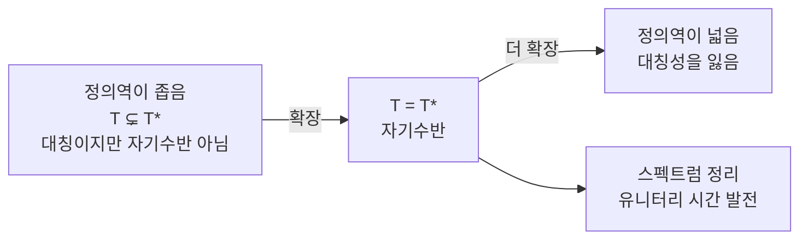

# 비유계 작용소와 Stone 정리

# 개요

물리와 미분방정식에서 실제로 다루는 작용소는 대개 [유계가 아니다](bounded-operators.md). 미분 $-i\,d/dx$ 는 고주파 성분을 마음대로 키우므로 $L^2$ 전체에서 연속일 수 없고, 사실 $L^2$ 전체에서 정의되지도 않는다.

그래서 이론의 형태가 바뀐다. 작용소는 공간 전체가 아니라 조밀한 부분공간 위에서만 정의되고, 그 정의역이 작용소의 일부가 된다. 같은 미분 표현이라도 경계조건을 어떻게 주느냐에 따라 전혀 다른 작용소가 되며, 스펙트럼도 달라진다.

여기서 유한차원에는 없던 구별이 생긴다. 대칭인 것과 자기수반인 것이 다르다. 대칭은 내적 안에서 옮길 수 있다는 형식적 성질이고, 자기수반은 정의역까지 정확히 일치한다는 강한 조건이다. 스펙트럼 정리와 유니터리 시간 발전은 자기수반일 때만 작동하며, 이 사실이 양자역학에서 경계조건이 물리적으로 중요한 이유다.

# 직관

## 정의역이 작용소의 일부다

$H=L^2[0,1]$ 에서 $T=-i\,d/dx$ 를 생각하자. 이 표현만으로는 작용소가 정해지지 않는다. 어떤 함수에 적용할지를 말해야 한다.

- $\mathcal D_0$ 은 양 끝에서 0 이 되는 매끄러운 함수들이다.
- $\mathcal D_\theta$ 는 $f(1)=e^{i\theta}f(0)$ 인 함수들이다.
- $\mathcal D_{\max}$ 는 미분이 $L^2$ 에 있는 모든 함수다.

셋 다 조밀하고 셋 다 같은 미분 표현을 쓴다. 그런데 첫째는 자기수반이 아니고, 둘째는 각 $\theta$ 마다 자기수반이며 스펙트럼이 $\{2\pi n+\theta\}$ 로 서로 다르고, 셋째는 대칭조차 아니다.

같은 식이 무한히 많은 서로 다른 작용소를 준다. 경계조건이 수학적 장식이 아니라 작용소의 정체다.

## 대칭과 자기수반의 차이

$\langle Tf,g\rangle=\langle f,Tg\rangle$ 가 정의역 안에서 성립하면 대칭이다. 이 조건은 수반작용소 $T^*$ 가 $T$ 의 확장임을 뜻한다.

$$
T\ \text{대칭}\iff T\subseteq T^*,\qquad T\ \text{자기수반}\iff T=T^*
$$

$T^*$ 의 정의역은 $T$ 의 정의역이 작을수록 커진다. 그래서 정의역을 너무 좁게 잡으면 대칭이지만 자기수반이 아니고, 너무 넓게 잡으면 대칭성을 잃는다. 딱 맞는 지점을 찾는 것이 문제다.

## 왜 자기수반이어야 하는가

자기수반일 때만 스펙트럼 측도가 존재하고, 그래야 $e^{-itT}$ 를 정의할 수 있다. 대칭이기만 하면 스펙트럼이 실수라는 보장조차 없고, 실제로 복소평면의 절반 전체가 스펙트럼인 대칭 작용소가 있다.

양자역학의 언어로는 이렇다. 관측량이 실수 값을 가지고 시간 발전이 확률을 보존하려면 Hamilton 작용소가 자기수반이어야 한다. 대칭만으로는 부족하다.

# 정의

## 조밀 정의 작용소와 수반

$\mathcal D(T)\subset H$ 가 조밀하고 $T:\mathcal D(T)\to H$ 가 선형이라 하자. 수반작용소의 정의역은 다음이다.

$$
\mathcal D(T^*)=\big\{g\in H:\ \exists h\in H,\ \langle Tf,g\rangle=\langle f,h\rangle\ \ \forall f\in\mathcal D(T)\big\}
$$

이때 $T^*g=h$ 로 두며, $\mathcal D(T)$ 의 조밀성이 $h$ 의 유일성을 보장한다. 정의역이 조밀하지 않으면 수반이 정의되지 않는다는 점이 첫 번째 제약이다.

$S\subseteq T$ 는 $T$ 가 $S$ 의 확장이라는 뜻이며, 이때 $T^*\subseteq S^*$ 로 순서가 뒤집힌다.

## 닫힌 작용소

$T$ 의 그래프 $\{(f,Tf):f\in\mathcal D(T)\}$ 가 $H\oplus H$ 에서 닫혀 있으면 닫힌 작용소라 한다. 유계 작용소는 항상 닫혀 있지만 역은 거짓이다. 닫힌그래프 정리는 전 공간에서 정의된 경우에만 적용되므로 모순이 아니다.

수반은 항상 닫혀 있다. 대칭 작용소가 닫힌 확장을 가질 때 그 최소 확장을 폐포라 한다.

## 본질적 자기수반

대칭 작용소 $T$ 의 폐포가 자기수반이면 $T$ 를 본질적 자기수반이라 한다. 이 경우 자기수반 확장이 정확히 하나이므로 정의역을 세밀하게 정하지 않아도 된다.

실무에서 가장 바라는 상황이다. 매끄럽고 받침이 콤팩트한 함수들 위에서 작용소를 정의한 뒤 본질적 자기수반임을 보이면 유일한 확장이 따라온다.

## 결손지수

대칭 작용소 $T$ 에 대해 다음을 결손공간, 그 차원을 결손지수라 한다.

$$
K_\pm=\ker(T^*\mp i),\qquad n_\pm=\dim K_\pm
$$

von Neumann 의 정리가 자기수반 확장의 개수를 완전히 결정한다.

| 결손지수 | 자기수반 확장 |
|---|---|
| $n_+=n_-=0$ | 이미 본질적 자기수반, 유일 |
| $n_+=n_-=n>0$ | $K_+$ 에서 $K_-$ 로 가는 유니터리만큼, 무한히 많음 |
| $n_+\ne n_-$ | 없음 |

# 성질

## 구간 위의 미분 작용소

$\mathcal D_0$ 를 $[0,1]$ 에서 양 끝이 0 인 매끄러운 함수들이라 하고 $T=-i\,d/dx$ 라 하자. 부분적분에서 경계항이 사라지므로 $T$ 는 대칭이다.

수반의 정의역은 훨씬 크다. 경계조건 없이 미분이 $L^2$ 에 있는 모든 함수이며, $T^*f=-if'$ 다. 결손공간을 계산하면 $-if'=\pm if$ 즉 $f(x)=e^{\mp x}$ 이고 둘 다 $L^2[0,1]$ 에 있으므로 $n_+=n_-=1$ 이다.

따라서 자기수반 확장이 원 하나만큼 있고, 이것이 앞에서 본 경계조건 $f(1)=e^{i\theta}f(0)$ 의 족이다. 각 $\theta$ 마다 스펙트럼이 $\{2\pi n+\theta:n\in\mathbb Z\}$ 로 달라진다.

같은 작용소를 반직선 $[0,\infty)$ 에서 보면 사정이 바뀐다. $e^{-x}$ 만 제곱적분가능하므로 $n_+=1$ 이고 $n_-=0$ 이며, 자기수반 확장이 하나도 없다. 반직선 위의 운동량 관측량이 존재하지 않는다는 것이 이 계산의 물리적 의미다.

## 스펙트럼 정리

자기수반 작용소 $T$ 에 대해 사영값 측도 $E$ 가 유일하게 존재해 다음이 성립한다.

$$
T=\int_{\mathbb R}\lambda\,dE(\lambda),\qquad
\mathcal D(T)=\Big\{f:\int\lambda^2\,d\langle E(\lambda)f,f\rangle<\infty\Big\}
$$

유계인 경우와 달리 정의역이 스펙트럼 측도로부터 결정된다는 점이 다르다. 동치인 형태로, 모든 자기수반 작용소는 어떤 측도공간 위에서 실함수를 곱하는 작용소와 유니터리 동치다.

여기서도 자기수반이 본질적이다. 대칭이지만 자기수반이 아닌 작용소에는 스펙트럼 측도가 없다.

## Stone 정리

자기수반 작용소와 강연속 유니터리 일매개군이 일대일로 대응한다.

$T$ 가 자기수반이면 $U(t)=e^{-itT}$ 가 유니터리군이고, 역으로 강연속 유니터리군 $U(t)$ 가 주어지면

$$
Tf=\lim_{t\to0}\frac{i\big(U(t)f-f\big)}{t}
$$

가 존재하는 $f$ 들 위에서 자기수반 작용소를 정의하며 $U(t)=e^{-itT}$ 다.

대응이 정확한 전단사라는 점이 중요하다. 대칭이기만 한 작용소에서는 유니터리군을 만들 수 없고, 유니터리군에서 나오는 생성원은 반드시 자기수반이다. 그래서 "시간 발전이 확률을 보존한다" 와 "Hamilton 작용소가 자기수반이다" 가 같은 진술이 된다.

## Kato–Rellich 정리

$T$ 가 자기수반이고 $V$ 가 대칭이며 상대적으로 유계, 즉 어떤 $a<1$ 과 $b$ 에 대해

$$
\lVert Vf\rVert\le a\lVert Tf\rVert+b\lVert f\rVert
$$

이면 $T+V$ 가 $\mathcal D(T)$ 위에서 자기수반이다.

이 정리가 실제 계산을 가능하게 한다. 자유 Hamilton 작용소 $-\Delta$ 는 Fourier 변환으로 곱셈 작용소가 되므로 자기수반임이 쉽게 보이고, 여기에 위치에너지를 더한 것이 자기수반인지를 위 조건으로 판정한다. Coulomb 위치에너지 $-1/|x|$ 가 $\mathbb R^3$ 에서 이 조건을 만족하므로 수소 원자의 Hamilton 작용소가 자기수반이다.

## 스펙트럼의 분해

자기수반 작용소의 스펙트럼은 스펙트럼 측도의 성질로 나뉜다. 순점 부분이 고유값에 해당하고 속박 상태를 준다. 절대연속 부분이 산란 상태를 준다. 특이연속 부분은 대개 없지만 준주기 퍼텐셜 같은 곳에서 나타나며 이상한 국소화 현상을 만든다.

수소 원자에서는 음의 고유값들이 이산적으로 쌓여 $0$ 으로 수렴하고 $[0,\infty)$ 가 절대연속 스펙트럼이다. 에너지 준위와 이온화의 경계가 이 분해에 그대로 대응한다.

# 활용

## 양자역학의 경계조건

상자 안의 입자에서 벽에 어떤 경계조건을 주느냐가 위의 자기수반 확장을 고르는 일이다. Dirichlet, Neumann, 주기 경계조건이 각각 다른 작용소를 주고 다른 에너지 준위를 준다. 물리적 상황이 수학적으로는 확장의 선택으로 나타난다.

점 상호작용을 가진 모형에서는 이 관점이 더 직접적이다. 델타 함수 퍼텐셜을 특이한 항으로 다루는 대신, 원점을 뺀 공간에서 작용소를 정의하고 자기수반 확장의 족을 결합상수로 매개화한다.

## 발전 방정식

Schrödinger 방정식뿐 아니라 열방정식과 파동방정식도 같은 틀로 다룬다. 자기수반 작용소에서 $e^{-tT}$ 와 $\cos(t\sqrt T)$ 같은 함수를 만들어 해를 쓰며, 이것이 반군 이론으로 일반화된다. 자기수반이 아닌 생성원에 대해서는 Hille–Yosida 정리가 대응하는 조건을 준다.

## 수치 계산에서의 주의

비유계 작용소를 이산화하면 항상 유계 행렬이 되므로, 어떤 자기수반 확장을 근사하고 있는지가 격자와 경계 처리에 숨어 버린다. 경계조건을 잘못 이산화하면 수렴하는 것처럼 보이면서 다른 작용소의 스펙트럼으로 수렴할 수 있다. 연속 스펙트럼을 유한 행렬이 흉내 내지 못해 생기는 가짜 고유값 문제도 그대로 남는다.

# 연관 문서

## 선수지식

- [유계 작용소와 스펙트럼](bounded-operators.md)

## 더 알아보기

아직 연결한 문서가 없다.

#functional_analysis #analysis
