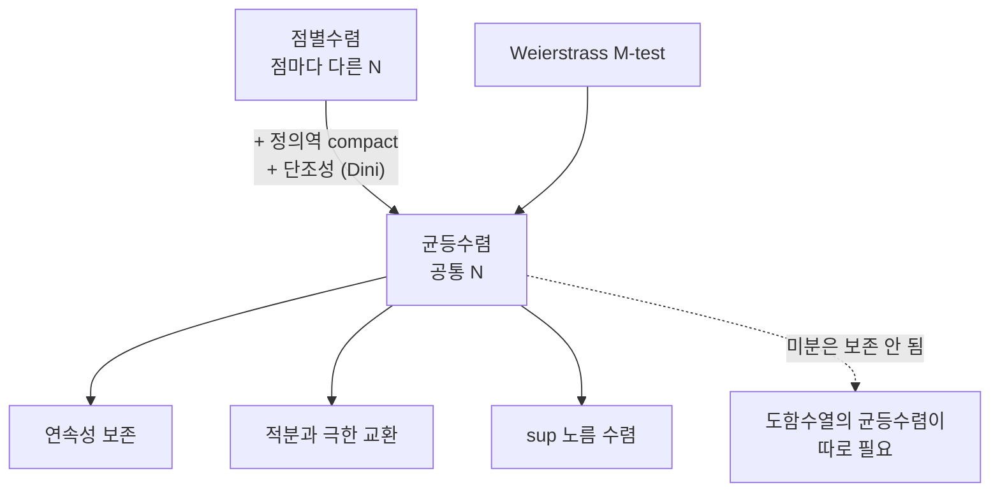

# 균등수렴

# 개요

함수열이 극한함수로 다가간다는 말에는 최소 두 가지 뜻이 있다. 각 점마다 따로 [수열의 극한](limits.md)을 취하는 점별수렴(pointwise convergence)과, 정의역 전체에서 오차를 동시에 통제하는 균등수렴(uniform convergence)이다.

둘의 차이는 사소해 보이지만 결과는 크게 다르다. 점별수렴은 [연속성](continuity.md)도, 적분값도, 미분도 보존하지 않는다. 균등수렴은 연속성을 보존하고, 유계 구간에서 적분과 극한의 교환을 허락한다. 해석학에서 "극한을 어떤 연산과 바꿔도 되는가"라는 질문이 나올 때 첫 번째로 확인하는 조건이 균등수렴이다.

균등수렴은 함수공간 위의 거리(sup 노름)로 표현되는 수렴이기도 하다. 이 관점에서 보면 균등수렴은 [거리 공간](metric-spaces.md)에서의 평범한 수렴이고, [Cauchy 수열과 완비성](completeness.md)의 이야기가 그대로 함수공간으로 옮겨 간다.

# 직관

정의역 위의 각 점에 오차 막대를 세운다고 하자.

- **점별수렴**: 각 점마다 "언제부터 오차가 작아지는가"를 묻는다. 답은 점마다 달라도 된다. 어떤 점은 10번째 항부터, 다른 점은 10억번째 항부터 작아져도 점별수렴이다.
- **균등수렴**: 모든 점에 대해 공통으로 작동하는 항 번호가 있어야 한다. 극한함수 주위로 폭 `eps` 의 띠(tube)를 그렸을 때, 어느 시점부터 모든 그래프가 그 띠 안에 완전히 들어가야 한다.



전형적인 반례가 `[0,1]` 위의 `f_n(x) = x^n` 이다. 각 점에서 극한은 `x < 1` 이면 0, `x = 1` 이면 1 이므로 극한함수가 불연속이다. 1 에 가까운 점일수록 0 에 도달하는 데 오래 걸리므로 공통 `N` 을 잡을 수 없다. 연속함수들의 점별 극한이 불연속이 된 것이고, 이것이 곧 균등수렴이 아니라는 증거다.

# 정의

`X` 는 집합, `f_n` 과 `f` 는 `X` 에서 실수(또는 거리공간)로 가는 함수라 하자.

## 점별수렴

모든 `x` 가 `X` 에 속할 때

$$
\lim_{n \to \infty} f_n(x) = f(x) .
$$

논리 기호로 풀면, 임의의 `x` 와 임의의 양수 `eps` 에 대해 어떤 `N` 이 존재하여 `n >= N` 이면 `|f_n(x) - f(x)| < eps` 다. 여기서 `N` 은 `x` 와 `eps` 에 모두 의존한다.

## 균등수렴

임의의 양수 `eps` 에 대해 어떤 `N` 이 존재하여, `n >= N` 이면 **모든** `x` 에 대해 `|f_n(x) - f(x)| < eps` 다. 동치로

$$
\lim_{n \to \infty} \ \sup_{x \in X} \ |f_n(x) - f(x)| = 0 .
$$

이때 `f_n` 이 `f` 로 균등수렴한다고 한다. 양화사 순서만 바꾼 것이지만(`for all x, exists N` 대 `exists N, for all x`), 그 차이가 전부다.

## sup 노름

유계함수 전체의 공간 `B(X)` 위에

$$
\Vert g \Vert_\infty = \sup_{x \in X} |g(x)|
$$

를 두면 이것은 노름이고, 균등수렴은 정확히 이 노름에 대한 수렴이다. `X` 가 [위상 공간](topology.md)이고 `C_b(X)` 를 유계연속함수 공간이라 하면, 아래 성질 절에서 보듯 `C_b(X)` 는 이 노름에 대해 완비다.

## 균등 Cauchy 조건

`f_n` 이 **균등 Cauchy** 라는 것은 임의의 양수 `eps` 에 대해 어떤 `N` 이 존재하여 `m, n >= N` 이면 모든 `x` 에서 `|f_n(x) - f_m(x)| < eps` 라는 뜻이다. 목표 함수 `f` 를 미리 알지 못해도 균등수렴을 판정할 수 있다는 점에서 실용적이다.

## 급수의 균등수렴

함수항 급수는 부분합의 함수열로 정의한다.

$$
S_N(x) = \sum_{n=1}^{N} u_n(x), \qquad \sum_{n=1}^{\infty} u_n \ \text{균등수렴} \iff S_N \ \text{균등수렴}.
$$

# 성질

## 완비성

`X` 가 임의의 집합일 때, 유계함수 공간은 sup 노름에 대해 완비다. 즉 균등 Cauchy 함수열은 균등수렴한다.

**증명 스케치.** 각 `x` 를 고정하면 `f_n(x)` 는 실수의 Cauchy 수열이므로 [완비성](completeness.md)에 의해 극한 `f(x)` 가 존재한다. 균등 Cauchy 조건식에서 `m` 을 무한대로 보내면 `n >= N` 인 모든 `n` 과 모든 `x` 에서 `|f_n(x) - f(x)| <= eps` 를 얻는다. 이것이 균등수렴이다.

## 연속성 보존

**정리.** `f_n` 이 연속이고 `f` 로 균등수렴하면 `f` 는 연속이다.

**증명 스케치.** 고전적인 3분할(three epsilon) 논법이다. 점 `a` 근방에서

$$
|f(x) - f(a)| \le |f(x) - f_n(x)| + |f_n(x) - f_n(a)| + |f_n(a) - f(a)| .
$$

첫째와 셋째 항은 균등수렴으로 `n` 을 크게 잡아 `eps/3` 미만으로 만든다(여기서 `x` 와 무관하게 잡을 수 있다는 점이 결정적이다). `n` 을 고정한 뒤 `f_n` 의 연속성으로 `x` 를 `a` 에 충분히 가깝게 하여 가운데 항을 `eps/3` 미만으로 만든다.

따라서 유계연속함수 공간 `C_b(X)` 는 `B(X)` 의 닫힌 부분공간이고, 완비다. 이 사실이 [축약사상 고정점 정리](banach-fixed-point.md)를 함수공간에 적용해 [상미분방정식](ordinary-differential-equations.md)의 해의 존재성을 증명하는 Picard 반복의 기반이 된다.

## 적분과 극한의 교환

**정리.** 유계 닫힌 구간 `[a,b]` 위에서 [Riemann 적분](riemann-integral.md) 가능한 `f_n` 이 `f` 로 균등수렴하면 `f` 도 적분가능하고

$$
\lim_{n \to \infty} \int_a^b f_n(x) \, dx = \int_a^b f(x) \, dx .
$$

**증명 스케치.** 오차 평가가 한 줄이다.

$$
\Big| \int_a^b f_n - \int_a^b f \Big| \le \int_a^b |f_n - f| \le (b-a) \, \Vert f_n - f \Vert_\infty \to 0 .
$$

구간 길이가 유한하다는 점이 쓰였다. 무한 구간에서는 균등수렴만으로 적분 교환이 성립하지 않는다. 예를 들어 `f_n` 을 `[0,n]` 위에서 `1/n` 으로 두면 sup 노름은 0 으로 가지만 적분은 항상 1 이다. 이런 상황은 [지배 수렴 정리](dominated-convergence.md)나 [균등적분가능성](uniform-integrability.md)이 다룬다.

## 미분과의 관계

균등수렴은 미분을 보존하지 않는다. `f_n(x) = sin(n x) / n` 은 0 으로 균등수렴하지만 도함수 `cos(n x)` 는 어디에서도 수렴하지 않는다. 더 극단적으로, Weierstrass 함수는 매끄러운 함수들의 균등극한이면서 어디에서도 미분불가능하다.

올바른 정리는 도함수 쪽에 균등수렴을 요구한다.

**정리.** `f_n` 이 `[a,b]` 위에서 미분가능하고, 어떤 한 점 `c` 에서 `f_n(c)` 가 수렴하며, 도함수열 `f_n'` 이 균등수렴하면, `f_n` 자체가 어떤 `f` 로 균등수렴하고 `f' = lim f_n'` 이다.

**증명 스케치.** 평균값 정리를 차 `f_n - f_m` 에 적용하면

$$
|(f_n - f_m)(x) - (f_n - f_m)(y)| \le |x - y| \, \Vert f_n' - f_m' \Vert_\infty
$$

이므로 `f_n` 이 균등 Cauchy 임이 나오고, [미적분학의 기본 정리](fundamental-calculus.md)로 도함수의 극한이 극한의 도함수임을 확인한다. 요약하면 적분은 극한에 친화적이고 미분은 적대적이며, 미분을 다룰 때는 한 단계 위(도함수열)에서 균등수렴을 확보해야 한다.

## Weierstrass M-test

**정리.** 각 `n` 에 대해 상수 `M_n` 이 있어 모든 `x` 에서 `|u_n(x)| <= M_n` 이고 `sum M_n` 이 수렴하면, 급수 `sum u_n` 은 균등(그리고 절대) 수렴한다.

**증명 스케치.** 부분합의 차를 `sum_{k=m+1}^{n} M_k` 로 눌러 균등 Cauchy 조건을 확인하면 된다. 실무에서 급수의 균등수렴을 보이는 거의 모든 경우가 이 판정으로 처리된다. [멱급수](power-series.md)가 수렴반경 내부의 닫힌 원판에서 균등수렴하는 것도 M-test 의 직접 따름이다.

## Dini 정리

점별수렴을 균등수렴으로 끌어올리는 조건이다.

**정리.** `K` 가 compact, `f_n` 과 `f` 가 연속, `f_n` 이 `f` 로 점별수렴하며 각 점에서 `f_n(x)` 가 `n` 에 대해 단조이면, 수렴은 균등하다.

**증명 스케치.** `g_n = |f_n - f|` 는 연속이고 점별로 0 으로 단조 감소한다. 임의의 `eps` 에 대해 열린집합 `U_n = {x : g_n(x) < eps}` 는 증가하는 열린덮개이고, [compactness](compactness.md)에 의해 유한 부분덮개가 있으므로 어떤 `N` 에서 `U_N` 이 `K` 전체를 덮는다. 단조성으로 그 이후 모든 `n` 에서도 성립한다.

세 가정 중 하나라도 빼면 거짓이다. `x^n` 은 `[0,1)` 위에서 단조지만 compact 가 아니고, 극한이 불연속인 `[0,1]` 위에서는 극한함수의 연속성 가정이 깨진다.

## 반례 모음

| 함수열 (`[0,1]` 위) | 점별 극한 | 균등? | 무엇이 깨지는가 |
| --- | --- | --- | --- |
| `x^n` | 불연속 계단 | 아니오 | 연속성 |
| `n x (1-x)^n` | 0 | 아니오 | 봉우리 높이가 상수로 남음 |
| `n^2 x (1-x)^n` | 0 | 아니오 | 적분이 발산, 적분 교환 실패 |
| `sin(n x)/n` | 0 | 예 | 미분은 보존 안 됨 |
| `x/n` | 0 | 예 | 문제 없음 |

두 번째 예에서 `f_n` 의 최댓값은 `n/(n+1)` 의 거듭제곱 꼴로 `1/e` 근처의 상수에 수렴하므로 sup 노름이 0 으로 가지 않는다. 세 번째 예는 적분이 `n^2/((n+1)(n+2))` 로 1 에 수렴하여, 점별 극한 0 의 적분과 다르다.

# 활용

## 함수 근사와 급수 전개

- **Weierstrass 근사 정리**: compact 구간 위의 연속함수는 다항식으로 균등근사된다. Bernstein 다항식에 [큰 수의 법칙](law-of-large-numbers.md)을 적용하는 확률적 증명이 유명하다.
- **[멱급수와 Taylor 급수](power-series.md)**: 수렴반경 내부에서 균등수렴하므로 항별 미분과 적분이 정당화된다.
- **[Fourier 급수](fourier-series.md)**: 균등수렴은 일반적으로 보장되지 않고(연속함수의 Fourier 급수가 발산할 수 있다), Gibbs 현상이 불연속점 근처에서 균등수렴을 막는다. 그래서 [내적 공간](inner-product-spaces.md)의 `L^2` 수렴을 대신 쓴다.

## 수치 확인

`x^n` 과 `sin(nx)/n` 의 sup 노름을 직접 계산해 두 수렴 방식을 구별한다.

```python
import numpy as np

xs = np.linspace(0.0, 1.0, 20001)

def sup_err(fn, limit):
    return np.max(np.abs(fn(xs) - limit(xs)))

pow_limit = lambda x: (x >= 1.0).astype(float)     # x^n 의 점별 극한
zero = lambda x: np.zeros_like(x)

for n in [10, 100, 1000, 10000]:
    a = sup_err(lambda x, n=n: x**n, pow_limit)             # 균등수렴 아님
    b = sup_err(lambda x, n=n: n*x*(1-x)**n, zero)          # 균등수렴 아님
    c = sup_err(lambda x, n=n: np.sin(n*x)/n, zero)         # 균등수렴
    print(f"n={n:6d}  x^n:{a:.4f}  nx(1-x)^n:{b:.4f}  sin(nx)/n:{c:.6f}")
```

앞의 두 열은 `n` 이 커져도 1 과 `1/e` 근처에 머물고, 마지막 열만 `1/n` 으로 0 에 간다.

## 해석학의 다른 곳

- **미분방정식**: Picard–Lindelöf 정리는 연속함수 공간의 완비성과 [축약사상 고정점 정리](banach-fixed-point.md)를 쓰며, 반복열의 균등수렴이 해를 만든다.
- **함수해석**: sup 노름 공간 `C(K)` 는 Banach 공간의 기본 예이고, Arzelà–Ascoli 정리는 `C(K)` 에서 어떤 집합이 compact 인지를 균등유계성과 등연속성(equicontinuity)으로 특징짓는다. 등연속성은 균등수렴의 "정의역 방향" 균등화이며, [균등적분가능성](uniform-integrability.md)이 `L^1` 에서 하는 역할과 구조가 같다.[^1]
- **[정칙함수](holomorphic-functions.md)**: 복소해석에서는 compact 집합 위의 균등수렴(국소균등수렴)만으로 극한이 정칙이고 도함수열도 수렴한다(Weierstrass 수렴 정리). 실해석과 달리 미분이 보존되는 이유는 Cauchy 적분 공식이 미분을 적분으로 바꿔 주기 때문이다.[^2]

[^1]: Walter Rudin, *Principles of Mathematical Analysis*, 3rd ed., McGraw-Hill, 7장 (Sequences and Series of Functions), https://archive.org/details/RudinW.PrinciplesOfMathematicalAnalysis3e
[^2]: Terence Tao, *Analysis II*, Hindustan Book Agency, 3장 (Uniform convergence), https://terrytao.wordpress.com/books/analysis-ii/

# 연관 문서

## 선수지식

- [연속함수](continuity.md)
- [수열의 극한](limits.md)

## 더 알아보기

아직 연결한 문서가 없다.

#analysis
