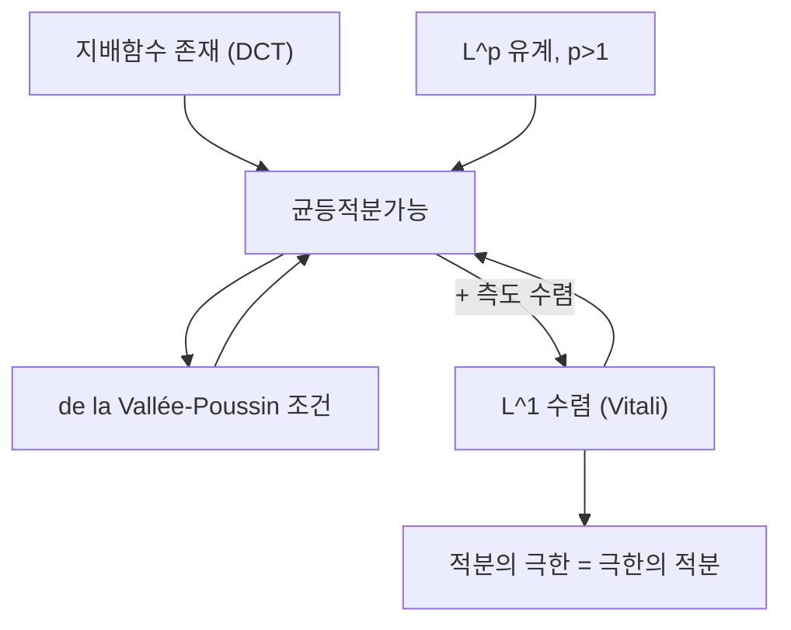

# 균등적분가능성

# 개요

[Lebesgue 적분](lebesgue-integral.md)에서 극한과 적분을 바꾸는 정리들은 모두 어떤 형태의 "질량이 새지 않는다"는 조건을 요구한다. [단조 수렴 정리](monotone-convergence.md)는 단조성으로, [지배 수렴 정리](dominated-convergence.md)는 하나의 적분가능한 지배함수로 그 조건을 만든다. 균등적분가능성(uniform integrability, 줄여서 UI)은 이 조건을 함수족 전체에 대한 최소한의 형태로 뽑아낸 것이다.

핵심 문장은 하나다. 가측함수열이 측도 수렴하고 균등적분가능하면, 그리고 그때만, `L^1` 에서 수렴한다. 이것이 Vitali 수렴 정리이며, 지배 수렴 정리는 이 정리의 특수한 경우다. 확률론에서는 [martingale](martingales.md)의 수렴, [조건부 기댓값](conditional-expectation.md)족의 성질, 극한에서 기댓값이 보존되는지 여부가 모두 UI 로 판정된다.

# 직관

적분값이 사라지지 않고 "무한대로 도망가는" 방식은 두 가지뿐이다.

- **높이로 도망간다.** 함수값이 아주 큰 영역에 질량이 몰린다. 예를 들어 구간 `[0,1]` 위에서 `f_n = n` 을 `[0,1/n]` 에 올린 함수열은 각 적분이 1 이지만 점별로는 0 으로 간다. 질량은 점점 높고 좁은 봉우리로 도피한다.
- **넓이로 도망간다.** 무한 측도 공간에서 질량이 멀리 밀려난다. 실직선 위의 `f_n = 1/n` 을 `[0,n]` 에 올린 함수열이 그렇다.

균등적분가능성은 첫 번째 도피로를 막는 조건이다. "함수값이 큰 곳에서의 적분 기여가 족 전체에 대해 균등하게 작다"가 정의의 내용이다. 유한 측도 공간(특히 확률공간)에서는 두 번째 도피로가 애초에 없으므로 UI 만으로 충분하고, 무한 측도 공간에서는 꼬리를 따로 통제하는 조건(tightness)이 추가로 필요하다.

지배함수가 있다는 것은 족 전체를 하나의 적분가능한 함수 밑에 가두는 것이므로 첫 번째 도피로를 막는 아주 강한 방법이다. UI 는 같은 목적을 달성하는 가장 약한 조건이라고 보면 된다.



# 정의

이하 `(X, F, mu)` 는 측도공간, 함수는 모두 실수값 가측함수다. 함수족을 `H` 로 쓴다.

## 균등적분가능성

함수족 `H` 가 **균등적분가능**하다는 것은 다음을 뜻한다.

$$
\lim_{M \to \infty} \ \sup_{f \in H} \ \int_{\{|f| > M\}} |f| \, d\mu = 0 .
$$

즉 임의의 양수 `eps` 에 대해 어떤 `M` 이 존재하여 모든 `f` 가 `H` 에 속할 때

$$
\int_{\{|f| > M\}} |f| \, d\mu < \varepsilon
$$

이 성립한다. `M` 을 `f` 와 무관하게 잡을 수 있다는 것이 "균등"의 뜻이다.

하나의 함수 `f` 가 적분가능하면 지배 수렴 정리에 의해 위 극한이 성립하므로, 유한족은 항상 UI 다. 문제가 되는 것은 무한족뿐이다.

## 유한 측도에서의 동치 조건

`mu(X)` 가 유한할 때, `H` 가 UI 인 것은 다음 두 조건이 동시에 성립하는 것과 동치다.

1. **`L^1` 유계**:

$$
\sup_{f \in H} \int_X |f| \, d\mu < \infty .
$$

2. **균등절대연속 (ε–δ 조건)**: 임의의 양수 `eps` 에 대해 어떤 양수 `delta` 가 존재하여, 가측집합 `A` 가 `mu(A) < delta` 를 만족하면 모든 `f` 가 `H` 에 속할 때

$$
\int_A |f| \, d\mu < \varepsilon .
$$

이 두 번째 조건은 [Radon–Nikodym 정리](radon-nikodym.md)에서 밀도의 적분이 정의하는 측도가 원래 측도에 절대연속이라는 사실의 균등판이다. 무한 측도 공간에서는 1 과 2 가 UI 를 함의하지 않으며, 위에서 본 `1/n` 위의 예가 반례다.

## de la Vallée-Poussin 판정

`H` 가 `L^1` 유계일 때, `H` 가 UI 인 것과 다음 조건은 동치다. 어떤 함수 `G` 가 존재하여

$$
G : [0,\infty) \to [0,\infty), \qquad \lim_{t \to \infty} \frac{G(t)}{t} = \infty, \qquad \sup_{f \in H} \int_X G(|f|) \, d\mu < \infty .
$$

`G` 는 증가 [볼록함수](convexity.md)로 잡을 수 있다. 초선형(superlinear) 증가함수에 대한 유계성이 UI 와 같은 말이라는 뜻이다. 가장 흔한 선택은 `G(t) = t^p` (`p > 1`) 이고, 이 경우 판정은 "`L^p` 유계이면 UI" 로 읽힌다. `G(t) = t log(1+t)` 도 자주 쓰인다.

## 확률에서의 표현

확률공간에서 확률변수족 `H` 의 UI 는 절단(truncation)으로 쓰는 편이 편하다.

$$
\lim_{M \to \infty} \ \sup_{Z \in H} \ \mathbb{E}\big[ |Z| \, \mathbf{1}\{|Z| > M\} \big] = 0 .
$$

[확률변수](random-variables.md)의 기댓값을 큰 값 쪽에서 잘라낸 잔여 기댓값이 족 전체에서 균등하게 0 으로 간다는 조건이다.

# 성질

## 충분조건들

다음은 모두 UI 를 함의한다. 증명은 모두 Markov 부등식과 절단 기댓값의 직접 평가다.

- **지배함수**: `|f| <= g` 가 모든 `f` 에 대해 성립하고 `g` 가 적분가능하면, 절단 적분이 `g` 의 꼬리 적분으로 눌린다. 따라서 [지배 수렴 정리](dominated-convergence.md)의 가정은 UI 를 준다.
- **`L^p` 유계 (`p > 1`)**: Hölder 부등식으로

$$
\int_{\{|f| > M\}} |f| \, d\mu \ \le \ \Big( \int |f|^p d\mu \Big)^{1/p} \mu(|f| > M)^{1 - 1/p}
$$

이고, Markov 부등식이 `mu(|f| > M) <= C/M` 을 주므로 `M` 을 키우면 균등하게 0 으로 간다. 단, `p = 1` 유계만으로는 UI 가 아니다(위의 높이 도피 예가 `L^1` 유계이면서 UI 가 아니다).

- **조건부 기댓값족**: 적분가능한 `Z` 에 대해 부분 sigma-대수 전체를 훑는 족

$$
\{ \mathbb{E}[Z \mid \mathcal{G}] : \mathcal{G} \subseteq \mathcal{F} \ \text{sub-sigma-algebra} \}
$$

는 UI 다. Jensen 부등식으로 절단 기댓값을 `Z` 의 절단 기댓값으로 눌러서 얻는다. 이것이 [조건부 기댓값](conditional-expectation.md)이 정의하는 martingale 이론의 출발점이다.

- **유한합과 볼록결합**: UI 족 두 개의 합, UI 족의 볼록포(convex hull), UI 족의 `L^1` 폐포는 모두 UI 다.

## Vitali 수렴 정리

유한 측도공간에서 다음이 동치다.

1. `f_n` 이 `L^1` 에서 `f` 로 수렴한다. 즉 `int |f_n - f| dmu -> 0`.
2. `f_n` 이 `f` 로 측도 수렴하고, 족 `{f_n}` 이 균등적분가능하다.

**증명 스케치 (2 ⇒ 1).** 절단 함수 `T_M(x) = max(-M, min(M, x))` 를 쓴다. 삼각부등식으로

$$
\int |f_n - f| \le \int |f_n - T_M(f_n)| + \int |T_M(f_n) - T_M(f)| + \int |T_M(f) - f| .
$$

첫째와 셋째 항은 UI 에 의해 `M` 을 크게 잡으면 `n` 과 무관하게 작다(극한 `f` 의 적분가능성은 Fatou 보조정리로 얻는다). 가운데 항은 피적분함수가 `2M` 으로 유계이고 측도 수렴하므로, 유한 측도에서 유계 수렴 정리에 의해 0 으로 간다.

**증명 스케치 (1 ⇒ 2).** `L^1` 수렴은 측도 수렴을 준다(Markov). UI 는 `f_n` 을 `f` 와 `f_n - f` 로 쪼개어, `f` 하나의 적분가능성에서 오는 UI 와 `L^1` 로 작아지는 잔차를 합치면 된다.

무한 측도공간에서는 (2) 에 "꼬리의 균등 소멸", 즉 임의의 `eps` 에 대해 유한 측도 집합 `E` 가 존재하여 `E` 바깥에서의 적분이 균등하게 `eps` 미만이라는 조건을 추가해야 한다.

## 지배 수렴 정리와의 관계

지배 수렴 정리는 Vitali 정리의 따름정리다. 지배함수가 있으면 UI 이고 거의 어디서나 수렴은 측도 수렴을 함의하므로(유한 측도에서), Vitali 가 곧바로 `L^1` 수렴을 준다. 역방향은 성립하지 않는다. 즉 UI 이면서 어떤 적분가능한 지배함수도 갖지 않는 함수열이 있다.

간단한 예는 `[0,1]` 위에서 `f_n` 을 길이 `1/n` 인 구간 위에서 값 `n^{1/2}` 로 두는 것이다. 이 열은 `L^2` 유계가 아니지만 절단 적분이 `n^{-1/2}` 규모로 균등하게 작아 UI 이고, 점별로 0 으로 가므로 `L^1` 수렴한다. 반면 모든 `f_n` 을 덮는 최소 지배함수는 각 구간 위에서 `n^{1/2}` 이상이어야 하므로 적분이 발산한다.

## Dunford–Pettis 정리

`L^1` 부분집합이 약위상(weak topology)에서 상대적으로 compact 인 것과 그 집합이 UI 이고 (무한 측도라면) tight 인 것이 동치다. UI 가 `L^1` 에서 [compactness](compactness.md) 개념을 대신한다는 뜻이며, 확률측도열의 tightness 와 Prokhorov 정리가 [상측도](pushforward-measure.md) 수준에서 하는 역할을 UI 는 밀도 수준에서 한다.

## 반례 정리

`L^1` 유계는 UI 와 다르다는 점을 기억하는 세 예다.

| 함수열 (`[0,1]` 위, Lebesgue 측도) | `L^1` 노름 | 점별 극한 | UI? | `L^1` 수렴? |
| --- | --- | --- | --- | --- |
| `n` on `[0,1/n]` | 1 | 0 | 아니오 | 아니오 |
| `n^{1/2}` on `[0,1/n]` | `n^{-1/2}` | 0 | 예 | 예 |
| `1` on `[0,1]` (상수열) | 1 | 1 | 예 | 예 |

# 활용

## 확률: martingale 수렴

[martingale](martingales.md) `M_n` 이 `L^1` 유계이면 거의 확실히 어떤 `M_infty` 로 수렴한다(Doob). 하지만 `L^1` 수렴과 `E[M_n] = E[M_infty]` 는 따라오지 않는다. 이것이 성립할 필요충분조건이 정확히 `{M_n}` 의 균등적분가능성이고, 이때 martingale 은 닫힌 형태

$$
M_n = \mathbb{E}[M_\infty \mid \mathcal{F}_n]
$$

를 가진다. 따라서 "UI martingale" 은 하나의 적분가능한 확률변수를 [조건부 기댓값](conditional-expectation.md)으로 펼친 것과 같은 말이다. 도박에서 optional stopping 정리가 언제 성립하는지도 정지시각까지의 족이 UI 인지로 판정된다.

## 통계와 극한정리

[큰 수의 법칙](law-of-large-numbers.md)의 `L^1` 형태, 추정량의 평균제곱오차 수렴, [최대가능도 추정](maximum-likelihood.md)의 점근 정규성 증명에서 "거의 확실한 수렴을 기댓값의 수렴으로 올리는" 단계가 반복해서 등장한다. 그 단계가 UI 이며, 실무에서는 보통 `L^{1+delta}` 유계(de la Vallée-Poussin 의 `G(t) = t^{1+delta}`)를 보여서 처리한다. [측도변환](change-of-measure.md)에서 우도비족이 UI 인지도 같은 방식으로 확인한다.

## 수치 확인

절단 적분이 균등하게 0 으로 가는지를 두 함수열에 대해 직접 계산해 본다. `[0,1]` 위에서 높이 `n^a`, 폭 `1/n` 인 봉우리열의 절단 적분은 `n^a > M` 인 `n` 에 대해 `n^{a-1}` 이다.

```python
import numpy as np

def tail_sup(a, Ms, ns):
    """높이 n^a, 폭 1/n 인 봉우리열의 절단 적분 상한 sup_n int_{|f_n|>M} |f_n|."""
    out = []
    for M in Ms:
        vals = [n**(a - 1.0) for n in ns if n**a > M]
        out.append(max(vals) if vals else 0.0)
    return np.array(out)

ns = range(1, 200000)
Ms = [10, 100, 1000, 10000]
print("a=1.0 (L^1 유계, UI 아님):", tail_sup(1.0, Ms, ns))
print("a=0.5 (UI):            ", tail_sup(0.5, Ms, ns))
```

`a = 1` 이면 절단 적분이 `M` 과 무관하게 1 로 남아 UI 가 깨지고, `a = 0.5` 이면 `M^{-1}` 규모로 0 으로 가 UI 다. 앞의 표와 일치한다.

## 함수해석에서의 위치

UI 는 `L^1` 이 재귀적(reflexive)이지 않아서 유계 집합이 약compact 하지 않다는 결함을 메우는 조건이다. 편미분방정식의 변분해법, 최적수송, 확률측도열의 극한 구성에서 "극한이 여전히 밀도를 갖는다"를 보장하는 표준 도구로 쓰인다.[^1] [Lebesgue 적분](lebesgue-integral.md)과 [가측함수](measurable-functions.md)를 배운 직후에 이 개념을 익혀 두면, 이후의 수렴 논증에서 지배함수를 억지로 찾는 수고가 크게 줄어든다.[^2]

[^1]: David Williams, *Probability with Martingales*, Cambridge University Press, 13장 (Uniform Integrability), https://www.cambridge.org/core/books/probability-with-martingales/B4CFCE0D08930FB46C6E93E775503863
[^2]: Gerald B. Folland, *Real Analysis: Modern Techniques and Their Applications*, Wiley, 6장 연습문제 (Vitali convergence theorem), https://www.wiley.com/en-us/Real+Analysis%3A+Modern+Techniques+and+Their+Applications%2C+2nd+Edition-p-9780471317166

# 연관 문서

## 선수지식

- [지배 수렴 정리](dominated-convergence.md)

## 더 알아보기

아직 연결한 문서가 없다.

#measure_theory #probability
