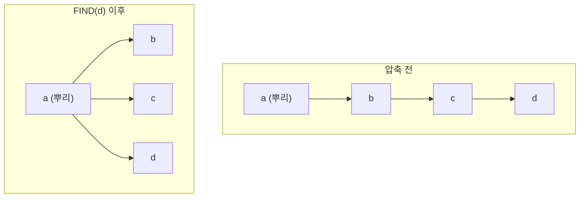

# 서로소 집합 자료구조

# 개요

[동치관계](relations.md)는 집합을 겹치지 않는 조각으로 나눈다. 조각이 미리 정해져 있으면 다룰 일이 없지만, "이 둘을 같은 것으로 보자" 는 선언이 하나씩 들어오면서 조각이 점점 합쳐지는 상황이라면 이야기가 다르다. 매번 처음부터 동치류를 다시 계산할 수는 없다.

서로소 집합 자료구조는 이 상황을 위한 것이다. 합치는 연산과 같은 조각에 있는지 묻는 연산 둘만 지원하되, 둘 다 사실상 상수 시간에 처리한다. [그래프](graphs.md)의 연결 성분을 간선이 추가될 때마다 갱신하는 것이 가장 흔한 용도이며, Kruskal 알고리즘의 효율이 이 자료구조에 달려 있다.

이론적으로도 흥미로운 대상이다. 최적 복잡도가 inverse Ackermann 함수라는, 실용적으로는 $4$ 이하이지만 상수는 아닌 함수로 정확히 결정되어 있다.

# 직관

## 대표원 하나로 부류를 가리킨다

부류를 판별하려면 부류마다 이름표가 필요하다. 원소 하나를 대표로 뽑아 이름표로 쓰면, "같은 부류인가" 는 "대표가 같은가" 가 된다.

각 부류를 트리로 만들고 뿌리를 대표로 삼으면 합치기가 쉬워진다. 한 뿌리를 다른 뿌리의 자식으로 붙이기만 하면 두 부류가 하나가 된다. 문제는 트리가 길어지면 뿌리를 찾는 데 오래 걸린다는 것뿐이고, 두 가지 요령이 그 문제를 없앤다.

## 두 요령

**크기로 붙이기.** 작은 트리를 큰 트리 밑에 붙인다. 그러면 어떤 원소의 깊이가 $1$ 늘어날 때마다 그가 속한 트리의 크기가 최소 두 배가 되므로, 깊이는 $\log_2 n$ 을 넘지 못한다.

**경로 압축.** 뿌리를 찾으러 올라가는 길에 지난 정점들의 부모를 곧바로 뿌리로 바꾼다. 한 번 비용을 치르고 나면 다음부터 그 길은 한 걸음이다.

두 요령을 함께 쓰면 트리가 거의 평평해진다. 아래 그림에서 왼쪽이 압축 전, 오른쪽이 $FIND(d)$ 이후다.



## 되돌릴 수는 없다

이 자료구조는 합치기만 한다. 한 번 합친 것을 떼어 내는 연산은 없고, 트리 구조가 이미 뭉개져 있어 되돌릴 방법도 없다. 간선이 삭제되기도 하는 [동적 연결성](dynamic-connectivity.md) 문제는 전혀 다른 기법이 필요하며, 그래서 [link-cut tree](link-cut-trees.md) 같은 훨씬 복잡한 자료구조가 등장한다.

# 정의

## 연산

유한한 원소 집합 $U$ 를 서로 겹치지 않는 부분집합으로 분할하고, 각 부분집합이 대표원 하나를 가진다.

- `MAKE-SET(x)` 는 원소 $x$ 만 든 새 집합을 만든다.
- `FIND(x)` 는 $x$ 가 속한 집합의 대표원을 반환한다.
- `UNION(x,y)` 는 두 집합을 하나로 합친다.

같은 집합에 속한다는 관계는 반사적·대칭적·추이적이므로 동치관계다. 따라서 $FIND(x) = FIND(y)$ 는 $x$ 와 $y$ 가 같은 동치류에 있다는 뜻이다.

## 트리 표현

각 집합을 뿌리 있는 트리로 나타내고 뿌리를 대표원으로 삼는다. 배열 $parent[]$ 하나로 표현할 수 있고, 뿌리는 자기 자신을 부모로 가리킨다. $FIND$ 는 부모 포인터를 따라 올라가고, $UNION$ 은 서로 다른 두 뿌리 중 하나를 다른 하나의 자식으로 만든다.

# 성질

## 크기 기준 합치기의 높이 한계

작은 트리의 뿌리를 큰 트리의 뿌리에 붙이면, 어떤 원소의 깊이가 $1$ 증가할 때마다 그가 속한 트리의 크기가 최소 두 배가 된다. 따라서 높이는

$$
\lfloor\log_2 n\rfloor
$$

을 넘지 않는다. 랭크 기준으로 붙여도 같은 한계를 얻는다.

## 경로 압축과 amortized 비용

경로 압축은 $FIND$ 가 지나간 원소들의 부모를 찾아낸 뿌리로 바꾼다. 크기 또는 랭크 기준 합치기와 함께 쓰면 $m$ 번의 연산열의 총비용이

$$
O\bigl(m\,\alpha(n)\bigr)
$$

로 제한된다. $\alpha$ 는 inverse Ackermann 함수이며 실용적인 모든 $n$ 에서 $4$ 이하다. Tarjan 과 van Leeuwen 은 이 한계가 이 부류의 알고리즘에 대해 최적임을 보였다.

두 가지를 혼동하면 안 된다. 이것은 긴 연산열의 평균 비용에 대한 명제이지, 개별 $FIND$ 가 항상 상수 시간이라는 뜻이 아니다. 최악의 단일 연산은 여전히 $O(log n)$ 이 걸릴 수 있고, 실시간 보장이 필요한 상황에서는 이 차이가 중요하다.

```python
class DSU:
    def __init__(self, n):
        self.parent = list(range(n))
        self.size = [1] * n
        self.components = n

    def find(self, x):
        root = x
        while self.parent[root] != root:
            root = self.parent[root]
        while self.parent[x] != root:        # 경로 압축
            self.parent[x], x = root, self.parent[x]
        return root

    def union(self, x, y):
        rx, ry = self.find(x), self.find(y)
        if rx == ry:
            return False
        if self.size[rx] < self.size[ry]:    # 크기 기준 합치기
            rx, ry = ry, rx
        self.parent[ry] = rx
        self.size[rx] += self.size[ry]
        self.components -= 1
        return True


d = DSU(6)
for a, b in [(0, 1), (1, 2), (3, 4)]:
    d.union(a, b)
print(d.components)                      # 3: {0,1,2} {3,4} {5}
print(d.find(0) == d.find(2))            # True
print(d.find(0) == d.find(3))            # False
print(d.union(0, 2))                     # False: 이미 같은 성분
```

$union$ 이 $False$ 를 돌려준다는 것은 두 정점이 이미 연결되어 있다는 뜻이고, 그래프에서는 그 간선을 더하면 순환이 생긴다는 신호다. Kruskal 알고리즘이 바로 이 판정을 쓴다.

## 유지할 수 있는 부가 정보

뿌리에 부류별 집계를 달아 두면 합칠 때 갱신할 수 있다. 부류의 크기, 원소들의 합, 최솟값과 최댓값, 부류의 개수가 모두 상수 시간에 유지된다.

가중 변형도 있다. 각 정점에 부모와의 상대값을 저장하면 "$x$ 와 $y$ 의 차가 $d$ 다" 같은 제약을 누적해 관리하고 모순을 검출할 수 있다. 경로 압축을 하면서 상대값을 합산해 갱신하는 것이 요령이며, 등식 제약을 다루는 단일화 알고리즘과 같은 구조다.

## 합치기만 하는 한계

간선이 삭제되지 않는 incremental 연결성 문제만 다룰 수 있다. 삭제까지 필요한 fully dynamic connectivity 는 다른 기법을 쓴다. 다만 모든 연산을 미리 알고 있다면 시간을 거꾸로 돌려 삭제를 추가로 바꾸는 오프라인 기법으로 이 자료구조를 재사용할 수 있고, 실무에서 자주 쓰이는 요령이다.

# 활용

## 최소 신장트리

[Kruskal 알고리즘](minimum-spanning-tree.md)은 간선을 가중치가 작은 순서로 보면서 $\mathrm{FIND}(u) \ne \mathrm{FIND}(v)$ 이면 선택하고 $UNION(u,v)$ 를 수행한다. 대표원이 같으면 그 간선은 순환을 만들므로 버린다. 정렬이 $O(m log m)$ 이고 나머지가 거의 선형이라, 전체 비용이 정렬에 지배된다.

## 연결 성분과 동치 제약

이미지의 연결 성분 표시, 격자의 침투 문제, 미로 생성, 컴파일러의 타입 단일화, 같은 계정을 가리키는 레코드 병합이 모두 같은 패턴이다. "같다" 는 선언을 순서대로 흡수하면서 현재 부류를 즉시 답하는 문제라면 이 자료구조가 답이다.

## 동치관계의 계산 구현

임의의 관계에서 반사·대칭·추이 폐포를 취하면 가장 작은 동치관계가 된다. 이 자료구조는 그 폐포를 점진적으로 계산하는 방법이며, 동치류의 정규형으로 대표원을 쓴다. 추상적인 몫 구성이 실제 계산으로 내려오는 자리이고, [동치관계](relations.md)가 이 문서의 부모인 이유다.[^1]

[^1]: Robert Sedgewick and Kevin Wayne, *Algorithms*, §1.5 Union-Find. quick-union, weighted union, path compression 과 비용 분석. https://algs4.cs.princeton.edu/15uf/

# 연관 문서

## 선수지식

- [동치관계와 동치류](relations.md)
- [그래프](graphs.md)

## 더 알아보기

- [최소 신장트리](minimum-spanning-tree.md)
- [동적 연결성](dynamic-connectivity.md)

#data_structures #algorithms
