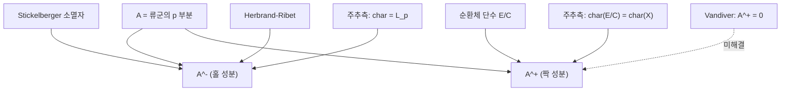

# Vandiver 추측과 순환체의 짝수 성분

# 개요

순환체 $\mathbb Q(\mu_p)$ 의 류군의 $p$ 부분 $A$ 는 지표 성분으로 완전히 쪼개진다.

$$
A=A^{-}\oplus A^{+},\qquad
A^{-}=\bigoplus_{i\ \text{홀}}A^{(\omega^{i})},\quad
A^{+}=\bigoplus_{i\ \text{짝}}A^{(\omega^{i})}
$$

홀수 쪽 $A^{-}$ 는 완전히 이해되어 있다. [Herbrand–Ribet](herbrand-ribet.md) 이 각 성분이 0 인지를 Bernoulli 수로 판정하고, [Iwasawa 주추측](iwasawa-main-conjecture.md)이 크기와 $\Lambda$ 가군 구조까지 $p$ 진 $L$ 함수로 기술한다.

짝수 쪽에 대해서는 예측이 하나뿐이고, 그것이 100 년 넘게 열려 있다.

> **Vandiver 추측.** $p\nmid h^{+}$ 이고 곧 $A^{+}=0$ 이다.

여기서 $h^{+}$ 는 실부분체 $\mathbb Q(\mu_p)^{+}=\mathbb Q(\zeta_p+\zeta_p^{-1})$ 의 류수다. 주장은 단순하지만 증명의 실마리가 없다. 더 답답한 점은 **주추측이 이 문제를 전혀 건드리지 못한다**는 것이다. 주추측은 짝수 지표 쪽에서 "류군 = 단수군 / 순환체 단수군" 이라는 비를 기술할 뿐, 그 비가 자명한지는 말하지 않는다.

이 문서는 왜 홀수와 짝수가 이렇게 다른지, 무엇이 알려져 있고 무엇이 알려져 있지 않은지를 정리한다.

# 직관

## 복소켤레가 모든 것을 둘로 나눈다

$\mathbb Q(\mu_p)$ 는 총허수체이고 복소켤레 $J$ 가 Galois 군의 중심에 있는 위수 2 원소다. $p$ 가 홀수이므로 $\mathbb Z_p[J]$ 에서 $\frac{1\pm J}2$ 가 멱등원이 되어 모든 $\mathbb Z_p[\Delta]$ 가군이 $\pm$ 로 쪼개진다.

이 분해는 기하적 의미가 있다. **$-$ 쪽은 "허수 방향", $+$ 쪽은 실부분체의 산술**이다. 단수는 실부분체에 거의 다 들어 있고($E=\mu\cdot E^{+}$ 에 가깝다), 그래서 단수가 만드는 제약이 $+$ 쪽에만 걸린다. 반대로 Gauss 합과 [Stickelberger](stickelberger.md) 원소는 $-$ 쪽만 본다.

| 쪽 | 통제하는 대상 | 도구 | 결과 |
|---|---|---|---|
| $-$ (홀) | $A^{-}$ | Stickelberger 원소, $L(0,\chi)$ | 완전히 기술됨 |
| $+$ (짝) | $A^{+}$ | 순환체 단수, $L'(0,\chi)$ | 비만 기술됨 |

## 왜 소멸자가 $+$ 쪽에는 없는가

[Stickelberger](stickelberger.md) 문서에서 본 항등식 $(1+\sigma_{-1})\theta_m=\sum_a\sigma_a$ 가 이유를 그대로 말해 준다. $\theta$ 의 짝수 부분은 노름원소이고 노름원소는 류군에 대해 아무 정보도 주지 않는다. $L(0,\chi)=0$ ($\chi$ 짝)이라는 해석적 사실의 대수적 그림자다.

$+$ 쪽에서 $L$ 함수가 살아나는 것은 $s=0$ 에서의 **미분** $L'(0,\chi)$ 이고, 그 값은 단수의 로그로 표현된다(Dirichlet 유수 공식의 $\chi$ 성분). 미분값은 곱셈적 소멸자를 주지 않는다. 소멸자를 얻으려면 값이 필요한데 값이 0 이다. **$+$ 쪽에는 쓸 수 있는 소멸자가 원리적으로 없다.**

## 주추측이 말해 주는 것과 말하지 못하는 것

짝수 지표 $\chi$ 에 대한 주추측은 다음 꼴이다.

$$
\mathrm{char}_\Lambda\Big(\big(E_\infty/C_\infty\big)^{(\chi)}\Big)=\mathrm{char}_\Lambda\Big(X_\infty^{(\chi)}\Big)
$$

$E_\infty$ 는 단수의 극한, $C_\infty$ 는 순환체 단수의 극한이다. 좌변은 "단수 중 순환체 단수가 아닌 것이 얼마나 있는가" 를 재고 우변이 류군이다. 두 양이 같다는 것이 주추측의 내용이다.

여기서 **양변이 동시에 0 일 수도 있고 동시에 비자명할 수도 있다.** 주추측은 둘을 묶을 뿐 어느 쪽인지 고르지 않는다. Vandiver 추측은 "둘 다 0" 을 주장하는 것이고, 그 주장을 뒷받침할 독립적인 이유가 아직 없다.

## 왜 그래도 참일 것 같은가

두 가지 근거가 있다.

- **수치.** $p<2^{31}$ 까지 반례가 없다. Buhler–Harvey 등의 계산이 Bernoulli 수의 $p$ 진 성질과 순환체 단수의 지표를 함께 확인했다.
- **확률 모형.** Cohen–Lenstra 류의 발견적 논법을 순환체에 적용하면 $p\mid h^{+}$ 일 확률이 대략 $p^{-2}$ 정도로 추정되고, $\sum p^{-2}$ 가 수렴하므로 **반례는 유한 개밖에 없을 것**으로 예상된다. 그런데 이 논법은 반례가 아예 없다는 것까지는 주지 않는다.

두 번째 근거가 미묘하다. 같은 발견법이 $A^{-}$ 에서는 $p\mid h^{-}$ 확률을 $p^{-1}$ 정도로 주고, 실제로 비정칙 소수가 $39\%$ 나 된다. 지수 하나 차이가 "흔한 일" 과 "일어나지 않을 일" 을 가른다.

# 정의

## 실부분체와 두 류수

$K=\mathbb Q(\mu_p)$ 와 $K^{+}=\mathbb Q(\zeta_p+\zeta_p^{-1})$ 를 두고 류수를 각각 $h$ 와 $h^{+}$ 라 하자. $h^{-}=h/h^{+}$ 를 **상대류수**라 한다. $h^{-}$ 은 [Stickelberger](stickelberger.md) 문서의 지표 공식으로 명시적으로 계산되지만 $h^{+}$ 에는 그런 공식이 없다.

## Vandiver 추측

**추측.** 모든 홀소수 $p$ 에 대해 $p\nmid h^{+}$ 이다. 동치로 $A^{+}=0$ 이며, 또 동치로 순환체 단수군 $C$ 가 단수군 $E$ 안에서 지표 $h^{+}$ 를 갖되 그 지표가 $p$ 로 나뉘지 않는다.

## 알려진 동치 조건

$p$ 에 대해 다음이 서로 동치다.

1. $A^{+}=0$ (Vandiver).
2. $A^{-}$ 가 $\mathbb Z_p[\Delta]$ 가군으로 순환적이다.
3. $\lambda^{+}=\mu^{+}=\nu^{+}=0$ 이고 곧 $\mathbb Q(\mu_{p^{\infty}})^{+}$ 의 탑에서 류군의 $p$ 부분이 모든 층에서 자명하다.
4. 각 짝수 $k$ 에 대해 $\mathbb Z_p[[T]]$ 가군 $X_\infty^{(\omega^{k})}$ 가 0 이다.

2 번이 특히 유용하다. **Vandiver 가 참이면 홀수 쪽 구조가 한 생성원으로 끝난다.** 이 때문에 많은 정리가 "Vandiver 를 가정하면" 이라는 단서를 달고 훨씬 강한 결론을 낸다.

# 성질

## Vandiver 를 가정하면 무엇이 나오는가

| 가정 아래 결론 | 내용 |
|---|---|
| $A^{-}$ 의 구조 | $\mathbb Z_p[\Delta]$ 순환, 각 성분이 $\mathbb Z/p^{n_i}$ |
| Iwasawa 가군 | $X_\infty^{-}$ 가 $\Lambda$ 위 순환, 특성 멱급수가 $L_p$ 그 자체 |
| FLT 둘째 경우 | $p\mid xyz$ 인 해가 없음(Vandiver 의 정리) |
| $K_{2i}(\mathbb Z)$ 의 계산 | 짝수 $K$ 군의 위수가 $\zeta(1-i)$ 로 결정 |

마지막 항목이 흥미롭다. Quillen–Lichtenbaum 이후 $\mathbb Z$ 의 대수적 $K$ 군은 순환체의 류군으로 환원되는데, 짝수 지표 성분의 소멸 여부가 곧 $K_{4k}(\mathbb Z)=0$ 여부다. **Vandiver 추측은 위상수학 쪽에서는 $K_{4k}(\mathbb Z)$ 가 소멸한다는 주장으로 다시 나타난다.**

## 무엇이 증명되어 있는가

- $p$ 가 정칙이면 $h$ 전체가 $p$ 로 나뉘지 않으므로 Vandiver 는 자명하다.
- 비정칙 $p$ 에 대해서도 대규모 수치 검증이 이루어졌다. 검증은 $B_k$ 를 $\bmod p^{2}$ 로 계산하고 짝수 성분의 소멸을 Iwasawa 불변량으로 확인하는 방식이다.
- $\lambda^{+}=0$ 을 일반적으로 증명하는 것은 [Greenberg 추측](greenberg-conjecture.md)(총실수체의 Iwasawa 불변량이 소멸)의 특수한 경우이고, 그쪽도 열려 있다.

## 왜 어려운가

세 가지 장벽이 겹쳐 있다.

1. **소멸자가 없다.** 위에서 본 대로 $+$ 쪽에는 $L$ 값이 주는 곱셈적 소멸자가 없다.
2. **원소를 만드는 쪽도 막혀 있다.** Eisenstein 합동은 $-$ 쪽 원소를 만든다. $+$ 쪽 원소를 만드는 합동이 있다면 그것은 Vandiver 의 **반례**를 만드는 기계일 텐데, 그런 기계가 있다면 추측이 거짓일 것이다. 곧 두 방향 모두 기존 도구가 닿지 않는다.
3. **크기가 극도로 작다.** 반례가 있더라도 극히 드물 것이므로, 구조적 정리보다는 "왜 하필 0 인가" 를 설명하는 새로운 원리가 필요하다.

[Euler 계](euler-systems.md)가 $A^{+}$ 를 누를 수 있으면 좋겠지만, 순환체 단수가 주는 Euler 계는 이미 주추측에 소진되어 있고 그 결론이 비만 준다. 추가 정보를 담은 새로운 대수적 원소가 필요하며, 그것이 무엇일지 알려져 있지 않다.

# 활용

## Fermat 의 둘째 경우

Kummer 는 정칙소수에 대해 Fermat 방정식의 첫째 경우, 곧 $p\nmid xyz$ 인 경우를 해결했다. Vandiver 는 $p\nmid h^{+}$ 라는 더 약한 가정만으로 $p\mid xyz$ 인 **둘째 경우**까지 처리했다. 실제 응용 가능성이 추측의 이름이 붙은 배경이다. Wiles 이후 Fermat 자체는 해결되었으므로 이 응용은 역사적 의미만 남았지만, 가정의 약화 방향은 여전히 참고가 된다.

## 대수적 $K$ 이론

$K_n(\mathbb Z)$ 의 계산에서 짝수 $n=4k$ 의 경우가 Vandiver 에 걸려 있다. Vandiver 를 가정하면 $K_{4k}(\mathbb Z)=0$ 이고 홀수 자리의 위수가 $\zeta(1-2k)$ 의 분자와 분모로 명시된다. 반대로 어떤 $k$ 에 대해 $K_{4k}(\mathbb Z)\ne0$ 임이 증명되면 Vandiver 의 반례가 나온다. **순수 위상수학적 계산이 정수론의 추측을 판정할 수 있는 드문 통로다.**

## 계산 수론의 벤치마크

Vandiver 검증은 대규모 Bernoulli 수 계산의 표준 시험대다. $B_k \bmod p$ 를 $k<p$ 전체에 대해 계산하는 작업은 다중점 다항식 평가와 빠른 곱셈의 성능을 그대로 드러내고, 그 과정에서 비정칙 소수 표와 Iwasawa 불변량 표가 함께 만들어진다. 검증이 끝난 범위가 계속 늘어나는 것 자체가 계산 기술의 지표다.

[^1]: H. S. Vandiver 의 원래 작업은 1920–30 년대이며, 정리와 동치 조건은 L. Washington, *Introduction to Cyclotomic Fields* (2판) 8, 10 장에 정리되어 있다. 수치 검증은 J. Buhler, D. Harvey, *Irregular primes to 163 million*, Math. Comp. **80** (2011). $K$ 이론과의 관계는 C. Weibel, *Algebraic K-theory of rings of integers in local and global fields* 를 보라.

# 연관 문서

## 선수지식

- [Herbrand–Ribet 정리와 Eisenstein 합동](herbrand-ribet.md)
- [Iwasawa 주추측과 순환체 단수](iwasawa-main-conjecture.md)

## 더 알아보기

- [Greenberg 추측과 총실수체의 Iwasawa 불변량](greenberg-conjecture.md)

#number_theory #computation #algebra
