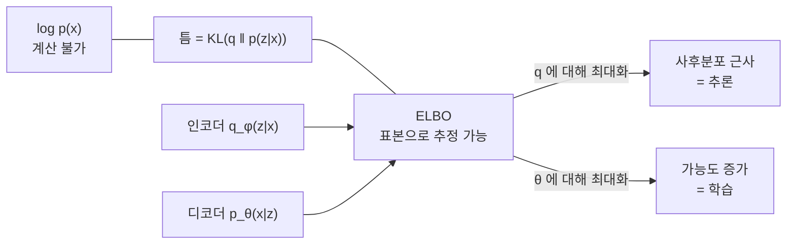

# 변분 오토인코더

# 개요

[확률적 PCA](probabilistic-pca.md)는 잠재변수 $z$ 를 Gauss 분포에서 뽑고 선형변환한 뒤 등방성 잡음을 더해 데이터를 만든다. 선형이라는 가정 덕분에 사후분포 $p(z\mid x)$ 가 Gauss 로 닫힌 형태로 나오고, 최대가능도 해가 고전 PCA 와 일치한다.

그 가정을 버리면 어떻게 되나. $z\mapsto x$ 를 신경망으로 바꾸면 표현력은 크게 늘지만 대가가 즉시 나타난다. 주변가능도 $p(x)=\int p(x\mid z)p(z)\,dz$ 의 적분이 닫히지 않고, 사후분포도 계산할 수 없다. 최대가능도 학습의 두 축이 동시에 막힌다.

변분 오토인코더의 해법은 두 가지다. 첫째, 사후분포를 다루기 쉬운 분포족으로 근사하고 그 근사의 품질을 [KL divergence](kl-divergence.md)로 잰다. 그러면 $\log p(x)$ 의 하계인 ELBO 가 나오고, 최대가능도가 하계 최대화로 바뀐다. 둘째, 그 하계를 [경사하강법](gradient-descent.md)으로 올린다. 기댓값 안에 최적화 대상이 들어 있어 기울기 추정이 문제가 되는데, 재매개화라는 간단한 변수변환이 이를 해결한다.

결과적으로 인코더와 디코더 두 신경망이 함께 학습되며, 확률적 PCA 의 선형 사영과 복원이 각각 비선형으로 일반화된 모습이 된다.

# 직관

## 적분을 하계로 바꾼다

$\log p(x)$ 를 직접 계산할 수 없으니 임의의 분포 $q(z)$ 를 끼워 넣는다.

$$
\log p(x)=\log\int p(x,z)\,dz=\log\mathbb E_{q}\Big[\frac{p(x,z)}{q(z)}\Big]
\ \ge\ \mathbb E_{q}\Big[\log\frac{p(x,z)}{q(z)}\Big]
$$

부등호는 $\log$ 의 오목성에서 오는 Jensen 부등식이다. 오른쪽이 ELBO 이고, 기댓값 안에 로그가 들어가 있으므로 표본으로 추정할 수 있다.

## 틈이 정확히 KL 이다

하계가 얼마나 느슨한지도 계산된다.

$$
\log p(x)-\mathrm{ELBO}(q)=\mathrm{KL}\big(q(z)\,\|\,p(z\mid x)\big)
$$

$q$ 가 참 사후분포와 같을 때만 등호가 성립한다. 곧 ELBO 를 $q$ 에 대해 최대화하는 것은 사후분포를 근사하는 것과 정확히 같은 일이고, $\theta$ 에 대해 최대화하는 것은 가능도를 올리는 것이다. 하나의 목적함수가 추론과 학습을 동시에 수행한다.



## 왜 인코더가 필요한가

데이터가 $N$ 개면 근사할 사후분포도 $N$ 개다. 각각에 대해 따로 최적화하면 새 데이터가 올 때마다 처음부터 다시 해야 한다.

대신 $x$ 를 받아 $q(z\mid x)$ 의 모수를 뱉는 함수를 하나 학습한다. 이것이 인코더이고, 이 방식을 상각 추론이라 한다. 개별 최적화보다 정확도가 떨어지는 만큼(상각 틈) 손해를 보지만, 새 데이터의 추론이 순전파 한 번으로 끝난다.

## 왜 재매개화가 필요한가

ELBO 의 기울기를 $q$ 의 모수 $\phi$ 에 대해 구해야 하는데, 기댓값을 취하는 분포 자체가 $\phi$ 에 의존한다. 미분과 기댓값의 순서를 바꿀 수 없다.

$z\sim\mathcal N(\mu,\sigma^2)$ 를 $z=\mu+\sigma\epsilon$, $\epsilon\sim\mathcal N(0,1)$ 로 쓰면 상황이 달라진다. 무작위성이 $\phi$ 와 무관한 $\epsilon$ 으로 옮겨 가고, $z$ 는 $\phi$ 의 결정적 함수가 된다. 이제 기댓값 안에서 그냥 미분하면 되고, 역전파가 인코더까지 관통한다.

# 정의

## 생성모형

$$
p_\theta(x,z)=p(z)\,p_\theta(x\mid z),\qquad p(z)=\mathcal N(0,I)
$$

$p_\theta(x\mid z)$ 의 모수를 신경망(디코더)이 $z$ 에서 계산한다. 연속 데이터면 $\mathcal N(\mu_\theta(z),\sigma^2I)$, 이진 데이터면 Bernoulli 다.

사전분포를 표준 Gauss 로 고정하는 것은 제약이 아니다. 충분히 표현력 있는 디코더가 어떤 분포로도 밀어낼 수 있기 때문이며, 확률적 PCA 에서 $z\sim\mathcal N(0,I)$ 로 두는 것과 같은 이유다.

## 변분 사후분포

$$
q_\phi(z\mid x)=\mathcal N\big(\mu_\phi(x),\ \mathrm{diag}\,\sigma^2_\phi(x)\big)
$$

인코더 신경망이 $\mu_\phi$ 와 $\log\sigma^2_\phi$ 를 출력한다. 공분산을 대각으로 두는 것이 표준 선택이고, 이 제한이 근사의 주된 한계이기도 하다.

## ELBO

$$
\mathcal L(\theta,\phi;x)=\mathbb E_{q_\phi(z\mid x)}\big[\log p_\theta(x\mid z)\big]-\mathrm{KL}\big(q_\phi(z\mid x)\,\|\,p(z)\big)
$$

첫 항이 복원항, 둘째가 정칙화항이다. 위의 $\mathbb E_q[\log p(x,z)-\log q(z)]$ 를 정리한 것과 같다.

$q$ 와 $p(z)$ 가 모두 Gauss 이므로 KL 항은 닫힌 형태다.

$$
\mathrm{KL}=\frac12\sum_{j=1}^d\big(\mu_j^2+\sigma_j^2-1-\log\sigma_j^2\big)
$$

복원항만 표본으로 추정하면 되고, 실무에서는 표본 하나로도 충분하다.

## 재매개화 추정량

$$
\nabla_\phi\mathcal L=\nabla_\phi\,\mathbb E_{\epsilon\sim\mathcal N(0,I)}
\big[\log p_\theta(x\mid \mu_\phi+\sigma_\phi\odot\epsilon)\big]-\nabla_\phi\mathrm{KL}
$$

기댓값이 $\phi$ 와 무관한 분포에 대한 것이므로 미분이 안으로 들어간다.

# 성질

## 두 항의 해석

복원항은 $z$ 에서 $x$ 를 얼마나 잘 복원하는지를 재고, KL 항은 $q(z\mid x)$ 를 사전분포 쪽으로 당긴다. 두 힘이 맞선다. KL 이 없으면 각 $x$ 가 잠재공간의 서로 다른 점에 고립되어 오토인코더가 되고, 복원항이 약하면 모든 $x$ 가 같은 곳으로 붕괴한다.

[정보이론](kl-divergence.md)의 언어로 다시 쓰면 KL 항의 데이터 평균이 다음과 같이 갈린다.

$$
\mathbb E_{x}\big[\mathrm{KL}(q(z\mid x)\|p(z))\big]=I(x;z)+\mathrm{KL}\big(q(z)\,\|\,p(z)\big)
$$

$q(z)=\mathbb E_x[q(z\mid x)]$ 는 총합 사후분포다. 첫 항은 잠재변수가 데이터에 대해 갖는 상호정보량이고, 둘째는 총합 사후분포가 사전분포와 얼마나 다른지다. ELBO 최대화가 상호정보량에 벌점을 준다는 뜻이고, 이것이 다음 문제로 이어진다.

## 사후 붕괴

디코더가 충분히 강하면(자기회귀 디코더처럼 $z$ 없이도 $x$ 를 잘 모형화하면) $q(z\mid x)=p(z)$ 로 두는 것이 최적이 된다. KL 항이 0 이 되고 복원항은 거의 손해를 보지 않는다. 잠재변수가 아무 정보도 담지 않는 이 현상을 사후 붕괴라 한다.

ELBO 가 $\log p(x)$ 의 하계일 뿐 표현 학습의 목적함수가 아니라는 점이 원인이다. 대응책으로 KL 항에 가중치를 두거나($\beta$-VAE), KL 에 하한을 두어 일정량의 정보를 강제하거나, 디코더의 표현력을 제한한다. $\beta>1$ 은 잠재변수의 축을 분리하는 효과가 있어 해석 가능한 표현을 얻는 데 쓰인다.

## 확률적 PCA 와의 관계

디코더를 선형 $\mu_\theta(z)=Wz+b$ 로, 관측 잡음을 등방성 Gauss 로 두면 모형 자체가 확률적 PCA 다. 이때 참 사후분포가 Gauss 이므로 변분족이 그것을 포함하고, ELBO 의 최대값이 실제 $\log p(x)$ 와 같아진다.

다만 변분족의 공분산을 대각으로 제한하면 그렇지 않다. 참 사후분포의 공분산은 일반적으로 대각이 아니기 때문에 틈이 남는다. 표현력의 손실이 디코더가 아니라 인코더의 분포족에서 온다는 점을 보여 주는 사례다.

## 하계와 틈을 직접 확인

선형 Gauss 모형에서는 모든 양이 닫힌 형태로 나오므로 ELBO 와 KL 의 관계를 수치로 확인할 수 있다.

```python
import numpy as np
rng = np.random.default_rng(0)

# 선형 Gauss 모형: z ~ N(0,1), x|z ~ N(w z, s^2). 사후분포가 닫힌 형태로 나온다.
w, s2, x = 2.0, 0.5, 1.3
post_var = 1 / (1 + w * w / s2)
post_mu = post_var * w * x / s2
log_px = -0.5 * (np.log(2 * np.pi * (w * w + s2)) + x * x / (w * w + s2))
print(f"참 사후분포 N({post_mu:.4f}, {post_var:.4f}),  log p(x) = {log_px:.6f}")

def elbo(mu, var, n=2_000_000):
    """재매개화로 뽑은 z 로 ELBO = E_q[log p(x,z) - log q(z)] 를 추정."""
    z = mu + np.sqrt(var) * rng.standard_normal(n)          # 재매개화
    log_pxz = (-0.5 * (np.log(2 * np.pi) + z ** 2)
               - 0.5 * (np.log(2 * np.pi * s2) + (x - w * z) ** 2 / s2))
    log_q = -0.5 * (np.log(2 * np.pi * var) + (z - mu) ** 2 / var)
    return (log_pxz - log_q).mean()

def kl(mu, var):
    """KL(q || 참 사후분포), 두 Gauss 사이의 닫힌 형태."""
    return 0.5 * (var / post_var + (mu - post_mu) ** 2 / post_var
                  - 1 + np.log(post_var / var))

print(f"{'q':>22} {'ELBO':>11} {'log p(x)-ELBO':>15} {'KL(q||p)':>10}")
for mu, var in [(post_mu, post_var), (0.0, 1.0), (1.0, 0.2), (post_mu, 0.05)]:
    e = elbo(mu, var)
    print(f"N({mu:6.3f},{var:6.3f}) {e:11.6f} {log_px - e:15.6f} {kl(mu, var):10.6f}")

# 참 사후분포 N(0.5778, 0.1111),  log p(x) = -1.858755
#                      q        ELBO   log p(x)-ELBO   KL(q||p)
# N( 0.578, 0.111)   -1.858755       -0.000000   0.000000
# N( 0.000, 1.000)   -6.267750        4.408995   4.403610
# N( 1.000, 0.200)   -2.766966        0.908211   0.908329
# N( 0.578, 0.050)   -1.983645        0.124890   0.124254
```

참 사후분포를 넣으면 ELBO 가 $\log p(x)$ 와 정확히 일치하고, 그 밖에서는 틈이 KL 과 같다. 표본 200 만 개의 몬테카를로 오차 범위 안에서 두 열이 맞는다.

마지막 줄이 중요하다. 평균은 맞는데 분산을 너무 작게 잡아도 틈이 생긴다. ELBO 최대화가 평균뿐 아니라 불확실성의 크기까지 맞추도록 강제한다는 뜻이며, 최대가능도로 점추정만 하는 오토인코더와 갈리는 지점이다.

## 두 기울기 추정량의 분산

재매개화 없이도 기울기를 추정할 수는 있다. $\nabla_\phi\mathbb E_q[f]=\mathbb E_q[f\nabla_\phi\log q]$ 라는 항등식을 쓰는 점수함수 추정량(REINFORCE)이 그것이고, $q$ 가 이산이어도 쓸 수 있다는 장점이 있다. 대신 분산이 크다.

```python
import numpy as np
rng = np.random.default_rng(0)
w, s2, x = 2.0, 0.5, 1.3
mu, var = 0.0, 1.0                      # 최적이 아닌 q 에서 기울기를 재 본다

def f(z):                               # log p(x,z) - log q(z)
    return (-0.5 * (np.log(2 * np.pi) + z ** 2)
            - 0.5 * (np.log(2 * np.pi * s2) + (x - w * z) ** 2 / s2)
            + 0.5 * (np.log(2 * np.pi * var) + (z - mu) ** 2 / var))

def grad_reparam(n):                    # z = mu + sqrt(var)·eps 로 mu 에 대해 미분
    eps = rng.standard_normal(n)
    z = mu + np.sqrt(var) * eps
    return (z - w * (w * z - x) / s2).mean()      # d/dz [log p(x,z)] · dz/dmu

def grad_score(n):                      # REINFORCE: E[f(z)·d/dmu log q(z)]
    z = mu + np.sqrt(var) * rng.standard_normal(n)
    return (f(z) * (z - mu) / var).mean()

for n in (10, 100, 1000):
    r = np.array([grad_reparam(n) for _ in range(500)])
    s = np.array([grad_score(n) for _ in range(500)])
    print(f"표본 {n:>4}개: 재매개화 추정량 {r.mean():+.3f} ± {r.std():.3f}"
          f"   |   점수함수 추정량 {s.mean():+.3f} ± {s.std():.3f}")

# 표본   10개: 재매개화 추정량 +5.232 ± 2.204   |   점수함수 추정량 +5.306 ± 6.468
# 표본  100개: 재매개화 추정량 +5.206 ± 0.742   |   점수함수 추정량 +5.245 ± 1.784
# 표본 1000개: 재매개화 추정량 +5.185 ± 0.229   |   점수함수 추정량 +5.191 ± 0.564
```

두 추정량 모두 불편이라 평균이 같은 값으로 모이지만 표준편차가 3 배 가까이 차이 난다. 신경망의 모수가 수백만 개이고 미니배치마다 표본을 하나만 쓰는 실제 상황에서는 이 차이가 훨씬 커져, 점수함수 추정량으로는 학습이 사실상 진행되지 않는다.

재매개화가 가능한 이유는 Gauss 분포가 위치–척도족이기 때문이다. 이산 잠재변수에는 그대로 적용되지 않고, 연속 완화(Gumbel–softmax)로 우회하거나 점수함수 추정량에 기저선을 붙여 분산을 줄인다.

# 활용

## 생성과 표현

학습이 끝나면 $z\sim\mathcal N(0,I)$ 를 뽑아 디코더에 넣는 것으로 새 표본을 만든다. 잠재공간이 연속이고 사전분포와 정렬되어 있어 두 데이터의 잠재 표현을 보간하면 그 사이를 잇는 자연스러운 변화가 나온다.

생성 품질만 놓고 보면 확산모형이나 적대적 생성망에 밀린다. 복원항이 보통 화소별 Gauss 가능도라 사람 눈에 중요한 구조를 반영하지 못해 흐릿한 표본이 나오기 때문이다. 반면 잠재공간이 저차원이고 인코더가 있어 표현 학습과 이상탐지에는 여전히 널리 쓰인다.

## 다른 모형의 부품으로

잠재 확산모형은 VAE 로 이미지를 저차원 잠재공간에 압축한 뒤 그 공간에서 확산모형을 학습한다. 화소 공간에서 직접 확산을 돌리는 것보다 계산이 수십 배 싸고, 현재 쓰이는 대형 이미지 생성모형의 표준 구조다. VAE 가 생성기 자체보다 표현을 만드는 부품으로 자리를 잡은 셈이다.

벡터 양자화를 결합한 VQ-VAE 는 잠재공간을 이산 부호로 만들어, 그 부호열을 자기회귀 모형으로 다시 모형화한다. 이미지와 음성 생성에서 널리 쓰이는 구성이다.

## 변분추론 일반으로

ELBO 와 재매개화는 VAE 만의 도구가 아니다. 베이즈 신경망의 가중치 사후분포 근사, 확률적 프로그래밍 언어의 자동 추론 엔진, 주제모형의 대규모 학습이 모두 같은 틀 위에 있다.

MCMC 와 대비하면 성격이 분명해진다. MCMC 는 충분히 오래 돌리면 참 사후분포에 수렴하지만 느리고 수렴 판정이 어렵다. 변분추론은 빠르고 목적함수 값으로 진행을 감시할 수 있지만, 분포족의 한계 때문에 참 사후분포에 도달하지 못하고 대개 불확실성을 과소평가한다. $\mathrm{KL}(q\|p)$ 를 최소화하는 방향이 $p$ 가 작은 곳에서 $q$ 도 작기를 요구해, $q$ 가 사후분포의 한 봉우리에만 몰리기 때문이다.

# 연관 문서

## 선수지식

- [확률적 PCA](probabilistic-pca.md)
- [KL divergence와 상호정보량](kl-divergence.md)
- [경사하강법](gradient-descent.md)

## 더 알아보기

- [확산모형](diffusion-models.md)

#machine_learning #statistics #information_theory
