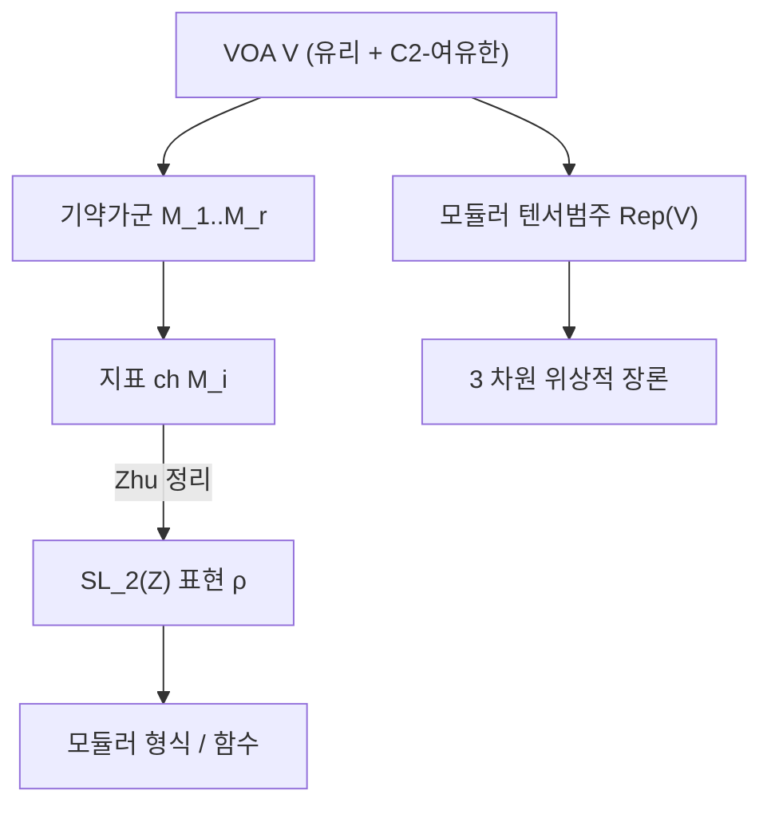

# 정점작용소대수

# 개요

2 차원 등각장론에서 관측량은 곡면 위의 점에 놓인 **장**(field)이고, 두 장을 곱하면 점이 가까워질 때 발산한다. 곧 장들의 집합은 점별 곱셈으로 대수를 이루지 못한다. 대신 두 장의 곱을 거리의 Laurent 급수로 전개하면 각 계수가 다시 장이 된다.

$$
a(z)\,b(w)\ \sim\ \sum_{n}\frac{\big(a_{(n)}b\big)(w)}{(z-w)^{n+1}}
$$

이 전개를 공리로 삼아 만든 대수 구조가 **정점작용소대수**(vertex operator algebra, VOA)다. 결합대수에서 곱셈 하나가 하는 일을 무한히 많은 쌍선형 연산 $a_{(n)}$ 이 나눠 맡고, 결합법칙 자리에는 "두 장이 충분히 떨어져 있으면 순서를 바꿔도 된다" 는 국소성 공리가 들어간다.

[Lie 대수](lie-algebras.md) 쪽에서 보면 Virasoro 대수와 affine Kac–Moody 대수의 표현을 담는 틀이다. 무한차원 Lie 대수의 최고무게 가군에 곱셈 구조를 얹은 것이 VOA 이고, 그래서 VOA 의 정의 안에 Virasoro 원소 $\omega$ 가 명시적으로 들어간다.

[모듈러 형식](modular-forms.md) 쪽에서 보면 지표의 생성지다. 좋은 조건을 만족하는 VOA 의 기약가군 지표들은 $\mathrm{SL}_2(\mathbb Z)$ 의 유한차원 표현을 이룬다(Zhu 정리). 대수 구조 하나가 모듈러 형식 한 묶음을 낳는다는 뜻이고, [괴물 달빛](monstrous-moonshine.md)에서 $j$ 가 나온 것이 이 원리의 가장 유명한 사례다.

# 직관

## 원소 하나가 연산자 무한 개를 준다

결합대수에서 원소 $a$ 는 왼쪽 곱셈 연산자 $L_a$ 하나를 준다. VOA 에서 원소 $a$ 는 **형식 급수**를 준다.

$$
Y(a,z)=\sum_{n\in\mathbb Z}a_{(n)}z^{-n-1},\qquad a_{(n)}\in\operatorname{End}(V)
$$

$z$ 는 수렴을 신경 쓰지 않는 형식변수다. 이 대응 $a\mapsto Y(a,z)$ 를 **상태-장 대응**이라 하는데, 물리에서 "모든 장에는 대응하는 상태가 있고 그 역도 성립한다" 는 원리를 그대로 공리로 옮긴 것이다.

각 $v\in V$ 에 대해 $a_{(n)}v=0$ 이 충분히 큰 $n$ 에서 성립하도록 요구한다(절단 조건). 그래서 $Y(a,z)v$ 는 $z$ 의 Laurent 급수, 곧 아래로 유한한 형식 급수다.

## 국소성이 결합법칙을 대신한다

VOA 의 핵심 공리는 하나다. 임의의 $a,b\in V$ 에 대해 충분히 큰 $N$ 이 있어

$$
(z-w)^N\big[Y(a,z),Y(b,w)\big]=0
$$

두 장을 잇는 거리의 거듭제곱을 곱하면 교환자가 사라진다는 조건이다. 물리에서는 공간꼴로 떨어진 두 관측량이 교환한다는 요구이고, 수학적으로는 $Y(a,z)Y(b,w)$ 와 $Y(b,w)Y(a,z)$ 가 서로 다른 영역에서 수렴하는 **같은 유리형 함수**의 전개라는 말이다.

이 조건 하나에서 Borcherds 항등식, 결합성의 약한 형태, 교환자 공식이 모두 따라 나온다. 특히 $n\ge0$ 부분만 추리면 익숙한 구조가 나온다.

$$
\big[a_{(m)},b_{(n)}\big]=\sum_{k\ge0}\binom{m}{k}\big(a_{(k)}b\big)_{(m+n-k)}
$$

$k=0$ 항만 남는 경우가 Lie 대수의 괄호이고, 나머지 항이 "고차 보정" 이다. VOA 가 Lie 대수의 확장이라는 말의 정확한 뜻이 이 공식이다.

## 등급이 모듈러성을 낳는다

$V=\bigoplus_{n}V_n$ 의 등급은 Virasoro 원소의 $L_0$ 고유값이다. 지표를 생성함수로 쓰면

$$
\operatorname{ch}V(\tau)=\operatorname{tr}_Vq^{L_0-c/24}=q^{-c/24}\sum_n(\dim V_n)q^n
$$

이다. $-c/24$ 라는 보정은 물리에서 원기둥 위의 Casimir 에너지에서 나오는데, 바로 이 보정이 있어야 지표가 모듈러 성질을 갖는다. [Dedekind eta](theta-functions.md)의 $q^{1/24}$ 와 같은 자리에서 나오는 상수다.

$c$ 가 24 의 배수일 때 $q^{-c/24}$ 가 정수 거듭제곱이 되어 지표가 진짜 $q$ 의 Laurent 급수가 된다. 달빛에서 $c=24$ 인 것이 우연이 아니다.

# 정의

## 공리

**정점작용소대수**는 네 쌍 $(V,Y,\mathbf 1,\omega)$ 이다.

- $V=\bigoplus_{n\in\mathbb Z}V_n$ 은 각 $V_n$ 이 유한차원이고 아래로 유한한 등급 벡터공간.
- $Y:V\to\operatorname{End}(V)[[z,z^{-1}]]$, $Y(a,z)=\sum_n a_{(n)}z^{-n-1}$ 은 절단 조건을 만족.
- $\mathbf 1\in V_0$ 은 **진공**으로 $Y(\mathbf 1,z)=\operatorname{id}$ 이고 $Y(a,z)\mathbf 1\big|_{z=0}=a$.
- $\omega\in V_2$ 는 **Virasoro 원소**로 $Y(\omega,z)=\sum_n L_nz^{-n-2}$ 의 모드가 중심전하 $c$ 의 Virasoro 대수를 이룬다.

$$
[L_m,L_n]=(m-n)L_{m+n}+\frac{c}{12}m(m^2-1)\delta_{m+n,0}
$$

- $L_0$ 은 등급을 주고($L_0|_{V_n}=n$), $L_{-1}$ 은 평행이동을 준다($Y(L_{-1}a,z)=\partial_zY(a,z)$).
- 국소성: 모든 $a,b$ 에 대해 어떤 $N$ 이 있어 $(z-w)^N[Y(a,z),Y(b,w)]=0$.

$\omega$ 를 빼면 그냥 **정점대수**다. Virasoro 원소가 등급과 모듈러성을 담당하므로, 모듈러 형식 쪽 응용에서는 반드시 필요하다.

## 가군과 지표

$V$-가군 $M$ 은 상태-장 대응 $Y_M:V\to\operatorname{End}(M)[[z,z^{-1}]]$ 를 갖고 같은 항등식을 만족하는 공간이다. $L_0$ 의 고유값은 일반적으로 정수가 아니라 $h+\mathbb Z_{\ge0}$ 꼴이며, $h$ 를 **등각무게**라 한다.

$$
\operatorname{ch}M(\tau)=\operatorname{tr}_Mq^{L_0-c/24}=q^{h-c/24}\sum_{n\ge0}(\dim M_{h+n})q^n
$$

기약가군이 $V$ 자신 하나뿐이면 **홀로모픽**이라 한다.

## 격자 VOA

가장 중요한 구성이다. 짝수 [격자](lattices.md) $L$ 이 랭크 $n$ 이면 중심전하 $n$ 의 VOA $V_L$ 을 만들 수 있다.

$$
V_L=S\big(\mathfrak h^-\big)\otimes\mathbb C[L],\qquad \mathfrak h=L\otimes_{\mathbb Z}\mathbb C
$$

앞쪽은 Heisenberg 대수의 Fock 공간(자유 보손), 뒤쪽은 격자의 군환이다. 격자벡터 $\alpha$ 에 대응하는 장이 정점작용소

$$
Y(e^\alpha,z)=e^{\alpha}z^{\alpha_{(0)}}\exp\!\left(\sum_{k>0}\frac{\alpha_{(-k)}}{k}z^k\right)\exp\!\left(-\sum_{k>0}\frac{\alpha_{(k)}}{k}z^{-k}\right)
$$

이고, 이 이름에서 구조 전체의 이름이 나왔다. 지표는 곧바로 계산된다.

$$
\operatorname{ch}V_L(\tau)=\frac{\Theta_L(\tau)}{\eta(\tau)^{n}}
$$

[theta 급수](theta-functions.md)를 $\eta$ 의 거듭제곱으로 나눈 것이다. $L$ 이 짝수 유니모듈러면 $V_L$ 이 홀로모픽이고 지표가 모듈러 함수가 된다.

# 성질

## 무게 1 자리가 Lie 대수다

임의의 VOA 에서 $V_1$ 은 괄호 $[a,b]=a_{(0)}b$ 로 Lie 대수가 된다. 격자 VOA 에서는 이것이 매우 구체적이다.

$$
\dim(V_L)_1=n+\#\{\alpha\in L:\langle\alpha,\alpha\rangle=2\}
$$

$\mathfrak h$ 에서 오는 $n$ 차원 가환 부분(Cartan 부분대수)과 최소벡터에서 오는 근벡터들이다. $L=E_8$ 이면 $8+240=248$ 로 $E_8$ Lie 대수가 정확히 재현된다. 근계 조합론이 VOA 의 무게 1 자리에 그대로 앉는다.

Leech 격자는 $\langle\alpha,\alpha\rangle=2$ 인 벡터가 없다. 따라서 $\dim(V_\Lambda)_1=24$ 이고, 근이 없는 24 차원 가환 Lie 대수만 남는다.

## 지표를 계산해 보기

$E_8$ 격자 VOA 와 Leech 격자 VOA 의 지표를 직접 전개한다.

```python
N = 6  # q^N 까지

def mul(a, b):
    c = [0] * N
    for i, ai in enumerate(a):
        if ai:
            for k in range(N - i):
                c[i + k] += ai * b[k]
    return c

def eta_inv_power(m):
    """Π(1-q^n)^{-m} 의 q 전개. eta^{-m} = q^{-m/24} * 이 급수"""
    s = [1] + [0] * (N - 1)
    for n in range(1, N):
        # (1-q^n)^{-1} = 1 + q^n + q^{2n} + ...
        geo = [1 if (i % n == 0) else 0 for i in range(N)]
        for _ in range(m):
            s = mul(s, geo)
    return s

def sigma(k, n):
    return sum(d**k for d in range(1, n + 1) if n % d == 0)

# Θ_{E8} = E_4 = 1 + 240 Σ σ_3(n) q^n
theta_e8 = [1] + [240 * sigma(3, n) for n in range(1, N)]
ch_e8 = mul(theta_e8, eta_inv_power(8))
print(ch_e8[:4])
# [1, 248, 4124, 34752]   ← q^{-1/3} 를 뺀 계수. 248 = dim E8

# Θ_Λ (Leech): 최소 노름 4 이므로 q^2 부터. 계수는 알려진 값
theta_leech = [1, 0, 196560, 16773120, 398034000, 4629381120][:N]
ch_leech = mul(theta_leech, eta_inv_power(24))
print(ch_leech[:4])
# [1, 24, 196884, 21493760]   ← q^{-1} 를 뺀 계수

# j - 744 의 계수와 비교
j_shift = [1, 0, 196884, 21493760]   # q^{-1} 자리부터
print(ch_leech[0] == j_shift[0], ch_leech[1], j_shift[1])
# True 24 0
print(ch_leech[2:4] == j_shift[2:4])
# True
```

$V_\Lambda$ 의 지표는 $j-744+24 = j-720$ 이다. $q^1$ 이후의 계수는 $j$ 와 완전히 일치하는데 상수항만 $24$ 만큼 어긋난다. 바로 이 $24$ 가 무게 1 의 가환 Lie 대수이고, 이것이 있는 한 자기동형군이 괴물군이 될 수 없다.

$\mathbb Z/2$ 궤도체가 하는 일이 정확히 이 $24$ 를 지우는 것이다. 결과가 $\operatorname{ch}V^\natural=j-744$ 이고, 무게 1 이 비어 있는 덕분에 무게 2 의 196884 차원 공간(Griess 대수)이 구조 전체를 통제하게 된다.

## Zhu 의 모듈러 불변성

VOA 에 두 가지 유한성 조건을 걸면 지표가 모듈러가 된다.

- **유리성**: 모든 가군이 기약가군의 직합으로 완전분해된다.
- **$C_2$-여유한**: $C_2(V)=\operatorname{span}\{a_{(-2)}b\}$ 에 대해 $\dim V/C_2(V)<\infty$.

Zhu 정리는 이런 $V$ 의 기약가군 $M_1,\dots,M_r$ 의 지표들이 $\mathrm{SL}_2(\mathbb Z)$ 의 작용에 닫혀 있다고 말한다.

$$
\operatorname{ch}M_i\!\left(\frac{a\tau+b}{c\tau+d}\right)=\sum_{j}\rho(\gamma)_{ij}\operatorname{ch}M_j(\tau)
$$

홀로모픽이면 $r=1$ 이므로 지표가 $\mathrm{SL}_2(\mathbb Z)$ 의 1 차원 표현, 곧 스칼라배를 제외하면 모듈러 함수다. $c=24$ 이고 홀로모픽이며 $\dim V_1=0$ 인 VOA 의 지표가 $j-744$ 일 수밖에 없는 이유가 여기에 있다. 그런 VOA 는 무게 0 의 모듈러 함수이므로 $j$ 의 다항식이고, 극이 1 위수이고 상수항이 0 이면 $j-744$ 다.



## 중심전하 24 의 홀로모픽 VOA

$c=24$, 홀로모픽인 VOA 를 분류하는 문제가 있다. Schellekens 가 무게 1 Lie 대수의 가능한 목록이 71 개임을 계산했고, 각 경우에 VOA 가 유일하게 존재한다는 것이 2010 년대에 대부분 확인되었다. 그 중 $\dim V_1=0$ 인 것이 유일하게 $V^\natural$ 이다.

$V^\natural$ 이 $c=24$, 홀로모픽, $\dim V_1=0$ 인 유일한 VOA 라는 명제는 아직 완전히 증명되지 않았고 **Frenkel–Lepowsky–Meurman 추측**으로 남아 있다.

# 활용

## 괴물 달빛

$V^\natural$ 은 Leech 격자 VOA 의 $\mathbb Z/2$ 궤도체이고, $\operatorname{Aut}(V^\natural)=\mathbb M$ 이다. 지표가 $j-744$ 이므로 $\mathbb M$ 의 등급 표현이 되고, 여기서 [괴물 달빛](monstrous-moonshine.md)의 모든 것이 시작된다. Borcherds 의 증명도 $V^\natural$ 에 쌍곡격자 VOA 를 텐서해 무한차원 Lie 대수를 만드는 데서 출발한다.

## 등각장론과 위상적 장론

VOA 는 2 차원 등각장론의 손지기(chiral) 부분을 수학적으로 정의한다. 유리 VOA 의 가군 범주는 **모듈러 텐서범주**가 되고, 그것이 3 차원 Chern–Simons 이론과 매듭 불변량을 준다. 2 차원 등각장론과 3 차원 위상적 장론의 대응이 VOA 를 매개로 서술된다.

## 대수의 계보

- **W-대수.** Virasoro 대수를 고차 스핀 장으로 확장한 VOA 들이다. Drinfeld–Sokolov 축소로 affine VOA 에서 만들어지고, 기하학적 Langlands 의 국소 이론에 쓰인다.
- **손지기 대수와 인수분해 대수.** Beilinson–Drinfeld 가 VOA 를 대수곡선 위의 층으로 재정식화했다. 좌표에 의존하지 않는 정의라 기하학적 Langlands 로 바로 이어진다.
- **정점대수의 4 차원 판본.** 4 차원 $\mathcal N=2$ 초등각 이론에 VOA 를 대응시키는 구성이 2013 년 이후 활발하다.

[^1]: 표준 입문서는 V. Kac, *Vertex Algebras for Beginners* (2판, 1998) 과 E. Frenkel, D. Ben-Zvi, *Vertex Algebras and Algebraic Curves* (2판, 2004). 격자 VOA 와 $V^\natural$ 의 구성은 I. Frenkel, J. Lepowsky, A. Meurman, *Vertex Operator Algebras and the Monster* (1988). 모듈러 불변성은 Y. Zhu, "Modular invariance of characters of vertex operator algebras", *JAMS* 9 (1996). $c=24$ 목록은 A. Schellekens, "Meromorphic c=24 conformal field theories", *Comm. Math. Phys.* 153 (1993). 본문의 지표 계산은 직접 한 것이다.

# 연관 문서

## 선수지식

- [Lie 대수](lie-algebras.md)
- [모듈러 형식](modular-forms.md)

## 더 알아보기

- [괴물 달빛 추측](monstrous-moonshine.md)
- [Zhu 대수와 모듈러 불변성](zhu-algebra.md)

#algebra #complex_analysis #construction
