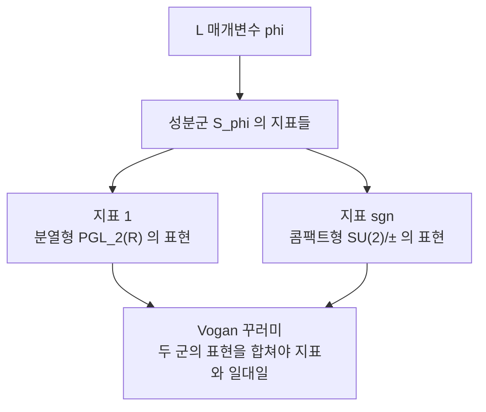

# Vogan L 꾸러미와 순수 내부형식

# 개요

[Langlands 강령](langlands-program.md)의 국소 판본은 이렇게 말한다. 국소체 $F$ 위의 환원군 $G$ 의 기약 표현은 **L 매개변수**로 이름표를 붙일 수 있다.

$$
\varphi:W_F\times\mathrm{SL}_2(\mathbb C)\longrightarrow{}^LG
$$

$\mathrm{GL}\_n$ 에서는 이 이름표가 완벽하다. 표현과 매개변수가 일대일로 대응한다. 그런데 다른 군에서는 **여러 표현이 같은 이름표를 공유한다**. 같은 $\varphi$ 를 갖는 표현들의 모임이 **L 꾸러미** $\Pi_\varphi$ 다.

그러면 꾸러미 안에서 표현을 구별하는 것은 무엇인가. 답은 매개변수의 중심화군이 주는 유한군, **성분군** $\mathcal S_\varphi$ 다. 꾸러미의 원소가 $\mathcal S_\varphi$ 의 기약 지표와 대응한다는 것이 정련된 국소 Langlands 대응이다.

$$
\Pi_\varphi\ \longleftrightarrow\ \mathrm{Irr}(\mathcal S_\varphi)
$$

여기에 함정이 하나 있다. **군 $G$ 하나만 보면 이 대응이 전사가 아니다.** 지표는 있는데 대응하는 표현이 없는 경우가 생긴다. 모자란 표현은 $G$ 의 **내부형식** 위에 있다. 그래서 대응을 완성하려면 $G$ 와 그 순수 내부형식들의 표현을 **전부 모아야** 한다. 이렇게 모은 큰 꾸러미가 **Vogan 꾸러미**다.

$$
\Pi_\varphi^{\mathrm{Vogan}}=\bigsqcup_{b\in H^1(F,G)}\Pi_\varphi\bigl(G_b\bigr)
$$

이 틀이 없으면 [Gan–Gross–Prasad 추측](gan-gross-prasad.md)의 지표 공식은 아예 진술할 수조차 없다. "중복도의 합이 1"이라고 말할 때의 그 합이 정확히 Vogan 꾸러미 위의 합이기 때문이다.

# 직관

## 왜 이름표가 겹치는가

$\mathrm{GL}_n$ 이 예외적으로 좋은 이유는 중심화군이 언제나 작기 때문이다. $\varphi$ 가 기약이면 Schur 보조정리로 중심화군은 스칼라뿐이고, 일반적으로도 $\mathrm{GL}$ 안의 중심화군은 연결되어 있다. 연결되어 있으면 성분군이 자명하고, 지표가 하나뿐이니 꾸러미도 하나다.

$\mathrm{SL}_2$ 로 내려가면 사정이 달라진다. $\mathrm{GL}_2(F)$ 의 기약 표현을 $\mathrm{SL}_2(F)$ 로 제한하면 쪼개질 수 있고, 쪼개진 조각들은 $\mathrm{GL}_2(F)$ 의 켤레작용으로 서로 옮겨 다닌다. 이 조각들이 같은 매개변수를 갖는다. 쌍대군이 $\mathrm{PGL}_2(\mathbb C)$ 이고 그 안에서는 중심화군이 연결되지 않을 수 있다는 것이 원인이다.

## 표현이 모자라면 옆 군에서 빌려온다

가장 선명한 예가 실군이다. $\mathrm{PGL}_2(\mathbb R)$ 의 이산계열은 $\mathrm{SL}_2(\mathbb R)$ 에서 정칙/반정칙 두 조각으로 갈라져 성분군 $\mathbb Z/2$ 의 두 지표를 채운다. 그런데 매개변수에 따라서는 $\mathrm{PGL}_2(\mathbb R)$ 쪽에 표현이 하나밖에 없는 경우가 있다. 이때 남은 지표에 해당하는 표현은 **콤팩트 내부형식** $\mathrm{PB}^\times=\mathrm{SU}(2)/\{\pm1\}$ 의 유한차원 표현이다.



무한차원 표현과 유한차원 표현이 같은 이름표를 나눠 갖는다는 것이 처음에는 이상하게 들린다. 그러나 [Jacquet–Langlands 대응](waldspurger-formula.md)이 이미 그 둘을 같은 것으로 취급해 왔다. Vogan 꾸러미는 그 사실을 이름표 체계 안에 정식으로 넣은 것이다.

## 기저점을 골라야 대응이 정해진다

$\Pi_\varphi\leftrightarrow\mathrm{Irr}(\mathcal S_\varphi)$ 는 표준적인 대응이 아니다. 양쪽 모두 유한집합일 뿐이라 짝짓는 방법이 여럿이다. 하나를 고정하려면 **기저점**을 정해야 하고, 관례는 Whittaker 데이터를 쓰는 것이다.

> 유사분열형 $G$ 위에서 주어진 Whittaker 데이터에 대해 [일반 표현](whittaker-models.md)인 원소를 $\mathcal S_\varphi$ 의 **자명 지표**에 대응시킨다.

꾸러미마다 그런 일반 표현이 정확히 하나 있다는 사실(Shahidi 의 일반성 추측)이 이 정규화를 가능하게 한다. GGP 의 지표 공식이 구체적인 $\varepsilon$ 부호로 적히려면 이 정규화가 먼저 고정되어야 한다.

# 정의

## 내부형식과 순수 내부형식

$G$ 를 $F$ 위의 유사분열 환원군이라 하자. $G$ 의 **내부형식**은 $\bar F$ 위에서 $G$ 와 동형이지만 $F$ 위에서는 다를 수 있는 군이고, $H^1(F,G_{\mathrm{ad}})$ 로 분류된다. **순수 내부형식**은 그보다 세밀하게 $H^1(F,G)$ 로 분류되며, 각 코사이클 $b$ 가 군 $G_b$ 를 준다.

- $G=\mathrm{PGL}_2$ : 내부형식은 $B^\times/F^\times$ 이고 곧 사원수 대수들이다.
- $G=U(V)$ : 순수 내부형식은 같은 차원의 에르미트 공간 $V'$ 들이고, 국소체 위에서는 판별식으로 구별되어 정확히 두 개다.
- $G=\mathrm{GL}_n$ : $H^1(F,\mathrm{GL}_n)=1$ 이므로 순수 내부형식이 자기 자신뿐이다. $\mathrm{GL}_n$ 이 유별나게 간단한 진짜 이유가 이것이다.

## 성분군

$\varphi$ 의 상을 중심화하는 쌍대군의 부분군을 $S_\varphi=\mathrm{Cent}\bigl(\varphi,\widehat G\bigr)$ 라 하고

$$
\mathcal S_\varphi=\pi_0\!\left(S_\varphi\big/Z(\widehat G)^{\Gamma}\right)
$$

를 **성분군**이라 한다. 고전군에서는 이것이 $(\mathbb Z/2)^r$ 의 몫으로 나온다.

## Vogan 꾸러미와 정련된 대응

$$
\Pi_\varphi^{\mathrm{Vogan}}=\bigsqcup_{b\in H^1(F,G)}\Pi_\varphi(G_b)
\ \xrightarrow{\ \sim\ }\ \mathrm{Irr}(\mathcal S_\varphi)
$$

이 전단사가 정련된 국소 Langlands 대응이고, 어느 순수 내부형식 위에 있는지는 지표를 $Z(\widehat G)^\Gamma$ 에 제한해서 읽는다. 곧 **표현이 어느 군에 사는지까지 지표가 기억한다**.

## 안정성

꾸러미가 자연스러운 단위인 이유는 지표 쪽에 있다. 개별 표현의 지표는 안정 켤레류 위에서 잘 정의되지 않지만, 꾸러미 전체의 합

$$
\Theta_\varphi=\sum_{\pi\in\Pi_\varphi}\dim(\rho_\pi)\,\Theta_\pi
$$

는 **안정 분포**가 된다. [대각합 공식의 안정화](fundamental-lemma.md)가 다루는 대상이 바로 이 합이고, 꾸러미를 쪼개는 일이 내시(endoscopy)다.

# 성질

## 고전군의 꾸러미 크기

$\mathrm{SO}(2n+1)$ 의 쌍대군은 $\mathrm{Sp}_{2n}(\mathbb C)$ 다. 템퍼드 매개변수를 서로 다른 기약 성분의 합으로 적으면(다중도 1), 각 성분이 심플렉틱형이어야 하고 중심화군은 $\{\pm1\}^r$ 이 된다. 중심을 나누면 꾸러미 크기가 $2^{r-1}$ 이다.

```javascript
// SO(2n+1) 의 템퍼드 매개변수: phi = phi_1 + ... + phi_r,
// 서로 다른 기약 심플렉틱형 성분. 쌍대군은 Sp_{2n}(C).
function packet(dims) {
  const N = dims.reduce((a, b) => a + b, 0)
  if (new Set(dims).size !== dims.length) throw new Error('다중도 1 이 아니다')
  const S = 2 ** dims.length          // 중심화군의 성분군 (Z/2)^r
  return { dualGroup: `Sp_${N}(C)`, group: `SO(${N + 1})`, packetSize: S / 2 }
}

console.log(packet([4]))
console.log(packet([2, 6]))
console.log(packet([2, 4, 6]))
// { dualGroup: 'Sp_4(C)',  group: 'SO(5)',  packetSize: 1 }
// { dualGroup: 'Sp_8(C)',  group: 'SO(9)',  packetSize: 2 }
// { dualGroup: 'Sp_12(C)', group: 'SO(13)', packetSize: 4 }
```

기약 매개변수의 꾸러미는 원소가 하나뿐이고, 성분이 쪼개질수록 꾸러미가 커진다. **매개변수가 분해될수록 이름표가 덜 세밀해진다**는 것이 요점이다.

## GGP 지표 공식이 놓이는 자리

GGP 의 국소 정리는 다음 형태였다.

$$
\sum_{\pi\in\Pi_\varphi^{\mathrm{Vogan}}}m(\pi)=1,
\qquad
\chi(\pi)=\varepsilon\!\left(\tfrac12,\varphi_{n+1}\otimes\varphi_n\right)
$$

왼쪽 합이 **Vogan 꾸러미 위의 합**이라는 점이 결정적이다. 유사분열형 군 하나만 보면 중복도가 전부 0 일 수 있고, 그때 정답은 비유사분열 내부형식 위에 있다. [Waldspurger 정리](waldspurger-formula.md)에서 주기가 어느 사원수 대수 위에서 살아남는지가 문제였던 것이 정확히 이 현상의 $n=1$ 판본이다. 오른쪽 등식은 $\varepsilon$ 인자가 $\mathcal S_\varphi$ 위의 지표를 지정한다는 뜻이고, 그 지표를 $Z(\widehat G)^\Gamma$ 에 제한해 읽으면 어느 내부형식인지가 나온다.

## Arthur 매개변수

템퍼드가 아닌 표현까지 다루려면 매개변수에 $\mathrm{SL}_2$ 를 하나 더 붙인다.

$$
\psi:W_F\times\mathrm{SL}_2(\mathbb C)\times\mathrm{SL}_2(\mathbb C)\to{}^LG
$$

둘째 $\mathrm{SL}_2$ 가 비템퍼드성을 담당한다. Arthur 꾸러미는 L 꾸러미보다 크고, 유니터리가 아닌 원소를 포함할 수도 있어 더 미묘하다. 고전군에 대한 Arthur 의 분류가 전역 중복도 공식을 성분군의 언어로 적는다. 전역 자기동형 표현 $\pi=\otimes\pi_v$ 가 이산 스펙트럼에 나타나는지는 국소 지표들의 곱

$$
\prod_v\chi_{\pi_v}\ \overset{?}{=}\ \text{자명}
$$

이 성립하는지로 결정된다. 국소 정보의 곱이 전역 존재를 통제한다는 구조가 GGP 의 전역 진술과 같은 모양이다.

# 활용

## 분류 정리의 언어

고전군의 자기동형 표현 분류(Arthur, Mok, 그리고 Kaletha–Mínguez–Shin–White 의 내부형식 확장)는 전부 이 언어로 적혀 있다. "어떤 표현이 존재하는가"를 "어떤 매개변수와 지표의 짝이 가능한가"로 바꾸는 것이 분류의 실질이다. 표현을 직접 세는 대신 유한군의 지표를 세면 된다.

## 주기와 분지의 예측

GGP 뿐 아니라 주기 적분의 비소멸 문제 일반이 이 틀에서 진술된다. 주기가 살아남는 표현을 꾸러미 안에서 지목하는 규칙이 있고, 그 규칙은 언제나 $\mathcal S_\varphi$ 위의 지표로 적힌다. 표현론적 질문이 유한군의 지표 계산으로 환원되는 것이다.

## 내시와 대각합 공식

꾸러미가 안정 분포의 단위라는 사실이 [안정화된 대각합 공식](fundamental-lemma.md)의 출발점이다. 개별 표현이 아니라 꾸러미를 세면 항등식이 깔끔해지고, 그 항등식을 쪼개 개별 표현 정보를 뽑는 일이 내시 이전이다. Vogan 꾸러미는 이 쪼개기가 어떤 유한군의 Fourier 해석인지를 말해 준다. $\mathcal S_\varphi$ 의 지표로 전개하는 것이 곧 내시군 별로 분해하는 것이다.

# 연관 문서

## 선수지식

- [Langlands 강령](langlands-program.md)
- [Galois 표현과 에탈 코호몰로지](galois-representations.md)

## 더 알아보기

- [Gan–Gross–Prasad 추측](gan-gross-prasad.md)
- [Arthur 매개변수와 비템퍼드 표현](arthur-parameters.md)

#number_theory #group_theory #field_theory
