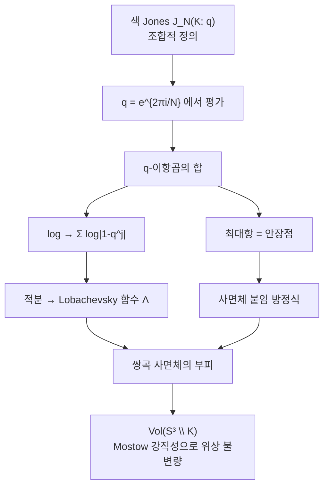

# 볼륨 추측과 색 Jones 다항식

# 개요

[Jones 다항식](knot-invariants.md)은 조합적으로 정의된다. 매듭 도식을 골라 교차점마다 규칙을 적용하고 합을 취하면 다항식이 나온다. 그 과정 어디에도 기하가 없다. 길이도, 각도도, 부피도 쓰지 않는다.

반면 쌍곡 매듭에는 강력한 기하 불변량이 있다. 여집합 $S^3\setminus K$ 가 완비 쌍곡 계량을 가지면 Mostow 강직성에 의해 그 계량이 **유일**하고, 따라서 부피 $\mathrm{Vol}(S^3\setminus K)$ 가 위상 불변량이 된다. 8 자매듭이라면 $2.029883\ldots$ 이다.

이 두 세계는 서로 아무 관계가 없어 보인다. 볼륨 추측은 그 둘이 같다고 말한다.

> $$\lim_{N\to\infty}\frac{2\pi\log\big|J_N(K;e^{2\pi i/N})\big|}{N}=\mathrm{Vol}(S^3\setminus K)$$

$J_N$ 은 $N$ 차원 표현으로 색칠한 색 Jones 다항식이고, 이것을 **1 의 $N$ 제곱근**에서 평가한다. 보통 Jones 다항식은 이 점에서 값이 작지만, 색을 함께 키우면 값이 지수적으로 폭발하고 그 지수증가율이 정확히 쌍곡 부피다.

조합적 불변량의 **증가율**에 기하가 들어 있다는 진술이다. 다항식의 값 자체가 아니라 값이 커지는 속도가 기하를 안다.

# 직관

## 왜 다른 극한인가

[Witten 점근 추측](witten-asymptotics.md)과 나란히 놓으면 구조가 분명해진다. 둘 다 양자 불변량의 점근이지만 극한의 방향이 다르다.

| | Witten 점근 추측 | 볼륨 추측 |
|---|---|---|
| 대상 | 닫힌 3 다양체 | $S^3$ 안의 매듭 |
| 키우는 것 | 레벨 $k$ | 색 $N$ |
| $q$ | $e^{2\pi i/(k+2)}\to1$ | $N$ 과 함께 움직임 |
| 크기 | 다항식적 | **지수적** |
| 읽는 것 | 위상 (CS 값) | 증가율 (부피) |

핵심 차이는 크기다. Witten 쪽에서는 실수 임계값의 위상 $e^{2\pi ik\mathrm{CS}}$ 가 나와 절댓값이 1 이고, 전체는 $k$ 의 멱으로만 자란다. 볼륨 추측에서는 **복소 임계값**이 나온다. 안장점이 실축 위에 없어 $e^{iN\cdot(\text{복소수})}$ 가 지수적으로 커지고, 그 지수의 허수부가 부피다.

곧 같은 안장점 해석의 두 얼굴이다. 임계값이 실수면 진동하고, 복소수면 폭발한다. 쌍곡 구조는 $\mathrm{SL}_2(\mathbb C)$ 표현에 대응하므로 CS 불변량이 복소수가 되고, 그 허수부가 부피다. 정확한 형태는

$$
\mathrm{CS}+i\,\frac{\mathrm{Vol}}{2\pi}
$$

라는 복소수 하나이고, 볼륨 추측의 정련된 판본은 위상까지 포함해 이 복소수 전체를 주장한다.

## 이산 사면체가 부피를 아는 이유

왜 유한합이 부피를 아는지에 대한 그림은 $q$ 이항급수에서 온다. 8 자매듭의 색 Jones 다항식은 Habiro 의 공식으로

$$
J_N(4_1;q)=\sum_{k=0}^{N-1}\prod_{j=1}^{k}\big|1-q^{j}\big|^2\quad(q=e^{2\pi i/N}\ \text{에서})
$$

가 된다. 이 합의 각 항은 $\prod(1-q^j)$ 꼴이고, $\log$ 를 취하면 $\sum\log|1-q^j|$ 라는 **합**이 된다. $N\to\infty$ 에서 이 합은 적분으로 바뀌고

$$
\frac1N\sum_{j}\log\big|1-e^{2\pi ij/N}\big|\ \longrightarrow\ \frac1{2\pi}\int\log|1-e^{i\theta}|\,d\theta
$$

가 나타난다. 그런데 $-\int\log|2\sin(\theta/2)|d\theta$ 가 바로 **Lobachevsky 함수**이고, 쌍곡 사면체의 부피가 정확히 이 함수로 표현된다. 8 자매듭 여집합이 정이면체 사면체 두 개로 분할되고 그 부피가 $2\Lambda(\pi/6)\cdot3=2.0298\ldots$ 다.

**$q$ 이항곱의 로그가 Lobachevsky 함수를 낳는 것**이 조합과 쌍곡기하를 잇는 다리다. 합의 최대항이 어디인지를 찾는 것이 안장점 조건이고, 그 조건이 사면체의 이면각을 정하는 방정식(gluing equation)과 같은 식이 된다.



# 정의

## 색 Jones 다항식

$K$ 를 매듭이라 하자. $\mathfrak{sl}_2$ 의 $N$ 차원 기약표현으로 $K$ 를 색칠해 얻은 양자 불변량을 $J_N(K;q)$ 라 쓰고, $J_N(\text{풀린 매듭};q)=1$ 로 정규화한다. $N=2$ 가 보통의 Jones 다항식이다.

## 추측

> **추측 (Kashaev 1997, Murakami–Murakami 2001).** 모든 매듭 $K$ 에 대해
> $$
> \lim_{N\to\infty}\frac{2\pi}N\log\big|J_N(K;e^{2\pi i/N})\big|=\mathrm{Vol}(S^3\setminus K)
> $$
> 여기서 $\mathrm{Vol}$ 은 단체적 부피(Gromov norm 에 비례)이고, 쌍곡 매듭이면 쌍곡 부피와 같다.

Kashaev 가 양자 이면체 대칭에서 나온 불변량 $\langle K\rangle_N$ 으로 이 주장을 먼저 했고, Murakami 형제가 $\langle K\rangle_N=J_N(K;e^{2\pi i/N})$ 임을 보여 색 Jones 다항식의 진술로 바꾸었다.

단체적 부피를 쓴 것이 중요하다. 쌍곡이 아닌 매듭에서는 단체적 부피가 0 이므로, 추측은 그런 매듭에서 **$J_N$ 이 지수적으로 자라지 않는다**고 말한다. 실제로 원환면 매듭에서는 증가가 $N$ 의 멱뿐이다.

## 증명된 경우

| 매듭 | 상태 |
|---|---|
| 8 자매듭 $4_1$ | 증명됨 (Ekholm, 엄밀한 해석) |
| 원환면 매듭 | 증명됨 (부피 0, 다항 증가) |
| $5_2$, 일부 twist 매듭 | 증명됨 |
| 쌍곡 링크의 무한족 일부 | 증명됨 |
| 일반 매듭 | **미해결** |

추측은 30 년 가까이 열려 있고, 증명된 경우는 합이 명시적으로 다룰 수 있을 만큼 단순한 것들이다. 어려움은 안장점 해석을 엄밀하게 만드는 데 있다. 합의 항이 복소수라 최대항 근처의 상쇄를 통제하기 어렵다.

# 성질

## 왜 놀라운가

Jones 다항식이 처음 나왔을 때 가장 큰 물음이 "이것이 기하적으로 무엇인가" 였다. Alexander 다항식은 무한순환덮개의 호몰로지라는 분명한 해석이 있는데 Jones 다항식에는 그런 것이 없었다. 볼륨 추측은 그 물음에 대한 가장 강력한 답의 후보다.

따름정리도 강하다. 추측이 참이면 **$J_N$ 이 전부 자명한 매듭은 풀린 매듭뿐**이다. 부피가 0 이고 단체적 부피가 0 이면 여집합이 Seifert 올다양체이고, 거기서부터 따라 나온다. 보통 Jones 다항식 하나가 풀린 매듭을 검출하는지는 아직 모르는 문제인데, 색을 전부 쓰면 답이 나온다는 뜻이다.

## 정련된 판본

위상까지 포함하면 더 강한 주장이 된다.

$$
J_N(K;e^{2\pi i/N})\ \sim\ N^{3/2}\,e^{N\big(\mathrm{Vol}+i\,\mathrm{CS}\big)/2\pi}\cdot\big(c+O(1/N)\big)
$$

$N^{3/2}$ 가 붙는 것이 요점이다. 지수 앞의 멱이 정확히 $3/2$ 라는 것은 안장점이 비퇴화이고 실질 차원이 3 이라는 뜻이며, 아래 수치 실험에서 이 멱을 직접 확인할 수 있다. 상수 $c$ 는 비틀림과 관련된다. Witten 점근 추측에서 진폭이 Reidemeister 비틀림이었던 것과 같은 구조가 복소 안장점에서 반복된다.

## 어디로 이어지는가

- **양자 모듈러성.** Zagier 는 $J_N$ 을 1 의 여러 거듭제곱근에서 본 함수가 모듈러 변환에서 거의 잘 행동함을 관찰했다. 볼륨 추측이 그 현상의 한 단면이다.
- **AJ 추측.** 색 Jones 다항식이 만족하는 $q$ 차분방정식의 고전극한이 $A$ 다항식(표현다양체를 정의하는 다항식)이라는 추측이다. 볼륨 추측과 같은 대응의 다른 층이다.
- **재정리 이론.** 섭동급수의 발산을 복소 안장점들의 기여로 조직하는 틀에서, 부피는 자명하지 않은 안장점의 작용값으로 나타난다.

# 활용

## 8 자매듭에서 부피를 뽑아낸다

Habiro 공식에서 $q=e^{2\pi i/N}$ 을 넣으면 합이 실수 양수 항들로 정리된다.

$$
J_N(4_1;e^{2\pi i/N})=\sum_{k=0}^{N-1}\prod_{j=1}^{k}\big|1-e^{2\pi ij/N}\big|^2
$$

이 유한합을 계산하고 증가율을 본다. 정련된 판본이 예언한 $N^{3/2}$ 보정까지 함께 확인한다.

```python
from cmath import exp, pi
from math import log

def J_fig8(N):
    """색 Jones 다항식 J_N(4_1) 을 q = e^{2 pi i / N} 에서 평가"""
    q = exp(2j*pi/N)
    total, prod = 0.0, 1.0 + 0j
    for k in range(N):
        total += abs(prod)**2          # k 번째 항
        prod *= (1 - q**(k+1))         # 다음 항을 위한 q-이항곱
    return total

VOL = 2.029883212819307                # 8 자매듭의 쌍곡 부피 (2 Λ(π/6) 로 계산되는 값)

print(f"{'N':>6s} {'2π log J_N / N':>16s} {'차이':>9s}"
      f" {'N^{3/2} 보정 후':>16s} {'차이':>9s}")
for N in [50, 100, 300, 800, 2000]:
    L = log(J_fig8(N))
    raw = 2*pi*L/N                     # 추측 그대로
    corr = 2*pi*(L - 1.5*log(N))/N     # J_N ~ N^{3/2} e^{N Vol/2pi} 를 가정
    print(f"{N:6d} {raw:16.6f} {abs(raw-VOL):9.4f} {corr:16.6f} {abs(corr-VOL):9.4f}")

#      N   2π log J_N / N        차이     N^{3/2} 보정 후        차이
#     50         2.734201    0.7043         1.996802    0.0331
#    100         2.447006    0.4171         2.012979    0.0169
#    300         2.203359    0.1735         2.024170    0.0057
#    800         2.106483    0.0766         2.027732    0.0022
#   2000         2.064840    0.0350         2.029021    0.0009
```

**왼쪽 두 열만 보면 수렴이 실망스럽다.** $N=2000$ 에서도 참값과 $0.035$ 나 차이가 난다. 유한합 2000 개를 더해 얻은 것 치고는 자릿수가 하나도 확정되지 않았다. 추측의 진술이 극한이므로 이것만으로는 설득력이 약하다.

**오른쪽 두 열이 사정을 바꾼다.** $\log J_N$ 에서 $\tfrac32\log N$ 만 빼면 $N=2000$ 에서 오차가 $0.0009$ 로 줄어 소수 셋째 자리까지 맞는다. 차이가 $0.0331\to0.0169\to0.0057\to0.0022\to0.0009$ 로 줄어드는 속도도 대략 $1/N$ 이라 정련된 판본의 $O(1/N)$ 과 맞는다.

이 대비 자체가 결과다. 느린 수렴의 원인이 **부피가 아니라 그 앞에 붙은 멱**이었다. $2\pi\log J_N/N$ 은 참값에 $2\pi\cdot\tfrac32\log N/N$ 만큼 얹혀 있고, 이 항은 $N\to\infty$ 에서 0 으로 가지만 $\log N/N$ 이라 느리다. $N=2000$ 에서 $3\pi\log N/N\approx0.0358$ 인데 관측된 차이가 $0.0350$ 이니 거의 전부 설명된다. **수치가 부피뿐 아니라 지수 앞 멱이 정확히 $3/2$ 라는 것까지 확인해 준다.** 멱을 $1$ 이나 $2$ 로 놓고 같은 계산을 하면 보정 후 값이 참값에서 멀어진다.

계산에 기하가 전혀 들어가지 않았다는 점을 다시 짚어 둘 만하다. 코드가 한 일은 1 의 거듭제곱근들의 곱을 더한 것뿐이다. 쌍곡 계량도, 사면체 분할도, Mostow 강직성도 쓰지 않았다. 그런데 나온 수가 $S^3\setminus4_1$ 의 쌍곡 부피다.

## 어디에 쓰는가

- **매듭 검출.** 추측이 참이면 색 Jones 다항식 전체가 풀린 매듭을 검출한다.
- **부피의 계산.** 실용적으로는 부피를 구하는 더 좋은 방법이 있지만(사면체 분할), 이 방향은 양자 불변량이 기하를 얼마나 아는지를 재는 시금석이다.
- **$\mathrm{SL}_2(\mathbb C)$ 로의 확장.** 복소 안장점을 다루는 틀이 $\mathrm{SU}(2)$ 대신 $\mathrm{SL}_2(\mathbb C)$ Chern–Simons 이론을 요구하고, 그쪽이 3 차원 위상수학과 양자장론의 현재 접점이다.

[^1]: R. Kashaev, *The hyperbolic volume of knots from quantum dilogarithm*, Lett. Math. Phys. 39 (1997) 가 원래 형태이고, H. Murakami–J. Murakami, *The colored Jones polynomials and the simplicial volume of a knot*, Acta Math. 186 (2001) 이 색 Jones 다항식의 진술로 옮겼다.
[^2]: 8 자매듭에 대한 엄밀한 증명은 T. Ekholm 의 미출판 논증이 널리 인용되며, 상세한 해석적 취급은 H. Murakami 의 개관 *An introduction to the volume conjecture* (2010) 에 정리되어 있다. 정련된 판본과 위상 항은 H. Murakami–J. Murakami–M. Okamoto–T. Takata–Y. Yokota, Experiment. Math. 11 (2002). 본문의 수치 계산은 직접 한 것이다.

# 연관 문서

## 선수지식

- [매듭 불변량과 Jones 다항식](knot-invariants.md)
- [Lobachevsky 함수와 쌍곡 사면체의 부피](lobachevsky-function.md)
- [쌍곡 3 다양체와 Mostow 강직성](hyperbolic-3-manifolds.md)

## 더 알아보기

아직 연결한 문서가 없다.

#topology #algebraic_topology #differential_geometry #computation
