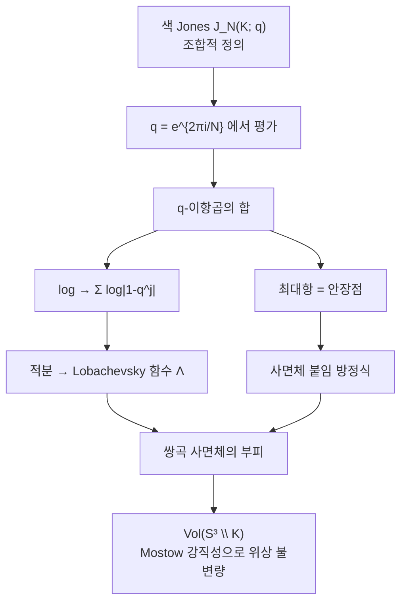

# 볼륨 추측과 색 Jones 다항식

# 개요

[Jones 다항식](knot-invariants.md)은 조합적으로 정의된다. 매듭 도식을 골라 교차점마다 규칙을 적용하고 합을 취하면 다항식이 나오며, 그 과정에 길이도 각도도 부피도 쓰이지 않는다.

쌍곡 매듭에는 기하 불변량이 따로 있다. 여집합 $S^3\setminus K$ 가 완비 쌍곡 계량을 가지면 Mostow 강직성에 의해 그 계량이 유일하고, 부피 $\mathrm{Vol}(S^3\setminus K)$ 가 위상 불변량이 된다. 8 자매듭이면 $2.029883\ldots$ 이다.

볼륨 추측은 두 양이 같다고 말한다.

$$
\lim_{N\to\infty}\frac{2\pi\log\big|J_N(K;e^{2\pi i/N})\big|}{N}=\mathrm{Vol}(S^3\setminus K)
$$

$J_N$ 은 $N$ 차원 표현으로 색칠한 색 Jones 다항식이고, 이것을 1 의 $N$ 제곱근에서 평가한다. 보통 Jones 다항식은 이 점에서 값이 작지만 색을 함께 키우면 값이 지수적으로 커지고, 그 증가율이 쌍곡 부피다.

# 직관

## 두 극한의 비교

[Witten 점근 추측](witten-asymptotics.md)과 나란히 놓으면 구조가 분명해진다. 둘 다 양자 불변량의 점근이지만 극한의 방향이 다르다.

| | Witten 점근 추측 | 볼륨 추측 |
|---|---|---|
| 대상 | 닫힌 3 다양체 | $S^3$ 안의 매듭 |
| 키우는 것 | 레벨 $k$ | 색 $N$ |
| $q$ | $e^{2\pi i/(k+2)}\to1$ | $N$ 과 함께 움직임 |
| 크기 | 다항식적 | 지수적 |
| 읽는 것 | 위상 (CS 값) | 증가율 (부피) |

Witten 쪽에서는 실수 임계값의 위상 $e^{2\pi ik\mathrm{CS}}$ 가 나와 절댓값이 1 이고 전체는 $k$ 의 멱으로 자란다. 볼륨 추측에서는 복소 임계값이 나온다. 안장점이 실축 위에 없어 $e^{iN\cdot(\text{복소수})}$ 가 지수적으로 커지고 그 지수의 허수부가 부피다. 쌍곡 구조는 $\mathrm{SL}_2(\mathbb C)$ 표현에 대응하므로 CS 불변량이 복소수

$$
\mathrm{CS}+i\thinspace\frac{\mathrm{Vol}}{2\pi}
$$

가 되고, 정련된 판본은 위상까지 포함해 이 복소수 전체를 주장한다.

## $q$ 이항급수와 Lobachevsky 함수

8 자매듭의 색 Jones 다항식은 Habiro 의 공식으로 다음이 된다.

$$
J_N(4_1;q)=\sum_{k=0}^{N-1}\prod_{j=1}^{k}\big|1-q^{j}\big|^2\quad(q=e^{2\pi i/N}\ \text{에서})
$$

각 항이 $\prod(1-q^j)$ 꼴이므로 $\log$ 를 취하면 합 $\sum\log|1-q^j|$ 가 되고, $N\to\infty$ 에서 적분으로 바뀐다.

$$
\frac1N\sum_{j}\log\big|1-e^{2\pi ij/N}\big|\ \longrightarrow\ \frac1{2\pi}\int\log|1-e^{i\theta}|\thinspace d\theta
$$

$-\int\log|2\sin(\theta/2)|d\theta$ 가 **Lobachevsky 함수**이고 쌍곡 사면체의 부피가 이 함수로 표현된다. 8 자매듭 여집합은 정이면체 사면체 두 개로 분할되고 그 부피가 $2.0298\ldots$ 다. 합의 최대항을 찾는 안장점 조건이 사면체의 이면각을 정하는 붙임 방정식과 같은 식이 된다.

# 정의

## 색 Jones 다항식

$K$ 를 매듭이라 하자. $\mathfrak{sl}_2$ 의 $N$ 차원 기약표현으로 $K$ 를 색칠해 얻은 양자 불변량을 $J_N(K;q)$ 라 쓰고 $J_N(\text{풀린 매듭};q)=1$ 로 정규화한다. $N=2$ 가 보통의 Jones 다항식이다.

## 추측

**추측 (Kashaev 1997, Murakami–Murakami 2001).** 모든 매듭 $K$ 에 대해

$$
\lim_{N\to\infty}\frac{2\pi}N\log\big|J_N(K;e^{2\pi i/N})\big|=\mathrm{Vol}(S^3\setminus K)
$$

이다. $\mathrm{Vol}$ 은 단체적 부피(Gromov norm 에 비례)이고, 쌍곡 매듭이면 쌍곡 부피와 같다.

Kashaev 가 양자 이면체 대칭에서 나온 불변량 $\langle K\rangle_N$ 으로 먼저 주장했고, Murakami 형제가 $\langle K\rangle_N=J_N(K;e^{2\pi i/N})$ 임을 보여 색 Jones 다항식의 진술로 바꾸었다.

단체적 부피는 쌍곡이 아닌 매듭에서 0 이므로, 추측은 그런 매듭에서 $J_N$ 이 지수적으로 자라지 않는다고 말한다. 원환면 매듭에서는 증가가 $N$ 의 멱뿐이다.

## 증명된 경우

| 매듭 | 상태 |
|---|---|
| 8 자매듭 $4_1$ | 증명됨 (Ekholm, 엄밀한 해석) |
| 원환면 매듭 | 증명됨 (부피 0, 다항 증가) |
| $5_2$ 와 일부 twist 매듭 | 증명됨 |
| 쌍곡 링크의 무한족 일부 | 증명됨 |
| 일반 매듭 | 증명되지 않음[^1] |

증명된 경우는 합을 명시적으로 다룰 수 있을 만큼 단순한 것들이다. 어려움은 안장점 해석을 엄밀하게 만드는 데 있고, 합의 항이 복소수라 최대항 근처의 상쇄를 통제하기 어렵다.

# 성질

## 따름정리

Alexander 다항식은 무한순환덮개의 호몰로지라는 해석이 있지만 Jones 다항식에는 그런 기하적 해석이 없었고, 볼륨 추측이 그 자리의 후보다.

추측이 참이면 $J_N$ 이 전부 자명한 매듭은 풀린 매듭뿐이다. 부피가 0 이고 단체적 부피가 0 이면 여집합이 Seifert 올다양체이고 거기서 결론이 따라 나온다. 보통 Jones 다항식 하나가 풀린 매듭을 검출하는지는 답이 나와 있지 않다[^3].

## 정련된 판본

위상까지 포함하면 다음이 된다.

$$
J_N(K;e^{2\pi i/N})\ \sim\ N^{3/2}\thinspace e^{N\big(\mathrm{Vol}+i\thinspace\mathrm{CS}\big)/2\pi}\cdot\big(c+O(1/N)\big)
$$

지수 앞의 멱이 $3/2$ 라는 것은 안장점이 비퇴화이고 실질 차원이 3 이라는 뜻이다. 상수 $c$ 는 비틀림과 관련되며, Witten 점근 추측에서 진폭이 Reidemeister 비틀림이던 구조가 복소 안장점에서 반복된다.

## 연결된 추측

- **양자 모듈러성.** Zagier 는 $J_N$ 을 1 의 여러 거듭제곱근에서 본 함수가 모듈러 변환에서 거의 잘 행동함을 관찰했다. 볼륨 추측이 그 현상의 한 단면이다.
- **AJ 추측.** 색 Jones 다항식이 만족하는 $q$ 차분방정식의 고전극한이 표현다양체를 정의하는 $A$ 다항식이라는 추측이다.
- **재정리 이론.** 섭동급수의 발산을 복소 안장점들의 기여로 조직하는 틀에서 부피는 자명하지 않은 안장점의 작용값으로 나타난다.

# 활용

## 8 자매듭의 수치

Habiro 공식에 $q=e^{2\pi i/N}$ 을 넣으면 합이 실수 양수 항들로 정리된다.

$$
J_N(4_1;e^{2\pi i/N})=\sum_{k=0}^{N-1}\prod_{j=1}^{k}\big|1-e^{2\pi ij/N}\big|^2
$$

$2\pi\log J_N/N$ 은 참값보다 $2\pi\cdot\tfrac32\log N/N$ 만큼 크다. 이 항은 0 으로 가지만 $\log N/N$ 이라 느려서 $N=2000$ 에서도 오차가 $0.035$ 다. $\log J_N$ 에서 $\tfrac32\log N$ 을 빼면 같은 $N$ 에서 오차가 $0.0009$ 로 줄고 감소 속도가 정련된 판본의 $O(1/N)$ 과 맞는다.

## 쓰임

- **매듭 검출.** 추측이 참이면 색 Jones 다항식 전체가 풀린 매듭을 검출한다.
- **부피의 계산.** 부피를 구하는 실용적 방법은 사면체 분할이고, 이 방향은 양자 불변량이 기하를 얼마나 아는지를 재는 시금석이다.
- **$\mathrm{SL}_2(\mathbb C)$ 로의 확장.** 복소 안장점을 다루는 틀이 $\mathrm{SU}(2)$ 대신 $\mathrm{SL}_2(\mathbb C)$ Chern–Simons 이론을 요구한다.[^1][^2]

[^1]: R. Kashaev, *The hyperbolic volume of knots from quantum dilogarithm*, Lett. Math. Phys. 39 (1997) 가 원래 형태이고, H. Murakami–J. Murakami, *The colored Jones polynomials and the simplicial volume of a knot*, Acta Math. 186 (2001) 이 색 Jones 다항식의 진술로 옮겼다.
[^2]: 8 자매듭에 대한 엄밀한 증명은 T. Ekholm 의 미출판 논증이 널리 인용되며, 상세한 해석적 취급은 H. Murakami 의 개관 *An introduction to the volume conjecture* (2010) 에 정리되어 있다. 정련된 판본과 위상 항은 H. Murakami–J. Murakami–M. Okamoto–T. Takata–Y. Yokota, Experiment. Math. 11 (2002).
[^3]: S. Bigelow, "Does the Jones polynomial detect the unknot?", Journal of Knot Theory and Its Ramifications 11 (2002), 493–505. 제목의 물음이 답을 얻지 못한 상태임을 서론이 밝힌다.

# 연관 문서

## 선수지식

- [매듭 불변량과 Jones 다항식](knot-invariants.md)
- [Lobachevsky 함수](lobachevsky-function.md)
- [쌍곡 3 다양체와 Mostow 강직성](hyperbolic-3-manifolds.md)

## 더 알아보기

아직 연결한 문서가 없다.

#topology #algebraic_topology #differential_geometry #computation
