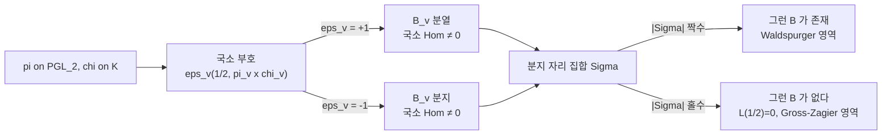

# Waldspurger 정리와 토릭 주기

# 개요

[Gan–Gross–Prasad 추측](gan-gross-prasad.md)의 계수를 끝까지 내리면 쌍 $\mathrm{SO}(3)\times\mathrm{SO}(2)$ 가 남는다. $\mathrm{SO}(3)$ 는 $\mathrm{PGL}_2$ 이고 $\mathrm{SO}(2)$ 는 토러스다. 이 경우의 GGP 는 추측이 아니라 1985 년에 증명된 **Waldspurger 정리**이고, 그 이전부터 전혀 다른 언어로 알려져 있었다.

$\mathrm{PGL}_2$ 위의 첨점형식 $\pi$ 와 허수이차체 $K$ 의 지표 $\chi$ 를 잡으면 **토릭 주기**를 만들 수 있다.

$$
\mathcal P_\chi(\varphi)=\int_{\mathbb A_F^\times K^\times\backslash\thinspace\mathbb A_K^\times}\varphi(t)\thinspace\chi^{-1}(t)\thinspace dt
$$

정리는 이 적분이 0 이 아닌 것과 중심값 $L(1/2,\pi_K\times\chi)$ 가 0 이 아닌 것이 같다고 말한다. 게다가 부등식이 아니라 **등식**이 성립한다. 주기의 절댓값 제곱이 중심값과 명시적인 상수배로 같다.

$$
\frac{|\mathcal P_\chi(\varphi)|^2}{\langle\varphi,\varphi\rangle}
=\frac{1}{2}\cdot\frac{L\negthinspace\left(\tfrac12,\pi_K\times\chi\right)}{L(1,\pi,\mathrm{Ad})}\cdot\prod_v\alpha_v
$$

같은 정리가 고전적으로는 전혀 다르게 생겼다. **반정수 무게 모듈러 형식의 Fourier 계수의 제곱이 중심 $L$ 값과 같다**는 Kohnen–Zagier 공식이 그것이다. 두 얼굴을 잇는 것이 Shimura 대응이고, 그 정체는 theta 올림이다.

$L(1/2)$ 가 함수방정식의 부호 때문에 반드시 0 이 되는 경우에는 주기도 0 이 되고, 그때는 도함수와 [Heegner 점](heegner-points.md)의 세계로 넘어간다. Waldspurger 와 Gross–Zagier 는 $\varepsilon=+1$ 과 $\varepsilon=-1$ 로 정확히 갈라진 분업 관계다.

# 직관

## 왜 토러스인가

$\mathrm{SO}(2)$ 는 원군이고, 수체 위에서는 이차체 $K$ 가 주는 토러스 $T=\mathrm{Res}_{K/F}\mathbb G_m/\mathbb G_m$ 이다. 사원수 대수 $B$ 안에 $K$ 가 들어가면 $K^\times$ 는 $B^\times$ 의 극대 토러스가 되고, $B^\times/F^\times\cong\mathrm{SO}(3)$ 의 관점에서 이것은 축 하나를 고정하는 회전군이다. 곧 GGP 의 쌍 $(\mathrm{SO}(3),\mathrm{SO}(2))$ 는 **3 차원 이차공간 안에 1 차원 부분공간을 하나 고르는 일**이고, 그 고르는 방식이 $K$ 다.

이렇게 보면 $L$ 함수가 왜 $\pi_K\times\chi$ 인지도 자연스럽다. $\chi$ 는 $K$ 위의 $\mathrm{GL}_1$ 자기동형 표현이고 $\pi_K$ 는 $\pi$ 의 기저변환이므로, 중심값은 $K$ 위의 $\mathrm{GL}_2\times\mathrm{GL}_1$ Rankin–Selberg $L$ 함수의 값이다. [Rankin–Selberg 적분](rankin-selberg.md)이 등장할 자리에 주기 적분이 들어선 셈이다.

## 사원수 대수를 고르는 일이 곧 순수 내부형식을 고르는 일

여기서 GGP 의 구조가 이미 전부 보인다. 같은 $\pi$ 를 놓고도 토릭 주기는 **어느 사원수 대수 위에서 재느냐**에 따라 결과가 달라진다. $B=M_2(F)$ 위에서는 0 인데 분지된 $B$ 위에서는 0 이 아닐 수 있다.

$\mathrm{SO}(3)$ 의 순수 내부형식이 정확히 사원수 대수들이다. GGP 가 "하나의 군이 아니라 순수 내부형식 전체에 걸쳐 중복도 1" 이라고 말한 것의 가장 구체적인 예다. 그리고 어느 $B$ 가 정답인지 알려주는 것이 $\varepsilon$ 인자다.



사원수 대수는 **짝수 개의 자리에서만** 분지될 수 있다(Hilbert 상호법칙). 그래서 국소 부호의 곱이 $-1$ 이면 필요한 $B$ 가 아예 존재하지 않고, 이는 전역 함수방정식의 부호가 $-1$ 이라 중심값이 강제로 0 인 상황과 정확히 일치한다. **표현론의 장애와 해석적 소멸이 같은 하나의 부호**다.

## 반정수 무게라는 다른 얼굴

고전적 Waldspurger 정리는 이렇게 생겼다. 무게 $2k$ 의 새형식 $f$ 에 대응하는 무게 $k+1/2$ 의 형식 $g=\sum c(n)q^n$ 을 Shimura 대응으로 잡으면, 기본판별식 $D$ 에 대해

$$
|c(|D|)|^2\ \sim\ |D|^{k-1/2}\thinspace\frac{L\negthinspace\left(\tfrac12,\ f\otimes\chi_D\right)}{\langle f,f\rangle}
$$

이 성립한다. 좌변은 $q$ 전개 계수라 컴퓨터로 곧장 뽑을 수 있고 우변은 $L$ 함수의 중심값이다. 이 두 얼굴이 같은 정리인 이유는 Shimura 대응이 **theta 대응**이기 때문이다. 쌍대쌍 $(\widetilde{\mathrm{SL}}_2,\mathrm{PGL}_2)$ 의 theta 올림이 한쪽에서는 반정수 무게 형식의 계수를, 다른 쪽에서는 토릭 주기를 내놓는다. [theta 급수](theta-functions.md)가 두 세계를 잇는 다리다.

# 정의

## 설정

$F$ 를 수체, $K/F$ 를 이차 확대, $B/F$ 를 사원수 대수라 하고 매장 $K\hookrightarrow B$ 를 하나 고정한다. $\pi$ 를 $B^\times(\mathbb A)$ 의 자기동형 표현이라 하고, Jacquet–Langlands 대응으로 $\mathrm{PGL}_2$ 위의 표현 $\pi'$ 와 짝지어 둔다. $\chi$ 는 $K^\times\backslash\mathbb A_K^\times$ 의 지표이고 $\chi|\_{\mathbb A_F^\times}=1$ 을 만족한다고 하자(중심이 자명).

이때 **토릭 주기**는 위의 $\mathcal P_\chi$ 이고, 적분 구간 $\mathbb A_F^\times K^\times\backslash\mathbb A_K^\times$ 는 콤팩트이므로 수렴에 문제가 없다.

## 국소 정리 (Tunnell–Saito)

국소체 $F_v$ 에서 $K_v$ 는 $F_v$ 의 이차 확대이거나 $F_v\times F_v$ 이고, $B_v$ 는 $M_2(F_v)$ 이거나 유일한 분할 사원수 대수다. 두 가지 $B_v$ 에 대해

$$
\dim\mathrm{Hom}_{K_v^\times}\bigl(\pi_v,\chi_v\bigr)\le1,
\qquad
\sum_{B_v}\dim\mathrm{Hom}_{K_v^\times}\bigl(\pi_v,\chi_v\bigr)=1
$$

이고, 어느 쪽이 1 인지는 부호가 결정한다.[^1]

$$
\dim\mathrm{Hom}_{K_v^\times}(\pi_v,\chi_v)=1
\ \text{ on }\ M_2(F_v)
\quad\Longleftrightarrow\quad
\varepsilon\negthinspace\left(\tfrac12,\pi_{K,v}\otimes\chi_v\right)\eta_v(-1)=+1
$$

여기서 $\eta$ 는 $K/F$ 에 딸린 이차 지표다. 이것이 GGP 국소 지표 공식의 $n=1$ 판본이다.

## 전역 정리

$\Sigma$ 를 위 부호가 $-1$ 인 자리들의 집합이라 하자. 그러면 다음이 성립한다.

- $|\Sigma|$ 가 짝수이면 정확히 $\Sigma$ 에서 분지된 사원수 대수 $B$ 가 유일하게 존재하고, 그 $B$ 위에서 $\mathcal P_\chi\not\equiv0$ 인 것과 $L(1/2,\pi_K\times\chi)\ne0$ 인 것이 동치다.
- $|\Sigma|$ 가 홀수이면 어떤 $B$ 위에서도 주기가 살아남지 못하고, 실제로 $L(1/2,\pi_K\times\chi)=0$ 이다.

## 정련된 등식

비소멸만이 아니라 값 자체가 결정된다. 적절히 정규화한 벡터 $\varphi=\otimes\varphi_v$ 에 대해

$$
\frac{|\mathcal P_\chi(\varphi)|^2}{\langle\varphi,\varphi\rangle}
=\frac{\zeta_F(2)}{2}\cdot
\frac{L\negthinspace\left(\tfrac12,\pi_K\times\chi\right)}{L(1,\pi,\mathrm{Ad})}\cdot
\prod_v\alpha_v(\varphi_v)
$$

이고, $\alpha_v$ 는 $K_v^\times$ 위의 행렬계수 적분으로 거의 모든 자리에서 1 이다. 이 형태가 [GGP 의 Ichino–Ikeda 정련](gan-gross-prasad.md)의 원형이다.

# 성질

## 부호 계산

전역 부호가 $+1$ 인지 $-1$ 인지는 국소 부호를 모두 곱해 얻고, 그것이 곧 필요한 사원수 대수의 존재 여부다. Hilbert 상호법칙이 두 조건을 같은 것으로 만든다.

```javascript
// 국소 부호 목록에서 분지 자리를 뽑고, 그런 사원수 대수가 존재하는지 판정한다
function quaternionFromSigns(signs) {
  const ramified = Object.keys(signs).filter((v) => signs[v] === -1)
  const global = Object.values(signs).reduce((a, b) => a * b, 1)
  return {
    ramified,
    exists: ramified.length % 2 === 0,   // Hilbert 상호법칙
    globalSign: global,                   // 함수방정식의 부호
  }
}

// 무한 자리와 두 유한 자리에서 부호가 -1 인 경우
console.log(quaternionFromSigns({ inf: -1, 2: -1, 3: 1, 5: 1 }))
// { ramified: [ '2', 'inf' ], exists: true, globalSign: 1 }

// 홀수 개 자리에서 -1 이면 B 가 없고 전역 부호도 -1 이다
console.log(quaternionFromSigns({ inf: -1, 2: 1, 3: 1, 5: 1 }))
// { ramified: [ 'inf' ], exists: false, globalSign: -1 }
```

`exists` 와 `globalSign === 1` 이 언제나 같은 값이 된다. 이 일치가 우연이 아니라는 것이 Waldspurger 정리의 뼈대다. 표현론이 주기를 담을 그릇을 마련하지 못하는 상황과, 해석이 중심값을 0 으로 만드는 상황이 하나의 부호로 통제된다.

## 두 정리의 분업

| | $\varepsilon=+1$ | $\varepsilon=-1$ |
| --- | --- | --- |
| 중심값 | 보통 $\ne0$ | 항상 $=0$ |
| 살아남는 양 | 토릭 주기 $\mathcal P_\chi$ | 주기는 0, 대신 도함수 |
| 기하 | 사원수 대수 위의 유한집합 | Shimura 곡선 위의 CM 점 |
| 정리 | Waldspurger | Gross–Zagier |
| BSD 계수 | 0 | 1 |

같은 데이터 $(\pi,K,\chi)$ 를 놓고 부호에 따라 두 정리 중 하나가 작동한다. [Heegner 점](heegner-points.md)의 높이가 $L'(1/2)$ 를 주는 것은 주기가 0 이 되어 한 차수 위로 밀려난 결과라고 읽을 수 있고, 이 읽기를 고계수 고전군으로 일반화한 것이 산술 GGP 다.

## 증명의 계보

- **Waldspurger (1985)**: theta 대응과 Siegel–Weil 공식을 써서 반정수 무게 쪽과 토릭 주기 쪽을 직접 잇는다. 원래 논문의 방법이다.[^2]
- **Jacquet 의 상대 대각합 공식**: 토러스 주기를 담은 대각합 공식과 $\mathrm{GL}_2$ 의 Kuznetsov 형 대각합 공식을 비교한다. 이 방법이 고계수로 확장되어 Jacquet–Rallis 가 되었고, 결국 유니터리군 GGP 의 증명 틀이 되었다.
- **Ichino–Ikeda 형 증명**: 삼중곱 $L$ 함수의 주기 공식을 특수화한다.

세 방법 모두 오늘날까지 쓰이는데, 두 번째가 GGP 로 가는 길을 열었다는 점에서 역사적으로 중요하다.

## 중복도 1 이 필요한 이유

정련된 등식이 성립하려면 좌변이 잘 정의되어야 하고, 이는 $\mathrm{Hom}$ 공간이 1 차원이라는 사실에 기댄다. 2 차원이면 주기를 재는 방법이 여럿이 되어 "주기의 제곱"이라는 양이 벡터 선택에 따라 달라진다. [중복도 1](whittaker-models.md)이 주기 이론의 전제 조건이라는 구조가 여기서 가장 또렷하게 보인다.

# 활용

## 중심값의 수치 계산

Kohnen–Zagier 공식의 실용적 가치는 방향에 있다. 중심 $L$ 값을 직접 계산하려면 근사 함수방정식으로 급수를 잘라야 하고 오차 관리가 번거롭다. 반면 반정수 무게 형식의 Fourier 계수는 theta 급수의 곱으로 표현되어 정수 연산만으로 나온다. 한 번의 $q$ 전개로 **무한히 많은 판별식 $D$ 에 대한 중심값을 동시에** 얻는 셈이다.

이 방식은 BSD 추측의 수치 검증, 이차 뒤틀림 족에서 계수 0 인 곡선의 밀도 조사, 합동수 판정 알고리즘에 그대로 쓰인다. Tunnell 정리가 합동수를 삼항이차형식의 표현수로 판정하는 것도 이 계산의 한 사례다.

## 비소멸의 통계

$\chi$ 나 $D$ 를 움직이며 중심값이 0 이 아닌 비율을 묻는 문제는 그 자체로 어렵다. Waldspurger 로 옮기면 반정수 무게 형식 계수의 비소멸 문제가 되고, 여기에는 Fourier 계수의 크기 추정과 합 공식이라는 다른 도구가 쓰인다. 계수 0 인 타원곡선이 양의 비율을 차지한다는 결과들이 이 경로를 지난다.

## BSD 로의 입력

$L(E,1)\ne0$ 이면 Mordell–Weil 계수가 0 이라는 [BSD](birch-swinnerton-dyer.md)의 절반은 Kolyvagin 의 Euler 계 논법이 준다. 그런데 그 논법에 들어가는 비소멸 조건을 확인하는 일이 남는다. Waldspurger 는 그 확인을 계수 계산으로 바꾸어 준다. 정리 하나가 해석적 조건을 산술적 검산으로 옮긴다는 점이, 주기 공식이 왜 쓸모 있는지를 가장 잘 보여준다.

[^1]: J. Tunnell, *Local epsilon factors and characters of GL(2)*, Amer. J. Math. **105** (1983). H. Saito, *On Tunnell's formula for characters of* $\mathrm{GL}(2)$ (Compositio Math. **85**, 1993).

[^2]: J.-L. Waldspurger, *Sur les valeurs de certaines fonctions $L$ automorphes en leur centre de symétrie*, Compositio Math. **54** (1985), 173–242. 고전적 판본은 W. Kohnen, D. Zagier, *Values of $L$ series of modular forms at the center of the critical strip*, Invent. Math. **64** (1981).

# 연관 문서

## 선수지식

- [Gan–Gross–Prasad 추측](gan-gross-prasad.md)
- [Heegner 점과 Gross–Zagier 공식](heegner-points.md)
- [Jacquet–Langlands 대응과 사원수 대수 위의 형식](jacquet-langlands.md)

## 더 알아보기

- [Tunnell–Saito 국소 부호 공식](tunnell-saito.md)

#number_theory #group_theory #theorem
