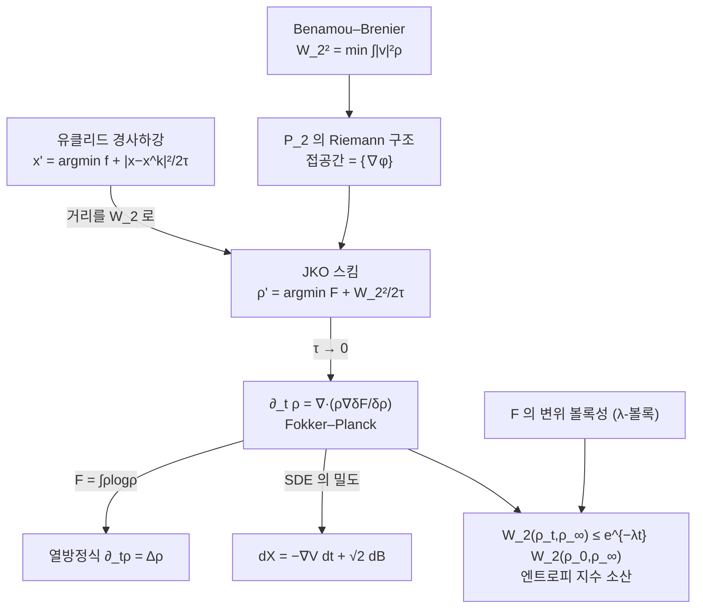

# Wasserstein 기울기 흐름

# 개요

열방정식 $\partial_t\rho=\Delta\rho$ 는 보통 확산의 방정식으로 읽는다. 다른 읽기가 있다. 확률측도 전체가 이루는 공간에 [최적 수송](optimal-transport.md)의 $W_2$ 거리를 주면 그 공간이 형식적인 Riemann 다양체가 되고, 열방정식이 **엔트로피의 경사하강**이 된다.

$$
\partial_t\rho=\nabla\!\cdot\!\Big(\rho\,\nabla\frac{\delta\mathcal F}{\delta\rho}\Big),
\qquad
\mathcal F(\rho)=\int V\rho+\int\rho\log\rho
$$

$\mathcal F$ 가 자유에너지이고, 이 방정식이 [Itô 계산](ito-calculus.md)에서 확률미분방정식의 밀도가 만족하는 Fokker–Planck 방정식과 같다. 곧 확산 과정 하나가 분포 공간 위의 경사하강 하나다.

이 관점이 주는 것은 두 가지다. 첫째, 경사하강의 암시적 오일러 이산화를 그대로 옮기면 **JKO 스킴**이라는 수치 방법이 나오고, 그것이 수렴한다는 증명이 Fokker–Planck 해의 존재 증명이 된다[^1]. 둘째, 유클리드 경사하강에서 목적함수의 볼록성이 수렴 속도를 주듯이, $W_2$ 를 따라 잰 볼록성이 확산의 수렴 속도를 준다. 부등식 증명과 생성모형 설계가 모두 이 두 번째 이득에 기댄다.

# 직관

## 거리를 바꾸면 흐름이 바뀐다

유클리드 공간에서 경사하강은 한 걸음마다 다음을 푸는 것과 같다.

$$
x^{k+1}=\arg\min_x\ \Big[f(x)+\frac{|x-x^k|^2}{2\tau}\Big]
$$

목적함수를 줄이되 너무 멀리 가지 말라는 요구이고, $\tau\to0$ 에서 $\dot x=-\nabla f(x)$ 가 나온다. 여기서 $|x-x^k|^2$ 는 공간에 준 거리일 뿐이다. 거리를 바꾸면 같은 $f$ 에 대해 다른 흐름이 나온다.

확률측도의 공간 $\mathcal P_2(\mathbb R^d)$ 에서 자연스러운 거리가 $W_2$ 다. 그러면 위 식이 그대로 뜻을 갖는다.

$$
\rho^{k+1}=\arg\min_{\rho\in\mathcal P_2}\ \Big[\mathcal F(\rho)+\frac{W_2^2(\rho,\rho^k)}{2\tau}\Big]
$$

이것이 **JKO 스킴**이다. 놀라운 것은 $\tau\to0$ 극한이 Fokker–Planck 방정식이라는 사실이다. 확산은 원래부터 경사하강이었다.

## 접공간이 기울기장이다

$W_2$ 의 Benamou–Brenier 동적 표현이 이 기하를 드러낸다.

$$
W_2^2(\mu,\nu)=\min\Big\{\int_0^1\!\!\int|v_t|^2\rho_t\,dx\,dt\ :\ \partial_t\rho_t+\nabla\!\cdot\!(\rho_tv_t)=0,\ \rho_0=\mu,\ \rho_1=\nu\Big\}
$$

곡선 $\rho_t$ 의 "속도" 는 연속방정식을 통해 속도장 $v_t$ 로 나타나고, 그 길이의 제곱이 $\int|v_t|^2\rho_t$ 다. 곧 $\rho$ 에서의 접공간에 내적이 하나 있는 셈이다.

$$
\langle v_1,v_2\rangle_\rho=\int v_1\cdot v_2\,\rho\,dx
$$

최소화하는 속도장은 항상 기울기장 $v=\nabla\varphi$ 꼴이다. 회전 성분은 밀도를 바꾸지 않으면서 길이만 늘리기 때문이다. 그래서 접공간이 $\lbrace\nabla\varphi\rbrace$ 의 닫힘이 되고, 이 구조가 Otto 미적분이라 불린다.

## 엔트로피의 기울기가 왜 Laplacian 인가

계산 한 줄이면 된다. $\mathcal S(\rho)=\int\rho\log\rho$ 의 일차 변분은 $\frac{\delta\mathcal S}{\delta\rho}=\log\rho+1$ 이므로 기울기 흐름의 속도장이 $-\nabla\log\rho$ 다. 연속방정식에 넣으면

$$
\partial_t\rho=\nabla\!\cdot\!\big(\rho\,\nabla\log\rho\big)=\nabla\!\cdot\!\Big(\rho\,\frac{\nabla\rho}{\rho}\Big)=\Delta\rho
$$

가 된다. 열방정식이 나왔다. $\rho$ 와 $1/\rho$ 가 상쇄되는 이 한 줄이 전체 관점의 핵심이다. 퍼텐셜 항 $\int V\rho$ 를 더하면 속도장에 $-\nabla V$ 가 붙어 Fokker–Planck 방정식이 되고, 이것이 SDE $dX_t=-\nabla V(X_t)dt+\sqrt2\thinspace dB_t$ 의 밀도 방정식이다.

# 정의

## 자유에너지와 기울기 흐름

$\mathcal P_2(\mathbb R^d)$ 위의 범함수를 세 항으로 적는다.

$$
\mathcal F(\rho)=\underbrace{\int V\rho}_{\text{퍼텐셜}}
+\underbrace{\frac12\iint W(x-y)\rho(x)\rho(y)}_{\text{상호작용}}
+\underbrace{\int\rho\log\rho}_{\text{내부 에너지}}
$$

**Wasserstein 기울기 흐름**은 연속방정식에 속도장 $v=-\nabla\frac{\delta\mathcal F}{\delta\rho}$ 를 넣은 것이다.

$$
\partial_t\rho=\nabla\!\cdot\!\Big(\rho\,\nabla\frac{\delta\mathcal F}{\delta\rho}\Big)
=\nabla\!\cdot\!\big(\rho\nabla V\big)+\nabla\!\cdot\!\big(\rho(\nabla W*\rho)\big)+\Delta\rho
$$

$W=0$ 이면 Fokker–Planck, $V=W=0$ 이면 열방정식, 내부 에너지를 $\frac1{m-1}\int\rho^m$ 으로 바꾸면 다공질 매질 방정식이 된다. 서로 다른 PDE 들이 같은 틀의 다른 에너지로 통합된다.

## JKO 스킴

시간 간격 $\tau>0$ 에 대해 $\rho^0=\rho_0$ 에서 시작해

$$
\rho^{k+1}=\arg\min_{\rho\in\mathcal P_2}\Big[\mathcal F(\rho)+\frac1{2\tau}W_2^2(\rho,\rho^k)\Big]
$$

를 반복한다. 각 단계는 볼록 최적화 문제 하나이고, 실제 계산에서는 $W_2^2$ 를 엔트로피 정규화해 [Sinkhorn 알고리즘](sinkhorn.md)으로 푸는 것이 표준이다.

## 변위 볼록성

$\mu_0,\mu_1$ 사이의 $W_2$ 측지선 $(\mu_t)_{t\in[0,1]}$ 을 따라

$$
\mathcal F(\mu_t)\le(1-t)\mathcal F(\mu_0)+t\mathcal F(\mu_1)-\frac\lambda2t(1-t)W_2^2(\mu_0,\mu_1)
$$

이면 $\mathcal F$ 가 **$\lambda$ 변위 볼록**이라 한다. 보통의 볼록성은 선형 보간 $(1-t)\mu_0+t\mu_1$ 을 따라 재지만, 여기서는 측지 보간을 따라 잰다. 두 개념은 다르다. 엔트로피는 선형 보간을 따라서는 볼록이지만 $\lambda=0$ 이고, $\int V\rho$ 는 $V$ 가 $\lambda$ 강볼록이면 $\lambda$ 변위 볼록이다.

# 성질

## JKO 정리

> **Jordan–Kinderlehrer–Otto.** $V$ 가 적당한 성장조건을 만족하고 $\mathcal F(\rho_0)<\infty$ 이면, JKO 스킴의 조각별 상수 보간 $\rho^\tau$ 는 $\tau\to0$ 에서 Fokker–Planck 방정식의 유일한 해로 수렴한다.

이 정리의 값어치는 수치 방법이 아니라 증명 전략에 있다. 각 JKO 단계가 잘 정의된다는 것은 $W_2$ 가 아래반연속이고 $\mathcal F$ 가 콤팩트 준위집합을 갖는다는 변분법의 직접법으로 나오고, 극한이 해라는 것은 일계 조건을 모아 얻는다. PDE 의 정칙성 이론을 거치지 않고 존재성이 나온다.

## 소산 항등식과 지수 수렴

기울기 흐름을 따라 에너지가 줄어드는 속도가 정확히 기울기의 크기다.

$$
\frac{d}{dt}\mathcal F(\rho_t)=-\int\rho_t\Big|\nabla\frac{\delta\mathcal F}{\delta\rho}\Big|^2=-\mathcal I(\rho_t)
$$

$\mathcal F$ 가 상대 엔트로피이면 $\mathcal I$ 는 Fisher 정보다. 곧 위 식은 de Bruijn 항등식이다.

$\mathcal F$ 가 $\lambda>0$ 변위 볼록이면 유클리드에서 강볼록 함수의 경사하강이 지수적으로 수렴하듯 흐름도 지수적으로 수렴한다.

$$
W_2(\rho_t,\rho_\infty)\le e^{-\lambda t}W_2(\rho_0,\rho_\infty),\qquad
\mathcal F(\rho_t)-\mathcal F(\rho_\infty)\le e^{-2\lambda t}\big(\mathcal F(\rho_0)-\mathcal F(\rho_\infty)\big)
$$

두 번째 부등식이 곧 **로그 Sobolev 부등식**의 동역학적 형태다. 정적 함수부등식과 확산의 수렴 속도가 같은 사실의 두 얼굴이라는 것이 이 관점의 대표적 성과이며, Bakry–Émery 판정법 $\nabla^2V\succeq\lambda I$ 가 $\lambda$ 변위 볼록성의 충분조건이다.

## 엄밀화의 위치

Otto 미적분은 형식적이다. $\mathcal P_2$ 는 무한차원이고 매끄러운 다양체가 아니며, 위에서 쓴 접공간과 계량은 유추다. Ambrosio, Gigli, Savaré 가 이를 **거리공간 위의 기울기 흐름** 이론으로 엄밀화했다. 기울기를 쓰지 않고 부등식 하나로 흐름을 정의하는 것이 요령이다.

$$
\frac12\frac{d}{dt}W_2^2(\rho_t,\sigma)+\frac\lambda2W_2^2(\rho_t,\sigma)+\mathcal F(\rho_t)\le\mathcal F(\sigma)
\quad\text{(모든 }\sigma\text{)}
$$

이 EVI 부등식을 만족하는 곡선으로 기울기 흐름을 정의하면, 미분구조가 없는 거리공간에서도 존재와 유일성, 축약성이 나온다. 형식적 계산으로 얻은 결론들이 사후에 정당화되는 구조다.

# 활용

## 어디에 쓰이는가

- **함수부등식.** 로그 Sobolev, Talagrand, HWI 부등식이 모두 자유에너지의 변위 볼록성에서 한 줄로 따라 나온다. 각각 따로 증명되던 것들이 하나의 기하에서 조직된다.
- **생성모형.** 확산모형의 역과정은 점수함수를 따르는 흐름이고, 그 목표 분포로의 수렴을 재는 도구가 이 이론이다. 흐름 정합처럼 속도장을 직접 학습하는 방법은 $\mathcal P_2$ 위의 곡선을 명시적으로 매개화한 것에 해당한다.
- **집단 동역학.** 상호작용 항 $W$ 가 있는 흐름이 군집, 화학주성, 자기조직화 모형이 된다. 입자 $N$ 개의 계가 $N\to\infty$ 에서 이 PDE 로 가는 평균장 극한도 같은 틀에서 다룬다.
- **표집 알고리즘.** Langevin 몬테카를로가 이 기울기 흐름의 시간 이산화다. 혼합 시간 분석이 곧 $\lambda$ 변위 볼록성의 정량화이며, 최적화의 수렴 분석과 같은 언어로 쓰인다.

[^1]: R. Jordan, D. Kinderlehrer, F. Otto, *The Variational Formulation of the Fokker–Planck Equation*, SIAM J. Math. Anal. 29 (1998), 1–17. 스킴의 정의와 $\tau\to0$ 수렴은 Theorem 5.1 이다. 변위 볼록성은 R. McCann, *A Convexity Principle for Interacting Gases*, Adv. Math. 128 (1997). 거리공간에서의 엄밀화는 L. Ambrosio, N. Gigli, G. Savaré, *Gradient Flows in Metric Spaces and in the Space of Probability Measures*, Birkhäuser 2005. 본문의 수치 실험은 직접 한 것이다.

# 연관 문서

## 선수지식

- [최적 수송과 Wasserstein 거리](optimal-transport.md)
- [Itô 적분과 확률미분방정식](ito-calculus.md)

## 더 알아보기

아직 연결한 문서가 없다.

#optimization #measure_theory #analysis
