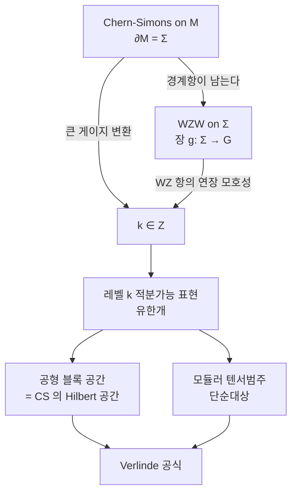

# Wess–Zumino–Witten 모형과 벌크–경계 대응

# 개요

[Chern–Simons 이론](chern-simons.md)의 작용은 게이지 불변이 아니다. 닫힌 3 다양체에서는 게이지 변환에 따른 변화가 $2\pi\mathbb Z$ 라서 $e^{iS}$ 가 불변이고, 레벨 $k$ 의 정수성이 거기서 나왔다. 3 다양체에 경계가 있으면 변화량에 경계 적분 항이 남고 그 항은 사라지지 않는다.

$$
M=\text{3 다양체},\quad \partial M=\Sigma \ \Longrightarrow\ \delta_{\text{gauge}}S_{\mathrm{CS}}\big|\_{\Sigma}\ne0
$$

남은 항이 경계 곡면 $\Sigma$ 위에 사는 2 차원 장론의 작용이고, 그 이론이 **Wess–Zumino–Witten 모형**이다. 벌크의 게이지 자유도가 경계에서 물리적 자유도가 되는 현상이 **벌크–경계 대응**이며, 3 차원 위상장론과 2 차원 등각장론이 같은 자료의 두 표현임을 말한다.

| 3 차원 Chern–Simons | ↔ | 2 차원 WZW(Wess–Zumino–Witten) |
|---|---|---|
| 레벨 $k$ | ↔ | 아핀 Lie 대수의 레벨 $k$ |
| $\Sigma$ 에 붙는 [Hilbert 공간](hilbert-spaces.md) | ↔ | $\Sigma$ 위의 공형 블록 공간 |
| Wilson 선의 라벨 | ↔ | 레벨 $k$ 적분가능 표현 |
| 선을 합치는 규칙 | ↔ | 융합 규칙 |

[Lie 대수](lie-algebras.md) $\mathfrak g$ 의 기약표현은 무한히 많지만 레벨을 $k$ 로 고정하면 유한개만 남는다. 그 유한성 덕분에 [모듈러 텐서범주](modular-tensor-categories.md)가 되고 3 [다양체](manifolds.md) 불변량이 유한합으로 계산된다.

# 직관

## 경계의 자유도

게이지 변환 가운데 경계에서 항등원으로 가는 것만이 물리적 상태를 바꾸지 않는다. 경계에서 자유롭게 움직이는 변환은 상태를 바꾼다.

$$
\mathcal G_{\text{진짜 게이지}}=\lbrace g:g|\_\Sigma=1\rbrace,\qquad
\frac{\mathcal G_{\text{전체}}}{\mathcal G_{\text{진짜 게이지}}}=\mathrm{Map}(\Sigma,G)
$$

몫으로 남는 $\Sigma$ 위의 $G$ 값 함수들이 **루프군**이다. 벌크에 국소 자유도가 없는 이론이 경계에 루프군만큼의 자유도를 남긴다. **WZW**(Wess–Zumino–Witten) 모형의 장 $g:\Sigma\to G$ 가 이 몫에서 오고, 이론의 대칭이 루프군의 중심확대인 **아핀 Lie 대수**가 된다. 양자 Hall 계에서 벌크에 틈이 있고 가장자리에 무질량 모드가 도는 현상이 같은 구조다.

## 정수 레벨의 두 출처

WZW 작용에는 2 차원 적분으로 쓸 수 없는 항이 있다. Wess–Zumino 항은 $\Sigma$ 를 경계로 하는 3 차원 $B$ 로 연장해서만 쓰인다.

$$
\Gamma(g)=\frac{1}{24\pi}\int_B \mathrm{tr}\big(\tilde g^{-1}d\tilde g\big)^3
$$

두 연장 $B,B'$ 를 붙이면 닫힌 3 다양체가 되고 그 위의 적분은 $\pi_3(G)=\mathbb Z$ 를 세는 정수의 $2\pi$ 배다. $\Gamma$ 는 $2\pi\mathbb Z$ 만큼 모호하므로 $e^{ik\Gamma}$ 가 잘 정의되려면 $k\in\mathbb Z$ 여야 한다. Chern–Simons 쪽에서 큰 게이지 변환이 강요하던 정수성과 출처가 $\pi_3(G)=\mathbb Z$ 로 같다.

## 레벨에 의한 절단

아핀 대수 $\hat{\mathfrak g}$ 의 최고무게 표현에 유니터리성을 요구하면 최고무게 $\lambda$ 가 조건

$$
\langle\lambda,\theta^\vee\rangle\le k
$$

를 만족해야 한다. $\theta$ 는 최고근이고, 좌변이 음이 아닌 정수들의 유계 조합이므로 해가 유한개다. $\mathfrak{su}(2)$ 에서는 스핀 $j$ 에 대해 $2j\le k$ 이므로 목록이 $j=0,\tfrac12,\dots,\tfrac k2$ 로 $k+1$ 개다. $\langle\lambda,\theta^\vee\rangle\gt k$ 이면 Verma [가군](modules.md) 안에 노름이 음인 벡터가 나타나 유니터리 표현이 남지 않는다. 이 유한 목록이 Chern–Simons Wilson 선의 라벨 목록이다.

# 정의

## 작용

콤팩트 단순 [Lie 군](lie-groups.md) $G$ 와 정수 $k$ 에 대해 장 $g:\Sigma\to G$ 의 **WZW 작용**은 다음이고 $\Gamma$ 는 위의 Wess–Zumino 항이다.

$$
S_k(g)=\frac{k}{16\pi}\int_\Sigma\mathrm{tr}\big(g^{-1}\partial^\mu g\thinspace g^{-1}\partial_\mu g\big)\thinspace d^2x\thickspace+\thickspace k\thinspace\Gamma(g)
$$

첫 항만 있으면 시그마 모형이고 등각불변이 아니다. 두 항의 계수 비가 위와 같을 때만 베타 함수가 0 이 되어 등각장론이 되며, 이 지점을 WZW 고정점이라 한다. 그때 운동방정식이 $\partial_{\bar z}(g^{-1}\partial_z g)=0$ 으로 정리되어 흐름

$$
J(z)=-k\thinspace\partial_z g\thinspace g^{-1},\qquad \bar J(\bar z)=k\thinspace g^{-1}\partial_{\bar z}g
$$

가 각각 정칙과 반정칙이 된다. 좌우가 독립으로 보존되는 구조에서 아핀 대칭이 나온다.

## 아핀 Lie 대수

$\mathfrak g$ 의 루프대수 $\mathfrak g\otimes\mathbb C[t,t^{-1}]$ 에 중심원소 $K$ 를 더한 다음 대수를 **아핀 Lie 대수** $\hat{\mathfrak g}$ 라 한다.

$$
[J^a_m,J^b_n]=f^{ab}{}\_c\thinspace J^c_{m+n}+m\thinspace\delta^{ab}\delta_{m+n,0}\thinspace K
$$

표현에서 $K$ 가 스칼라 $k$ 로 작용할 때 그 표현의 **레벨**이 $k$ 다. $m\delta_{m+n,0}K$ 항이 중심확대이고, 이것이 없으면 이론이 자명해진다.

에너지–운동량 텐서는 흐름의 이차식으로 만든다(Sugawara 구성).

$$
T(z)=\frac{1}{2(k+h^\vee)}\sum_a :J^aJ^a:(z),\qquad
c=\frac{k\thinspace\dim\mathfrak g}{k+h^\vee}
$$

$h^\vee$ 는 쌍대 Coxeter 수다. 분모의 $k+h^\vee$ 가 Chern–Simons 의 이동된 레벨과 같은 양이고, 양자 불변량 공식의 $q=e^{2\pi i/(k+h^\vee)}$ 가 여기서 온다. $\mathfrak{su}(2)$ 에서는 $h^\vee=2$ , $\dim\mathfrak g=3$ 이라 $c=3k/(k+2)$ 이고 $k=1$ 에서 $c=1$ 이다.

## 적분가능 표현과 융합

레벨 $k$ 에서 $\langle\lambda,\theta^\vee\rangle\le k$ 인 지배적 무게 $\lambda$ 를 **적분가능**이라 하고, 그 최고무게 표현들이 이 이론의 1 차 장 목록이다. 두 표현의 곱은 이 목록 안에서 닫히지 않으므로 잘라야 하고, 잘린 곱이 **융합 규칙**이다.

$$
\phi_i\times\phi_j=\sum_l N_{ij}^{\thickspace l}\thinspace\phi_l
$$

$\mathfrak{su}(2)\_k$ 에서는 스핀 덧셈에 상한이 하나 더 붙는다.

$$
j_1\times j_2=\sum_{j=|j_1-j_2|}^{\min(j_1+j_2,\thickspace k-j_1-j_2)}j
$$

$k\to\infty$ 에서 두 번째 조건이 사라져 Clebsch–Gordan 규칙으로 돌아간다.

# 성질

## 공형 블록과 Hilbert 공간

$\Sigma$ 위의 상관함수는 정칙 조각과 반정칙 조각의 쌍선형 결합이고, 정칙 조각들이 이루는 유한차원 공간이 **공형 블록** 공간 $\mathcal V(\Sigma;\lambda_1,\dots,\lambda_n)$ 이다.

**벌크–경계 대응.** Chern–Simons 이론이 곡면 $\Sigma$ (Wilson 선이 뚫고 지나간 점들에 라벨 $\lambda_i$ 가 붙은)에 붙이는 Hilbert 공간은 같은 자료의 WZW 공형 블록 공간과 표준적으로 동형이다.

3 차원 쪽의 상태가 2 차원 쪽의 함수에 대응한다. 3 다양체를 손잡이체 둘로 가르면 각 조각이 그 Hilbert 공간의 벡터를 주고, 둘을 붙이는 사상이 모듈러 군의 작용이 된다. [Reshetikhin–Turaev](reshetikhin-turaev.md) 불변량의 구성이 이 그림의 [범주](category.md)론 판본이다.

## Verlinde 공식

**정리 (Verlinde).** 융합 계수는

$$
N_{ij}^{\thickspace l}=\sum_{m}\frac{S_{im}S_{jm}S^\ast\_{lm}}{S_{0m}}
$$

이고, 종수 $g$ 곡면의 블록 차원은 $\dim\mathcal V_g=\sum_m(S_{0m})^{2-2g}$ 이다.

$S$ 는 지표의 모듈러 변환 $\tau\mapsto-1/\tau$ 를 나타내는 행렬이다. $\mathfrak{su}(2)\_k$ 에서 라벨 $a=2j$ 에 대해 다음이다.

$$
S_{ab}=\sqrt{\frac{2}{k+2}}\thinspace\sin\frac{\pi(a+1)(b+1)}{k+2}
$$

왼쪽 $N_{ij}^{\thickspace l}$ 은 표현의 곱을 분해한 음이 아닌 정수이고 오른쪽은 사인 값들의 비의 합이다.

$S_{a0}/S_{00}$ 을 **양자차원**이라 한다. $\mathfrak{su}(2)\_k$ 에서 $a=1$ 의 양자차원은

$$
d_{1}=\frac{\sin(2\pi/(k+2))}{\sin(\pi/(k+2))}=2\cos\frac{\pi}{k+2}
$$

이고 $k=1,2,3$ 에서 각각 $1$ , $\sqrt2$ , 황금비다. 정수가 아닌 차원은 이 범주가 벡터공간의 범주가 아니라는 표시이고, [애니온](anyons.md)의 통계가 자명하지 않은 것과 같은 사실이다.

## 대응 사전

| 2 차원의 사실 | 3 차원에서의 의미 |
|---|---|
| 지표의 모듈러 $S$ 변환 | 고체 원환면의 두 순환을 맞바꾸는 사상류 |
| 융합 규칙의 결합법칙 | Wilson 선을 합치는 순서 무관 |
| 1 차 장의 유한 목록 | 불변량이 유한합으로 계산됨 |
| 널 벡터에 의한 절단 | 레벨 $k$ 에서 $q$ 가 1 의 거듭제곱근 |

마지막 줄에서 $q=e^{2\pi i/(k+h^\vee)}$ 가 1 의 거듭제곱근이라는 것과 표현이 유한개라는 것이 같은 사실이며, 양자군 $U_q(\mathfrak g)$ 의 절단 현상도 같다.

# 활용

- **레벨 1.** $G=\mathrm{SU}(N)$ 의 레벨 1 에서는 적분가능 표현이 $N$ 개뿐이고 모두 양자차원 1 이며 $c=N-1$ 이다. 이론이 자유 보손을 근격자 위에 감은 것과 같아지고, 같은 구성을 다른 짝수 자기쌍대 격자에 적용하면 [정점작용소대수](vertex-operator-algebras.md)의 격자 구성이 된다.
- **위상적 양자계산.** WZW 의 융합 규칙이 애니온의 융합 규칙이고, 땋임이 공형 블록 위의 모노드로미로 실현된다.
- **기하적 Langlands.** 임계 레벨 $k=-h^\vee$ 에서 Sugawara 구성의 분모가 0 이 되어 Virasoro 대칭이 사라지고 큰 가환 대수가 나타난다. 이 레벨이 [기하적 Langlands](geometric-langlands.md) 대응의 출발 지점이다.
- **[모듈러 형식](modular-forms.md).** 적분가능 표현의 지표가 무게 0 의 벡터값 모듈러 형식이고, 그 $S$ 변환 행렬이 Verlinde 공식에 들어간다.

# 연관 문서

## 선수지식

- [Chern–Simons 이론](chern-simons.md)
- [Lie 대수](lie-algebras.md)

## 더 알아보기

아직 연결한 문서가 없다.

#differential_geometry #algebra #category_theory #group_theory
