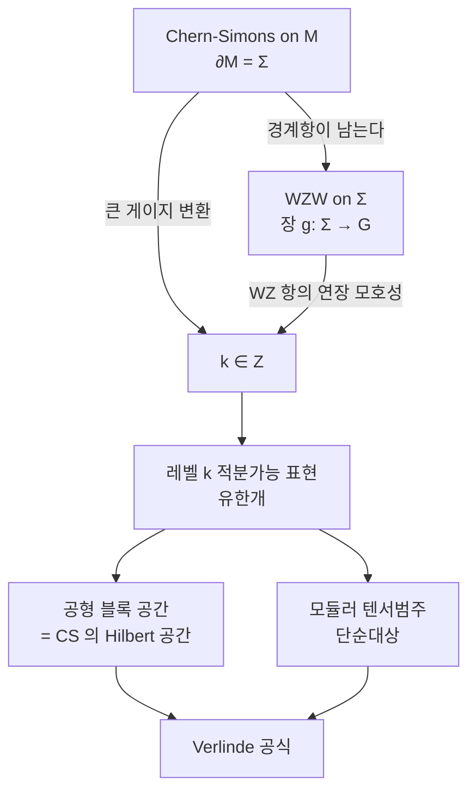

# Wess–Zumino–Witten 모형과 벌크–경계 대응

# 개요

[Chern–Simons 이론](chern-simons.md)의 작용은 게이지 불변이 아니다. 게이지 변환을 하면 값이 변하고, 닫힌 3 다양체에서는 그 변화가 $2\pi\mathbb Z$ 라서 $e^{iS}$ 만 보면 아무 일도 없었던 것처럼 된다. 레벨 $k$ 가 정수여야 하는 이유가 그것이었다.

그런데 3 다양체에 **경계가 있으면** 사정이 달라진다. 변화량에 경계 적분 항이 하나 더 남고, 이번에는 그것이 $2\pi\mathbb Z$ 가 아니다. 사라지지 않는다.

$$
M=\text{3 다양체},\quad \partial M=\Sigma \ \Longrightarrow\ \delta_{\text{gauge}}S_{\mathrm{CS}}\big|_{\Sigma}\ne0
$$

이 남은 항을 버리지 않고 정면으로 받아들이면, 그것이 경계 곡면 $\Sigma$ 위에 사는 **2 차원 장론의 작용**이 된다. 이것이 Wess–Zumino–Witten 모형이다. 벌크의 게이지 자유도가 경계에서 물리적 자유도로 바뀐다는 이 현상이 **벌크–경계 대응**이고, 3 차원 위상장론과 2 차원 등각장론이 같은 자료의 두 표현임을 말한다.

대응의 핵심은 사전 한 장으로 요약된다.

| 3 차원 Chern–Simons | ↔ | 2 차원 WZW |
|---|---|---|
| 레벨 $k$ | ↔ | 아핀 Lie 대수의 레벨 $k$ |
| $\Sigma$ 에 붙는 Hilbert 공간 | ↔ | $\Sigma$ 위의 공형 블록 공간 |
| Wilson 선의 라벨 | ↔ | 레벨 $k$ 적분가능 표현 |
| 선을 합치는 규칙 | ↔ | 융합 규칙 |

라벨의 개수가 유한하다는 사실이 이 대응에서 가장 실질적인 내용이다. [Lie 대수](lie-algebras.md) $\mathfrak g$ 의 기약표현은 무한히 많은데, 레벨을 $k$ 로 고정하면 살아남는 것이 유한개다. 유한개이기 때문에 [모듈러 텐서범주](modular-tensor-categories.md)가 되고, 3 다양체 불변량이 유한합으로 계산된다.

# 직관

## 경계가 자유도를 만든다

게이지 이론에서 게이지 변환으로 없앨 수 있는 자유도는 물리적이지 않다. 하지만 "게이지 변환"이라는 말에는 경계에서 항등원으로 가야 한다는 조건이 숨어 있다. 경계에서 자유롭게 움직이는 변환은 물리적 상태를 진짜로 바꾼다.

$$
\mathcal G_{\text{진짜 게이지}}=\lbrace g:g|_\Sigma=1\rbrace,\qquad
\frac{\mathcal G_{\text{전체}}}{\mathcal G_{\text{진짜 게이지}}}=\mathrm{Map}(\Sigma,G)
$$

몫으로 남는 것이 $\Sigma$ 위의 $G$ 값 함수들, 곧 **루프군**이다. 벌크에서 아무 국소 자유도도 없던 이론이 경계에 루프군만큼의 자유도를 남긴다. WZW 모형의 장 $g:\Sigma\to G$ 가 정확히 이 몫에서 온 것이고, 이론의 대칭이 루프군의 중심확대인 **아핀 Lie 대수**가 되는 것도 여기서 따라온다.

양자 Hall 계에서 벌크는 틈이 있어 아무것도 흐르지 않는데 가장자리에는 무질량 모드가 도는 현상이 같은 이야기다. 벌크의 위상적 성질이 경계의 실제 자유도로 나타난다.

## 왜 정수 레벨인가, 두 번

WZW 작용에는 2 차원 적분으로 쓸 수 없는 항이 하나 있다. Wess–Zumino 항은 $\Sigma$ 를 경계로 하는 3 차원 $B$ 로 연장해서만 쓰인다.

$$
\Gamma(g)=\frac{1}{24\pi}\int_B \operatorname{tr}\big(\tilde g^{-1}d\tilde g\big)^3
$$

연장은 하나가 아니다. 두 연장 $B,B'$ 를 붙이면 닫힌 3 다양체가 되고 그 위의 적분은 $\pi_3(G)=\mathbb Z$ 를 세는 정수의 $2\pi$ 배다. 그러므로 $\Gamma$ 자체는 $2\pi\mathbb Z$ 만큼 모호하고, $e^{ik\Gamma}$ 가 잘 정의되려면

$$
k\in\mathbb Z
$$

여야 한다. Chern–Simons 쪽에서 큰 게이지 변환이 강요하던 정수성과 **같은 $\pi_3(G)=\mathbb Z$ 가 출처**다. 두 이론이 같은 자료를 본다는 첫 번째 증거다.

## 레벨이 표현을 자른다

레벨 $k$ 가 정수라는 것만으로 표현의 개수가 유한해진다. 아핀 대수 $\hat{\mathfrak g}$ 의 최고무게 표현에서 유니터리성을 요구하면, 최고무게 $\lambda$ 가 조건

$$
\langle\lambda,\theta^\vee\rangle\le k
$$

를 만족해야 한다. $\theta$ 는 최고근이다. 좌변이 음이 아닌 정수들의 유계 조합이므로 해가 유한개다. $\mathfrak{su}(2)$ 에서는 스핀 $j$ 에 대해 $2j\le k$ 이므로

$$
j=0,\tfrac12,1,\dots,\tfrac k2\qquad(k+1\ \text{개})
$$

다. 왜 잘리는지는 널 벡터로 설명된다. $\langle\lambda,\theta^\vee\rangle>k$ 이면 Verma 가군 안에 노름이 음인 벡터가 나타나고, 몫을 취해 없애려 해도 유니터리 표현이 남지 않는다. **유한한 목록**이 여기서 나오고, 그 목록이 Chern–Simons Wilson 선의 라벨 목록과 같다.

# 정의

## 작용

> **정의.** 콤팩트 단순 Lie 군 $G$ 와 정수 $k$ 에 대해 장 $g:\Sigma\to G$ 의 WZW 작용은
> $$
> S_k(g)=\frac{k}{16\pi}\int_\Sigma\operatorname{tr}\big(g^{-1}\partial^\mu g\thinspace g^{-1}\partial_\mu g\big)\thinspace d^2x\thickspace+\thickspace k\thinspace\Gamma(g)
> $$
> 이고 $\Gamma$ 는 위의 Wess–Zumino 항이다.

첫 항만 있으면 그냥 시그마 모형이고 등각불변이 아니다. 두 항의 계수 비가 위와 같이 맞을 때만 베타 함수가 0 이 되어 **등각장론**이 된다. 이 지점을 WZW 고정점이라 한다.

그때 운동방정식이 $\partial_{\bar z}(g^{-1}\partial_z g)=0$ 으로 정리되어, 흐름

$$
J(z)=-k\thinspace\partial_z g\thinspace g^{-1},\qquad \bar J(\bar z)=k\thinspace g^{-1}\partial_{\bar z}g
$$

가 각각 정칙과 반정칙이 된다. 좌우가 독립으로 보존되는 이 구조가 아핀 대칭의 출처다.

## 아핀 Lie 대수

> **정의.** $\mathfrak g$ 의 루프대수 $\mathfrak g\otimes\mathbb C[t,t^{-1}]$ 에 중심원소 $K$ 를 더한
> $$
> [J^a_m,J^b_n]=f^{ab}{}_c\thinspace J^c_{m+n}+m\thinspace\delta^{ab}\delta_{m+n,0}\thinspace K
> $$
> 를 아핀 Lie 대수 $\hat{\mathfrak g}$ 라 한다. 표현에서 $K$ 가 스칼라 $k$ 로 작용할 때 그 표현의 **레벨**이 $k$ 다.

$m\delta_{m+n,0}K$ 항이 중심확대이고, 이것이 없으면 이론이 자명해진다. Virasoro 대수의 중심항과 같은 자리에 있는 항이다.

에너지–운동량 텐서는 흐름의 이차식으로 만들어진다 (Sugawara 구성).

$$
T(z)=\frac{1}{2(k+h^\vee)}\sum_a :J^aJ^a:(z),\qquad
c=\frac{k\thinspace\dim\mathfrak g}{k+h^\vee}
$$

$h^\vee$ 는 쌍대 Coxeter 수다. 분모의 $k+h^\vee$ 가 Chern–Simons 의 "이동된 레벨"과 정확히 같은 양이고, 양자 불변량 공식에서 $q=e^{2\pi i/(k+h^\vee)}$ 가 나타나는 이유다. $\mathfrak{su}(2)$ 면 $h^\vee=2$ 이고 $\dim\mathfrak g=3$ 이므로 $c=3k/(k+2)$ 이고 $k=1$ 에서 $c=1$ 이다.

## 적분가능 표현과 융합

> **정의.** 레벨 $k$ 에서 $\langle\lambda,\theta^\vee\rangle\le k$ 인 지배적 무게 $\lambda$ 를 **적분가능**이라 하고, 그 최고무게 표현들이 이 이론의 1 차 장 목록이다.

두 표현의 곱은 이 목록 안에서 닫히지 않으므로 잘라야 한다. 잘린 곱이 **융합 규칙**이다.

$$
\phi_i\times\phi_j=\sum_l N_{ij}^{\thickspace l}\thinspace\phi_l
$$

$\mathfrak{su}(2)_k$ 에서는 보통의 스핀 덧셈에 상한이 하나 더 붙는다.

$$
j_1\times j_2=\sum_{j=|j_1-j_2|}^{\min(j_1+j_2,\thickspace k-j_1-j_2)}j
$$

$k\to\infty$ 에서 두 번째 조건이 사라져 고전적인 Clebsch–Gordan 규칙으로 돌아간다. 레벨이 유한하다는 것이 **곱을 자르는** 방식으로 드러나는 셈이다.

# 성질

## 공형 블록이 Hilbert 공간이다

$\Sigma$ 위의 상관함수는 모듈러 불변인 하나의 함수가 아니라, 정칙 조각과 반정칙 조각의 쌍선형 결합이다. 그 정칙 조각들이 이루는 유한차원 공간이 **공형 블록** 공간 $\mathcal V(\Sigma;\lambda_1,\dots,\lambda_n)$ 이다.

> **벌크–경계 대응.** Chern–Simons 이론이 곡면 $\Sigma$ (Wilson 선이 뚫고 지나간 점들에 라벨 $\lambda_i$ 가 붙은) 에 붙이는 Hilbert 공간은 같은 자료의 WZW 공형 블록 공간과 표준적으로 동형이다.

곧 3 차원 쪽의 **상태**가 2 차원 쪽의 **함수**다. 3 다양체를 손잡이체 둘로 가르면 각 조각이 그 Hilbert 공간의 벡터를 주고, 둘을 붙이는 사상이 모듈러 군의 작용이 된다. [Reshetikhin–Turaev](reshetikhin-turaev.md) 불변량의 구성이 이 그림을 범주론으로 옮긴 것이다.

## Verlinde 공식

공형 블록 공간의 **차원**이 모듈러 $S$ 행렬 하나로 계산된다.

> **정리 (Verlinde).** 융합 계수는
> $$
> N_{ij}^{\thickspace l}=\sum_{m}\frac{S_{im}S_{jm}S^*_{lm}}{S_{0m}}
> $$
> 이고, 종수 $g$ 곡면의 블록 차원은 $\displaystyle\dim\mathcal V_g=\sum_m\big(S_{0m}\big)^{2-2g}$ 이다.

여기서 $S$ 는 지표의 모듈러 변환 $\tau\mapsto-1/\tau$ 를 나타내는 행렬이다. $\mathfrak{su}(2)_k$ 면 라벨 $a=2j$ 에 대해

$$
S_{ab}=\sqrt{\frac{2}{k+2}}\thinspace\sin\frac{\pi(a+1)(b+1)}{k+2}
$$

이다. 이 식이 **왜 놀라운가**를 짚을 만하다. 왼쪽은 표현의 곱을 분해한 비음 정수이고, 오른쪽은 사인 값들의 비를 더한 초월적인 실수다. 정수성이 전혀 자명하지 않은데 늘 성립한다. 아래 코드에서 직접 확인한다.

$S_{a0}/S_{00}$ 을 **양자차원**이라 하고, $\mathfrak{su}(2)_k$ 에서 $a=1$ 의 양자차원은

$$
d_{1}=\frac{\sin(2\pi/(k+2))}{\sin(\pi/(k+2))}=2\cos\frac{\pi}{k+2}
$$

다. $k=1$ 에서 $2\cos(\pi/3)=1$ 이고, $k=2$ 에서 $\sqrt2$ 이며, $k=3$ 에서 황금비 $\varphi$ 다. 정수가 아닌 차원이 나오는 것이 이 범주가 벡터공간의 범주가 아니라는 신호이고, [애니온](anyons.md)의 통계가 자명하지 않은 이유이기도 하다.

## 대응이 설명하는 것들

| 2 차원에서 당연한 것 | 3 차원에서의 의미 |
|---|---|
| 지표의 모듈러 $S$ 변환 | 고체 원환면의 두 순환을 맞바꾸는 사상류 |
| 융합 규칙의 결합법칙 | Wilson 선을 합치는 순서 무관 |
| 1 차 장의 유한 목록 | 불변량이 유한합으로 계산됨 |
| 널 벡터에 의한 절단 | 레벨 $k$ 에서 $q$ 가 1 의 거듭제곱근 |

마지막 줄이 실용적으로 중요하다. $q=e^{2\pi i/(k+h^\vee)}$ 가 1 의 거듭제곱근이라는 사실과 표현이 유한개라는 사실이 같은 말이고, 양자군 $U_q(\mathfrak g)$ 에서 그 지점에만 나타나는 절단 현상과도 같은 말이다.

# 활용

## 레벨 1 의 특수한 단순함

$G=\mathrm{SU}(N)$ 의 레벨 1 에서는 적분가능 표현이 $N$ 개뿐이고 전부 양자차원 1 이다. 중심전하는 $c=N-1$ 로 정수이고, 이론이 자유 보손을 격자 위에 감은 것과 같아진다. 이 격자가 $\mathfrak{su}(N)$ 의 근격자이고, 같은 구성을 다른 짝수 자기쌍대 격자에 적용하면 [정점작용소대수](vertex-operator-algebras.md)의 격자 구성이 된다. Leech 격자에서 시작해 달빛 가군을 만드는 경로가 그 연장선에 있다.

## 어디로 이어지는가

- **위상적 양자계산.** WZW 의 융합 규칙이 곧 애니온의 융합 규칙이고, 땋임이 공형 블록 위의 모노드로미로 실현된다.
- **기하적 Langlands.** 임계 레벨 $k=-h^\vee$ 에서 Sugawara 구성의 분모가 0 이 되어 Virasoro 대칭이 사라지는 대신 거대한 가환 대수가 나타난다. 이 특이한 레벨이 [기하적 Langlands](geometric-langlands.md) 대응의 출발점이다.
- **모듈러 형식.** 적분가능 표현의 지표가 무게 0 의 벡터값 모듈러 형식이고, 그 $S$ 변환 행렬이 위의 Verlinde 공식에 그대로 들어간다.

# 연관 문서

## 선수지식

- [Chern–Simons 이론과 레벨 양자화](chern-simons.md)
- [Lie 대수](lie-algebras.md)

## 더 알아보기

아직 연결한 문서가 없다.

#differential_geometry #algebra #category_theory #group_theory
