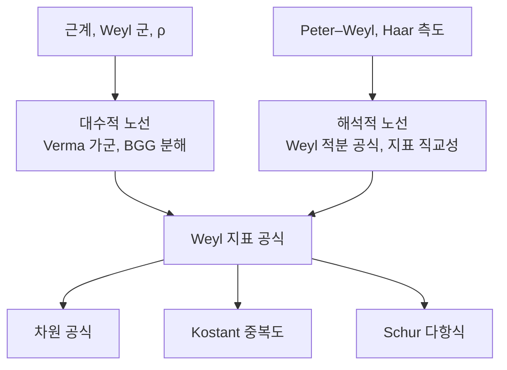

# Weyl 지표 공식과 최고무게 이론

# 개요

[근계](root-systems.md)는 반단순 Lie 대수를 유한한 조합 자료로 압축했다. 그런데 압축한 보람은 대수 자체의 분류에서 끝나지 않는다. **그 대수의 모든 유한차원 기약표현이 같은 자료로 분류되고, 각 표현의 크기와 모양까지 근계 위의 유한 계산으로 나온다.**

분류는 한 문장이다. 복소 반단순 Lie 대수 $\mathfrak g$ 의 유한차원 기약표현은 **지배적 정수 무게**와 일대일 대응한다.

$$
\{\text{유한차원 기약표현}\}/\cong\ \ \longleftrightarrow\ \ P^+=\Big\{\lambda\in P:\langle\lambda,\alpha_i^\vee\rangle\in\mathbb Z_{\ge0}\Big\}
$$

오른쪽은 무게격자의 한 모서리에 있는 격자점들, 곧 $n$ 개의 음이 아닌 정수다. 무한히 많고 복잡해 보이던 대상이 정수 $n$ 개짜리 목록이 된다.

여기까지가 절반이고, 나머지 절반이 **Weyl 지표 공식**이다. 표현 $V_\lambda$ 를 무게공간으로 쪼갠 정보 전체를 담은 형식합을 지표라 할 때,

$$
\operatorname{ch}V_\lambda=\sum_{\mu}\dim(V_\lambda)_\mu\ e^\mu
=\frac{\displaystyle\sum_{w\in W}(-1)^{\ell(w)}e^{w(\lambda+\rho)}}{\displaystyle\sum_{w\in W}(-1)^{\ell(w)}e^{w(\rho)}}
$$

가 성립한다. 왼쪽은 무한히 많은 표현 각각에 대해 따로 계산해야 할 것처럼 보이는 자료이고, 오른쪽은 유한군 $W$ 위의 교대합 두 개의 비다. 하나의 닫힌 공식이 모든 $\lambda$ 를 한꺼번에 처리한다.

이 공식이 [Peter–Weyl 정리](peter-weyl.md)와 맞물리는 지점이 요점이다. Peter–Weyl 은 콤팩트군 $G$ 의 $L^2(G)$ 가 기약표현들로 분해된다고 말하지만 그 기약표현이 무엇인지는 말해 주지 않는다. 지표 공식이 그 빈칸을 채운다. $G$ 가 콤팩트 연결 Lie 군이면 기약표현은 정확히 $P^+$ 로 색인되고 지표는 위 공식으로 주어지므로, $L^2(G)$ 의 정규직교기저가 근계 위의 조합 자료로 완전히 기술된다. $G=S^1$ 에서 이 진술은 [Fourier 급수](fourier-series.md)이고, $G=\mathrm{SU}(2)$ 에서는 [구면조화함수](spherical-harmonics.md)의 차원 $2\ell+1$ 이다.

# 직관

## $\mathfrak{sl}_2$ 가 전부를 예고한다

$\mathfrak{sl}_2$ 의 기약표현은 각 차원마다 하나씩 있고, $n+1$ 차원 표현 $V_n$ 의 무게는 $n,n-2,\dots,-n$ 이 하나씩이다. 형식지표를 $e^1=x$ 로 쓰면

$$
\operatorname{ch}V_n=x^n+x^{n-2}+\cdots+x^{-n}=\frac{x^{n+1}-x^{-(n+1)}}{x-x^{-1}}
$$

가 된다. 왼쪽은 항이 $n+1$ 개인 합이고 오른쪽은 항이 네 개인 분수다. 유한 등비급수를 닫힌 꼴로 접은 것뿐이지만, 접힌 모양을 잘 보면 일반 공식의 전부가 이미 들어 있다.

- $W=\{1,s\}$ 이고 $s$ 는 $x\mapsto x^{-1}$ 이다. 분자와 분모 모두 $W$ 에 대한 교대합이다.
- $\rho=1$ 이고 분자의 지수는 $\pm(n+1)=\pm(\lambda+\rho)$ 다. 지표에 나타나는 것은 $\lambda$ 가 아니라 항상 $\lambda+\rho$ 다.
- 분모는 $\lambda=0$ 을 넣은 분자, 곧 자명표현이 지표 $1$ 을 갖게 만드는 정규화다.

일반 공식은 이 세 줄을 근계 전체로 옮긴 것이다. $x\mapsto x^{-1}$ 자리에 Weyl 군이 들어가고, $\pm$ 부호 자리에 $(-1)^{\ell(w)}$ 가 들어가며, 등비급수 자리에 여러 방향의 급수가 들어간다.

## $\rho$ 이동이 왜 필요한가

$\operatorname{ch}V_\lambda$ 는 $W$ 에 대해 **대칭**이다. 무게 다이어그램이 Weyl 군 대칭을 갖기 때문이다. 그런데 대칭함수는 다루기 까다롭고, **반대칭**함수는 다루기 쉽다. 반대칭 함수는 모든 $W$ 궤도에서 한 번씩만 항을 골라 부호를 붙인 것이라 자유롭게 일대일 대응되기 때문이다.

대칭인 것을 반대칭으로 바꾸는 표준 수법은 Vandermonde 행렬식을 곱하는 것이다. 여기서 그 역할을 하는 것이 **Weyl 분모**다.

$$
\Delta=\sum_{w\in W}(-1)^{\ell(w)}e^{w\rho}=\prod_{\alpha\in\Phi^+}\left(e^{\alpha/2}-e^{-\alpha/2}\right)
$$

두 표현이 같다는 사실 자체가 **Weyl 분모 항등식**이고, $\rho=\frac12\sum_{\alpha>0}\alpha$ 가 나타나는 이유를 설명한다. 곱 쪽에서 각 인수의 최고차항 $e^{\alpha/2}$ 를 모두 모으면 정확히 $e^\rho$ 가 된다.

그래서 지표 공식은 이렇게 읽는 것이 맞다.

$$
\underbrace{\operatorname{ch}V_\lambda}_{\text{대칭}}\cdot\underbrace{\Delta}_{\text{반대칭}}=\underbrace{\sum_{w\in W}(-1)^{\ell(w)}e^{w(\lambda+\rho)}}_{\text{반대칭, 게다가 가장 단순한 것}}
$$

$\lambda$ 가 지배적이면 $\lambda+\rho$ 는 **엄격히** 지배적이라 $W$ 궤도가 자유롭다. 반대칭 함수 공간에서 궤도 하나가 기저 하나를 주므로, 오른쪽은 반대칭 함수 공간의 기저 원소 그 자체다. $\rho$ 를 더하는 이유는 경계에 붙어 있던(고정점이 있는) 무게를 내부로 밀어 궤도를 자유롭게 만들기 위해서다. 곱한 뒤 가장 단순한 것이 나오도록 이동시키는 것, 그것이 $\rho$ 의 일이다.

## 두 가지 증명 노선

같은 공식에 성격이 아주 다른 두 증명이 있고, 두 노선이 이 문서의 두 부모에 각각 대응한다.



해석적 노선(Weyl 의 원래 증명)은 콤팩트군 $G$ 와 극대원환면 $T$ 를 놓고 시작한다. 모든 원소가 어떤 원환면에 들어가므로 류함수는 $T$ 위의 $W$ 불변 함수로 결정되고, Haar 측도가 $T$ 위에서 $\frac1{|W|}|\Delta|^2$ 라는 야코비안을 갖는다(**Weyl 적분 공식**).

$$
\int_Gf(g)\,dg=\frac1{|W|}\int_Tf(t)\,|\Delta(t)|^2\,dt
$$

그러면 Peter–Weyl 이 주는 지표의 직교관계 $\int_G\chi_\lambda\overline{\chi_\mu}=\delta_{\lambda\mu}$ 가 $\chi_\lambda\Delta$ 들이 $T$ 위에서 정규직교라는 말이 된다. 반대칭 지수합들도 정규직교이므로, 남은 일은 $\chi_\lambda\Delta$ 가 그 중 어느 것인지 고르는 것뿐이다. **곱했더니 직교기저가 되더라**는 것이 증명의 전부다.

대수적 노선은 Verma 가군 $M_\mu$ 의 지표가 Kostant 분할 함수로 바로 나온다는 관찰에서 출발한다.

$$
\operatorname{ch}M_\mu=\frac{e^\mu}{\prod_{\alpha\in\Phi^+}(1-e^{-\alpha})}
$$

Verma 가군은 자유롭게 아래로 뻗은 가군이라 지표가 순수한 조합량이다. 기약표현은 Verma 가군들의 교대합으로 풀린다(**BGG 분해**).

$$
\operatorname{ch}V_\lambda=\sum_{w\in W}(-1)^{\ell(w)}\operatorname{ch}M_{w\cdot\lambda},\qquad w\cdot\lambda:=w(\lambda+\rho)-\rho
$$

여기 나오는 $\rho$ 이동 작용 $w\cdot\lambda$ 가 앞 절에서 본 이동과 같은 것이고, 이 식을 정리하면 곧바로 지표 공식이 된다.

# 정의

## 무게와 최고무게

Cartan 부분대수 $\mathfrak h$ 의 표현 $V$ 에 대한 동시 고유공간 분해를 무게공간 분해라 한다.

$$
V=\bigoplus_{\mu\in\mathfrak h^*}V_\mu,\qquad V_\mu=\{v\in V:h\cdot v=\mu(h)v\ \ \forall h\in\mathfrak h\}
$$

$V_\mu\neq0$ 인 $\mu$ 가 **무게**이고 $\dim V_\mu$ 가 그 **중복도**다. 유한차원 표현의 무게는 모두 무게격자 $P$ 에 들어간다.

양근 $\Phi^+$ 를 고정하면 무게에 부분순서가 생긴다. $\mu\le\lambda$ 를 $\lambda-\mu$ 가 단순근의 음이 아닌 정수결합이라는 뜻으로 쓴다. 유한차원 기약표현에는 이 순서에 대한 **최고무게** $\lambda$ 가 유일하게 있고, $V_\lambda$ 는 1 차원이며 $\alpha>0$ 에 대해 $\mathfrak g_\alpha\cdot V_\lambda=0$ 이다. 그 한 벡터가 표현 전체를 생성한다.

## 지배적 정수 무게와 분류 정리

무게 $\lambda$ 가 모든 단순근에 대해

$$
\langle\lambda,\alpha_i^\vee\rangle=\frac{2(\lambda,\alpha_i)}{(\alpha_i,\alpha_i)}\in\mathbb Z_{\ge0}
$$

를 만족하면 **지배적 정수 무게**라 하고, 그 집합을 $P^+$ 로 쓴다. 기본무게 $\omega_1,\dots,\omega_n$ 을 $\langle\omega_i,\alpha_j^\vee\rangle=\delta_{ij}$ 로 정의하면 $P^+=\mathbb Z_{\ge0}\omega_1\oplus\cdots\oplus\mathbb Z_{\ge0}\omega_n$ 이고, 표현이 음이 아닌 정수 $n$ 개(**Dynkin 라벨**)로 색인된다.

> **최고무게 분류 정리.** $\lambda\mapsto V_\lambda$ 는 $P^+$ 에서 유한차원 기약표현의 동형류 전체로 가는 전단사다.

정수성은 각 단순근의 $\mathfrak{sl}_2$ 부분대수로 제한해 보면 나온다. $\mathfrak{sl}_2$ 표현의 무게가 정수라는 사실이 그대로 조건이 되고, 음이 아니어야 한다는 것은 최고무게 벡터가 사다리 위쪽 끝이라는 뜻이다.

## 지표

군환의 형식기저 $\{e^\mu\}_{\mu\in P}$ 를 $e^\mu e^\nu=e^{\mu+\nu}$ 로 곱해 놓고,

$$
\operatorname{ch}V=\sum_{\mu\in P}\dim(V_\mu)\,e^\mu
$$

를 **형식지표**라 한다. 콤팩트군 쪽에서 보면 $e^\mu$ 를 극대원환면 위의 함수 $t\mapsto\mu(t)$ 로 읽는 것이고, 그때 $\operatorname{ch}V$ 는 표현의 대각합 $\chi_V(t)=\operatorname{tr}\rho(t)$ 와 같다. 형식지표는 직합과 텐서곱을 합과 곱으로 바꾸므로 표현환에서 다항식 계산을 하게 해 준다.

$$
\operatorname{ch}(V\oplus W)=\operatorname{ch}V+\operatorname{ch}W,\qquad \operatorname{ch}(V\otimes W)=\operatorname{ch}V\cdot\operatorname{ch}W
$$

# 성질

## 세 공식

지표 공식에서 세 가지 결과가 차례로 나온다.

**Weyl 지표 공식.**

$$
\operatorname{ch}V_\lambda=\frac{\sum_{w\in W}(-1)^{\ell(w)}e^{w(\lambda+\rho)}}{\prod_{\alpha\in\Phi^+}\left(e^{\alpha/2}-e^{-\alpha/2}\right)}
$$

**Weyl 차원 공식.** 위 식에서 $e^\mu\mapsto e^{t(\mu,\rho^\vee)}$ 로 특수화하고 $t\to0$ 극한을 취하면(양쪽 모두 $0/0$ 이라 L'Hôpital 을 $|\Phi^+|$ 번 쓴다) 분모와 분자가 모두 곱으로 풀린다.

$$
\dim V_\lambda=\prod_{\alpha\in\Phi^+}\frac{(\lambda+\rho,\alpha)}{(\rho,\alpha)}
$$

무한히 많은 표현의 차원이 양근 개수만큼의 곱셈으로 나온다. $A_2$ 에서 $\lambda=a\omega_1+b\omega_2$ 일 때 양근이 셋이므로

$$
\dim V_{(a,b)}=\frac{(a+1)(b+1)(a+b+2)}{2}
$$

가 되고, $(1,1)\mapsto8$ 과 $(3,0)\mapsto10$ 이 각각 $\mathrm{SU}(3)$ 의 8 중항과 10 중항이다.

**Kostant 중복도 공식.** 차원이 아니라 무게별 중복도를 원하면 Verma 지표의 분모를 급수로 펼친다. $\mathcal P(\nu)$ 를 $\nu$ 를 양근들의 음이 아닌 정수결합으로 쓰는 방법의 수(**Kostant 분할 함수**)라 할 때,

$$
\dim(V_\lambda)_\mu=\sum_{w\in W}(-1)^{\ell(w)}\ \mathcal P\big(w(\lambda+\rho)-(\mu+\rho)\big)
$$

$|W|$ 개의 항이 크게 상쇄되며 작은 수가 남는 꼴이라 손계산에는 나쁘지만, 중복도가 분할 함수의 교대합이라는 구조 자체가 중요하다. 실제 계산에는 재귀식인 Freudenthal 공식이 낫다.

$$
\big((\lambda+\rho,\lambda+\rho)-(\mu+\rho,\mu+\rho)\big)\dim(V_\lambda)_\mu=2\sum_{\alpha\in\Phi^+}\sum_{k\ge1}\dim(V_\lambda)_{\mu+k\alpha}\,(\mu+k\alpha,\alpha)
$$

## 계산으로 확인하기

$A_2$ 를 $\mathbb R^3$ 안에 놓고 차원 공식과 Kostant 공식을 각각 구현한다. 둘은 논리적으로 독립한 결과가 아니지만 계산 경로가 완전히 달라서(하나는 세 인수의 곱, 하나는 여섯 항의 교대합을 무게마다) 서로를 검증한다. $\sum_\mu\dim(V_\lambda)_\mu=\dim V_\lambda$ 가 맞아야 한다.

```python
from fractions import Fraction as F
from functools import lru_cache

def V(*xs):  return tuple(F(x) for x in xs)
def ip(a, b):  return sum(x * y for x, y in zip(a, b))
def add(a, b): return tuple(x + y for x, y in zip(a, b))
def sub(a, b): return tuple(x - y for x, y in zip(a, b))
def smul(c, a): return tuple(F(c) * x for x in a)

# A_2 = sl_3 을 R^3 의 e_i - e_j 로 실현
simple = [V(1, -1, 0), V(0, 1, -1)]
pos    = [simple[0], simple[1], add(simple[0], simple[1])]
rho    = smul(F(1, 2), tuple(sum(c) for c in zip(*pos)))        # = (1, 0, -1)

def refl(b, a): return sub(b, smul(2 * ip(b, a) / ip(a, a), a))
def act(word, v):
    for i in reversed(word): v = refl(v, simple[i])
    return v

# Weyl 군을 단순반사 단어로 BFS 생성. BFS 라 단어 길이가 곧 l(w)
def sig(w): return tuple(act(w, b) for b in [V(1,0,0), V(0,1,0), V(0,0,1)])
Wl, seen, frontier = [()], {sig(())}, [()]
while frontier:
    nxt = []
    for w in frontier:
        for i in range(len(simple)):
            w2 = (i,) + w
            if sig(w2) not in seen:
                seen.add(sig(w2)); Wl.append(w2); nxt.append(w2)
    frontier = nxt

def root_coords(v):
    """v 를 n1*a1 + n2*a2 로. 근격자 밖이면 None"""
    n1, n2 = v[0], -v[2]
    if add(smul(n1, simple[0]), smul(n2, simple[1])) != v: return None
    if n1.denominator != 1 or n2.denominator != 1: return None
    return (int(n1), int(n2))

POS = [root_coords(a) for a in pos]

@lru_cache(None)
def kostant_partition(n1, n2, k=len(POS)):
    """양근 앞 k 개만 써서 (n1,n2) 를 만드는 방법의 수"""
    if n1 == 0 and n2 == 0: return 1
    if n1 < 0 or n2 < 0 or k == 0: return 0
    a, b = POS[k - 1]
    return kostant_partition(n1, n2, k - 1) + kostant_partition(n1 - a, n2 - b, k)

def multiplicity(lam, mu):
    total = 0
    for w in Wl:
        d = root_coords(sub(act(w, add(lam, rho)), add(mu, rho)))
        if d is not None:
            total += (-1) ** len(w) * kostant_partition(*d)
    return total

def weyl_dim(lam):
    p = F(1)
    for a in pos: p *= ip(add(lam, rho), a) / ip(rho, a)
    return p

w1, w2 = V(F(2,3), F(-1,3), F(-1,3)), V(F(1,3), F(1,3), F(-2,3))   # 기본무게
for (a, b) in [(0,0), (1,0), (1,1), (3,0), (2,1), (3,3)]:
    lam = add(smul(a, w1), smul(b, w2))
    mults = {}
    for n1 in range(25):
        for n2 in range(25):
            mu = sub(lam, add(smul(n1, simple[0]), smul(n2, simple[1])))
            m = multiplicity(lam, mu)
            if m: mults[(n1, n2)] = m
    print(f"({a},{b})  dim={weyl_dim(lam)}  sum={sum(mults.values())}"
          f"  무게 {len(mults)} 개  최대중복도 {max(mults.values())}")
# (0,0)  dim=1   sum=1   무게 1 개   최대중복도 1
# (1,0)  dim=3   sum=3   무게 3 개   최대중복도 1
# (1,1)  dim=8   sum=8   무게 7 개   최대중복도 2
# (3,0)  dim=10  sum=10  무게 10 개  최대중복도 1
# (2,1)  dim=15  sum=15  무게 12 개  최대중복도 2
# (3,3)  dim=64  sum=64  무게 37 개  최대중복도 4
```

수반표현 $(1,1)$ 을 보면 구조가 그대로 읽힌다. 차원 8 인데 무게는 7 개뿐이고, 중복도 2 인 무게가 하나 있다. 그 무게가 $0$ 이고 중복도 2 는 $\dim\mathfrak h=2$ 곧 Cartan 부분대수의 차원이다. 근계 분해 $\mathfrak g=\mathfrak h\oplus\bigoplus\mathfrak g_\alpha$ 를 무게 언어로 다시 읽으면 근이 여섯, 영무게가 둘이라 $6+2=8$ 이다.

$(3,3)$ 에서 최대중복도가 4 로 커지는 것도 일반적인 현상이다. 무게 다이어그램의 바깥 껍질은 중복도 1 이고 안쪽으로 한 겹 들어갈 때마다 하나씩 늘어난다.

## 특수화들

**Schur 다항식.** $\mathfrak{gl}_n$ 에서 $e^{\varepsilon_i}=x_i$ 로 두면 $W=S_n$ 이고 분모가 Vandermonde 행렬식이 된다. 지표 공식은

$$
s_\lambda(x_1,\dots,x_n)=\frac{\det\!\big(x_i^{\lambda_j+n-j}\big)}{\det\!\big(x_i^{n-j}\big)}
$$

곧 Schur 다항식의 bialternant 공식이다. 대칭함수론 전체가 $A_{n-1}$ 형 지표 공식의 특수한 경우이고, Littlewood–Richardson 계수는 텐서곱 분해의 중복도다.

**Weyl 분모 항등식.** $\lambda=0$ 을 넣으면 좌변이 $1$ 이라 분자와 분모가 같아진다.

$$
\sum_{w\in W}(-1)^{\ell(w)}e^{w\rho}=\prod_{\alpha\in\Phi^+}\left(e^{\alpha/2}-e^{-\alpha/2}\right)
$$

$A_1$ 에서는 $x-x^{-1}$ 이라는 자명한 식이지만, 같은 항등식을 아핀 근계로 확장하면 Macdonald 항등식이 되고 그중 $A_1^{(1)}$ 의 경우가 Jacobi 삼중곱 공식이다. 표현론의 항등식이 [세타 함수](theta-functions.md)의 고전적 항등식으로 내려앉는 지점이다.

**기하.** $\lambda$ 에 대응하는 깃발다양체 $G/B$ 위의 직선다발 $\mathcal L_\lambda$ 를 놓으면 $H^0(G/B,\mathcal L_\lambda)\cong V_\lambda^*$ 다(Borel–Weil). 이 관점에서 지표 공식은 Atiyah–Bott 고정점 공식의 결과가 되고, 분모의 $\prod(e^{\alpha/2}-e^{-\alpha/2})$ 는 고정점에서의 접공간 기여다. $W$ 위의 합은 $T$ 의 고정점 $|W|$ 개 위의 합이다.

## 한계와 확장

공식이 그대로 성립하는 범위를 분명히 해 둘 필요가 있다.

| 상황 | 최고무게 이론 | 지표 공식 |
|---|---|---|
| 유한차원 복소 반단순 $\mathfrak g$ | 성립 | 성립 |
| 콤팩트 연결 Lie 군 | 성립 | 성립 |
| 비콤팩트 실 형식($\mathrm{SL}_2(\mathbb R)$ 등) | 유한차원 유니터리는 자명한 것뿐 | Harish-Chandra 지표(초함수)로 대체 |
| Kac–Moody 대수, 최고무게 적분가능 | 성립 | Weyl–Kac 공식, $W$ 무한군 |
| 표수 $p$ 인 체 | 기약표현은 여전히 $P^+$ 로 색인 | 실패. Lusztig 추측 영역 |

마지막 줄이 특히 중요하다. 표수 $p$ 에서도 분류는 살아남지만 차원과 중복도 공식이 무너진다. 표수 0 의 공식은 여전히 Weyl 가군의 지표를 주고 기약 지표는 그 삼각행렬 조합인데, 그 변환행렬(분해 행렬)이 Kazhdan–Lusztig 다항식으로 기술되리라는 것이 Lusztig 추측이었고, 작은 $p$ 에서 반례가 나오면서 문제가 훨씬 깊다는 것이 드러났다.[^1]

# 활용

## 물리의 다중항

$\mathrm{SU}(3)$ 맛깔 대칭에서 쿼크 세 종류는 $(1,0)$ 의 3 차원 표현이고, 중간자는 $3\otimes\bar3=8\oplus1$ 이고 바리온 10 중항은 $(3,0)$ 이다. Gell-Mann 과 Ne'eman 이 알려진 입자를 무게 다이어그램에 배치했을 때 10 중항에서 자리 하나가 비었고, 차원 공식이 그 자리가 반드시 있어야 한다고 말했다. 그 자리가 $\Omega^-$ 이고 예측된 질량과 함께 1964 년에 발견되었다. 표현의 차원이 곱 공식으로 정해진다는 사실이 실험 예측이 된 사례다.

## 텐서곱과 융합 규칙

두 표현의 텐서곱을 기약 분해하는 문제는 지표를 곱해서 다시 지표 공식의 기저로 펼치는 계산이 된다. 이 계산을 조합적으로 수행하는 것이 Littlewood–Richardson 규칙($A$ 형)과 Littelmann 경로 모형(일반)이다.

레벨 $k$ 를 고정한 아핀 Lie 대수나 양자군에서는 같은 계산이 유한한 표현 집합 안에서 닫히고, 그 구조상수를 지표의 모듈러 변환 행렬로 주는 것이 Verlinde 공식이다. [정점작용소대수](vertex-operator-algebras.md) 와 등각장론에서 지표가 모듈러 형식이 되는 현상의 출발점이 Weyl–Kac 공식이다.

## 조화해석과 구면함수

Peter–Weyl 이 준 $L^2(G)$ 의 분해에서 각 조각의 크기가 $(\dim V_\lambda)^2$ 이므로, 차원 공식이 있으면 $G$ 위 조화해석의 스펙트럼 밀도를 명시적으로 셀 수 있다. $G=\mathrm{SU}(2)$ 에서 $\dim V_n=n+1$ 이라 $S^3$ 위 Laplace 작용소의 고윳값 중복도가 나오고, $S^2=\mathrm{SU}(2)/T$ 로 내리면 구면조화함수의 $2\ell+1$ 이 된다. 열핵 전개, 격자 위 게이지 이론의 분배함수, 랜덤 행렬의 적률 계산이 모두 이 형태의 합으로 표현된다.

[^1]: 표준 참고서는 J. Humphreys, *Introduction to Lie Algebras and Representation Theory* (1972) 6 장(대수적 노선)과 T. Bröcker–T. tom Dieck, *Representations of Compact Lie Groups* (1985) 6 장(해석적 노선). Kostant 와 Freudenthal 공식은 Humphreys 24 절. Lusztig 추측의 반례는 G. Williamson, *Schubert calculus and torsion explosion*, J. Amer. Math. Soc. 30 (2017). 본문의 계산은 직접 한 것이다.

# 연관 문서

## 선수지식

- [근계와 Weyl 군](root-systems.md)
- [Peter–Weyl 정리](peter-weyl.md)

## 더 알아보기

- [Borel–Weil–Bott 정리와 깃발다양체](borel-weil-bott.md)
- [Schur 다항식과 대칭함수](schur-polynomials.md)
- [MV 순환과 무게 기저의 기하](mv-cycles.md)

#algebra #group_theory #combinatorics #theorem
