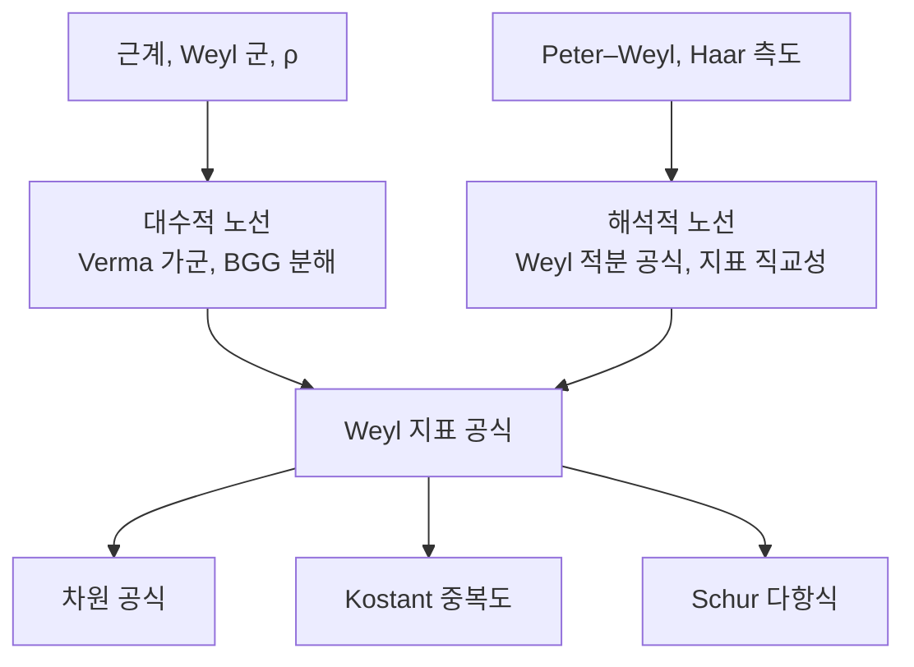

# Weyl 지표 공식과 최고무게 이론

# 개요

[근계](root-systems.md)는 반단순 Lie 대수를 유한한 조합 자료로 압축한다. 같은 자료가 그 대수의 유한차원 기약표현을 분류하고, 각 표현의 차원과 무게별 중복도까지 근계 위의 유한 계산으로 준다.

복소 반단순 Lie 대수 $\mathfrak g$ 의 유한차원 기약표현은 **지배적 정수 무게**와 일대일 대응한다.

$$
\lbrace\text{유한차원 기약표현}\rbrace/\cong\ \ \longleftrightarrow\ \ P^+=\Big\lbrace\lambda\in P:\langle\lambda,\alpha_i^\vee\rangle\in\mathbb Z_{\ge0}\Big\rbrace
$$

오른쪽은 무게격자의 한 모서리에 있는 격자점들, 곧 음이 아닌 정수 $n$ 개다.

표현 $V_\lambda$ 를 무게공간으로 쪼갠 정보를 담은 형식합이 지표이고, **Weyl 지표 공식**이 그것을 닫힌 꼴로 준다.

$$
\mathrm{ch}V_\lambda=\sum_{\mu}\dim(V_\lambda)_\mu\ e^\mu
=\frac{\displaystyle\sum_{w\in W}(-1)^{\ell(w)}e^{w(\lambda+\rho)}}{\displaystyle\sum_{w\in W}(-1)^{\ell(w)}e^{w(\rho)}}
$$

오른쪽은 유한군 $W$ 위의 교대합 두 개의 비이고, 하나의 공식이 모든 $\lambda$ 를 처리한다.

[Peter–Weyl 정리](peter-weyl.md)는 콤팩트군 $G$ 의 $L^2(G)$ 가 기약표현들로 분해된다고 말하되 그 기약표현이 무엇인지는 말하지 않는다. 지표 공식이 그 빈칸을 채운다. $G$ 가 콤팩트 연결 Lie 군이면 기약표현이 $P^+$ 로 색인되고 지표가 위 공식으로 주어지므로 $L^2(G)$ 의 정규직교기저가 근계의 조합 자료로 기술된다. $G=S^1$ 에서 이 진술은 [Fourier 급수](fourier-series.md)이고, $G=\mathrm{SU}(2)$ 에서는 [구면조화함수](spherical-harmonics.md)의 차원 $2\ell+1$ 이다.

# 직관

## $\mathfrak{sl}_2$ 의 경우

$\mathfrak{sl}_2$ 의 기약표현은 각 차원마다 하나씩 있고, $n+1$ 차원 표현 $V_n$ 의 무게는 $n,n-2,\dots,-n$ 이 하나씩이다. 형식지표를 $e^1=x$ 로 쓰면 다음이 된다.

$$
\mathrm{ch}V_n=x^n+x^{n-2}+\cdots+x^{-n}=\frac{x^{n+1}-x^{-(n+1)}}{x-x^{-1}}
$$

유한 등비급수를 닫힌 꼴로 접은 것이고, 접힌 모양에 일반 공식의 세 요소가 들어 있다.

- $W=\lbrace 1,s\rbrace$ 이고 $s$ 는 $x\mapsto x^{-1}$ 이다. 분자와 분모 모두 $W$ 에 대한 교대합이다.
- $\rho=1$ 이고 분자의 지수는 $\pm(n+1)=\pm(\lambda+\rho)$ 다. 지표에 나타나는 것은 $\lambda$ 가 아니라 $\lambda+\rho$ 다.
- 분모는 $\lambda=0$ 을 넣은 분자로, 자명표현의 지표를 $1$ 로 만드는 정규화다.

일반 공식은 $x\mapsto x^{-1}$ 자리에 Weyl 군을, $\pm$ 부호 자리에 $(-1)^{\ell(w)}$ 를, 등비급수 자리에 여러 방향의 급수를 넣은 것이다.

## $\rho$ 이동

$\mathrm{ch}V_\lambda$ 는 무게 다이어그램의 대칭 때문에 $W$ 에 대해 대칭이다. 반대칭 함수는 모든 $W$ 궤도에서 한 번씩만 항을 골라 부호를 붙인 것이라 다루기 쉽다. 대칭인 것을 반대칭으로 바꾸는 수법이 Vandermonde 행렬식 곱이고, 여기서 그 역할을 하는 것이 **Weyl 분모**다.

$$
\Delta=\sum_{w\in W}(-1)^{\ell(w)}e^{w\rho}=\prod_{\alpha\in\Phi^+}\left(e^{\alpha/2}-e^{-\alpha/2}\right)
$$

두 표현이 같다는 것이 **Weyl 분모 항등식**이다. 곱 쪽에서 각 인수의 최고차항 $e^{\alpha/2}$ 를 모으면 $e^\rho$ 가 되고, 여기서 $\rho=\frac12\sum_{\alpha>0}\alpha$ 가 나온다.

$$
\underbrace{\mathrm{ch}V_\lambda}_{\text{대칭}}\cdot\underbrace{\Delta}_{\text{반대칭}}=\underbrace{\sum_{w\in W}(-1)^{\ell(w)}e^{w(\lambda+\rho)}}_{\text{반대칭}}
$$

$\lambda$ 가 지배적이면 $\lambda+\rho$ 는 엄격히 지배적이라 $W$ 궤도가 자유롭고, 반대칭 함수 공간에서 궤도 하나가 기저 하나를 준다. $\rho$ 를 더하는 것은 고정점이 있던 무게를 내부로 밀어 궤도를 자유롭게 만드는 조작이다.

## 두 가지 증명 노선

해석적 노선(Weyl 의 원래 증명)은 콤팩트군 $G$ 와 극대원환면 $T$ 에서 시작한다. 모든 원소가 어떤 원환면에 들어가므로 류함수는 $T$ 위의 $W$ 불변 함수로 결정되고, Haar 측도가 $T$ 위에서 $\frac1{|W|}|\Delta|^2$ 라는 야코비안을 갖는다(**Weyl 적분 공식**).

$$
\int_Gf(g)\thinspace dg=\frac1{|W|}\int_Tf(t)\thinspace|\Delta(t)|^2\thinspace dt
$$

Peter–Weyl 이 주는 직교관계 $\int_G\chi_\lambda\overline{\chi_\mu}=\delta_{\lambda\mu}$ 는 $\chi_\lambda\Delta$ 들이 $T$ 위에서 정규직교라는 말이 된다. 반대칭 지수합들도 정규직교이므로 $\chi_\lambda\Delta$ 가 그중 어느 것인지 고르면 증명이 끝난다.

대수적 노선은 Verma 가군 $M_\mu$ 의 지표가 Kostant 분할 함수로 나온다는 관찰에서 출발한다.

$$
\mathrm{ch}M_\mu=\frac{e^\mu}{\prod_{\alpha\in\Phi^+}(1-e^{-\alpha})}
$$

기약표현은 Verma 가군들의 교대합으로 풀린다(**BGG 분해**).

$$
\mathrm{ch}V_\lambda=\sum_{w\in W}(-1)^{\ell(w)}\mathrm{ch}M_{w\cdot\lambda},\qquad w\cdot\lambda:=w(\lambda+\rho)-\rho
$$

여기 나오는 이동 작용 $w\cdot\lambda$ 가 앞 절의 $\rho$ 이동이고, 이 식을 정리하면 지표 공식이 나온다.

# 정의

## 무게와 최고무게

Cartan 부분대수 $\mathfrak h$ 의 표현 $V$ 에 대한 동시 고유공간 분해가 무게공간 분해다.

$$
V=\bigoplus_{\mu\in\mathfrak h^*}V_\mu,\qquad V_\mu=\lbrace v\in V:h\cdot v=\mu(h)v\ \ \forall h\in\mathfrak h\rbrace
$$

$V_\mu\neq0$ 인 $\mu$ 가 **무게**이고 $\dim V_\mu$ 가 그 **중복도**다. 유한차원 표현의 무게는 모두 무게격자 $P$ 에 들어간다.

양근 $\Phi^+$ 를 고정하면 무게에 부분순서가 생긴다. $\mu\le\lambda$ 는 $\lambda-\mu$ 가 단순근의 음이 아닌 정수결합이라는 뜻이다. 유한차원 기약표현에는 이 순서에 대한 **최고무게** $\lambda$ 가 유일하게 있고, $V_\lambda$ 는 1 차원이며 $\alpha>0$ 에 대해 $\mathfrak g_\alpha\cdot V_\lambda=0$ 이다. 그 한 벡터가 표현 전체를 생성한다.

## 지배적 정수 무게와 분류 정리

무게 $\lambda$ 가 모든 단순근에 대해

$$
\langle\lambda,\alpha_i^\vee\rangle=\frac{2(\lambda,\alpha_i)}{(\alpha_i,\alpha_i)}\in\mathbb Z_{\ge0}
$$

를 만족하면 **지배적 정수 무게**라 하고 그 집합을 $P^+$ 로 쓴다. 기본무게 $\omega_1,\dots,\omega_n$ 을 $\langle\omega_i,\alpha_j^\vee\rangle=\delta_{ij}$ 로 정의하면 $P^+=\mathbb Z_{\ge0}\omega_1\oplus\cdots\oplus\mathbb Z_{\ge0}\omega_n$ 이고, 표현이 음이 아닌 정수 $n$ 개(**Dynkin 라벨**)로 색인된다.

**최고무게 분류 정리.** $\lambda\mapsto V_\lambda$ 는 $P^+$ 에서 유한차원 기약표현의 동형류 전체로 가는 전단사다.

각 단순근의 $\mathfrak{sl}_2$ 부분대수로 제한하면 정수성이 나오고, 음이 아니어야 한다는 조건은 최고무게 벡터가 사다리의 위쪽 끝이라는 뜻이다.

## 지표

군환의 형식기저 $\lbrace e^\mu\rbrace\_{\mu\in P}$ 를 $e^\mu e^\nu=e^{\mu+\nu}$ 로 곱해 놓고

$$
\mathrm{ch}V=\sum_{\mu\in P}\dim(V_\mu)\thinspace e^\mu
$$

를 **형식지표**라 한다. 콤팩트군 쪽에서는 $e^\mu$ 를 극대원환면 위의 함수 $t\mapsto\mu(t)$ 로 읽고, 그때 $\mathrm{ch}V$ 가 표현의 대각합 $\chi_V(t)=\mathrm{tr}\rho(t)$ 와 같다. 형식지표는 직합과 텐서곱을 합과 곱으로 바꾼다.

$$
\mathrm{ch}(V\oplus W)=\mathrm{ch}V+\mathrm{ch}W,\qquad \mathrm{ch}(V\otimes W)=\mathrm{ch}V\cdot\mathrm{ch}W
$$

# 성질

## 세 공식

**Weyl 지표 공식.**

$$
\mathrm{ch}V_\lambda=\frac{\sum_{w\in W}(-1)^{\ell(w)}e^{w(\lambda+\rho)}}{\prod_{\alpha\in\Phi^+}\left(e^{\alpha/2}-e^{-\alpha/2}\right)}
$$

**Weyl 차원 공식.** 위 식에서 $e^\mu\mapsto e^{t(\mu,\rho^\vee)}$ 로 특수화하고 $t\to0$ 극한을 취하면(양쪽이 $0/0$ 이라 L'Hôpital 을 $|\Phi^+|$ 번 쓴다) 분모와 분자가 곱으로 풀린다.

$$
\dim V_\lambda=\prod_{\alpha\in\Phi^+}\frac{(\lambda+\rho,\alpha)}{(\rho,\alpha)}
$$

$A_2$ 에서 $\lambda=a\omega_1+b\omega_2$ 이면 양근이 셋이므로 다음이 되고, $(1,1)\mapsto8$ 과 $(3,0)\mapsto10$ 이 $\mathrm{SU}(3)$ 의 8 중항과 10 중항이다.

$$
\dim V_{(a,b)}=\frac{(a+1)(b+1)(a+b+2)}{2}
$$

**Kostant 중복도 공식.** 무게별 중복도는 Verma 지표의 분모를 급수로 펼쳐 얻는다. $\mathcal P(\nu)$ 를 $\nu$ 를 양근들의 음이 아닌 정수결합으로 쓰는 방법의 수(**Kostant 분할 함수**)라 하면 다음과 같다.

$$
\dim(V_\lambda)_\mu=\sum_{w\in W}(-1)^{\ell(w)}\ \mathcal P\big(w(\lambda+\rho)-(\mu+\rho)\big)
$$

$|W|$ 개의 항이 크게 상쇄되어 손계산에는 불리하다. 실제 계산에는 재귀식인 Freudenthal 공식을 쓴다.

$$
\big((\lambda+\rho,\lambda+\rho)-(\mu+\rho,\mu+\rho)\big)\dim(V_\lambda)_\mu=2\sum_{\alpha\in\Phi^+}\sum_{k\ge1}\dim(V_\lambda)_{\mu+k\alpha}\thinspace(\mu+k\alpha,\alpha)
$$

## 특수화

**Schur 다항식.** $\mathfrak{gl}_n$ 에서 $e^{\varepsilon_i}=x_i$ 로 두면 $W=S_n$ 이고 분모가 Vandermonde 행렬식이 되어 지표 공식이 Schur 다항식의 bialternant 공식이 된다.

$$
s_\lambda(x_1,\dots,x_n)=\frac{\det\negthinspace\big(x_i^{\lambda_j+n-j}\big)}{\det\negthinspace\big(x_i^{n-j}\big)}
$$

대칭함수론이 $A_{n-1}$ 형 지표 공식의 특수한 경우이고, Littlewood–Richardson 계수는 텐서곱 분해의 중복도다.

**Weyl 분모 항등식.** $\lambda=0$ 을 넣으면 좌변이 $1$ 이라 분자와 분모가 같아진다.

$$
\sum_{w\in W}(-1)^{\ell(w)}e^{w\rho}=\prod_{\alpha\in\Phi^+}\left(e^{\alpha/2}-e^{-\alpha/2}\right)
$$

$A_1$ 에서는 $x-x^{-1}$ 이고, 같은 항등식을 아핀 근계로 확장하면 Macdonald 항등식이 되며 $A_1^{(1)}$ 의 경우가 Jacobi 삼중곱 공식, 곧 [세타 함수](theta-functions.md)의 고전적 항등식이다.

**기하.** $\lambda$ 에 대응하는 깃발다양체 $G/B$ 위의 직선다발 $\mathcal L_\lambda$ 에 대해 $H^0(G/B,\mathcal L_\lambda)\cong V_\lambda^*$ 다(Borel–Weil). 이 관점에서 지표 공식은 Atiyah–Bott 고정점 공식의 결과이고, 분모의 $\prod(e^{\alpha/2}-e^{-\alpha/2})$ 는 고정점에서의 접공간 기여이며 $W$ 위의 합은 $T$ 고정점 $|W|$ 개 위의 합이다.

## 성립 범위

| 상황 | 최고무게 이론 | 지표 공식 |
|---|---|---|
| 유한차원 복소 반단순 $\mathfrak g$ | 성립 | 성립 |
| 콤팩트 연결 Lie 군 | 성립 | 성립 |
| 비콤팩트 실 형식($\mathrm{SL}_2(\mathbb R)$ 등) | 유한차원 유니터리는 자명한 것뿐 | Harish-Chandra 지표(초함수)로 대체 |
| Kac–Moody 대수, 최고무게 적분가능 | 성립 | Weyl–Kac 공식, $W$ 무한군 |
| 표수 $p$ 인 체 | 기약표현은 여전히 $P^+$ 로 색인 | 실패. Lusztig 추측 영역 |

표수 $p$ 에서는 분류가 살아남지만 차원과 중복도 공식이 무너진다. 표수 0 의 공식은 Weyl 가군의 지표를 주고 기약 지표는 그 삼각행렬 조합인데, 그 분해 행렬이 Kazhdan–Lusztig 다항식으로 기술되리라는 것이 Lusztig 추측이었고 작은 $p$ 에서 반례가 나왔다.[^1]

# 활용

- **물리의 다중항.** $\mathrm{SU}(3)$ 맛깔 대칭에서 쿼크 세 종류는 $(1,0)$ 의 3 차원 표현이고, 중간자는 $3\otimes\bar3=8\oplus1$ , 바리온 10 중항은 $(3,0)$ 이다. Gell-Mann 과 Ne'eman 이 알려진 입자를 무게 다이어그램에 배치했을 때 10 중항의 빈자리를 차원 공식이 지목했고, 그 자리의 $\Omega^-$ 가 1964 년에 발견되었다.
- **텐서곱과 융합 규칙.** 텐서곱의 기약 분해는 지표를 곱해 다시 지표 기저로 펼치는 계산이고, 이를 조합적으로 수행하는 것이 Littlewood–Richardson 규칙($A$ 형)과 Littelmann 경로 모형(일반)이다. 레벨 $k$ 를 고정한 아핀 Lie 대수나 양자군에서는 같은 계산이 유한 집합 안에서 닫히고 구조상수를 Verlinde 공식이 준다. [정점작용소대수](vertex-operator-algebras.md)와 등각장론에서 지표가 모듈러 형식이 되는 현상의 근거가 Weyl–Kac 공식이다.
- **조화해석.** $L^2(G)$ 분해에서 각 조각의 크기가 $(\dim V_\lambda)^2$ 이므로 차원 공식이 $G$ 위 조화해석의 스펙트럼 밀도를 준다. $G=\mathrm{SU}(2)$ 에서 $\dim V_n=n+1$ 이라 $S^3$ 위 Laplace 작용소의 고윳값 중복도가 나오고, $S^2=\mathrm{SU}(2)/T$ 로 내리면 구면조화함수의 $2\ell+1$ 이 된다. 열핵 전개, 격자 게이지 이론의 분배함수, 랜덤 행렬의 적률 계산이 같은 형태의 합으로 표현된다.

[^1]: 표준 참고서는 J. Humphreys, *Introduction to Lie Algebras and Representation Theory* (1972) 6 장(대수적 노선)과 T. Bröcker–T. tom Dieck, *Representations of Compact Lie Groups* (1985) 6 장(해석적 노선). Kostant 와 Freudenthal 공식은 Humphreys 24 절. Lusztig 추측의 반례는 G. Williamson, *Schubert calculus and torsion explosion*, J. Amer. Math. Soc. 30 (2017).

# 연관 문서

## 선수지식

- [근계와 Weyl 군](root-systems.md)
- [Peter–Weyl 정리](peter-weyl.md)

## 더 알아보기

- [Borel–Weil–Bott 정리와 깃발다양체](borel-weil-bott.md)
- [Schur 다항식과 대칭함수](schur-polynomials.md)
- [MV 순환과 무게 기저의 기하](mv-cycles.md)

#algebra #group_theory #combinatorics #theorem
