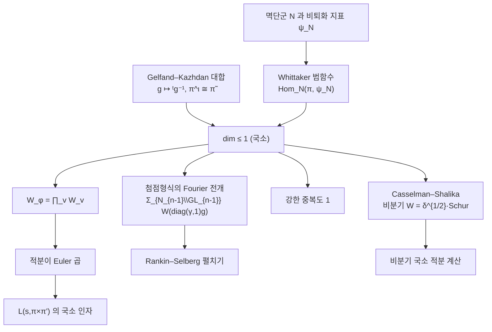

# Whittaker 모형과 중복도 1

# 개요

[Rankin–Selberg 적분](rankin-selberg.md)이 Euler 곱으로 쪼개지는 이유는 하나뿐이다. 전역 적분의 피적분함수가 자리마다의 곱으로 분해되기 때문이고, 그 분해를 보장하는 것이 **Whittaker 모형의 유일성**이다.

$\mathrm{GL}_n$ 의 상삼각 멱단군 $N$ 과 그 위의 비퇴화 지표 $\psi_N$ 에 대해, 표현 $\pi$ 의 Whittaker 모형은 $\pi$ 를 다음 성질을 갖는 함수공간으로 실현한 것이다.

$$
W\!\left(\begin{pmatrix}1&*\\&\ddots\\&&1\end{pmatrix}g\right)=\psi_N(n)\,W(g)
$$

고전적으로 이것은 **Fourier 계수의 대체물**이다. $\mathrm{GL}_2$ 에서 첨점형식의 Fourier 전개 $\sum a_nq^n$ 은 $N\cong\mathbb G_a$ 가 아벨군이라 수열로 적히지만, $n\ge3$ 에서 $N$ 은 아벨군이 아니다. 계수 자리에 수가 아니라 함수가 오고, 그 함수가 Whittaker 함수다.

정리의 내용은 이 실현이 **많아야 하나**라는 것이다.

$$
\dim\mathrm{Hom}_{N(F)}\bigl(\pi,\psi_N\bigr)\le1
$$

국소적으로는 Gelfand–Kazhdan 과 Shalika 가, 전역적으로는 이 국소 사실로부터 따라 나온다. 유일하기 때문에 전역 Whittaker 함수가 국소 Whittaker 함수들의 곱일 수밖에 없고, 그래서 적분이 Euler 곱이 된다.

$$
W_\varphi(g)=\prod_vW_v(g_v)
$$

$\mathrm{GL}_n$ 에서 자기동형 $L$ 함수 이론이 그토록 완결적인 것과, 다른 군에서 훨씬 어려운 것이 이 한 줄의 차이다. 유일성은 $\mathrm{GL}_n$ 의 특권이다.

# 직관

## Fourier 계수를 일반화한다

$\mathrm{GL}_2$ 의 첨점형식을 아델 위의 함수 $\varphi$ 로 보면, $N\cong\mathbb G_a$ 이므로 $N(\mathbb Q)\backslash N(\mathbb A)$ 는 콤팩트 아벨군이고 Fourier 해석이 가능하다. 지표로 전개하면

$$
\varphi(g)=\sum_{\alpha\in\mathbb Q^\times}W_\varphi\!\left(\begin{pmatrix}\alpha&\\&1\end{pmatrix}g\right)
$$

이고 $W_\varphi$ 가 $\psi$ 성분이다. 첨점 조건이 $\alpha=0$ 항을 없앴고, 나머지 항이 $\mathrm{GL}_1(\mathbb Q)$ 의 작용으로 한 항에서 전부 나온다. 곧 **첨점형식은 Whittaker 함수 하나로 복원된다**.

$n\ge3$ 이면 $N$ 이 비가환이라 지표만으로 전개가 끝나지 않는다. 대신 다음 전개가 성립한다.

$$
\varphi(g)=\sum_{\gamma\in N_{n-1}(\mathbb Q)\backslash\mathrm{GL}_{n-1}(\mathbb Q)}
W_\varphi\!\left(\begin{pmatrix}\gamma&\\&1\end{pmatrix}g\right)
$$

$\mathrm{GL}_1$ 자리에 $\mathrm{GL}_{n-1}$ 이 온 것이다. 이 합이 Rankin–Selberg 펼치기의 재료다.

## 왜 하나뿐인가

유일성의 증명은 **Gelfand–Kazhdan 의 대합**이 준다. $g\mapsto{}^tg^{-1}$ 는 $\mathrm{GL}_n$ 의 자기동형이고 $\pi\mapsto\tilde\pi$ 를 준다. 그런데 $\mathrm{GL}_n$ 에서는 모든 기약 표현이 반대표현과 같은 지표를 갖는다.

$$
\pi^\iota\cong\tilde\pi
$$

이 대칭이 Whittaker 범함수의 공간 위에 작용해 그 차원이 2 이상일 수 없게 만든다. [Satake 동형](satake-isomorphism.md)의 가환성 증명이 전치라는 반자기동형 하나에서 나온 것과 같은 요령이다. $\mathrm{GL}_n$ 이 유독 다루기 쉬운 이유가 이 대합에 있다.

기하적으로는 $N\backslash G/N$ 의 궤도 구조 문제다. Bruhat 분해로 $N$ 양쪽 작용의 궤도를 보면, 지표 $\psi_N$ 이 살아남는 궤도가 하나뿐이라 겹침이 생기지 않는다.

## 곱이 되는 이유

전역 표현이 $\pi=\otimes'_v\pi_v$ 로 제한 텐서곱이므로, 전역 Whittaker 범함수는 국소 범함수들의 곱을 준다. 반대 방향이 문제인데, 여기서 유일성이 결정적이다.

국소 공간이 1 차원이면 전역 범함수는 국소 범함수들의 곱에 스칼라를 곱한 것밖에 없다. 만약 국소 공간이 2 차원이었다면 전역 범함수가 여러 조합으로 쪼개져 "자리마다의 적분의 곱" 이라는 말 자체가 성립하지 않는다.

$$
\text{국소 유일성}\;\Longrightarrow\;\text{전역 Whittaker 함수의 분해}\;\Longrightarrow\;\text{적분이 Euler 곱}
$$

$L$ 함수가 소수마다의 인자의 곱이라는 사실이 표현론의 1 차원성에서 온다.

## 유일성이 깨지는 곳

모든 군에서 되는 것이 아니다.

- **첨점형식이 Whittaker 함수를 안 가질 수 있다.** $\mathrm{Sp}_4$ 같은 군에서는 Whittaker 모형이 아예 없는 첨점 표현(비일반 표현)이 있다. Saito–Kurokawa 올림이 그 예다.
- **유일성 자체가 깨지기도 한다.** 덮개군(metaplectic group)에서는 Whittaker 모형의 차원이 1 을 넘고, 그래서 $L$ 함수 이론이 훨씬 미묘하다.

대안으로 Bessel 모형, Fourier–Jacobi 모형, Shalika 모형 같은 다른 모형들이 쓰이고, 각 모형의 유일성이 그에 맞는 적분 표현을 낳는다.



# 정의

## 비퇴화 지표

$F$ 를 국소체 또는 아델환, $\psi$ 를 자명하지 않은 가법 지표라 하자. $N_n\subset\mathrm{GL}_n$ 을 대각성분이 1 인 상삼각행렬들의 군이라 하고

$$
\psi_N(u)=\psi\bigl(u_{12}+u_{23}+\cdots+u_{n-1,n}\bigr)
$$

로 둔다. 이웃한 단순근 자리의 성분만 본다. 모든 단순근 성분이 살아 있으므로 **비퇴화**다.

## Whittaker 모형

$(\pi,V)$ 를 $\mathrm{GL}_n(F)$ 의 기약 허용 표현이라 하자. **Whittaker 범함수**는 $\lambda:V\to\mathbb C$ 로

$$
\lambda(\pi(u)v)=\psi_N(u)\,\lambda(v),\qquad u\in N_n(F)
$$

를 만족하는 선형사상이다. $\lambda\ne0$ 이 있으면 $\pi$ 를 **일반적**(generic)이라 하고, 함수들

$$
W_v(g)=\lambda(\pi(g)v)
$$

가 이루는 공간 $\mathcal W(\pi,\psi)$ 를 **Whittaker 모형**이라 한다. 이 공간은 $W(ug)=\psi_N(u)W(g)$ 를 만족하는 함수들로 이루어지고 $\pi$ 와 동형이다.

전역적으로 첨점형식 $\varphi$ 의 Whittaker 함수는

$$
W_\varphi(g)=\int_{N_n(\mathbb Q)\backslash N_n(\mathbb A)}\varphi(ug)\,\psi_N^{-1}(u)\,du
$$

다.

# 성질

> **정리 (Gelfand–Kazhdan, Shalika).** $\mathrm{GL}_n(F)$ 의 기약 허용 표현 $\pi$ 에 대해
> $$
> \dim\mathrm{Hom}_{N_n(F)}(\pi,\psi_N)\le1
> $$
> 이다. 첨점 자기동형 표현은 모두 일반적이고, 전역 Whittaker 함수는 국소 Whittaker 함수의 곱으로 분해된다.[^1]

## 유한군에서 보는 유일성

$p$ 진체 대신 유한체를 놓으면 같은 현상이 유한 계산으로 확인된다. $G=\mathrm{GL}_n(\mathbb F_q)$, $N$ 을 상삼각 멱단군, $\psi_N$ 을 위와 같은 지표라 하면, 유도표현

$$
\Gamma=\mathrm{Ind}_N^G\psi_N
$$

을 **Gelfand–Graev 표현**이라 한다. Whittaker 모형의 유일성은 $\Gamma$ 가 **중복도 없이** 분해된다는 진술과 같다. Frobenius 상호법칙으로

$$
\dim\mathrm{Hom}_G(\Gamma,\pi)=\dim\mathrm{Hom}_N(\pi,\psi_N)
$$

이기 때문이다. 중복도가 모두 0 또는 1 이면 $\langle\Gamma,\Gamma\rangle$ 가 성분의 **개수**와 같아진다.

```python
import itertools, cmath

def det(M, q):
    n = len(M); A = [list(r) for r in M]; d = 1
    for i in range(n):
        p = next((r for r in range(i, n) if A[r][i] % q), None)
        if p is None: return 0
        if p != i: A[i], A[p] = A[p], A[i]; d = -d
        d = d * A[i][i] % q
        iv = pow(A[i][i], q-2, q)
        for r in range(i+1, n):
            f = A[r][i]*iv % q
            for c in range(i, n): A[r][c] = (A[r][c] - f*A[i][c]) % q
    return d % q

def mul(A, B, q):
    n = len(A)
    return tuple(tuple(sum(A[i][k]*B[k][j] for k in range(n)) % q
                       for j in range(n)) for i in range(n))

def inv(M, q):
    n = len(M)
    A = [list(r) + [1 if i == j else 0 for j in range(n)] for i, r in enumerate(M)]
    for i in range(n):
        p = next(r for r in range(i, n) if A[r][i] % q)
        A[i], A[p] = A[p], A[i]
        iv = pow(A[i][i], q-2, q)
        A[i] = [x*iv % q for x in A[i]]
        for r in range(n):
            if r != i and A[r][i]:
                f = A[r][i]
                A[r] = [(A[r][c] - f*A[i][c]) % q for c in range(2*n)]
    return tuple(tuple(row[n:]) for row in A)

def gelfand_graev(n, q):
    G = [M for M in (tuple(tuple(e[i*n:(i+1)*n]) for i in range(n))
                     for e in itertools.product(range(q), repeat=n*n)) if det(M, q)]
    N = [M for M in G if all(M[i][i] == 1 for i in range(n))
                      and all(M[i][j] == 0 for i in range(n) for j in range(i))]
    Nset = set(N)
    psi = lambda M: cmath.exp(2j*cmath.pi*sum(M[i][i+1] for i in range(n-1))/q)
    chi = {}                                     # Ind_N^G ψ 의 지표
    for g in G:
        t = 0
        for x in G:
            y = mul(mul(inv(x, q), g, q), x, q)
            if y in Nset: t += psi(y)
        chi[g] = t/len(N)
    return len(G), sum(abs(chi[g])**2 for g in G).real/len(G)

for (n, q) in [(2, 2), (2, 3), (2, 5), (3, 2)]:
    size, norm = gelfand_graev(n, q)
    print(f"GL_{n}(F_{q}): |G|={size:4d}  <Γ,Γ> = {norm:.6f}   q(q-1) = {q*(q-1)}")

# GL_2(F_2): |G|=   6  <Γ,Γ> = 2.000000   q(q-1) = 2
# GL_2(F_3): |G|=  48  <Γ,Γ> = 6.000000   q(q-1) = 6
# GL_2(F_5): |G|= 480  <Γ,Γ> = 20.000000   q(q-1) = 20
# GL_3(F_2): |G|= 168  <Γ,Γ> = 4.000000   q(q-1) = 2
```

마지막 열의 $q(q-1)$ 은 아래에서 유도하는 $\mathrm{GL}_2$ 전용 비교값이라 $\mathrm{GL}_3$ 줄에서는 맞지 않는다. $\langle\Gamma,\Gamma\rangle$ 가 정수로 떨어진다는 것부터가 중복도 없음의 징후다. 중복도 $m_i$ 에 대해 $\langle\Gamma,\Gamma\rangle=\sum m_i^2$ 이므로, 이 값이 성분의 개수와 같으려면 모든 $m_i$ 가 1 이어야 한다.

$\mathrm{GL}_2(\mathbb F_q)$ 의 기약표현은 1 차원 $q-1$ 개, Steinberg 꼬임 $q-1$ 개, 주계열 $(q-1)(q-2)/2$ 개, 첨점 $q(q-1)/2$ 개다. $\Gamma$ 는 1 차원을 제외한 전부를 정확히 한 번씩 담으므로 성분 개수가

$$
(q-1)+\frac{(q-1)(q-2)}2+\frac{q(q-1)}2=q(q-1)
$$

이고 계산값과 일치한다. $\mathrm{GL}_3(\mathbb F_2)$ 는 기약표현이 차원 $1,3,3,6,7,8$ 의 6 개인데 $\Gamma$ 의 차원이 $168/8=21$ 이고, 중복도 1 인 4 개 성분이라면 $3+3+7+8=21$ 로 맞아떨어진다. 자명표현과 6 차원 표현만 일반적이지 않다.

## Casselman–Shalika 공식

비분기 자리에서는 Whittaker 함수의 값이 명시적이다. $\pi$ 가 비분기이고 $W^\circ$ 가 $K$ 불변 Whittaker 함수(적절히 정규화)이면

$$
W^\circ\bigl(\varpi^\lambda\bigr)=\delta_B^{1/2}(\varpi^\lambda)\;s_\lambda(\alpha_1,\dots,\alpha_n)
$$

이고 $s_\lambda$ 는 **Schur 다항식**, $(\alpha_i)$ 는 [Satake 매개변수](satake-isomorphism.md)다. $\lambda$ 가 지배적이 아니면 0 이다.

Whittaker 함수의 값이 쌍대군의 기약지표라는 이 사실이 Rankin–Selberg 국소 적분을 계산 가능하게 만든다. 두 Whittaker 함수의 곱을 적분하면 Schur 다항식의 Cauchy 항등식

$$
\sum_\lambda s_\lambda(x)\,s_\lambda(y)=\prod_{i,j}\frac1{1-x_iy_j}
$$

이 나오고, 오른쪽이 정확히 $L(s,\pi\times\pi')$ 의 비분기 인자다. 국소 $L$ 인자가 왜 그 꼴인지에 대한 가장 투명한 설명이다.

## 강한 중복도 1

Whittaker 함수가 첨점형식을 복원하므로, 두 첨점형식의 Whittaker 함수가 같으면 형식이 같다. 여기에 유일성을 더하면

> $\pi$, $\pi'$ 가 $\mathrm{GL}_n$ 의 첨점 자기동형 표현이고 거의 모든 자리에서 $\pi_v\cong\pi'_v$ 이면 $\pi\cong\pi'$ 다.

이것이 **강한 중복도 1**(Jacquet–Shalika)이다. $\mathrm{GL}_n$ 의 자기동형 스펙트럼에 중복이 없다는 말이고, $L$ 함수가 표현을 결정한다는 진술과 짝을 이룬다. 다른 군에서는 거짓이며, 그 실패를 조직한 것이 Arthur 의 $L$ 꾸러미 이론이다.

# 활용

## 적분 표현의 기반

Rankin–Selberg 적분, Godement–Jacquet 의 $\mathrm{GL}_n\times\mathrm{GL}_1$ 꼬임, Bump–Friedberg 적분 등 $\mathrm{GL}_n$ 의 거의 모든 적분 표현이 Whittaker 전개에서 출발한다. 전역 적분을 국소 적분의 곱으로 바꾸는 단계가 언제나 유일성을 쓴다.

## 국소 Langlands 대응의 정규화

국소 $L$ 인자와 $\varepsilon$ 인자를 정의하려면 국소 적분들이 생성하는 아이디얼을 봐야 하는데, 그 적분의 재료가 Whittaker 함수다. 일반적 표현에 한해 정의가 자연스럽고, 비일반 표현의 $L$ 인자는 일반적 표현에서 유도해 정의한다. 국소 Langlands 대응이 일반적 표현에서 먼저 확립된 것도 이 때문이다.

## 계산 정수론

Maass 형식과 $\mathrm{GL}_3$ 자기동형 형식의 수치 계산은 Whittaker 함수의 전개로 이루어진다. Fourier 계수를 직접 다루는 대신 Whittaker 함수의 아르키메데스 부분(Bessel 함수의 일반화)을 계산하고, 나머지 자리는 Casselman–Shalika 로 Satake 매개변수에서 얻는다. LMFDB 의 $\mathrm{GL}_3$ 자료가 이 방식으로 만들어진다.

## 다른 모형들

유일성이라는 현상 자체는 더 넓다. 어떤 부분군 $H$ 와 지표 $\chi$ 에 대해 $\dim\mathrm{Hom}_H(\pi,\chi)\le1$ 이 성립하면 그에 맞는 적분 표현과 주기가 생긴다. Gan–Gross–Prasad 추측은 이런 중복도 1 현상을 고전군 전반에서 예측하고, 중복도가 1 이 되는 정확한 조건을 $L$ 매개변수로 기술한다. Whittaker 모형은 그 가운데 가장 오래되고 가장 쓸모 있는 예다.

[^1]: I. M. Gelfand, D. A. Kazhdan, *Representations of the group $\mathrm{GL}(n,K)$ where $K$ is a local field*, Lie Groups and Their Representations (1975). J. A. Shalika, *The multiplicity one theorem for $\mathrm{GL}_n$*, Ann. of Math. **100** (1974), 171–193. Casselman–Shalika 공식은 W. Casselman, J. Shalika, *The unramified principal series of p-adic groups II*, Compositio Math. **41** (1980), 207–231. 유한군판 Gelfand–Graev 표현은 R. Carter, *Finite Groups of Lie Type* (1985) 8장. 본문의 유한군 계산은 직접 한 것이다.

# 연관 문서

## 선수지식

- [Rankin–Selberg 적분](rankin-selberg.md)

## 더 알아보기

- [Casselman–Shalika 공식](casselman-shalika.md)
- [Gan–Gross–Prasad 추측](gan-gross-prasad.md)

#number_theory #group_theory #computation
